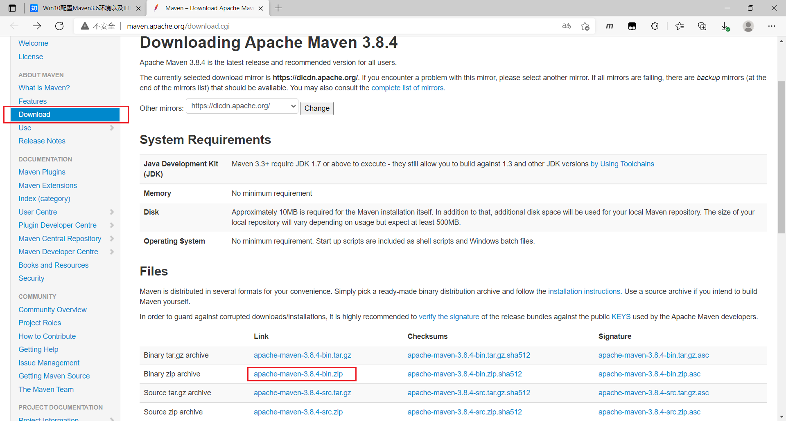
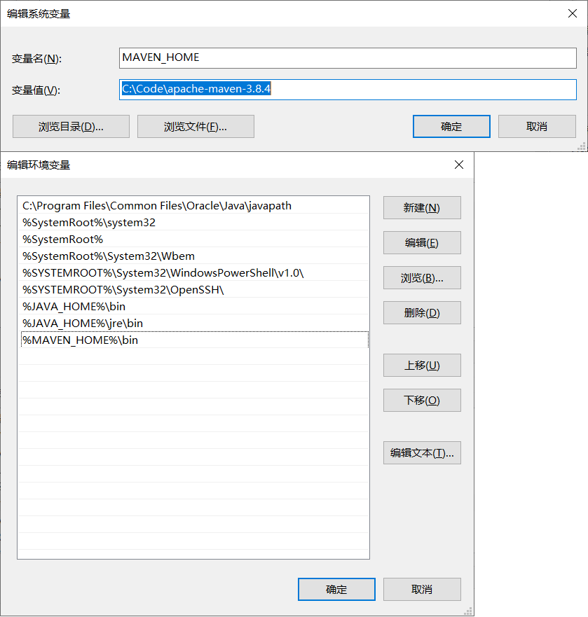
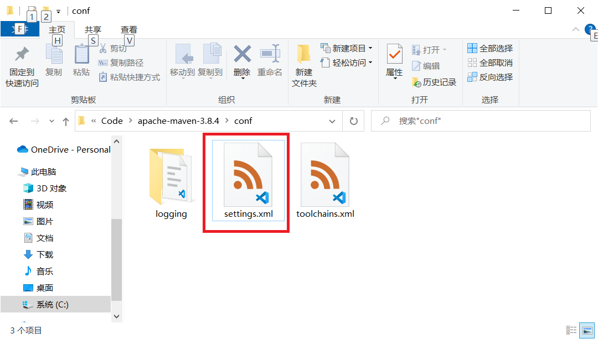
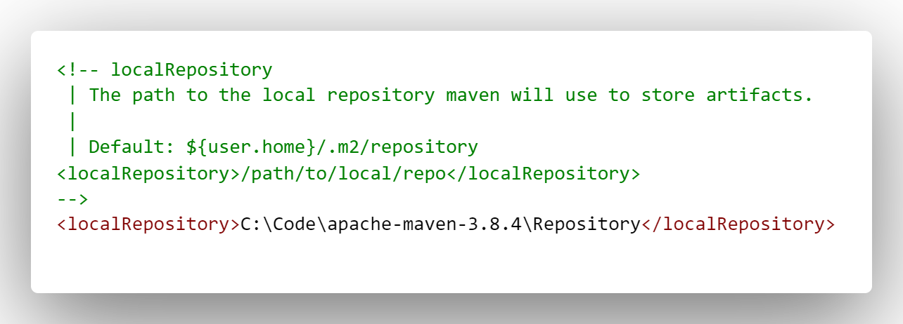
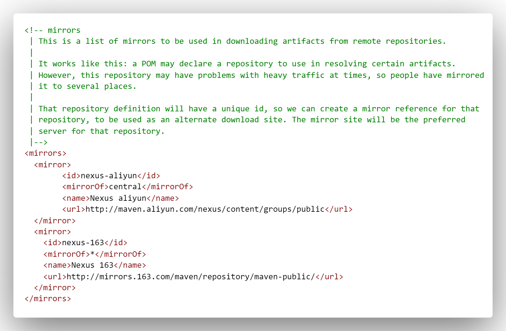
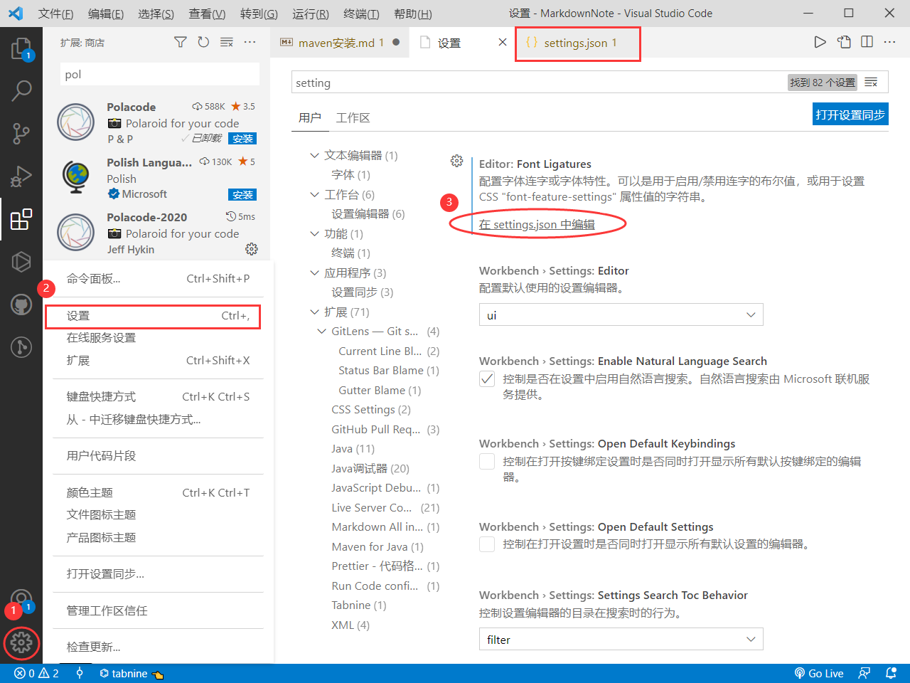
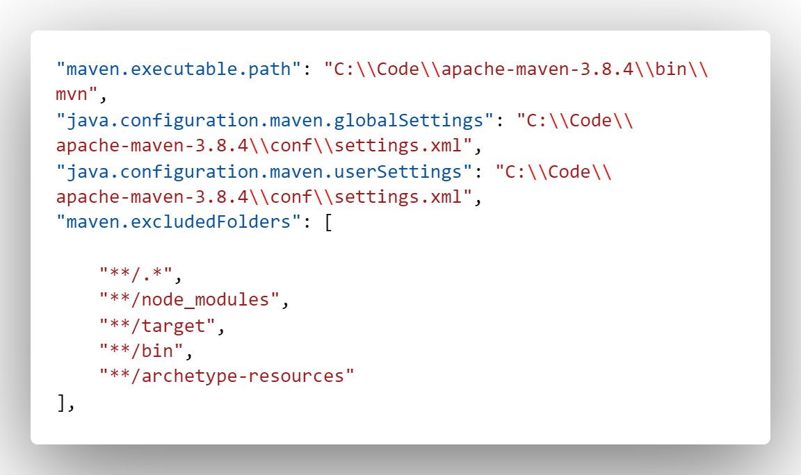

# Maven 基础

[TOC]

## Maven 安装

### windows下的 maven 安装

注意： maven 安装的前提条件需要先安装 JDK ，并且 JDK 环境配置正常 。

#### 下载安装 Maven

1. 首先到 maven 官网：<http://maven.apache.org/download.cgi> 下载maven ，下载 `apache-maven-X.X.X-bin.zip` 。
    <center></center>

2. 下载完毕解压，把解压后的文件夹放在自己的工作文件夹中。

3. 配置系统环境变量 ：

    ```txt
    变量名： MAVEN_HOME
    变量值： maven文件夹的完整路径

    在path中增加一个变量
    变量值： %MAVEN_HOME%\bin
    ```

    <center></center>


4. **maven 配置**
   1. 在 maven 文件夹中创建一个文件夹 ，命名为 `Repository` 。
   2. 打开 maven 的配置文件: `settings.json` ，此文件位于 maven 文件夹的 conf 文件夹中。
    <center></center>

   3. 找到配置文件中的以下内容：

        ```xml
        <!-- localRepository
        | The path to the local repository maven will use to store artifacts.
        |
        | Default: ${user.home}/.m2/repository
        <localRepository>/path/to/local/repo</localRepository>
        -->
        ```

        在注释下添加以下内容

        ```xml
        <localRepository>maven文件夹的路径\Repository</localRepository>
        ```

        > 此配置的作用为创建一个本地的离线依赖包，避免每次maven 项目添加依赖时都要去网上下载

        具体内容如下:
        <center></center>

   4. 找到 `<mirrors></mirrors>` ,在其中添加以下代码：

        ```xml
            <mirror>
                <id>nexus-aliyun</id>
                <mirrorOf>central</mirrorOf>
                <name>Nexus aliyun</name>
                <url>http://maven.aliyun.com/nexus/content/groups/public</url>
            </mirror>
            <mirror>
            <id>nexus-163</id>
            <mirrorOf>*</mirrorOf>
            <name>Nexus 163</name>
            <url>http://mirrors.163.com/maven/repository/maven-public/</url>
            </mirror>
        ```

        >此项作为为设置访问网站，减少下载的时间 。

        代码类如下：
        <center></center>
### 不同软件的 maven 配置

#### vscode 的 maven 配置

左键点击左下角的设置图标，点击弹窗中的设置选择，在设置界面中左键点击 `在 settings.json 中编辑` ，进入 vscode 的配置文件：`setting.json` 。
<center></center>

然后在最外层的大括号中添加以下代码

```json
      "maven.executable.path": "maven 的完整路径\\bin\\mvn",
    "java.configuration.maven.globalSettings": "maven 的完整路径\\conf\\settings.xml",
    "java.configuration.maven.userSettings": "maven 的完整路径\\conf\\settings.xml",
    "maven.excludedFolders": [
        "**/.*",
        "**/node_modules",
        "**/target",
        "**/bin",
        "**/archetype-resources"
    ],
```

  注意，在 vscode 的配置文件中，子路径的划分是以 `\\` 而不是 `\` 。
  具体设置应当类如下 ：
  <center></center>

## 标签介绍

maven 有很多的标签，理解这些标签的意思在进行 SpringCloud 开发时尤为重要。

#### scope

scope元素的作用：控制 dependency 元素的使用范围。通俗的讲，就是控制 Jar 包在哪些范围被加载和使用。
scope具体内容如下：

- **compile（默认）**

    $~~~~~$ **含义：** compile 是默认值，如果没有指定 scope 值，该元素的默认值为 compile。被依赖项目需要参与到当前项目的编译，测试，打包，运行等阶段。打包的时候通常会包含被依赖项目。

- **provided**

    $~~~~~$ **含义：** 被依赖项目理论上可以参与编译、测试、运行等阶段，相当于 compile ，但是再打包阶段做了 exclude 的动作。
    $~~~~~$ **适用场景：** 例如，如果我们在开发一个web 应用，在编译时我们需要依赖 servlet-api.jar，但是在运行时我们不需要该 jar 包，因为这个 jar 包已由应用服务器提供，此时我们需要使用 provided 进行范围修饰。

- **runtime**

    $~~~~~$ **含义：** 表示被依赖项目无需参与项目的编译，但是会参与到项目的测试和运行。与 compile 相比，被依赖项目无需参与项目的编译。
    $~~~~~$ **适用场景：** 例如，在编译的时候我们不需要 JDBC API 的 jar 包，而在运行的时候我们才需要 JDBC 驱动包。

- **test**

    $~~~~~$ **含义：** 表示被依赖项目仅仅参与测试相关的工作，包括测试代码的编译，执行。
    $~~~~~$ **适用场景：** 例如，Junit 测试。

- **system**

    $~~~~~$ **含义：** system 元素与 provided 元素类似，但是被依赖项不会从 maven 仓库中查找，而是从本地系统中获取，systemPath 元素用于制定本地系统中 jar 文件的路径。例如：

    ```xml
    <dependency>
        <groupId>org.open</groupId>
        <artifactId>open-core</artifactId>
        <version>1.5</version>
        <scope>system</scope>
        <systemPath>${basedir}/WebContent/WEB-INF/lib/open-core.jar</systemPath>
    </dependency>
    ```

- **import**

    $~~~~~$ 它只使用在 `<dependencyManagement>` 中，表示从其它的 pom 中导入 dependency 的配置，例如 (B项目导入A项目中的包配置)：
    $~~~~~$ 想必大家在做 SpringBoot 应用的时候，都会有如下代码：

    ```xml
    <parent>
        <groupId>org.springframework.boot</groupId>
        <artifactId>spring-boot-starter-parent</artifactId>
        <version>1.3.3.RELEASE</version>
    </parent>
    ```

    $~~~~~$ 继承一个父模块，然后再引入相应的依赖。
    $~~~~~$ Maven 的继承和 Java 的继承一样，是无法实现多继承的，如果10个、20个甚至更多模块继承自同一个模块的话，这个父模块的 `dependencyManagement` 会包含大量的依赖。如果你、想把这些依赖分类以更清晰的管理，那就不可能了，import 能解决这个问题。你可以把 `dependencyManagement` 放到单独的专门用来管理依赖的 pom 中，然后在需要使用依赖的模块中通过 import scope 依赖，就可以引入 `dependencyManagement` 。例如可以写这样一个用于依赖管理的 pom ：

    ```xml
    <project>
        <modelVersion>4.0.0</modelVersion>
        <groupId>com.test.sample</groupId>
        <artifactId>base-parent1</artifactId>
        <packaging>pom</packaging>
        <version>1.0.0-SNAPSHOT</version>
        <dependencyManagement>
            <dependencies>
                <dependency>
                    <groupId>junit</groupId>
                    <artifactid>junit</artifactId>
                    <version>4.8.2</version>
                </dependency>
                <dependency>
                    <groupId>log4j</groupId>
                    <artifactid>log4j</artifactId>
                    <version>1.2.16</version>
                </dependency>
            </dependencies>
        </dependencyManagement>
    </project>
    ```

    $~~~~~$ 然后我就可以通过非继承的方式来引入这段依赖管理配置

    ```xml
    <dependencyManagement>
        <dependencies>
            <dependency>
                <groupId>com.test.sample</groupId>
                <artifactid>base-parent1</artifactId>
                <version>1.0.0-SNAPSHOT</version>
                <type>pom</type>
                <scope>import</scope>
            </dependency>
        </dependencies>
    </dependencyManagement>

    <dependency>
        <groupId>junit</groupId>
        <artifactid>junit</artifactId>
    </dependency>
    <dependency>
        <groupId>log4j</groupId>
        <artifactid>log4j</artifactId>
    </dependency>
    ```

    $~~~~~$ 注意：import scope 只能用在 `dependencyManagement` 里面。
    $~~~~~$ 这样做，父模块的 pom 就会非常干净，由专门的 packaging 为 pom 来管理依赖，也契合的面向对象设计中的单一职责原则。此外，我们还能够创建多个这样的依赖管理 pom ，以更细化的方式管理依赖。这种做法与面向对象设计中使用组合而非继承也有点相似的味道。
    $~~~~~$ 总结来说： **import 属性不是继承，而是赋值，把 `dependencyManagement` 里设置的值赋值给需要继承的依赖。**

    $~~~~~$ 现在我们可以解决上面 SpringBoot 的继承问题了，配置如下：

    ```xml
    <dependencyManagement>
        <dependencies>
            <dependency>
                <groupId>org.springframework.boot</groupId>
                <artifactId>spring-boot-dependencies</artifactId>
                <version>1.3.3.RELEASE</version>
                <type>pom</type>
                <scope>import</scope>
            </dependency>
        </dependencies>
    </dependencyManagement>

    <dependencies>
        <dependency>
            <groupId>org.springframework.boot</groupId>
            <artifactId>spring-boot-starter-web</artifactId>
        </dependency>
    </dependencies>
    ```

    $~~~~~$ 这样配置的话，自己的项目里面就不需要继承 SpringBoot 的 module 了，而可以继承自己项目的 module 了。

    $~~~~~$ scope 的依赖传递: A–>B–>C 。当前项目为 A ，A 依赖于 B ，B 依赖于 C 。知道 B 在 A 项目中的 scope ，那么怎么知道 C 在 A 中的 scope 呢？答案是：当 C 是 test 或者 provided 时， C 直接被丢弃，A 不依赖 C ；否则 A 依赖 C ， C 的 scope 继承于 B 的 scope 。
    $~~~~~$ 下面是一张 nexus 的图。
    <center></center>

#### dependencyManagement

$~~~~~$ 在我们项目顶层的 POM 文件中，我们会看到 `dependencyManagement` 元素。通过它元素来管理 jar 包的版本，让子项目中引用一个依赖时不用显示的列出版本号。Maven 会沿着父子层次向上走，直到找到一个拥有 `dependencyManagement` 元素的项目，然后它就会使用在这个 `dependencyManagement` 元素中指定的版本号。
$~~~~~$ 过去我们的依赖是这样写的：

```xml
    <dependencies>
        <dependency>
            <groupId>org.slf4j</groupId>
            <artifactId>log4j-over-slf4j</artifactId>
            <version>1.7.7</version>
        </dependency>
    </dependencies>
```

$~~~~~$ 但是在多级项目中，这些写可能会存在依赖版本错误，和字符重复等问题，所以现在我们在父项目下用 `dependencyManagement` 标签给定了这个依赖的版本：

```xml
    <dependencyManagement>
        <dependencies>
        <dependency>
            <groupId>org.slf4j</groupId>
            <artifactId>log4j-over-slf4j</artifactId>
            <version>1.7.7</version>
        </dependency>
        </dependencies>
    </dependencyManagement>
```

$~~~~~$ 这样在子项目中，我们就可以不用去写依赖的版本号了， maven 会自动向上级目录寻找版本 `dependencyManagement` 标签，一层没找到再上一层，找到后就会把 `dependencyManagement`标签里定义的版本号自动赋给依赖。

- 如上我们看出 `dependencyManagement` 标签的写法，就是在 `<dependencyManagement> </dependencyManagement>` 中夹了 `<dependencies> </dependencies>` ,并且 `dependencies` 标签内容的写法没有任何变化。
- `dependencyManagement` 只适用于父子项目的集合项目中，所以在 SpringCloud 中经常用到，而在 SpringBoot 中没有。

#### properties

$~~~~~$ 通过 <properties> 元素用户可以自定义一个或多个 Maven 属性，然后在 POM 的其他地方使用 ${属性名} 的方式引用该属性，这种做法的最大意义在于消除重复和统一管理，如下代码：

```xml
    <properties>
        <java.version>17</java.version>
        <project.build.sourceEncoding>UTF-8</project.build.sourceEncoding>
        <project.reporting.outputEncoding>UTF-8</project.reporting.outputEncoding>
        <spring-boot-admin.version>2.6.7</spring-boot-admin.version>
        <spring-cloud.version>2021.0.2</spring-cloud.version>
    </properties>
```

配置了之后，我们就可以通过如下方式访问使用我们设置的版本号了

```xml
    <dependencyManagement>
        <dependencies>
            <dependency>
                <groupId>org.springframework.cloud</groupId>
                <artifactId>spring-cloud-dependencies</artifactId>
                <version>${spring-cloud.version}</version>
                <type>pom</type>
                <scope>import</scope>
            </dependency>
            <dependency>
                <groupId>de.codecentric</groupId>
                <artifactId>spring-boot-admin-dependencies</artifactId>
                <version>${spring-boot-admin.version}</version>
                <type>pom</type>
                <scope>import</scope>
            </dependency>
        </dependencies>
    </dependencyManagement>
```

$~~~~~$ `</dependencyManagement>` 与 `<properties>` 两个的区别在于：`<properties>` 只设置版本号，但是程序在调用时需要用 `${名称}` 来调用；`</dependencyManagement>` 可以让依赖自动获取版本号，但是书写要更复杂，看起来也复杂。
$~~~~~$ 所以目前的方案是：用 `<properties>` 设置版本号，然后通过 `</dependencyManagement>` 内部设置的是整合包，以 pom 方式打包，然后调用 `<properties>` 设置的版本号。
$~~~~~$ 看起来代码量更多，但这样在依赖版本更新时，我们不需要去看 `</dependencyManagement>` 中的数据，只需要在 `<properties>` 中修改数据就行了，如上代码 spring-boot-admin-dependencies 和 spring-cloud-dependencies 都是整合包。
