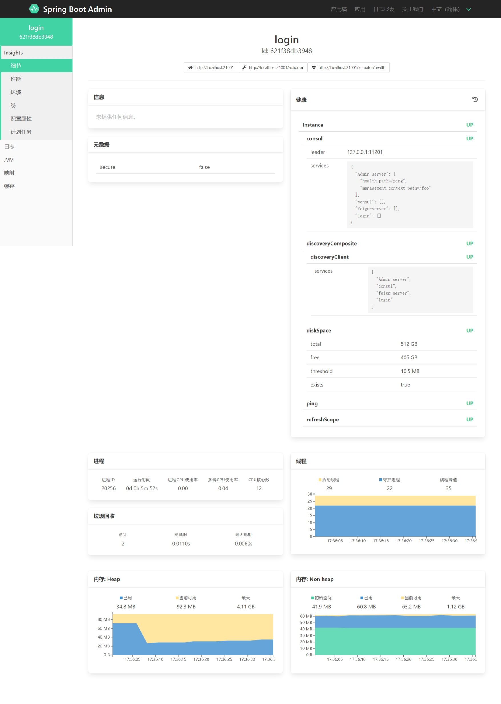

# SpringCloud 基础

[TOC]

## SpringCould项目创建与使用

$~~~~~$ springcould 项目与 springboot 项目创建相似，但是多了一个父子项目的概念。

### 项目创建

1. 先创建一个 spring 项目。
    <center></center>

2. 打开pom.xml把所有的组件删除然后添加 `spring-boot-starter-parent` 的依赖,此依赖位于 `<project> </project>` 下，因为这是所有 springboot 项目的父级依赖。

    ```xml
     <parent>
         <groupId>org.springframework.boot</groupId>
         <artifactId>spring-boot-starter-parent</artifactId>
         <version>2.3.9.RELEASE</version>
         <relativePath/>
     </parent>

    <properties>
        <java.version>17</java.version>
        <project.build.sourceEncoding>UTF-8</project.build.sourceEncoding>
        <project.reporting.outputEncoding>UTF-8</project.reporting.outputEncoding>
        <spring-cloud.version>2021.0.2</spring-cloud.version>
    </properties>
    ```

    $~~~~~$ 之所以要删除所有组件，是因为 SpringCloud 的子项目会下载父项目设置的所有组件，因此除非子项目都会用到这个组件，否则父项目不要添加组件。
    $~~~~~$ 然后把 src 文件夹删了，因为最上级的这个父项目不会去写代码，只是作为多个项目的容器而已。（但是也能写）

3. 子项目建立
    $~~~~~$ 子项目建立有两种方法，第一种原始方法就是直接去创建一个 springboot 项目，然后把项目移动到父项目文件夹中，最后点开两个项目的 pom.xml 。

    子项目需要继承父项目，也就是 `<parent> </parent>` 中引用的是父项目

    ```xml
    <parent>
        <artifactId>spring-cloud-test01</artifactId>
        <groupId>com.cky</groupId>
        <version>0.0.1-SNAPSHOT</version>
    </parent>
    ```

    > 版本号由父项目统一创建可以有效避免版本冲突。

    然后点开父项目，在 `<project> </project>` 下创建下列标签

    ```xml
    <modules>
        <module>  子项目的 “<artifactId>” 名  </module>
    </modules>
    ```

    $~~~~~$ `<modules>` 标签是用来设置子项目的，每有一个子项目就创建一 `<module>` 子标签来标注。

    完成的父项目与子项目类比如图，主要是 `<modules>` 和 `<parent>` 的配置。
    <center></center>

    $~~~~~$ 第二种就是点击项目文件夹右键，创建新 maven 项目，创建的项目会自动给父项目和本项目写上对应值，但是这是一些软件特色，不是 maven 自带的，在 vscode 中可以通过查看 maven 状态栏来查看项目。
    <center></center>

    $~~~~~$ 红框处是显示方式，当以列表方式显示时，能在父项目中看到子项目，且父项目外没有显示这个项目，就表示父子项目的目录结构没有问题，自此，SpringCloud 的项目创建正式完成。

- SpringCloud 的子项目会把父项目的所有依赖全部下载到项目内，所以会发现在编译时，父项目没有任何编译文件，但是要是父项目也是实现项目那另说。
- SpringCloud 就是 SpringBoot 的拓展。

### 统一依赖版本

$~~~~~$ 依赖的版本管理是一个非常麻烦的事情，依赖冲突，版本错误，依赖过多难以管理，更新困难等。
$~~~~~$ 这时我们就需要采用统一管理的方法，去规避上述问题，实现自动化配置。

首先在项目或者父项目的 `<properties>` 中添加以下代码

```xml
<spring-cloud.version>2021.0.2</spring-cloud.version>
```

$~~~~~$ 这样设置了以后，程序就可以通过 `${spring-cloud.version}` 获取所设置的版本号，具体效果见下面的步骤。

然后要在父文件的 pom 文件中加入以下内容。

```xml

    <dependencyManagement>
        <dependencies>
            <dependency>
                <groupId>org.springframework.cloud</groupId>
                <artifactId>spring-cloud-dependencies</artifactId>
                <version>${spring-cloud.version}</version>
                <type>pom</type>
                <scope>import</scope>
            </dependency>
    </dependencyManagement>
```

$~~~~~$ 对于 SpringCloud 的项目而言，`<dependencyManagement>` 放在父项目一样可以获取。
$~~~~~$ 最终达成了我们的目的，子项目公共依赖的版本都通过父项目获取。

### 基础配置

$~~~~~$ SpringCloud原本有个自己的注解：`@SpringCloudApplication` ，但是在2.7.0版本中已经处于废除状态，根本原因是结构上的优化，或者说现在已经不需要这个注解了。
$~~~~~$ 因为 SpringCloud 的便捷化更新，我们现在只用配置 `@SpringBootApplication` 。

想要调用这个注解，需要以下几个步骤：

1. **xml依赖注入**

    $~~~~~$ 根据是否使用的 web 项目，可以选择以下两个依赖其中一个
    > 非 web 的 Springboot 项目搭建请在目录中寻找。

    ```xml
    # 这是 web 项目需要引用的依赖
    <dependency>
        <groupId>org.springframework.boot</groupId>
        <artifactId>spring-boot-starter-web</artifactId>
    </dependency>

    # 这是非 web 项目引用的依赖
    <dependency>
       <groupId>org.springframework.boot</groupId>
       <artifactId>spring-boot-starter</artifactId>
    </dependency>
    ```

2. **启动类设置**

    依赖引入后，就可以使用 **`@SpringBootApplication`** 注解了 ：

    ```java
    @SpringBootApplication
    public class SpringBootTestApplication {
        public static void main(String[] args) {
            SpringApplication.run(SpringBootTestApplication.class, args);
        }
    }
    ```

启动类配置完成后，理论上项目就可以启动了。
> 此处启动类与 SpringBoot 的配置完全一样。

## SpringCloud 三大组件

### consul 注册中心

$~~~~~$ Eureka 已经无了，这里选择了 consul 进行替代。
$~~~~~$ 什么是注册中心？注册中心可以说是微服务架构中的目录，它记录了服务和服务地址的映射关系。在分布式架构中，服务会注册到这里，当服务需要调用其它服务时，就到这里找到服务的地址，进行调用。同时，也可以通过注册中心对程序进行简单的监控，比如存活，卡死等。

$~~~~~$ consul 需要下载额外的客户端，并不是集成在 springcloud 中的。也就是说配置 consul 并不要自行设置 server 端，但是需要下载它的客户端。

#### consul Server端（windows）

1. 前往官网：`https://www.consul.io/downloads`，下载服务端软件
    <center></center>

    $~~~~~$ 下载完成后，将压缩文件解压，得到一个 consul.exe 文件，将文件放入单独的文件夹中，因为文件在运行的时候会产生一大堆运行文件，让文件运行有三种方式，这里简单讲解一下。cmd 处理文件的简单的方法就三种，文件绝对路径，目录地址，环境变量配置。

    1. **文件绝对路径法：** 点开 cmd ，直接将文件拖入窗口，然后空格，输入 `-version` ，回车确认版本号，显示类如下图，就说明能识别到版本，文件没有破损。
        <center></center>

        $~~~~~$ 再次把文件拖入，输入 `agent -dev` ,启动文件,浏览器输入 `http://localhost:8500` 就能看到注册中心的网站了。

    2. **目录地址：** 点开 consul.exe 所在的文件夹，在文件资源管理器的路径栏中输入 cmd 回车。这时出现的 cmd 窗口就只能对该文件夹及其子文件夹进行操作。
        <center></center>

        $~~~~~$ 在 cmd 中输入 `consul --version` 与 `consul agent -dev` ,效果与第一个方法的指令是一样的。然后同样到浏览器输入 `http://localhost:8500` 查看注册中心网站。

    3. **环境变量配置**： 由于consul并不是一个像 jdk，maven 这样会被系统或者第三方软件频繁调用的程序，启动之后就会一直运行，直到被关闭（运行 cmd 的窗口被关闭的话，consul 也被关闭了），所以不建议配置环境变量，但是此处也简单描述一下步骤。

        与 maven 安装类似，打开系统环境变量设置，新建环境变量：

        ```txt
        变量名：consul
        变量值：文件的绝对路径
        ```

        $~~~~~$ 这样每次输入 consul 时，都相当于输入了一次绝对路径，要想运行程序的话就需要输入：绝对路径+程序指令，现在就变成了：变量名+程序指令。

#### consul server 接口配置

$~~~~~$ consul 默认对外连接的接口有很多，大多数都集中在8000段，修改默认的接口配置对我们来说，可以避免接口重复，防止接口被别人直接发现。

1. 在 consul.exe 所在的文件夹中，新建一个 basic.json 文件，并在其中输入以下内容：

   ```json
    {
        "ports": {
            "http": 11200,
            "https":11210,
            "server": 11220,
            "dns": 11230,
            "serf_lan": 11240,
            "serf_wan": 11250
        }
    }
   ```

   后面的接口地址可以自己修改，想用那个就用哪个
   > $~~~~~$ 上方的内容并未覆盖所有的 consul 接口地址，只是最常用的几个而已，`http://localhost:8500` 查看的其实是 http 接口地址。

2. 新建一个 consul 启动的 bat 文件，避免每次输入一长串指令。bat 文件内容如下：

   ```bat
   [conul的绝对路径] agent -server -bootstrap-expect 1 -data-dir .\ -advertise 127.0.0.1 -client 0.0.0.0 -ui -config-dir .\
    pause
   ```

   之后每次想要打开 consul 直接点击这个文件的图标就行了。

#### consul Client端

1. 引入依赖, `spring-cloud-starter-consul-discovery` 和 `spring-boot-starter-web` 。

    ```xml
    <dependencies>
        <dependency>
            <groupId>org.springframework.cloud</groupId>
            <artifactId>spring-cloud-starter-consul-discovery</artifactId>
        </dependency>
        <dependency>
            <groupId>org.springframework.boot</groupId>
            <artifactId>spring-boot-starter-web</artifactId>
        </dependency>
    </dependencies>
    ```

    > 此处我在父级文件设置了版本号，所以这里没有。

2. 启动类声明

   ```java
   @SpringbootApplication
    public class ConsulServerApplication {
        public static void main(String[] args) {
            SpringApplication.run(ConsulServerApplication.class, args);
        }
    }
   ```

   > 没有添加任何东西，因为注册中心原理就是程序向注册中心发送信息，所以并不需要任何类配置。

3. **yaml 配置文件修改**

    项目与服务想要在注册中心注册，就需要向注册中心注册，注册方法就是在配置文件中，输入下列代码：

    ```yaml
    server:
        port: 30000
    spring:
        application:
            name: consul-client

    #consul注册中心地址
    cloud:
        consul:
        host: localhost
        port: 11200
        discovery:

            # 设置禁止当服务器停止时，自动注销
            deregister: false

            service-name: ${spring.application.name}

            # 健康检查失败多长时间后，取消注册
            health-check-critical-timeout: 30s
            health-check-interval: 30s
            health-check-path: /actuator/info

            #开启心跳检测
            heartbeat:
            enabled: true
    ```

    $~~~~~~$ 通过以上代码，让项目或服务向注册中心注册。至此，consul 的 server 端和 client 端部署完成
    > $~~~~~$ 之所以要将默认的自动注销方案从服务器停止改变为健康建设失败，是因为真出现问题时，只会出现服务器异常停止或者 consul 掉线。这种情况下停止的服务如果没有再次上线注册，就会长期停留在 consul 上，只能手动去注销，非常麻烦。
    $~~~~~$ 替换成心跳检测就不一样了，如果服务检测失败，就说明服务器肯定是出现了问题，这时将其关闭即不用担心错误，又不用担心失效服务会长期留在注册中心上。
    $~~~~~$ 但是对于稳定运行，不怎么迭代的系统，还是建议默认方法，避免频繁注册的资源浪费，consul 的注册非常消耗资源。

#### 整体流程

$~~~~~$ 运行流程就是客户端调用服务端，服务端向注册中心提供客户端的生命运行数据，注册中心只需要定期向客户端发送请求，就会重复上述步骤，形成闭环，直到某个端口出错。

1. consul Server 注册中心为额外的程序，需要我们自己下载。

2. 引入依赖 spring-cloud-starter-consul-discovery ，作为外部注册中心的 consul，我们并不需要太多的配置，毕竟 100 多 mb 的软件不是白下的。

3. 服务提供者启动后，向注册中心注册服务。

4. 服务提供者向注册中心注册之后，需要每隔30秒，向注册中心发送心跳，也就是 renew 续约。

5. ApplicationClient 客户端消费者，也是作为一个客户端，定期拉取服务列表，拉取之后，会把列表缓存起来。

6. ApplicationClient 从列表中选择一个具体的服务直接访问。

7. 注册的服务可以通过 Fegin 互相调用。

#### 一些报错解决

1. Error starting agent: error="Failed to start Consul server: Failed to start RPC layer: listen tcp 0.0.0.0:11201: bind: Only one usage of each socket address (protocol/network address/port) is normally permitted."

    > 端口被占用了

### SpringBoot Admin

$~~~~~$ Spring Boot Admin 是用来监控及收集系统日志和数据流，可做监控、可做⼆次框架开发。

首先要在父文件的 pom文件中加入以下内容。

```xml
    <dependencyManagement>
        <dependencies>
            <dependency>
                <groupId>org.springframework.cloud</groupId>
                <artifactId>spring-cloud-dependencies</artifactId>
                <version>${spring-cloud.version}</version>
                <type>pom</type>
                <scope>import</scope>
            </dependency>
            <dependency>
                <groupId>de.codecentric</groupId>
                <artifactId>spring-boot-admin-dependencies</artifactId>
                <version>${spring-boot-admin.version}</version>
                <type>pom</type>
                <scope>import</scope>
            </dependency>
        </dependencies>
    </dependencyManagement>
```

#### Admin项目创建

$~~~~~$ SpringBoot Admin 是一个开源社区项目，用于管理和监控SpringBoot应用程序。应用程序作为 SpringBoot Admin Client 向为SpringBoot Admin Server 注册（通过HTTP）或通过注册中心（例如Eureka，Consul）发现。 UI是的 AngularJs 应用程序，展示SpringBoot Admin Client 的 Actuator 端点上的一些监控。

常见的功能或者监控如下：

1. 显示健康状况
2. 显示详细信息，例如
   1. JVM和内存指标
   2. micrometer.io指标
   3. 数据源指标
   4. 缓存指标
3. 显示构建信息编号
4. 关注并下载日志文件
5. 查看jvm系统和环境属性
6. 查看Spring Boot配置属性
7. 支持Spring Cloud的postable / env-和/ refresh-endpoint
8. 轻松的日志级管理
9. 与JMX-beans交互
10. 查看线程转储
11. 查看http跟踪
12. 查看auditevents
13. 查看http-endpoints
14. 查看计划任务
15. 查看和删除活动会话（使用spring-session）
16. 查看Flyway / Liquibase数据库迁移
17. 下载heapdump
18. 状态变更通知（通过电子邮件，Slack，Hipchat，......）
19. 状态更改的事件日志（非持久性）

要想使用这个功能，我们需要创建一个 SpringCloud 项目，步骤如下：

1. **依赖引入**

    $~~~~~$ Spring Boot Admin Server 需要三个依赖，分别是 Admin Server、Spring MVC、监控 依赖代码如下：

    ```xml
    <dependency>
        <groupId>de.codecentric</groupId>
        <artifactId>spring-boot-admin-starter-server</artifactId>
    </dependency>

    <dependency>
        <groupId>org.springframework.boot</groupId>
        <artifactId>spring-boot-starter-web</artifactId>
    </dependency>

    <dependency>
        <groupId>org.springframework.boot</groupId>
        <artifactId>spring-boot-actuator</artifactId>
    </dependency>
    <!-- spring-boot-starter-web 和 spring-boot-actuator 是 spring-cloud-dependencies 集合里的 -->
    <!-- spring-boot-admin-starter-server 是 spring-boot-admin-dependencies 集合里的 -->
    ```

2. **注解**

    实现 admin-server 只需要在启动项中加入注解 `@EnableAdminServer`

    ```java
    @EnableAdminServer
    @SpringBootApplication
    public class MonitorServerApplication {
        public static void main(String[] args) {
            SpringApplication.run(MonitorServerApplication.class, args);
        }
    }
    ```

3. **yaml 配置**

    $~~~~~$ 由于这是 SpringCloud 的准备组件，所以要在 yaml 上把项目名称，端口改一下，便于查看和避免端口重复 ：

    ```yaml
    spring:
    application:
        name: Admin-server
    server:
        port: 11100
    ```

$~~~~~$ 自此，admin 项目搭建完毕，SpringCloud 大部分基础组件都只用在启动项上加一个组件就行了，访问服务端口就能看到 server 端页面了。

#### Client端

$~~~~~$ 所谓 Client 端，指的应该是所有的项目、所有的模块，或者说所有需要监控的项目和模块，这里仅仅以 client 模块来模拟不同的项目和模块 ，所有被监控的内容的配置都和 client 模块相似。

1. **依赖**

   $~~~~~$ 被监控端也需要有 admin 三个依赖，除了 `admin-starter-server` 变成了 `admin-starter-client` 另外两个都一样。

    ```xml
    <dependency>
        <groupId>de.codecentric</groupId>
        <artifactId>spring-boot-admin-starter-client</artifactId>
    </dependency>

    <dependency>
        <groupId>org.springframework.boot</groupId>
        <artifactId>spring-boot-starter-web</artifactId>
    </dependency>

    <dependency>
        <groupId>org.springframework.boot</groupId>
        <artifactId>spring-boot-actuator</artifactId>
    </dependency>
    ```

2. **配置文件声明**

    $~~~~~$ 需要声明两点，⼀个是声明或者指定 Server 端的地址，⼆是声明自己的项目哪些地方愿意给 Server 端监控。

   1. **命名项目，以及设置 Admin-Server 端口号**。

        ```yaml
        spring:
            application:
                name: Monitor-Client
            boot:
                admin:
                    client:
                        url: http://localhost:11100  
        # 通过 spring.boot.admin:client.url:  
        # 指定 Admin-server 地址，声明地址项目才知道向哪里发送数据。
        ```

   2. **设定哪些东西给 Admin 监控**，此处默认全部:

        ```yaml
        management:
            endpoints:
                web:
                    exposure:
                        include: '*'
            endpoint:
                health:
                    show-details: always
        ```

   3. **为了指定系统日志和数据日志给 Server 端做监控**，这里还需要配置⼀下 Spring 的 log 日志，如下（如果需要部署到服务器上，建议使用绝对路径）：

        ```yaml
        logging:
            file:
                path: ../cloud-logs
        ```

    **整体 yaml 文件代码如下：**

    ```yaml
    spring:
        application:
            name: Monitor-Client
        boot:
            admin:
                client:
                    url: http://localhost:11100  # 通过此段代码指定 Admin-server 地址。
    server:
        port: 11101
    management:
        endpoints:
            web:
                exposure:
                    include: '*'
        endpoint:
            health:
                show-details: always
    logging:
        file:
            path: ../cloud-logs  # 设置打印的日志地址，没有设置不会打印日志。
    ```

    然后我们就可以访问 Admin-server 看到下面的内容：

    <center></center>

    **点击提交日志的服务，我们可以看到服务运行的各项信息：**
    <center></center>

#### admin 与 consul 联合使用

$~~~~~$ 监控中心 admin 可以通过获取注册中心的数据对整个服务进行监控，原理就是拷贝了一份注册中心的数据。所以所能监控到的数据上限，其实就是注册中心所获取所有数据。

这样的结果可以用三点来概括：

1. 程序不用再向监控中心提交数据了，admin-client 的依赖也不用下载了。但是 consul 的负载压力加大了（不过 consul 本来压力就不大）。
2. 监控中心的效率变高，开支变低，但是所获得的数据变少了，通常只有是否存活和是否健康可以知道。
3. 项目的开发时间与成本降低，效率提高，但是当 consul 崩溃或者停止时，监控中心将无法知晓程序状态，风险提高。

$~~~~~~$ 因此在重要或者高负载服务上使用 admin-client 直连，不重要和低负载的服务通过注册中心进行监控，可以实现最优解

**整体项目差距不大，除了 consul 引入和yaml 参数的修改：**

1. admin-server 依赖引入

    ```xml
    <dependency>
        <groupId>org.springframework.cloud</groupId>
        <artifactId>spring-cloud-starter-consul-discovery</artifactId>
    </dependency>
    ```

2. yaml 数据修改，在 **spring:** 中添加如下代码

    ```yaml
    # 取消监控 consul 的 sever 接口与其他不需要通过 consul 监控的服务。（通配符 *）
    boot:
        admin:
        discovery:
            ignored-services: consul

    # 如下是 consul 注册配置与注册服务监控配置
    #consul注册中心地址
    cloud:
        config:
            enabled: false
        consul:
        host: localhost
        port: 11200
        discovery:
            tags: management.context-path=/foo,health.path=/ping
            deregister: false
            service-name: ${spring.application.name}
            # 健康检查失败多长时间后，取消注册
            health-check-critical-timeout: 30s
            health-check-interval: 30s
            health-check-path: /actuator/info
            #开启心跳检测
            heartbeat:
            enabled: true
    ```

这样我们就能通过 consul 对服务进行简单监控了。

#### 注意事项

##### 重复依赖

/usr/lib/jvm/java-17-openjdk-amd64

Admin 的 Server 端和 Client 端的依赖都重复使用了如下两个依赖：

```xml
<dependency>
    <groupId>org.springframework.boot</groupId>
    <artifactId>spring-boot-starter-web</artifactId>
</dependency>

<dependency>
    <groupId>org.springframework.boot</groupId>
    <artifactId>spring-boot-actuator</artifactId>
</dependency>
```

$~~~~~$ 为了减少这种重复依赖的出现，我们可以统⼀将其写在⽗依赖中，之前说过，子项目会把父项目的所有依赖都下载下来。

<center></center>

$~~~~~$ 若子项目都需要同一种插件，也可以放在父项目中，子项目也会下载父项目的插件，此处两个项目我们都需要打包插件。

```xml
<build>
  <plugins>
      <plugin>
          <groupId>org.springframework.boot</groupId>
          <artifactId>spring-boot-maven-plugin</artifactId>
          <configuration>
              <excludes>
                  <exclude>
                      <groupId>org.projectlombok</groupId>
                      <artifactId>lombok</artifactId>
                  </exclude>
              </excludes>
          </configuration>
      </plugin>
  </plugins>
</build>
```

$~~~~~$ 但是需要注意，子项目会把父项目的所有依赖都下载下来，所以除非你可以确定子项目都需要并且以后可能拓展的子项目也都需要才用这个方法。

### Feign 接口及服务调用

$~~~~~$ 为了能使得微服务之间能够相互通信，我们引⼊了 Spring Cloud组件中的第⼆个组件 Feign ，其中 Feign 组件是基于 `RestTemplate` 接口调⽤引擎模板实现的，而 `RestTemplate` 是基于 `HTTPClient` 实现的。

1. **依赖引入**

    主要依赖:

    ```xml
    <dependency>
        <groupId>org.springframework.cloud</groupId>
        <artifactId>spring-cloud-starter-openfeign</artifactId>
    </dependency>
    ```

    $~~~~~$ feign 有两种连接方法。一种是通过注册中心，通过指定其他服务在注册中心的名称对服务进行连接；另一种就是通过负载中心，其实还有通过 url 的方法，但是这只是测试时使用的方法。
    $~~~~~$ 这里主要讲解如何通过注册中心进行 feign 连接。

    次要依赖：

    ```xml
    <dependencies>
        <dependency>
            <groupId>org.springframework.cloud</groupId>
            <artifactId>spring-cloud-starter-consul-discovery</artifactId>
        </dependency>
        <dependency>
            <groupId>org.springframework.boot</groupId>
            <artifactId>spring-boot-starter-web</artifactId>
        </dependency>
    </dependencies>
    ```

2. **启动类声明**

`@SpringBootApplication` + `@EnableFeignClients` 。

```java
@EnableFeignClients
@SpringBootApplication
public class FeignServerApplication {
    public static void main(String[] args) {
        SpringApplication.run(FeignServerApplication.class, args);
    }
}
```

$~~~~~$ 添加了 `@EnableFeignClientes` 后则该启动类对应的模块、项目即可直接使用 Feign 来做远程接口的调用。

#### YAML 配置文件的声明

$~~~~~$ 由于我们需要将各个微服务交由 consul 进行管理，并还要从注册中心获取信息进行远程连接，所有我们还需要引入 consul 依赖，Fegin 实际上就是在注册中心中寻找服务器名，进而获取服务器的端口，通过调用端口达成连通，所以还需要在配置⽂件中声明如下配置：

```yaml
# ====== 下面是 feigin 配置文件的完整代码 ======
server:
        port: 30001
    spring:
        application:
            name: feign01

    #consul注册中心地址
    cloud:
        consul:
        host: localhost
        port: 11200
        discovery:

            # 设置禁止当服务器停止时，自动注销
            deregister: false

            service-name: ${spring.application.name}

            # 健康检查失败多长时间后，取消注册
            health-check-critical-timeout: 30s
            health-check-interval: 30s

            #开启心跳检测
            heartbeat:
            enabled: true
```

至此，配置⽂件声明完成。

#### Feign 的使用

$~~~~~$ Feign 的使用按照 RESTful 风格来划分使用层级结构，分为 GET 、POST 、PUT 、DELETE 四个基本的基于RESTful 风格的Feign调用请求。

`@Feignclient` 标准格式是：

```java
@FeignClient("服务名")
```

$~~~~~$ 服务名的设置就是配置文件 yaml 中的这段代码：

```yaml
spring:
    application:
        name: feign01  #服务名最好是英文，别有空格
```

$~~~~~$ `@FeignClient` 注解用于后端之间的数据传输用，**注意：注解的类只能是接口类，类中的方法没有方法体，只有返回值与传入的参数。**
$~~~~~$ 通过注解 `@FeignClient("feign-server")` 指向服务注解让类中的映射地址指向另一个服务，当我们在调用注解下的方法时，方法就会向指定的另一个服务的接口传递数据，然后接受返回值。
> $~~~~~$ 即我们向这个类的方法中传递了数据，这个数据就会自动传递到指定的服务中，然后获取返回值回来。
> $~~~~~$ 注意，是调用方法，而不是调用 mapping 地址。

`@RequestMapping(value = "/feign")` 通过方法上的请求映射注解设置具体接口，这是 server 端（被调用端）的设置，设置方法与设置前后端的接口一样。

下面是示例代码：

```java
//此java类是在 feign-server 服务中
@RestController
@RequestMapping(value = "/feign")
public class FeignServerController {

    private final String str = "通过 Feign 调用了 FeignServerController 中的 get 方法 !";

    @GetMapping(value = "/get")
    public String get(@RequestParam(value = "id") String id) {
        return "接收的参数为: " + id + " & " + str;
    }
```

```java
//此java类是在 feign-client 服务中
@FeignClient(name = "feign-server", path = "/")
public interface FeignClientService {
    @GetMapping(value = "/feign/get")
    String get(@RequestParam("id") String id);
    }
```

$~~~~~$ 然后我们需要一个方法去调用 `@FeignClient(name = "feign-server", path = "/")` 注解类中的方法：

```java
@RestController
@RequestMapping(value = "/client")
public class FeignClientController {

    @Resource
    private FeignClientService feignClientService;

    @GetMapping(value = "/test")
    public Object test(@RequestParam(value = "name") String name) {
        String str = feignClientService.get(name);
        return str;
    }
}
```

$~~~~~$ 直接调用方法后，方法会去设置的请求地址发送请求，此处是向另一个服务 feign-server 的 /feign/get 发送请求，然后获取返回值。
> $~~~~~$ 在正式使用时必须要知道这个是做什么，怎么用，什么时候用？
> $~~~~~$ 在实际开发中，是按照模块进行开发的，即我做登录注册，你做支付收款，每个分别负责一个子项目，这时候我们只需要去用 feign 去调用别人的给的接口就行了。

- server 端 client 端只是一个便于理解的称呼，实际上只要是在 consul 中注册的服务都可以通过 Feign 互相调用。你甚至可以自己调用自己，虽然毫无意义。
- 注意，此处 Fegin 类中的请求方法中参数加上了 `@RequestParam("id")` 注解，这是因为 `@RequestParam` 注解是通过 key 值来获取数据的，而方法传参时没有 key ，这时候就需要通过 `@RequestParam` 给方法设置上 key 。
