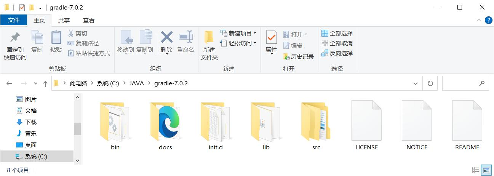
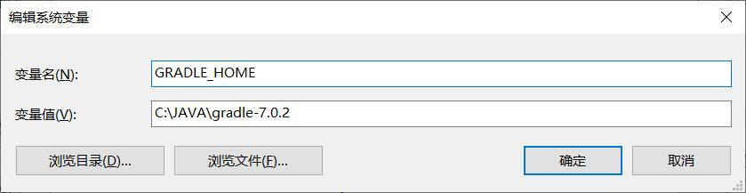
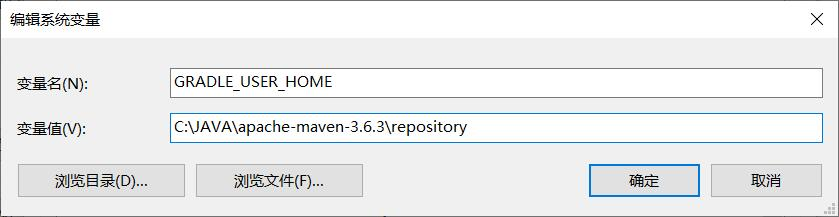
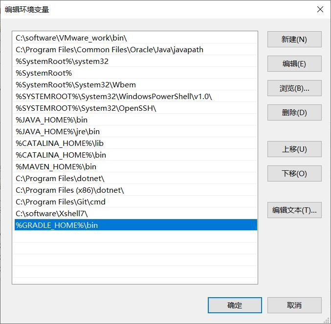
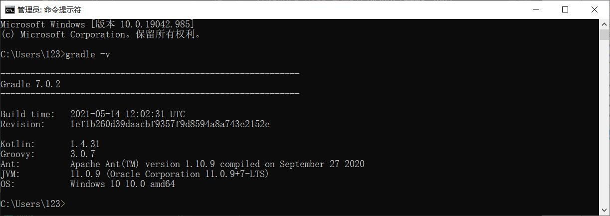

# gradle 安装

## 基础安装

1. **下载**

   先进入官网下载gradle，下载完整版本：<https://gradle.org/install/>

   下载完成后应该是一个压缩文件，解压到任意文件夹中，解压完成后如图：
   

2. **配置环境变量**

   下载解压完成后，还需要进行如下的环境变量配置 ：

   ```windows
   变量名： GRADLE_HOME
   变量值： gradle 文件地址
   ```

   ```windows
   变量名： GRADLE_USER_HOME
   变量值： gradle 的本地依赖仓库地址，自己设置一个文件夹就行了，也可以用 maven 的
   ```

   如图：
   
   

   然后还要在 Path 中添加一个配置

   ```windows
   变量名：  path
   变量值：  %GRADLE_HOME%\bin
   ```

   如图：

   

3. **测试gradle安装**

   使用 cmd 输入代码 `gradle -v` 查看是否成功安装，成功安装会显示类似如下的内容 ：

   

   自此， gradle 安装完成。

***

## [点击此处返回 Gradle 目录](../gardle目录.md)
