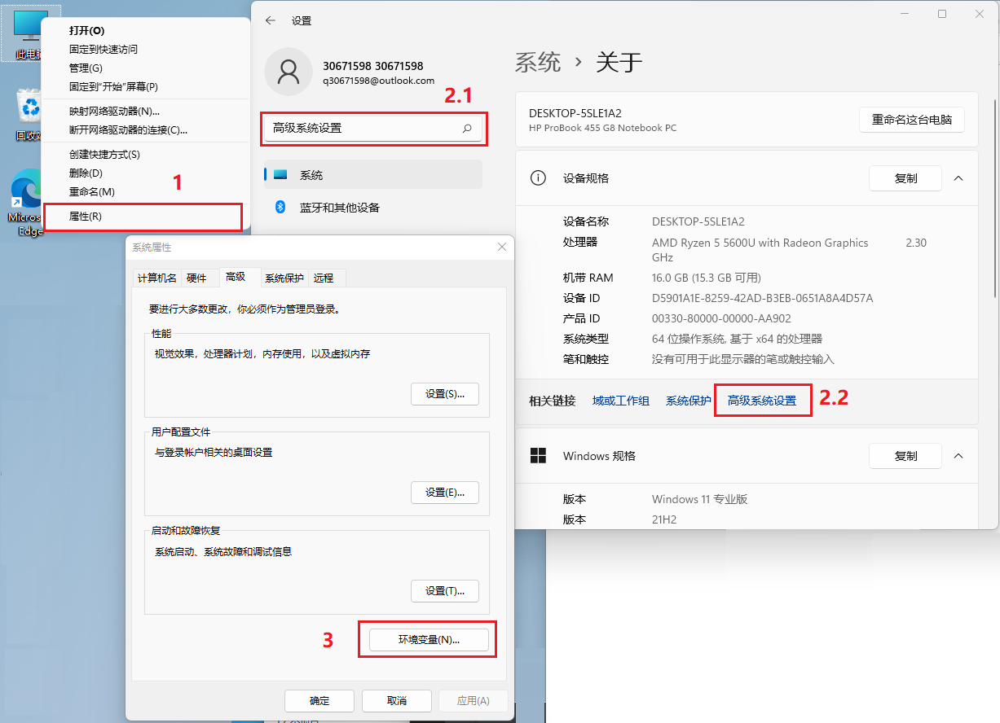

# Java基础

[TOC]

$~~~~~$ jdk 中有大量的方法，我们其实不需要理解这么多东西，实际上连很多基础的东西我们都不需要去学习，在使用中通常只会使用下面这些东西

1. 基础数据类型：boolean , byte , int , float , double
2. 引用数据类型：String , 类 , 数组
3. 一些数据存储方法：hashMap , ArrayList
4. 逻辑运算符：if , for , swtich , while
5. 方法调用，方法重载，
6. 实体，方法，接口，继承等类的创建，调用
7. 多线程，动态代理，线程池，线程安全

## java环境配置与运行

$~~~~~$ java 环境就是 jdk ，这既是 java 的 编译器，也包含了 java 的解译器 jre 。

### windows下java环境配置

1. 前往官网下载 jdk ：`https://www.oracle.com/java/technologies/downloads/`
   $~~~~~$ jdk 拥有几个个长期支持版本，分别是 1.8 ；11 ；17 ；21 ，截至编辑日最新版本为 `jdk-18.0.1`，推荐安装最新的长期支持版本 。
    <center></center>

    $~~~~~$ 注意下载一定要选对操作系统，程序选择安装程序（即 exe , msi 结尾的文件），安装时会进行自动注册，减少环境配置操作 。
    <center></center>

2. 下载完毕一路确认安装，注意安装地址，也可以选择自定义地址。
   > $~~~~~$ 注意安装完成后建议不要再移动 jdk 了，个人移动了后哪怕更改了环境变量的属性，使用 `java -version` 也无法检测到 jdk ，猜测安装时向注册表注册了有关地址方面的东西。

3. 配置环境变量
   1. 右键点击此电脑 → 左键点击属性 → 可选择直接搜索高级系统设置 **或** 在 系统>关于 处找到相关链接：高级系统设置 → 左键点击环境变量。
    <center></center>

4. 新建两个**系统环境变量**
   <center></center>

    ```txt
    变量名：JAVA_HOME
    变量值：jdk的完整路径

    变量名：classpath
    变量值：%JAVA_HOME%\lib\dt.jar;%JAVA_HOME%\lib\tools.jar
    ```

    <center></center>

    接着，在 path 中添加一个变量：

    ```txt
    变量值：%JAVA_HOME%\bin
    ```

    具体设置类如下图：
     <center></center>

5. 在 cmd 中分别输入 `javac` , `java -version` 。若类如下图及说明成功 。
   <center></center>

   > 变量： %JAVA_HOME%\jre\bin 在 jdk11 中就已经不用添加了。

<font size=4 color="DarkViolet">jdk免安装版本安装</font>

$~~~~~$ jdk 免安装版本，即 zip 打包的jdk，具体安装流程与安装版本几乎一样，将压缩包解压到指定的路径后，执行环境变量配置就行了。
$~~~~~$ 但是免安装版本无法做到双击运行 jar 文件，这是因为没有向注册表写入东西，我们可以通过自己去写入来解决问题。不过并不建议这样做，这样就失去了免安装版本的便捷性了，而且这样做也没什么用，在运行 jar 文件的时候，要么是命令行，要么是编辑软件，双击运行几乎不会这样做。

## 不同软件的 jdk 配置

### vsocde 配置

$~~~~~$ 单纯的 jdk 在 vscode 中没有什么需要配置的，只用下载 `Extension Pack for Java` 插件就行了，这个插件包含了6个子插件，足够应对纯 jdk 的开发了。
<center></center>

> 如果配置过 jdk 的环境变量，那完全不用去配置文件配置。

然后只用在右侧的文件夹窗口中，右键选择新建文件就行了，直接创建一个java文件即可。
要想运行 java 程序直接右键文件，在状态栏点击文件或者文件中右键 run 就行了。

### idea 配置

$~~~~~$ idea 也不需要进行什么配置，只需要依次点击文件，项目结构，然后在弹窗中的平台设置中选择 SDK ，如果有就直接改为自己的 jdk 目录，没有就点击上方的加号添加 jdk 。

<center></center>

$~~~~~$ 创建 java 项目也非常简单，点击文件，新建，项目。在弹出窗口中选择新建项目，注意名称，jdk 版本，文件存放位置即可。
$~~~~~$ 项目创建完成后，左侧状态栏中右键 src 文件夹，选择创建 Java 类，然后输入 名称.java 即可。

## 类与方法

### 写法

类写法：

```java
// 普通类
[访问权限修饰符] [关键字] class [类名] { }
/**如*/ public class name {}

//继承子类（继承父类就是普通类）
[访问权限修饰符] class [子类类名] extends [父类类名] {}
/**如*/ public class name extends father {}

//接口父类
public abstract interface [类名] {}
/**如*/ interface name{} 

//接口子类
[访问权限修饰符] class [子类类名] implements [父类类名] {}
/**如*/ public class name implements father{}
```

- 接口父类，子类可以省略访问权限修饰符，默认且必须为 public。

方法写法

```java
[访问权限修饰符] [关键字] [返回类型] [方法名]([对外变量]) {}

//如
public final static void test001(String A,int B){}
```

- 访问权限修饰符：

  - public：对所有类可见，任何人都可以使用
  - private：仅对本类可见
  - protected：对本包和所有子类可见
  - 默认（default）：对本包可见（子类不可见）

- 关键字：

  - static：设置方法为静态方法
    - 静态方法无法访问动态方法，动态方法能访问静态方法。
    - 静态方法是加载在内存中的，动态方法只有在调用时才会加载到内存中
  - final：设置方法、属性、类为最终形态。
    - 最终形态的方法只能被调用，无法被修改。
    - 最终形态定义的属性无法被修改，只能被读取。
    - 最终形态定义的类无法被继承。

  - abstract：设置方法、属性、类为抽象形态

    - 抽象类中的静态方法无法被改写，但是可以被继承和调用。
    - 子类重写父类时，必须实现父类的所有抽象方法。
    - 抽象类不能实例化，也就是不能使用 new 关键字创建对象。
    - 抽象方法（无方法体的方法）只能在抽象类中。
         >无方法体的方法， 即只有定义的方法，如 `public abstract void test01(String name,int id)` 。简单理解就是没有大括号的方法。
    - 抽象类的访问权限只能是 public ；抽象方法访问权限修饰符不能是 private。
         > 因为抽象类必须由子类来实现，而抽象方法必须被重写（不被重写就毫无意义了）

  - 默认：动态非最终形态方法
   >状态修饰符可以多个共存（只要不冲突），关键字之间空格就行了。
    > 上述关键字并非全部，事实上只是一点点常用的而已。
- 返回值类型：
  - void ：设定有返回值，但具体类型以返回值为准。
  - 基本数据类型：返回值只能为设定的数据类型
  - 引用数据类型：返回值只能为引用数据类型
  - Object：返回值可以为所有数据。
    > Object 为所有类的超类。

- 对外变量：即可以接受外界传输过来的数据类型，可以为基本数据类型，引用数据类型，Object，并且可以有多个，用逗号隔开。

> $~~~~~$ 在类中的变量、方法、类等被称作**属性** ；在方法中的变量被称作**变量**。只有类和属性可以使用访问权限修饰符、状态修饰符。
> $~~~~~$ 方法中的所有数据都是暂时的，当方法结束时会自动销毁，并且无法查看。

### 引用

```java
//引用
// [类名] [变量名]

Class class01;

//引用子类
Class 


//实例化
[类名] [变量名]=new [类名]([构造方法参数]);

// 子类实例化
[父类] [变量名]=new [子类]([构造方法参数])

//方法引用（引用方法需要先引用类）
[类在本 类/方法 中的变量名].[类中的方法名]([方法对外变量])

//子类独有方法引用（即引用的是继承关系的子类，如 father name=new son()）
(([类名])[类在本 类/方法 中的变量名]).[类中的方法名]([方法对外变量])
//如： 
father son1=new son01("第一个",18);
((son01) son1).sa("iy",18);
```

## 继承，接口，多态，覆盖

### 继承

- 子类不需要实现父类的全部属性和方法，子类实现了的父类方法会覆盖掉父类的方法，没有实现的就按父类的方法进行执行。
- 子类若想创建一个父类没有的方法，直接创建就行了。
- 子类只能有一个父类，一个父类可以有多个子类。
- 子类与父类皆可单独引用，按普通类引用方式即可。

- 单独引用已引用了的具备继承关系的类，用 `(([类名])[实例化的变量名]).[方法]()`
    如 `((son01) son1).test01();`

- 子类的构造方法要分以下两个情况

  - 若父类没有定义有参构造方法，则子类可以定义也可以不定义构造方法。

  - 若父类仅定义了有参构造方法，则子类必须定义带有同样参数的构造方法 ，并且必须在子类构造方法的第一行显式地（通过super）调用超类的构造方法。
    > $~~~~~$ 带有，不是只有，即至少要有那几个参数，但是可以额外多加参数。
    > $~~~~~$ 此处 super 的用法是在有参构造方法中，`super(父类构造方法的参数)` 。

- 子类是父类的超集，子类拥有的信息，父类不一定有。用子类类型去操作父类对象是不安全的。

- 父类是子类的子集，父类拥有的公有信息，子类一定有，所以用父类类型去操作子类对象是安全的，也即向上转型是成立的。

下列是示例代码：

```java
//这是是父类
public class father {
    private String name;
    private int id;
    public father(String myName, int myid) {
        name = myName;
        id = myid;
    }
    public void test01(){
        System.out.println(name+"这是father一号");
    }
    public void test02(){
        System.out.println(name+"这是father二号");
    }
}


//这是一号子类，实现全部父类的属性，所以执行的时候都是子类的代码
public class son01 extends father {
    private String name;
    private int id;
    public son01(String myName, int myid) {
        super(myName,myid);
        name = myName;
        id = myid;
    }
    public void test01(){
        System.out.println(name+"这是son01一号");
    }
    public void test02(){
        System.out.println(name+"这是son02一号");
    }
}


//这是二号子类，有一个方法没有实现，所以执行时未实现的方法按父类的方法来执行。
 public class son02 extends father {
        private String name;
        private int id;
        public son02(String myName, int myid) {
            super(myName,myid);
        }

     public void test01(){
            System.out.println(name+"这是son01一号");
        }
}

//这是引用类
public class Main {
    public static void main(String[] args) {
        father son1=new son01("第一个",18);
        father son2=new son02("第二个",18);
        ((son01) son1).sa("iy",18);
        son1.test01();
        son1.test02();
        son2.test01();
        son2.test02();
    }
}

//这是输出结果
iy这是son01一号
iy这是son02一号
null这是son01一号
第二个这是father二号
```

### 接口

$~~~~~$ 接口也是基于多态思想的产物，与继承不同，接口的子接口与实现类支持多继承，即以子接口或实现类可以有多个父接口，但接口的子接口或实现类必须实现父接口的所有方法。
> $~~~~~$ java 为了增强接口的功能，允许在接口中出现静态方法，静态方法无法被继承，只能通过调用该接口使用。
> $~~~~~$ 主要由于接口的代码太少了，而且只有抽象方法，于是想增强接口的功能。

$~~~~~$ 接口父类只能是公开的抽象类，所以接口的 public abstract 可以省略，但是接口的实现类由于由是实现接口抽象方法，所以访问权限也必须一样，为 public 。
$~~~~~$ 同样，实现类或者子接口是父类的超类，子需要有父有的，子也可以有父没有的。

```java
//以下是接口父类的示例
public interface test{
    String test01();
    String test02();
}

//以下是接口子类的示例
public class test01 implements test {
    public String test01(){
        [方法体…………………………]
    }
    public String test02(){
        [方法体…………………………]
    }
}
```

多继承很简单，在声明继承的类的时候，用逗号隔开就行。

```java
public interface test01{
    String test01();
}
public interface test02{
    String test02();
}

//以下是接口子类的示例
public class testImpl implements test01,test02 {
    public String test01(){
        [方法体…………………………]
    }
    public String test02(){
        [方法体…………………………]
    }
}
```

> 如果多个父接口有相同的方法，实现类只只会有一个方法，实现所有父接口的该方法。

调用实现类有两个方法。

1. 和调用普通类一样直接调用实现类，这样就能实现实现类的所有方法。
2. 利用继承原理，通过父接口指向实现类，这样实现类的“多余”方法就无法使用。

通常只要你不用“多余”的方法，推荐使用继承方式，示例如下

```java
public interface test{
    String test01();
    String test02();
}

//以下是接口子类的示例
public class test01 implements test {
    public String test01(){
        [方法体…………………………]
    }
    public String test02(){
        [方法体…………………………]
    }
}

//以下是调用示例
public static void main(String[] args) {
    //这是继承方式指向调用
    test Impl01  = new test01();
    //这是直接实例化调用
    test01 Impl02  = new test01();

    Impl01.test01();
    Impl02.test01();
}
```

### 多态

$~~~~~$ 多态的概念就是一对多，调用一个模块有多个子模块就是多态，如类有多个子类，这就是继承多态；接口有多个子接口，这就是接口多态，方法通过一个名可以调用多个方法，这就是重载多态。

$~~~~~$ 多态是一个很扭曲的概念，因为我们并不是必需要这个东西，一个父类多个子类，我们完全可以直接封装多个类。

$~~~~~$ 想了半天，最后得出两个原因，方便，规范。
$~~~~~$ 对于继承而言，我们更多的是使用它的默认继承父方法，用以减少代码量；而接口，我们是用的它的规范型，子接口必须实现父类的所有方法，所以我们需要多个功能相同，执行方法不同的类时，能够保证代码的规范，不至于缺失功能。

## 数据类型

$~~~~~$ Java 语言的数据类型分为两种：基本数据类型和引用数据类型。

$~~~~~$ 基本数据类型包括 boolean（布尔型）、float（单精度浮点型）、char（字符型）、byte（字节型）、short（短整型）、int（整型）、long（长整型）和 double（双精度浮点型）共8种。
<center></center>

$~~~~~$ 引用数据类型建立在基本数据类型的基础上，包括数组、类和接口。引用数据类型是由用户自定义，用来限制其他数据的类型。另外，Java 语言中不支持 C++ 中的指针类型、结构类型、联合类型和枚举类型。
$~~~~~$ 在使用中，基本数据类型 short，long 不常用，引用数据类型都经常用。
$~~~~~$ 基本数据类型几乎没有什么可以介绍的，如果不会，建议 C 语言开学。

### 基本数据类型的封装类型

$~~~~~$ 由于 java 的基本数据类型不支持 null ，但是在 web 中极有可能出现这个问题，而且 null 有时候也是属于需求内的属性。
$~~~~~$ 基于此需求，与增强数据处理功能的目的，java 对所有的基础数据类型进行了封装，封装类型可以存放 null ，并且有许多额外的功能。

下面是基本数据类型和其封装类型的对照表

|基础|封装||基础|封装|
| :--: | :--: | :--: | :--: |:--:|
| int | Interger || boolean | Boolean |
| byte | Byte || char | Character |
| short | Short ||long|Long|
|float|Float||double|Double|
|void|Void||||

使用也很简单，与基本数据类型使用一样。

```java
Integer a;
a = 0;
a= null;
```

封装数据类型也是引用数据类型。
封装类型的方法这里不详细讲解，很多 String 数据类型的方法都可以使用，大家都是引用数据类型。

### 数组

数组是用来存储多个相同类型的数据，java 的数组不支持可变长度。

写法：

```java
数据类型[] 数组名称 =new 数据类型[]{值};
数据类型[] 数组名称 ={值};


//下面是例子

String[] a=new String[]{“1”,”2”,”3”};
String[] aa={"a","b","c"};


//数组在定义时可以不用定义长度和值，如:

String[] a=new String[]{}; 
String[] aa;
```

但是定义时没有长度和值是不行的，这样的数组无法直接使用，使用时需要先赋予长度，再赋值。因为java的数组不支持可变长度, 如 ：

```java
String[] a=new String[]{};
aaa = new String[3]  // 赋予数组长度时，只能通过 new String[] 
```

二维数组的定义也很简单

```java
String[][] a = {{"bbbb", "cccc"},{"dddd", "eee"}};
String[][] b = new String[][]{{"bbbb", "cccc"},{"dddd", "eee"}};

String [][]  c; 
String [][] d = new String[][]{};
```

同样，二维数组也需要定义，不定义就要先赋予长度才能使用。

指定数据中某个数据的方式为 `name[int]` 二维数组为 `name[i][i]`

```java
public static void main(String[] args){
    String[] test01 = {"11","22"}
    double[][] class_score={{10.0,99,99},{100,98,97},{100,100,99.5},{99.5,99,98.5}};
    System.out.println("一维数组第二个数据："+test01[1]);
    System.out.println("二维数组第四行第一列元素的值："+class_score[3][0]);
}
```

数组的一些方法：

- `length`
  该方法用于获取数组的长度，但是仅限于一维数组，用于二维数组就只会获取列数量。
  
  ```java
  public static void main(String[] args){
        String[] test01 = {"11","22"}
        double[][] class_score={{10.0,99,99},{100,98,97},{100,100,99.5},{99.5,99,98.5}};
        System.out.println("一维数组数量："+test01.length);
        System.out.println("二维数组列数："+class_score.length);
    }
  ```

  如果获取二维数组的长度，就只能先获取列数，然后用 for 循环遍历每个列的数量（但其实不用，数组长度固定，只要知道一个列的长度直接 列数×列长 就行了）

    ```java
    public static void main(String[] args){
        double[][] class_score={{100,99,99},{100,98,97},{100,100,99.5},{99.5,99,98.5 }};
        for(int i=0;i<class_score.length;i++)
        {    //遍历行
            for(int j=0;j<class_score[i].length;j++)
            {
                System.out.println("class_score["+i+"]["+j+"]="+class_score[i][j]);
            }
        }
    }
    ```

- `Arrays.toString`
    如果要想输出数组，可以通过 for 循环，但是如果想要将数组的数据一次性输出，就需要 Arrays 类的 toString 方法了，数组自带的 toString 方法只会输出数据类型和内存地址。

    ```java
        public static void main(String[] args) {
        String[] a = {"aaa","bbb"};
        System.out.println("a的值"+Arrays.toString(a));
    }
    ```

- `clone()`

    $~~~~~$ 数组的指向与基础数据类型不一样，数组如果直接使用基础数据类型赋值的话，只是将内存地址赋值了过去，这时不管对哪个数组进行操作，都会影响另一个数组。

    ```java
    public static void main(String[] args) {

        String[] a = {"aaa","bbb"};
        String [] b = a;
        b[1] = "ccc";
        System.out.println("a的值"+Arrays.toString(a));
        System.out.println("b的值"+Arrays.toString(b));
    }

    /**
    结果
    a的值[aaa, ccc]
    b的值[aaa, ccc]
    **/
    ```

    我们可以通过三种方式来让创建新数组
    1. for 循环
    2. new
    3. clone

    $~~~~~$ for 循环会消耗大量的性能，而 new 只是创建了一个新的数组，然后把变量指向这个数组，这个变量依旧不是自己存放了一个数组。
    $~~~~~$ 而 clone 和 new 差不多，属于浅拷贝，改变的结果储存在另一个地方，而原始数据还是指向这个内存地址，不过不管怎么样，改变也不会影响原来的数组了。
    > 浅拷贝只复制指向某个对象的指针，而不复制对象本身，新旧对象还是共享同一块内存， 所以如果其中一个对象改变了这个地址，就会影响到另一个对象。
    浅拷贝对应的就是深拷贝，深拷贝是将一个对象从内存中完整的拷贝一份出来,从堆内存中开辟一个新的区域存放新对象,且修改新对象不会影响原对象。

    ```java
    public static void main(String[] args) {

        String[] a = {"aaa","bbb"};
        String [] b = a.clone();
        b[1] = "ccc";
        System.out.println("b的值"+Arrays.toString(b));
    }
    ```

- Arrays.equals(array1,array2)
    如果两个指定的数组彼此相等，则返回 true ，否则返回 false 。

    ```java
    int[] arr1 = {123};
    int[] arr2={123};
    System.out.println(Arrays.equals(arr1,arr2));//true
    ```

- `hashCode([Array])`
   根据指定数组的内容返回哈希码。

    ```java
    String[] a = {"aaa","bbb"};
    System.out.println("b的值"+Arrays.hashCode(a));
    ```

- `getClass()`
    返回此 Object 的运行时类

    ```java
    String[] a = {"aaa","bbb"}; 
    System.out.println("a的值"+a.getClass()); // [class
    System.out.println("a的值"+a.getClass().getName()); // [??? ,几维数组就有几个 [
    ```

- `Arrays.asList(array)`
    返回由指定数组支持的固定大小的列表。
    `Arrays.asList(array).contains(obj)` : 判断数组中是否有指定字符串

    ```java
    String[] arr={"1","2","3"};

    System.out.println(Arrays.asList(arr));//[1, 2, 3]
    System.out.println(Arrays.asList(arr).contains("2"));//true
    ```

- `Arrays.copyOf(array,int)` : 方法： 复制指定的数组，可以指定长度，如果长度超过数组长度就会用 0 来填充

    ```java
    String[] arr={"1","2","3"};
    int [] arr = {1,9,3,7};
    int [] arr1=Arrays.copyOf(arr,6);
    System.out.println(Arrays.toString(arr1));//[1, 9, 3, 7, 0, 0]
    ```

- `Arrays.deepEquals(array1,array2)`
    如果两个指定的数组彼此深度相等，返回 true ，否则返回 false
    > 深度就是长度一样，二维数组的话一维二维长度都要一样。

    ```java
    int a[][] = new int[][]{{0}, {1, 2, 3, 5, 4}};

    int b[][] = new int[][]{{0}, {1, 2, 3, 5, 4}};
    int c[][] = new int[][]{{0}};
    System.out.println(Arrays.deepEquals(a, b));//true
    System.out.println(Arrays.deepEquals(a, c));//false
    ```

- `Arrays.sort(array,int1,int2)`
    按照数字顺序排列指定的数组。
    `int1,int2` : 可选参数，只会对数组中 int1 到 int2 的数排序。

    ```java
    int[] arr2={1,9,3,7,2,5};
    Arrays.sort(arr2,1,4);//范围包含1不包4
    System.out.println(Arrays.toString(arr2));//[1, 3, 9, 7, 2, 5]
    ```

- `array.length()`

    获得此数组的长度

    ```java
    int[] arr={1,5,6,8,2,3,7};
    System.out.println(arr.length);//722]
    ```

- `System.arraycopy(array1, int1, array2, int2, int3);`
  该方法用于合并数组，通过指定参数将前一个数组的数据复制到第二个数组的末尾。

  - `array1` : 原始数组
  - `int1` : 原始数组取值开始位置
  - `array2` : 目标数组
  - `int2` : 目标数组起始位置
  - `int3` : 最终数组总长度`

    ```java
    int[] a = new int[](1,2,3,4,5,6)
    int[] pin= new int[5];
    System.arraycopy(a, 0, pin, 0,6);
    System.out.println(Arrays.toString(pin));
    ```

### ArrayList

ArrayList 类是一个可以动态修改的数组，与普通数组的区别就是它是没有固定大小的限制，我们可以添加或删除元素。
ArrayList 继承了 AbstractList ，并实现了 List 接口，也就是说，我们可以通过 list 接口去调用这个类，这个类就是 List 的实现类，写法为：

```java
List<E> arr01  = new ArrayList<>();
ArrayList<E> arr02 = new ArrayList<>();
```

- `E` : 指定 Arraylist 集合的数据类型，只能为引用类型。
  > 这不代表不能存数字浮点这些了，java 专门有这些数据类型的封装类型(封装类型就是一种引用类型)，如 int 的封装类型为 inteager 。

$~~~~~$ 第一行代码创建了一个 ArrayList 的对象后把上溯到了 List 。此时它是一个 List 对象了，有些 ArrayList 有但是 List 没有的属性和方法，它就不能再用了。
$~~~~~$ 第二行代码创建一对象则保留了ArrayList的所有属性。
> 这个概念很简单，子类可以实现父类的方法并新增方法。所以用父类指向子类由于父类没有这些方法，所以没法使用。

$~~~~~$ 通常还是建议使用第一个方法，这样之后如果有修改属性的情况，比如 Arraylist 改成 LinkedList ，只用实例化的 `ArrayList<>()` 改为 `LinkedList<>()` 就行了，解耦合，提高可复用和可维护性，如果看到用上了 `ArrayList<E> arr02 = new ArrayList<>()` 多半用上特有方法，特有方法此处不做介绍。

该方法需要引用 jdk 自带的库

```java
import java.util.ArrayList;
```

**下面是 ArrayList 的几个常用方法:**

- `List.add(obj)`
  该方法用于向 list 中添加元素

    ```java
    List<String> sites = new ArrayList<>();
    sites.add("Google");
    sites.add("Weibo");
    System.out.println(sites);
    ```

- `ArrayList.get(int)`

    获取 list 中的元素。
    > 注意，list 中的元素也是从 0 开始排的。

```java
    List<String> sites = new ArrayList<>();
    sites.add("Google");
    sites.add("Runoob");
    System.out.println(sites.get(1));  // 访问第二个元素
```

- `List.set(int,obj)`

    修改 list 中的元素，第一个参数决定位置，第二个参数决定内容。

    ```java
    List<String> sites = new ArrayList<>();
    sites.add("Google");
    sites.add("Runoob");
    sites.add("Taobao");
    sites.add("Weibo");
    sites.set(2, "Wiki"); // 第一个参数为索引位置，第二个为要修改的值
    System.out.println(sites);
    ```

- `list.remove(int)`
    删除 list 中的元素，删除后后面的元素会向前进一位，中间不会有空位置。

    ```java
    List<String> sites = new ArrayList<>();
    sites.add("Google");
    sites.add("Runoob");
    sites.add("Taobao");
    sites.remove(2); // 删除第 3 个元素
    System.out.println(sites);
    ```

- `List.size()`
    获取 list 中元素的总数，并返回数据，返回值为 int 。

    ```Java
    List<String> sites = new ArrayList<>();
    sites.add("Google");
    sites.add("Runoob");
    sites.add("Taobao");
    sites.add("Weibo");
    System.out.println(sites.size());
    ```

- `Collections.sort(list)`
    对 list 进行排序（数组应该也行）。
    该方法需要引用 jdk 自带的库

    ```java
    import java.util.Collections;  // 引入 Collections 类
    ```

    ```java
    List<String> sites = new ArrayList<>();
    sites.add("Taobao");
    sites.add("Wiki");
    sites.add("Runoob");
    sites.add("Weibo");
    sites.add("Google");
    Collections.sort(sites);  // 字母排序
    System.out.println(sites.toString());
    ```

- 如果要逐个获取 list 中的元素，可以使用 for 循环。

```java
    List<String> sites = new ArrayList<>();
    sites.add("Google");
    sites.add("Runoob");
    sites.add("Taobao");
    sites.add("Weibo");
    for (int i = 0; i < sites.size(); i++) {
        System.out.println(sites.get(i));
    }
```

- `List contains(Object)`
    判断 list 中是否存在某个数。

    ```java
    // 创建一个数组
    ArrayList<String> sites = new ArrayList<>();

    sites.add("Google");
    sites.add("Runoob");
    sites.add("Taobao");
    System.out.println("网站列表: " + sites);


    // 检查 Runoob 是否在这个数组中
    System.out.print("Runoob 是否存在于 arraylist: ");
    System.out.println(sites.contains("Runoob"));

    // 检查 Weibo 是否在这个数组中
    System.out.print("Weibo 是否存在于 arraylist: ");
    System.out.println(sites.contains("Weibo"));
    ```

- `List addAll(int,list)`
    将指定集合中的所有元素都插入到本集合中，第一个元素指定插入的位置（将插入在该位置后面），第二个元素指定要插入的集合。
    > 若第一个元素不填，会默认插入到最后。

    ```java
    // 创建一个动态数组
    ArrayList<Integer> primeNumbers = new ArrayList<>();
    // 往动态数组里添加元素
    primeNumbers.add(3);
    primeNumbers.add(5);
    System.out.println("Prime Numbers: " + primeNumbers);

    // 创建另外的一个动态数组
    ArrayList<Integer> numbers = new ArrayList<>();
    numbers.add(1);
    numbers.add(2);

    // 把 primeNumbers 的所有元素添加到 numbers 的动态数组中
    numbers.addAll(1,primeNumbers);
    System.out.println("Numbers: " + numbers);
    ```

### HashMap

$~~~~~$ HashMap 是一种键值对应的储存容器。
$~~~~~$ HashMap 实现了 Map 接口，根据键的 HashCode 值存储数据，具有很快的访问速度，最多允许一条记录的键为 null，不支持线程同步。
$~~~~~$ HashMap 是无序的，即不会记录插入的顺序。
$~~~~~$ HashMap 继承于AbstractMap，实现了 Map、Cloneable、java.io.Serializable 接口。

HashMap 的声明方式为

```java
Map<Object,Object> [变量名]=new HashMap<>();
HashMap<Object,Object> [变量名]=new HashMap<>();
```

> 一个是父引子，一个是直接调用。

下面是声明的例子

```java
//接口引用方式
Map<Integer,String> map01 = new HashMap<>();
Map<ArrayList<String>,Object> map02 = new HashMap<>();

//直接实例化
HashMap<String,String> hashmap=new HashMap<>(); 
```

> HashMap 的数据类型也只能为引用数据类型。
> 由于运行效率问题，key 值通常为 Integer , String ，数据容器最好不要设置为 key。

**HashMap 中有多种方法可以使用，常用的方法如下：**

- `put(key, value)`
    添加键值对(key-value)

    ```java
    HashMap<Integer, String> Sites = new HashMap<Integer, String>();
    // 添加键值对
    Sites.put(1, "Google");
    Sites.put(2, "Runoob");
    Sites.put(3, "Taobao");
    Sites.put(4, "Zhihu");
    System.out.println(Sites);
    ```

- `get(key)`
    获取 key 对应的 value

    ```java
    // 创建 HashMap 对象 Sites
    HashMap<Integer, String> Sites = new HashMap<Integer, String>();
    // 添加键值对
    Sites.put(1, "Google");
    Sites.put(2, "Runoob");
    Sites.put(3, "Taobao");
    Sites.put(4, "Zhihu");
    System.out.println(Sites.get(3));
    ```

- `remove(key)`
    删除 key 对应的键值对(key-value)

    ```java
    HashMap<Integer, String> Sites = new HashMap<Integer, String>();
    // 添加键值对
    Sites.put(1, "Google");
    Sites.put(2, "Runoob");
    Sites.put(3, "Taobao");
    Sites.put(4, "Zhihu");
    Sites.remove(4);
    System.out.println(Sites);
    ```

- `HashMap.clear()`
    删除该变量的所有键值对(key-value)

    ```java
    // 创建 HashMap 对象 Sites
    HashMap<Integer, String> Sites = new HashMap<Integer, String>();
    // 添加键值对
    Sites.put(1, "Google");
    Sites.put(2, "Runoob");
    Sites.put(3, "Taobao");
    Sites.put(4, "Zhihu");
    Sites.clear();
    System.out.println(Sites);
    ```

- `HashMap.size()`
    计算 HashMap 中的元素数量，即 hashmap 中储存了多少个键值对。

    ```java
    // 创建 HashMap 对象 Sites
    HashMap<Integer, String> Sites = new HashMap<Integer, String>();
    // 添加键值对
    Sites.put(1, "Google");
    Sites.put(2, "Runoob");
    Sites.put(3, "Taobao");
    Sites.put(4, "Zhihu");
    System.out.println(Sites.size());
    ```

- `HashMap.setkey()`
    获取所有 key 值，返回值为数组？

    ```java
    // 创建一个 HashMap
    HashMap<Integer, String> sites = new HashMap<>();

    // 往 HashMap 添加一些元素
    sites.put(1, "Google");
    sites.put(2, "Runoob");
    sites.put(3, "Taobao");
    System.out.println(sites.keySet())  
    ```

    > 通过这个方法可以实现遍历输出，有了 key 值，只需要通过 get() 方式就可以遍历获取数据。

## 异常

$~~~~~$ 异常是指程序在运行过程中发生的，由于外部问题导致的程序运行异常事件，异常的发生往往会中断程序的运行。在 Java 这种面向对象的编程语言中，万物都是对象，异常本身也是一个对象，程序发生异常就会产生一个异常对象。

<center></center>

- `Throwable`
    $~~~~~$ Throwable 类是 Java 语言中所有错误或异常的顶层父类，其他异常类都继承于该类。Throwable类有两个重要的子类：**Exception（异常）** 和 [Error（错误）]，二者都是 Java 异常处理的重要子类，各自都包含大量子类。

- `Error`
    $~~~~~$ Error 是 Throwable 的子类，通常情况下应用程序「不应该试图捕获的严重问题」。
    $~~~~~$ Error 是程序无法处理的错误，表示运行应用程序中较严重问题。大多数错误与代码编写者执行的操作无关，而表示代码运行时 JVM（Java 虚拟机）出现的问题。

- `Exception`
    Exception以及它的子类，代表程序运行时发送的各种不期望发生的事件。可以被Java异常处理机制使用，是异常处理的核心，该异常主要分为两类。
    1. 非检查性异常（unchecked exception）
    2. 检查性异常（checked exception）

$~~~~~$ 通常情况下，我们只会关注 Exception ，Error 的错误通常是非常严重的，在编译阶段就无法编译。
$~~~~~$ 在运行中，程序遇到异常就会自动捕获，然后结束。
$~~~~~$ 有些异常由于运行效率，或者违反规定才会产生，这时候我们不希望程序在这里结束，这时我们就就需要捕获异常，让异常发生后程序还能继续运行。

java在代码块中使用 `try …… catch`  来捕获异常，下面是使用方式：

```java
try {
    ...
} catch ([异常类型] [变量名]) {
    ...
} catch ([异常类型] [变量名]) {
    ...
} finally {
    ...
}
```

- `try`
    $~~~~~$ try 块中放可能发生异常的代码，如果执行完 try 且不发生异常，则接着去执行 finally 块中的代码和 finally 后面的代码（如果有的话）。
    $~~~~~$ 如果程序发生异常，则尝试去匹配对应的 catch 块。
- `catch`
    $~~~~~$ 每一个 catch 块用于捕获并处理一个特定的异常，或者这异常类型的子类，但是也可以将多个异常放在一个 catch 中，写法为 `catch ([异常类型1] [变量名1] , [异常类型2] [变量名2] , ……)` 。、
    > 但是这样多个异常就不好去执行不同的代码了，不过也可以用 if 去判断变量是否为空来知道哪个异常被捕获了。

    $~~~~~$ catch 后面的括号定义了异常类型和异常参数。如果异常与之匹配且是最先匹配到的，则虚拟机将使用这个 catch 块来处理异常。
    $~~~~~$ 在 catch 块中可以使用这个块的异常参数来获取异常的相关信息。异常参数是这个 catch 块中的局部变量，其它块不能访问。
    $~~~~~$ 如果当前 try 块中发生的异常在后续的所有 catch 中都没捕获到，则先去执行 finally ，然后到这个方法的外部调用者中去匹配异常处理器。
    $~~~~~$ 如果 try 中没有发生异常，则所有的 catch 块将被忽略。
    > catch 从上向下执行，如果异常被前面的 catch 捕获了，后面的 catch 就不会执行。

- `finally`
    $~~~~~$ finally 块不是必须的，通常是可选的。
    $~~~~~$ 无论异常是否发生，异常是否匹配被处理，finally 中的代码都会执行。
    $~~~~~$ 一个 try 至少要有一个 catch 块，否则， 至少要有 1 个 finally 块。但是 finally 不是用来处理异常的，finally 不会捕获和处理异常，处理异常的只能是 catch 块。
    $~~~~~$ finally 主要做一些清理工作，如流的关闭，数据库连接的关闭等。
    $~~~~~$ finally 块不管异常是否发生，只要对应的 try 执行了，则它一定也执行。只有一种方法让 finally 块不执行：「System.exit()」 。

除此之外，还可以通过类的继承来实现将类中的所有异常抛出，原理来源于继承子类会拥有父类所有的方法。

```java
public class test01 extends Exception {
    ………………………………………………………………
}
```

## 多线程

$~~~~~$ JAVA 中的多线程与 CPU 中的多线程并不是同一个东西，CPU 中的多线程是硬件多线程，是真正意义上的并行。而 JAVA 上的多线程是指提出一个额外的并行进程，但是具体是否是由电脑的另一个硬件线程来执行，那就要看 IO 的调度了，如果调用的物理线程，那就是并行，如果是调用的同一个线程，那就是模拟并行，即处理器执行了一会这个程序，然后挂着再去执行另一个线程，执行一会再返回回来继续自行，如此往复，反复横跳。
$~~~~~$ 另外，多线程的数据与单线程一样，类数据是持久数据，方法数据是临时数据，即我们设置了一个属性 `int i=100` ，然后设置两个线程，内容为 i 减一，当我们运行完毕时，i 的值就变成了 98 。（理论上是这样）

$~~~~~$ 线程按时间顺序一共有四个状态，分别是：创建状态，就绪状态，调用状态，运行状态，中断或者死亡状态。
$~~~~~$ 另外，还有一个单独的状态，就是阻塞状态，即线程被暂停或者出现逻辑错误，并没有向下继续执行，当阻塞的事件解除后，就会重新进入就绪状态，等待 cpu 调度。

$~~~~~$ 多线程一共有三种主流方法： `Thread` 、`Runnable` 、`Callable` ，下面将依次讲解各方法的区别和如何使用。

### Thread

使用 Thread 来实现多线程有以下几个步骤

1. **创建一个类，继承 Thread 类，以下是示范代码：

   ```java
   class ThreadTest extends Thread {
        //······
    }
   ```

2. 在类中实现 run 方法，这个方法就是我们多线程所执行的方法，请注意名称 run 是固定的，不能更改，即一个类中只有一个 run 方法用来执行多线程。

    ```Java
    public void  run(){
        //······
    }
    ```

3. 然后在主方法中创建一个多线类的实例，通过 start 方法来以多线程方法执行 run 方法，下面是完整的例子代码

    ```Java
    public class Main {
        public static void main(String[] args) {
            ThreadTest test1=new ThreadTest(2);
            ThreadTest test2=new ThreadTest(3);
            test1.start();
            test2.start();
        }
    }

    class ThreadTest extends Thread {
        int cat;
        ThreadTest (int cat){
            this.cat=cat;
        }
        public void  run(){
            System.out.println("这里有"+cat+"只猫");
        }
    }
    /*
    输出结果：
        这里有2只猫
        这里有3只猫
    */
    ```

    $~~~~~$ 执行逻辑就是创建一个多线程继承类，然后在其中创建一个特殊方法 run ，通过 start方法去运行这个类时，它会去类中寻找叫做 run 的方法，然后开启新一个线程去执行它。

### Runnable（推荐）

$~~~~~$ thread 类也是实现了 Runnable 接口,点进 thread 类源码就可以看到了。
$~~~~~$ 注意我上面说的是实现了接口，这也是两个方法的一个区别，一个类继承，一个是接口实现。此外两者的多线程类内容完全一样，但是运行这个类的方法有所区别。

1. 创建一个类，实现 Runnable 接口,然后在类中实现 run 方法。

   ```Java
    class Test implements Runnable {
        @Override
        public void run() {
            //······
        }
    }
   ```

   $~~~~~$ 然后创建实例化接口、新建一个线程类 `Thread a=new Thread([类名]);` ，将接口放入线程中，然后 使用 start 方法运行线程类
   > $~~~~~$ 如果我们对于线程有严格规定分类规定的话，那么就用 `Thread a=new Thread();` ，如果没有 ，那就用 `new Thread(test1,"7号").start();` 直接运行线程，少敲几个字。

   ```java
    Thread a=new Thread(Test);
    a.start();
   ```

    下面是一个完整的代码，同时我将利用下面这个代码介绍并发数据冲突的问题

   ```Java
   public class RunnableTest {
        public static void main(String[] args) {
            Test test1=new Test();
            Test test2=new Test();
            new Thread(test1,"7号").start();
            new Thread(test2,"8号").start();
            new Thread(test1,"9号").start();
            new Thread(test2,"10号").start();
        }
    }

    class Test implements Runnable {
        int a=0;
        @Override
        public void run() {
            while(a<5){
                System.out.println("狗"+Thread.currentThread().getName()+"跑了"+a+"步");
                a++;
            }
        }
    }
    /*运行结果：
        狗8号跑了0步
        狗9号跑了0步
        狗7号跑了0步
        狗10号跑了0步
        狗7号跑了2步
        狗9号跑了1步
        狗8号跑了1步
        狗9号跑了4步
        狗7号跑了3步
        狗10号跑了2步
        狗8号跑了3步
        狗10号跑了4步
    */
   ```

$~~~~~$ 此处我们直接对类中的属性进行操作，这时候数据就是共享的，从理论上来说， i 的数量是逐个增加的，即 7号马跑了一步，八号马就无法跑一步，只能跑两步，九号马只能跑三步，……
$~~~~~$ 但是上面的数据明显不是这样，我们可以看到有的马跑了相同的步数重复了，有的没有，这是因为在多线程操作时，第一个线程来获取了数据，还没执行完，第二个线程又过来获取数据了，这时候数据还没有发生改变，因此两个线程获取的数据就是一样的，这时就出现了数据冲突，这也是多线程的线程安全问题之一，后面会介绍缓解方法。

### Callable

$~~~~~$ 使用 Callable 接口来实现多线程与前两个不同的是，Callable 是附带返回值的，具体使用场景此处就不多说了。
> 根据功能越多，越花里胡哨，效率越低原则，这个效率不如前两个。

1. 我们首先需要创建一个类，继承 Callable 接口,然后在类中创建一个指定的 call 方法，运行该类时，会自动去运行这个方法

   ```Java
   //注意，此处的返回值如果是 int 的话，必须要是封装类型 integer
   //如果你想用这个方法，但是不想要返回值，可以设置返回值类型为 void ，但不建议。
   class [类名] implements Callable<[数据类型]> {

       //类属性

       @Override
       //该方法的返回值类型必须与接口 Callable 设置的类型一样。
       public [返回值类型] call() {
           // ····方法体····
       }
   }
   ```

2. 之后，我们就能在主类中去调用它了，声明类的方式与接口子类一样。至于运行，就是通过创建一个线程来运行，但由于有返回值（ Callable 类无法直接通过 int i= 来赋值），所以我们需要通过线程池或者 Future 来获取返回值。

    ```java
    //这是是用 Future 的示例
    //由于代码类型比较多，所以此处用示例代码解释
    public static void main(String[] args)  {
        //实例化我创建的类：Test
        Callable<Integer> test = new Test();

        //声明 FutureTask ，并将类封装到里面，达到存放返回值的目的
        //此处的数据类型需要与  Callable 类数据类型一致
        FutureTask<Integer> funture = new FutureTask<Integer>(test);
        
        //创建一个线程来运行该类
         new Thread(funture).start();

        //由于Callable 类返回到 FutureTask 中的数据可能出现无数据，数据类型错误等异常
        //所以在获取 funture 中数据时，必须要创建一个 try 来抛出异常
        //抛出的异常包括 InterruptedException 与 ExecutionException
        try {
            //创建一个参数类接受 funture 中存放的值，通过 get 方法
            Integer A = funture.get();
            System.out.println("fash:"+A);
        } catch (InterruptedException | ExecutionException e) {
            e.printStackTrace();
        }
    }
    ```

**下面是一个完整的示例代码:**

```Java
import java.util.concurrent.Callable;
import java.util.concurrent.ExecutionException;
import java.util.concurrent.FutureTask;

public class CallableTest {
    public static void main(String[] args)  {
        Callable<Integer> test = new Test();
        FutureTask<Integer> funture = new FutureTask<Integer>(test);
         new Thread(funture).start();
        try {
            Integer A = funture.get();
            System.out.println("fash:"+A);
        } catch (InterruptedException | ExecutionException e) {
            e.printStackTrace();
        }

    }
}

class Test implements Callable<Integer> {

    public Integer fash=20;

    @Override
    public Integer call() {
        return fash;
    }

}
```

### 线程指令

$~~~~~$ 我们有时需要对该线程本身进行各种设置，而不是线程内的方法，此处提供几个对线程本身进行控制的指令与技巧

$\small\color{DarkBlue}{\boldsymbol{线程停止}}$

$~~~~~$ jdk 原本提供了几个线程停止的方法，但是都被弃用了，现在所采用的是标识符方式
$~~~~~$ 标识符的原理就是通过 whlie 循环的属性判断一个接受变量，当该变量变换的时候就停止循环。
> 因此，线程停止通常用于一直在循环执行的线程。

1. 首先，我们需要建立一个多线程类，并在类中建立一个多线程方法、标识符，对外提供的标识符方法

    ```java
    class MYTEST implements Runnable {

        //标识符
        private boolean AAA=true;

        //线程 run 方法
        public void run(){
            //设置循环，当标识符转变的时候，停止
            //whlie的原理是当判定值为真的时候，继续循环，为假结束循环。
            //由于本身就是 boolean 变量的 true ，所以不用进行判断设置，每次都是真
            while(AAA){
                System.out.println("线程正在执行");
            }
        }

        //设置对外修改标识的方法，将标识更改为 false 后，判断就为假了，然后跳出循环。
        public void flag() {
            AAA=false;
        }
    }
    ```

2. 然后，我们只需要在主方法中弃用这个线程方法，在需要停止时调用其中的 flag 方法就行了。

    ```java
    public static void main(String[] args) {

        //实例化类
        MYTEST mytest = new MYTEST();
        //启动该线程
        new Thread(mytest).start();
        //设置时间缓冲，此处由于是演示所以这样，在实际使用是自然有对应的关闭逻辑
        for(int i = 0;i<200;i++){
            if(i==199){
                //通过调用标识符方法达到改变标识符的目的
                mytest.flag();
            }
        }
    }
    ```

下面是一个完整的示例代码

```java
public class 线程停止 {
    public static void main(String[] args) {

        MYTEST mytest = new MYTEST();
        new Thread(mytest).start();
        for(int i = 0;i<1000;i++){
            if(i==99){
                System.out.println("调用了标识符");
                mytest.flag();
            }
        }
        
    }
}

class MYTEST implements Runnable {
    private boolean AAA=true;

    public void run(){
        while(AAA){
            System.out.println("线程正在执行");
        }
    }

    public void flag() {
        AAA=false;
        System.out.println("转变了标识符属性");
    }
}
```

$\small\color{DarkBlue}{\boldsymbol{更改线程优先级}}$

$~~~~~$ java 通过 `setPriority(int)` 方法控制线程优先级，线程从 1~10 一共有10个等级，数字越大优先级就越高，越容易提前执行。
> 之所以不是必定提前执行，是因为一切都要看 cpu 的调度。

$~~~~~$ 线程优先级的设置是放在线程执行前面的，即 `Thread.setPriority()` 是在 `Thread.start()` 前面。

1. 首先我们创建一个多线程类，输出一句话带线程名称的话用来辨识线程。

   ```java
   class MYTEST03 implements Runnable{
      public void run() {
          //Thread.currentThread.getName() 获取线程名
          System.out.println("开始执行线程："+Thread.currentThread().getName());
      }
   }
   ```

2. 然后，我们使用该类，创建三个线程分别设置优先级 1，5，10

   ```java
   public static void main(String[] args) {

        Thread mytest01 = new Thread(new MYTEST03(),"线程一");
        Thread mytest02 = new Thread(new MYTEST03(),"线程二");
        Thread mytest03 = new Thread(new MYTEST03(),"线程三");
        //设置优先级为1
        mytest01.setPriority(1);
        mytest01.start();
        //设置优先级为5
        mytest02.setPriority(5);
        mytest02.start();
        //设置优先级为10
        mytest03.setPriority(10);
        mytest03.start();
   }
   ```

$~~~~~$ 执行完成后我们会发现输出结果与执行顺序并不一致，这就是优先级带来的效果了。下面是完整的示例代码

```java
public class 优先级 {
    public static void main(String[] args) {

        Thread mytest01 = new Thread(new MYTEST03(),"线程一");
        Thread mytest02 = new Thread(new MYTEST03(),"线程二");
        Thread mytest03 = new Thread(new MYTEST03(),"线程三");

        mytest01.setPriority(1);
        mytest01.start();

        mytest02.setPriority(5);
        mytest02.start();

        mytest03.setPriority(10);
        mytest03.start();
    }
}

class MYTEST03 implements Runnable{
    public void run() {
        System.out.println("开始执行线程："+Thread.currentThread().getName());
    }
}
```

$\small\color{DarkBlue}{\boldsymbol{线程休眠}}$

$~~~~~$ 线程休眠通过线程的 sleep 方法，当线程方法在执行到 sleep 指令是，就会进入休眠状态，等到休眠结束之后，才会进入就绪状态，然后再进入到运行状态运行后面的代码。
$~~~~~$ 线程休眠是在线程方法中使用的，要想在外界操控只能通过方法调用的模式将休眠代码植入到里面。
> 线程休眠并不一定要在多线程方法中使用，单线程一样可以使用。

$~~~~~$ 线程休眠存在异常 `InnterruptedException` ,因此每次使用都要抛出该异常。线程休眠并不会释放锁。

1. 首先，我们创建一个多线程类，并在其中设置 `Thread.sleep()` ，注意一定要抛出异常。

    > 现在的编写软件都会在代码中报错的，修复错误就会自动添加异常代码

    ```Java
    class MYTEST implements Runnable {

    public void run() {
        System.out.println("线程开始执行");
        //抛出异常
        try {
            System.out.println("开始休眠，休眠时间1000毫秒");
            //设置休眠时间1000毫秒，1秒=1000毫秒
            Thread.sleep(1000);

        } catch (InterruptedException e) {
            e.printStackTrace();
        }
        System.out.println("线程结束");
    }
    }
    ```

2. 在主类中创建该线程并启用

    ```Java
    public static void main(String[] args) {
        //创建一个线程并用该线程启动多线程类
        new Thread(new MYTEST()).start();
    }
    ```

通过执行结果会明显发现 `线程开始执行` 语句输出后停顿了一秒。下面是完整的代码

```java
public class 线程休眠 {

   public static void main(String[] args) {

       new Thread(new MYTEST()).start();
   }
}


class MYTEST implements Runnable {

   public void run() {

       System.out.println("线程开始执行");

       try {
           System.out.println("开始休眠，休眠时间1000毫秒");
           Thread.sleep(1000);
       } catch (InterruptedException e) {
           e.printStackTrace();
       }
       System.out.println("线程结束");
   }
}
```

$\small\color{DarkBlue}{\boldsymbol{强制执行}}$

$~~~~~$ java 通过 `thread.join()` 方法来强制线程执行，该方法将会合并线程，并强制执行该线程，只有当该线程执行完毕后才会执行其他线程，即将该线程执行的时候，所有线程停止执行（阻塞），该线程执行完成后，所有线程才会重新就绪执行。
$~~~~~$ join 需要在线程启动后，死亡前才能后面使用。
> 线程强制执行时线程可能时处于就绪或运行状态。（阻塞的线程还会继续阻塞）
> 阻塞实际上也是一种运行状态，只有当阻塞的时间过去时，才会继续运行。
> 阻塞存在 `InterruptedException` 异常，使用时必须与抛出该异常。

1. 创建一个多线程类，此处通过 for 循环来更清除的演示

   ```Java
   class MYTEST02 implements Runnable{
       public void run() {
           //创建一个循环来演示，运行结果：本方法输出时，主方法的循环停止了。
           for(int i = 0; i < 20; i++) {
               System.out.println("线程强制执行"+i);
           }
       }
   }
   ```

2. 然后执行它，再使用 `线程名.join()` 来强制执行

    ```java
    public static void main(String[] args) {

        //创建线程并执行
        Thread mytest = new Thread(new MYTEST02());
        mytest.start();

        //创建一个循环用来演示
        for(int i=0; i<50; i++) {
            System.out.println("main方法执行"+i);
            if(i==10){
                //抛出 InterruptedException 异常
                try {
                    //使用 join 方法
                    mytest.join();
                } catch (InterruptedException e) {
                    e.printStackTrace();
                }
            }
        }
    }
    ```

通过运行结果我们可以发现，当线程在执行时，主方法停止执行了。下面时完整代码

```java
public class 强制执行 {
    public static void main(String[] args) {

        Thread mytest = new Thread(new MYTEST02());
        mytest.start();

        for(int i=0; i<50; i++) {
            System.out.println("main方法执行"+i);
            if(i==10){
                try {
                    mytest.join();
                } catch (InterruptedException e) {
                    e.printStackTrace();
                }
            }
        }
    }
}

class MYTEST02 implements Runnable{
    public void run() {
        for(int i = 0; i < 20; i++) {
            System.out.println("线程强制执行"+i);
        }
    }
}
```

$\small\color{DarkBlue}{\boldsymbol{线程礼让}}$

$~~~~~$ java 通过 `Thread.yield()` 方法实现线程礼让。当程序执行到代码时，就会暂停，将线程转换为就绪状态，只有当礼让后的线程结束运行状态才会继续运行。
> $~~~~~$ 线程转换为就绪状态，不会阻塞。礼让也是一种结束运行状态的情况，由运行状态转换为了就绪状态。

$~~~~~$ 还有一种情况，就是礼让之后转变成了就绪状态，此时该线程与其他就绪状态的线程在 cpu 看来是一样的，因此会出现礼让了之后还是继续执行的情况，即礼让后 cpu 又调用该线程。
$~~~~~$ 所以礼让是否成功，是不确定的。
> $~~~~~$ 通过以上特性不难发现礼让在线程池中的作用，当线程执行时发现还不到执行的时候时，可通过礼让来防止线程堵塞。

1. 礼让只用在在多线程方法中输入 `Thread.yield();` ，就行了，首先我们创建一个多线程类，让其输出线程名以方便确认

    ```JAVA
    class MYTEST01 implements Runnable {

        public void run() {
            //Thread.currentThread().getName() 获取线程名
             System.out.println(Thread.currentThread().getName()+"线程开始执行");
             //礼让代码
             Thread.yield();
             System.out.println(Thread.currentThread().getName()+"线程执行结束");
        }
    }
    ```

2. 然后，我们创建三个线程来使用该方法

    ```Java
    public class 线程礼让 {
        public static void main(String[] args) {
            //实例化多线程类
            MYTEST01 mytest = new MYTEST01();
            //创建三个线程来运行该类，并每个附上线程名
            new Thread(mytest,"A").start();
            new Thread(mytest,"B").start();
            new Thread(mytest,"C").start();
        }
    }
    ```

通过输出结果可以看出，在运行到 `yield` 时线程停止了在后续线程执行完成后才会执行。下面是完整示例代码

```java
public class 线程礼让 {
     public static void main(String[] args) {

         MYTEST01 mytest = new MYTEST01();

         new Thread(mytest,"A").start();
         new Thread(mytest,"B").start();
         new Thread(mytest,"C").start();
     }
}

class MYTEST01 implements Runnable {

     public void run() {

          System.out.println(Thread.currentThread().getName()+"线程开始执行");
          Thread.yield();
          System.out.println(Thread.currentThread().getName()+"线程执行结束");
     }
}
```

$\small\color{DarkBlue}{\boldsymbol{守护线程}}$

$~~~~~$ 守护线程就是整个程序的直属线程，程序关闭时是不会判断守护线程的，也就是说如果程序要关闭，那么不管你守护线程有没有执行完都要关闭。
$~~~~~$ 因为这个机制，守护线程被常用于定时检测，日志记录等与程序有关的事情。
$~~~~~$ 通过 `Thread.setDaemon(boolean)` 方法，我们可以将线程的属性再执行线程和守护线程中切换。属性为 true 是守护线程，false 是执行线程，默认为 false 。

1. 首先，我们创建一个多线程类，作为我们的守护线程，我们在其中建立一个定时输出的代码

   ```java
   class MYTEST04 implements Runnable{
       public void run() {
           while (true) {
               try {
                   Thread.sleep(10);
               } catch (InterruptedException e) {
                   e.printStackTrace();
               }
               System.out.println("守护线程正在执行");
           }
       }
   }
   ```

2. 然后，我们创建一个线程来使用该类，先将该线程的 `Daemon` 属性改为 `true` 然后运行

    ```java
    public static void main(String[] args) {
        //创建线程并使用该线程类
        Thread mytest=new Thread(new MYTEST04());
        //通过 setDaemo 方法修改线程的属性
        mytest.setDaemon(true);
        //启用该线程
        mytest.start();
        //设置休眠的目的是为了防止守护线程还没启动，主线程就执行完了
        try {
            Thread.sleep(100);
        } catch (InterruptedException e) {
            e.printStackTrace();
        }
        //设置一个循环方法，方便查看
        for (int i = 0; i < 100; i++) {
            System.out.println("循环执行次数"+i);
        }
    }
    ```

通过运行结果我们可以看见，主线程执行完后程序就直接关闭了。下面是完整的示例代码

```java
public class 守护线程 {
    public static void main(String[] args) {

        Thread mytest=new Thread(new MYTEST04());
        mytest.setDaemon(true);
        mytest.start();
        try {
            Thread.sleep(100);
        } catch (InterruptedException e) {
            e.printStackTrace();
        }
        for (int i = 0; i < 100; i++) {
            System.out.println("循环执行次数"+i);
        }
    }
}

class MYTEST04 implements Runnable{
    public void run() {
        while (true) {
            try {
                Thread.sleep(10);
            } catch (InterruptedException e) {
                e.printStackTrace();
            }
            System.out.println("守护线程正在执行");
        }
        
    }
}
```

### 静态代理

$~~~~~$ 静态代理严格来说不属于多线程学习内容，但是却与多线程的动态代理息息相关。
$~~~~~$ 在学习代码之前，首先要弄懂什么是代理。在日常生活中，一个人想要做什么事情，委托其他人来做，这个行为就是代理。而在 java 中，代理是一种设计模式,提供了对目标对象另外的访问方式：即通过代理对象访问目标对象，主要作用就是将实体对象与逻辑方法分开。

$~~~~~$ 静态代理的使用就是方法调用，让一个类中的方法去调用另一个类中的方法，只不过是用了接口而已，因此，静态代理了解就行。

1. 静态代理基于接口实现，业务类与方法类需要实现接口的方法。

    ```Java
    interface [接口名]{
        void [方法]();
    }
    ```

2. 然后，先创建业务类，因为继承接口并使用实体类的方法，所以我们需要创建一个接口的接受变量（接口型可以被赋值它的所有子接口），来接受实体类

    ```java
    class [业务类名] implements [接口名]{
        //声明并引用接口
        private [接口名] [变量名]

        //由于业务类只需要一个接口型的接受变量，所有我们用构造方法来传参，
        public [类名] ( [接口名] [变量名] ){
            //将接受的变量传递给本地的变量
            this.[变量名]=[变量名]
        }

        //通常情况下，返回值由要返回的数据确认，如果没啥具体值，比如就是一个控制台输出，就用void
        public [返回值类型] [方法名](){
            //······方法体·······

            //我们将实体类传输给接受变量时，这段代码就是在调用实现类了。
            this.[接口的本地变量名].[方法名]()

            //······方法体·······
        }
    }
    ```

3. 接下来，我们需要创建实体类，同样需要继承接口并实现方法。

   ```java
    public class [实体类名] implements [接口名] (){
        //······方法体·······
    }
   ```

4. 最后，我们调用并将实现类赋值给业务类，实现就实现了静态代理。

    ```Java
    public static void main(String[] args){

        //将实现类传输给代理类
        [代理类] [变量名] = new [代理类](new [实现类])
        //调用代理类的业务方法
        [代理类].[方法]();
    }
    ```

下面是一个完整的示例代码

```Java
public class 静态代理 {
    public static void main(String[] args) {
        agent RunTest01 = new agent(new entity01());
        agent RunTest02 = new agent(new entity02());
        RunTest01.mytest();
        System.out.println("");
        RunTest02.mytest();
    }
}

interface Apex{
    void mytest();
}

//代理类
class agent implements Apex{

    private Apex apex;

    public agent(Apex apex){ this.apex=apex; }

    public void mytest(){
        System.out.println("—————————代理类——————————");
        this.apex.mytest();
        System.out.println("—————————代理类——————————");
    }
}

//两个实体类
class entity01 implements Apex{

    public void mytest(){ System.out.println("实体类01"); }
}
class entity02 implements Apex{

    public void mytest(){ System.out.println("实体类02"); }
}

/* 输出结果：
    —————————代理类——————————
    实体类01
    —————————代理类——————————

    —————————代理类——————————
    实体类02
    —————————代理类——————————
*/
```

$~~~~~$ 从代码的角度来看，静态代理和方法调用区别不大，唯一的就是就是实现原理的区别，但效果大差不差。

### 动态代理

$~~~~~$ 在讲述动态代理前，我们需要将其与静态代理做个对比

**静态代理：**

$~~~~~$ 在程序运行前，代理类的.class文件已存在。事先知道要代理的实现类是什么。

优点：不需要知道委托类（实现类），只需知道代理类即可。

缺点：（1）代码重复。代理类和委托类（实现类）实现了相同的接口。
$~~~~~~~~$（2）维护复杂。接口增加一个方法，所有的代理类和委托类（实现类）都需要实现此方法，而且代理类和委托类（实现类）的关系为一对一，无法一对多。
> $~~~~~$ 静态对比直接的方法调用没什么优势，所谓的多实体类在方法调用中也可以 OBJECT 接受参数进行实现。

**动态代理：**

$~~~~~$ 在程序运行时，通过反射机制动态生成代理类。事先不知道要代理的实现类是什么。

优点：（1）能代理该接口的所有实现类。
$~~~~~~~~~$（2）接口中的所有方法都在InvocationHandler.invoke 方法中统一处理，不像静态代理那样每个都进行处理。
缺点： Java动态代理只能代理接口，要代理类需要使用如cglib第三方的类库。

### 线程同步

$~~~~~$ 在之前执行多线程数据操作的时候，我们已经发现了由于多线程并发的问题，导致数据读取出错，一个线程刚开始执行另一个线程就执行完成了，结果数据不同步，出现了重复。
$~~~~~$ 线程同步就是用来解决这个问题的，通过队列＋锁，来消除并发产生的数据异常，下面解释一下这两个概念

- 队列：我叫其叫做等待池，如果没有任何序列化操作，那就是无序队列，哪个先执行看 cpu 。
- 锁：当数据被调用时，锁定该数据，只有调用完毕，才被解锁数据允许调用
    > $~~~~~$ 代码加锁也就也意味着那段代码变成了单线程模式，不管前面有多少线程，来到这里统统一个一个的执行

#### 同步方法

$~~~~~$ 我们可以通过设置同步方法来将方法锁定为单通式，从来实现数据同步。

1. 要想实现同步方法，我们只用在方法上加上 `synchronized` 关键字就行。
   > $~~~~~$ 注意，当方法使同步时，该方法就变成单线程了，所有使用该方法的线程只有等到前面的方法完后才能执行，当该关键字加到大方法上的时候，运行效率会非常慢，所以建议将参数调用的方法单独提取出来添加上关键字，降低单线程时运行的代码，提高效率。

   ```Java
    class MYTEST05 implements Runnable {
        boolean flag=true;
        int apple=10;

        @Override
        public void run() {
            >为什么此处要用
            while(flag){
                try {
                    Thread.sleep(100);
                } catch (InterruptedException e) {
                    e.printStackTrace();
                }
                doing();
            }
        }

        private synchronized void doing(){
            apple--;
            if(apple>0) {
            System.out.println(Thread.currentThread().getName()+"拿走了一个苹果，还剩："+apple+" 个苹果");
            } else flag=false;
        }
    }
   ```

   > $~~~~~$ 所有与数据相关的语句必须要放在同步方法中，不然由于 cpu 调度问题，可能几个线程都执行了同步方法后才轮到第一个线程执行后面的语句，结果就是数据出错。

2. 然后我们直接在主方法中直接调用就行了

   ```java
    public static void main(String[] args) {
        //实例化多线程类
        MYTEST05 mytest05=new MYTEST05();
        //创建四个线程来调用它
        new Thread(mytest05,"一号").start();;
        new Thread(mytest05,"二号").start();;
        new Thread(mytest05,"三号").start();;
        new Thread(mytest05,"四号").start();;
    }
   ```

    > $~~~~~$ 注意，不能使用 `new Thread(new MYTEST05()).start();` ，因为这样代表了每一个线程都新建了一个多线程类，结果就是不同线程调用了不同的类，同步方法就毫无意义了。

$~~~~~$ 通过结果我们会发现，数据再也没有出现重复了，但是并没按我们想象的顺序来执行，因为前面的步骤并没有设置同步，所以后面的线程就会堵在线程同步方法这块。这时大家都是阻塞状态，又没有什么判定标识符，哪个先执行就看 cpu 心情了。

#### 同步块

$~~~~~$ 同步方法是将方法锁定，但如果我们只是需要那么一两个属性实现数据同步，就可以使用同步块。
$~~~~~$ 同步块也是一个 java 方法，会将方法中指定的属性设置为单通模式，只有当前一个线程访问完毕后面的才能访问。
> $~~~~~$ 同步块并不是只能锁属性，实际上同步块的值是 Object ，也就是说什么都可以锁。
> $~~~~~$ 关于访问完毕这个判断，本人不太清楚是只要有返回值就算还是线程执行完毕，或者有其他的判断。

1. 想要使用同步块，我们只需要在多线程类中使用 `synchronized(Object){}` ，将执行的代码放在 `{}` 中，将需要锁定的属性放在 `()` 中，下面是完整的代码

    ```java
    public class 同步线程 {
        public static void main(String[] args) {

            MYTEST05 mytest05=new MYTEST05();
            new Thread(mytest05,"一号").start();
            new Thread(mytest05,"二号").start();
            new Thread(mytest05,"三号").start();
            new Thread(mytest05,"四号").start();
        }
    }

    class MYTEST05 implements Runnable {
        boolean flag=true;
        Integer apple=10;

        @Override
        public void run() {
            //使用 synchronized(){} 属性
            synchronized(apple){
                while(flag){
                    if(apple>0){
                        System.out.println(Thread.currentThread().getName()+"拿走了一个苹果，还剩："+apple--+" 个苹果");
                    } else flag=false;
        
                }
            }
        }
    }
    ```

$~~~~~$ 同步块不建议使用，因为不如同步方法好用，很多时候我们只同步属性的话，输出的结果并不一定是与属性操作一起的，如 `return a--;` 和 `a--;return a;` ，这时候我们就需要在块中设置值为方法，但为什么不用同步方法呢？
$~~~~~$ 既然同步方法可以替代这个东西，建议就直接采用同步方法了，少学一个东西。

#### 死锁

$~~~~~$ 死锁是一种只存在于多线程中的概念，如：当 A 线程运行`get a ; get b;` ，B 线程执行 `get b ; get a;` ， a,b 皆为同步属性，且 A，B 线程刚好已经执行完第一个代码，准备执行第二个代码时，就会发现：
$~~~~~$ A 想获取 b 属性，但是由于 B 线程还在使用 b 属性所以锁定了；B 线程想要获取 a 属性，但是 A 还在使用 a 属性所以锁定了，两个线程由于下一步所要获取的数据被对方使用着无法获取，而无法继续执行，这就叫做死锁。
$~~~~~$ 死锁通常是代码没有规划好才会出现，而且在大项目中，死锁可能由多个线程多个数据组成，分析起来异常麻烦，解决消耗的时间非常久。

#### Lock 锁：`ReentrantLock`

$\small\color{DarkBlue}{\boldsymbol{基础锁}}$

$~~~~~$ 不论是同步方法，同步块都是利用锁的原理（队列存粹是基于 cpu 调度的无序队列），jdk 提供了一个显性锁，作为线程同步的增益补充。
$~~~~~$ 通过 `lock()` 可以将后面的代码段变成单通模式，然后通过 `unlock()` 解除单通模式。，
$~~~~~$ 使用该功能，我们需要引用 locks 库 `import java.util.concurrent.locks.ReentrantLock`
> `ReentrantLock` 锁继承了 locks.Lock 的接口

1. 首先我们创建一个多线程类，并实例化 `ReentrantLock` 来使用加锁与解锁的方法。

    ```java
    class MYTEST05 implements Runnable {
        boolean flag=true;
        Integer apple=10;
        //实例化 ReentrantLock 方法
        ReentrantLock lock=new ReentrantLock();

        @Override
        public void run() {
                
                while(flag){
                    //加锁
                    lock.lock();
                    if(apple>0){
                        System.out.println(Thread.currentThread().getName()+"拿走了一个苹果，还剩："+apple--+" 个苹果");
                    } else flag=false;
                    //解锁
                    lock.unlock();
                }
        }
    }
    ```

2. 然后，我们在主类中，生成多个线程使用类

   ```java
   public static void main(String[] args) {

      MYTEST05 mytest05=new MYTEST05();
      new Thread(mytest05,"一号").start();
      new Thread(mytest05,"二号").start();
      new Thread(mytest05,"三号").start();
      new Thread(mytest05,"四号").start();
   }
   ```

$~~~~~$ 此处我电脑的输出结果全是一号，这是 cpu 调度的问题，可通过等待队列，线程休眠等方法解决，下面是完整的代码

```Java
import java.util.concurrent.locks.ReentrantLock;

public class 同步线程 {
    public static void main(String[] args) {

        MYTEST05 mytest05=new MYTEST05();
        new Thread(mytest05,"一号").start();
        new Thread(mytest05,"二号").start();
        new Thread(mytest05,"三号").start();
        new Thread(mytest05,"四号").start();
    }
}

class MYTEST05 implements Runnable {
    boolean flag=true;
    Integer apple=10;

    ReentrantLock lock=new ReentrantLock();

    @Override
    public void run() {
            
            while(flag){
                lock.lock();
                if(apple>0){
                    System.out.println(Thread.currentThread().getName()+"拿走了一个苹果，还剩："+apple--+" 个苹果");
                } else flag=false;
                lock.unlock();
            }
    }
}
```

$\small\color{DarkBlue}{\boldsymbol{写锁（未完成）}}$

$\small\color{DarkBlue}{\boldsymbol{读锁（未完成）}}$

#### 线程通信

$~~~~~$ 多线程在很多时候，需要在线程之间相互调用，死锁，冲突情况经常会在在这种情况下发生的。
$~~~~~$ 为了提高效率，jdk 提供了许多多线程之间的方法，下面将列举几个常用方法（没有代码例子），调用的方法可以在线程中用 `Thread.[方法]` 或线程外 `[线程变量名].[方法]`
> 线程变量名是 `Thread [变量名] =new Thread` 这个，线程名是 `new Thread(mytest05,[线程名])` 这个。

- `wait()` ：线程将会一直等待，直到被其他线程唤醒（会释放锁）
  > 线程外：`[线程变量名].wait();` $~~~~~~$ 线程内：`wait();` (需要抛异常)

- `wait(long)` ： 指定等待的毫秒数
  > 线程外：`[线程变量名].wait(long);` $~~~~~~$ 线程内：`wait(long);` (需要抛异常)

- `notify()` ：唤醒一个线程
  > 线程外：`[线程变量名].notify();` $~~~~~$ 线程内：`notify();`

- `notifyAll()` ：唤醒使用同一个对象的所有线程，按优先级唤醒
  > 线程外：`[线程变量名].notifyAll();` $~~~~~$ 线程内：`notifyAll();`

### 线程池

$~~~~~$ 在前面的操作中，会明显发现创建线程的性能开销很大，在并发场景下非常容易导致服务器崩溃。
$~~~~~$ 因此开发 jdk 的大佬们引入了线程池的概念：在项目启动时就先创建一堆线程放入一个容器中，这个容器就是线程池,当需要调用的时候就直接从池中拿，执行完毕后就放回去，当长时间没有调用就销毁。
$~~~~~$ 好出显而易见，提高响应时间，减少资源消耗，便于管理。

jdk 一共提供了四种线程池

- **单个线程型线程池 `newSingleThreadExecutor()`** ：该线程池中只会存在一个线程，用以保证所有任务按照指定顺序 (FIFO, LIFO, 优先级) 执行，适合那些需要按序执行任务的场景。

- **缓存型线程池 `newCachedThreadPool()`** ： 该线程的默认线程数为 0 ，上限为 int 最大值，默认 60s 未调用就销毁，适合小开销的高并发任务。

- **固定线程数的线程池 `newFixedThreadPool(int)`** ： 线程池中存在的线程数由用户自己设置，线程执行完后不会被销毁，也不能动态增加线程。

- **固定个数的线程池 `newScheduledThreadPool(int)`** ： 相较于 `newFixedThreadPool` ，这个线程池可以执行延迟任务，也能执行带有返回值的任务

1. 上述四个线程池都可以通过 `ExecutorService singleThreadPool = Executors.[线程池]();` 来创建

    ```java
    ExecutorService pool01= Executors.newFixedThreadPool(10);
    ExecutorService pool02= Executors.newSingleThreadExecutor();
    ExecutorService pool03= Executors.newCachedThreadPool();
    ExecutorService pool04= Executors.newSingleThreadScheduledExecutor();
    ExecutorService pool05= Executors.newScheduledThreadPool(10);
    ```

    > 如果你要问为什么后面不是 new ，那建议点进源码看看。ExecutorService 是一个接口。

2. 然后，我们可以通过 `[变量名].execute( new [多线程类] )` 执行命令。当然，还是建议调用同一个对象

    ```java
    import java.util.concurrent.ExecutorService;
    import java.util.concurrent.Executors;

    public class 同步线程 {
        public static void main(String[] args) {

            ExecutorService pool01= Executors.newFixedThreadPool(10);
            MYTEST05 mytest05=new MYTEST05();

            //执行一次线程
            pool01.execute(mytest05);
            pool01.execute(mytest05);
        }
    }

    class MYTEST05 implements Runnable {

        @Override
        public void run() {
                        System.out.println("执行了该线程");
        }

    }
    ```

$~~~~~$ 每次我们执行 `pool01.execute(mytest05);` 就是在执行一个线程，如上我们用的 `newFixedThreadPool` 线程池，如果我们发送11个执行请求，那么第11个就会进入阻塞，知道线程池里有任务完成。
> $~~~~~$ 线程复用并不是指类复用，比如此处我们创建了10个线程，那么我们可以将多线程类丢进去，这时候类会直接放在已创建的线程上运行，而不是创造一个线程再来运行。

#### 基础线程池

$~~~~~$ 以上四个线程池实际上就是基于基础线程池实现的，`ThreadPoolExecutor` 就是基础线程池，四大线程池实际上就是通过调整基础线程池的属性得出的。

```java
public  ThreadPoolExecutor(int arg0, int arg1, long arg2, java.util.concurrent.TimeUnit arg3, java.util.concurrent.BlockingQueue<java.lang.Runnable> arg4) {
}

public  ThreadPoolExecutor(int arg0, int arg1, long arg2, java.util.concurrent.TimeUnit arg3, java.util.concurrent.BlockingQueue<java.lang.Runnable> arg4, java.util.concurrent.ThreadFactory arg5) {
}

public  ThreadPoolExecutor(int arg0, int arg1, long arg2, java.util.concurrent.TimeUnit arg3, java.util.concurrent.BlockingQueue<java.lang.Runnable> arg4, java.util.concurrent.RejectedExecutionHandler arg5) {
}

public  ThreadPoolExecutor(int arg0, int arg1, long arg2, java.util.concurrent.TimeUnit arg3, java.util.concurrent.BlockingQueue<java.lang.Runnable> arg4, java.util.concurrent.ThreadFactory arg5, java.util.concurrent.RejectedExecutionHandler arg6) {
}
```

可以看到其中有多个属性可以设置，下面将依次讲解每个属性的作用

1. `arg0` : 线程池中的核心线程数(也就是基础的线程数)
2. `arg1` : 线程池中的最大线程数(当等待队列达到上限时，才会启动额外线程，额外线程上限由最大线程数决定)
3. `arg2` : 线程允许的等待时间，超过该时间线程就会自动销毁，但是会保证剩余线程数不低于核心线程数。
4. `arg3` : 等待时间单位
5. `arg4` : 等待队列形式与队列上限
6. `arg5` : 线程工厂设置，用来创建线程的一个方法。
7. `arg6` : 当任务添加失败所作出的反应

具体可以参考以下自定义线程池的代码

```java
 public class AffairsTinyPool {

     // 线程池中的核心线程数(也就是最小的线程数)
     private int minPoolSize = 8;

     // 线程池中的最大线程数
     private int maximumPoolSize = 32;

     // 线程池维护线程所允许的空闲时间
     private int keepAliveTime = 1;

     // 线程池所使用的缓冲队列
     private int queueBlockSize = 256;

     //自定义线程池实际上就是向 ThreadPoolExecutor 中传递属性，然后使用 ThreadPoolExecutor
     //所以，此处将 ThreadPoolExecutor 实例化，
     private ThreadPoolExecutor executor;

     public AffairsTinyPool(String name ,boolean defant) {
         this.executor = new ThreadPoolExecutor(minPoolSize, maximumPoolSize, keepAliveTime,
                 TimeUnit.MINUTES,   /* 时间单位，此处设置的是分钟 */
                 new ArrayBlockingQueue<Runnable>(queueBlockSize),   /*  等待队列设置，此处为 ArrayBlockingQueue 队列，同时设置队列长度为 256  */
                 new CustomThreadFactory(name, defant),  /* 设置线程工厂，此处用自设的线程工厂 */
                 new ThreadPoolExecutor.CallerRunsPolicy()); /* 重试添加当前加入失败的任务 */
     }

     // 传入 Runnable 类的接口
     public void execute(Runnable task) {
         executor.execute(task);
     }

     // 传入 Callable 类的接口
     public <T> Future<T> submit(Callable<T> task) {
         return executor.submit(task);
     }
 }
 /** 自定义线程工厂 */
class CustomThreadFactory implements ThreadFactory {

 // 线程前缀,采用AtomicInteger实现线程编号线程安全自增
 private final AtomicInteger atomicInteger = new AtomicInteger(1);

 // 线程命名前缀
 private final String namePrefix;

 // 线程工厂创建的线程是否是守护线程
 private final boolean isDaemon;

 public CustomThreadFactory(String prefix, boolean daemin) {

     // 将传输入数值中的空格全部转换为 null ，再进行判断，防止没有传入有效数值
     String sasa = prefix.replaceAll(" ", null);
     if (sasa.equals(null)) {
         this.namePrefix = "thread_pool";
     } else {
         this.namePrefix = prefix;

     }
     // 是否是守护线程

     if (daemin == true) {
         isDaemon = daemin;
     } else
         isDaemon = false;
 }

 @Override
 public Thread newThread(Runnable r) {
     Thread thread = new Thread(r, namePrefix + "-" + atomicInteger.getAndIncrement());
     thread.setDaemon(isDaemon);
     // 设置线程优先级
     if (thread.getPriority() != Thread.NORM_PRIORITY) {
         thread.setPriority(Thread.NORM_PRIORITY);
     }
     return thread;
 }
```
