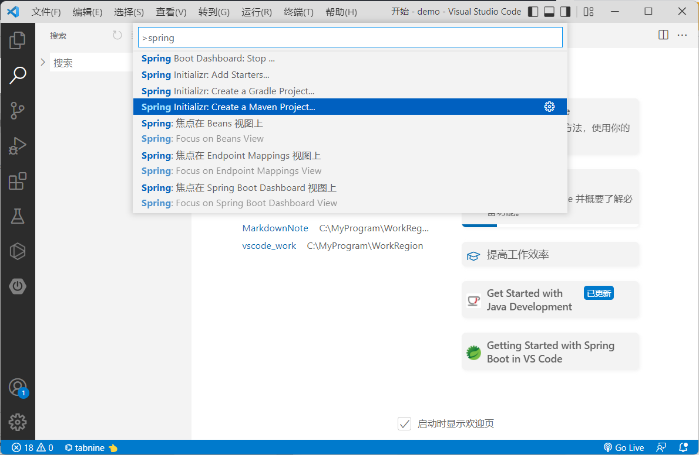
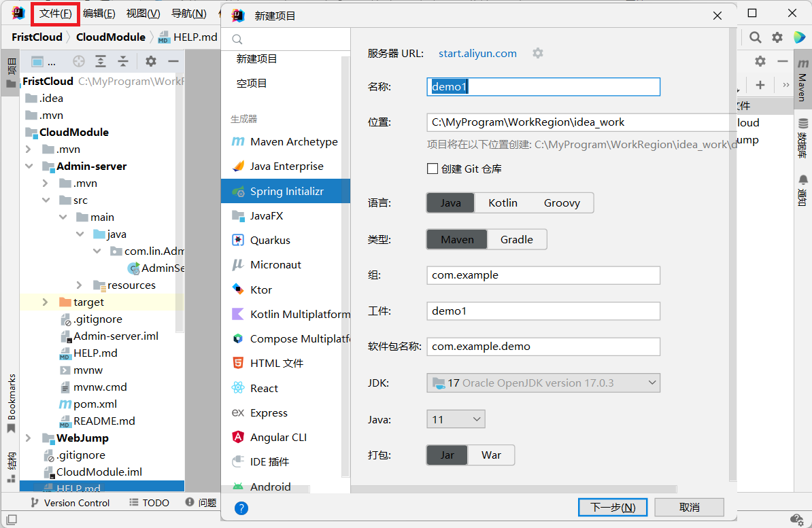
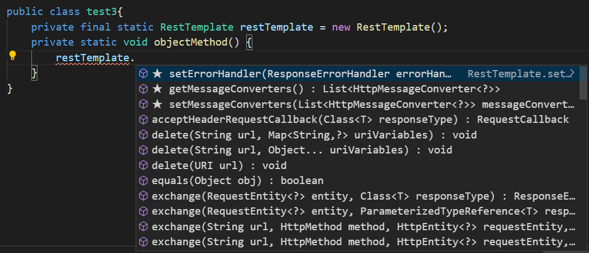
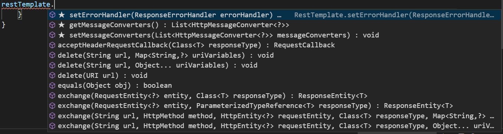

# $\small Springboot$ 基础

[TOC]

$~~~~~$ 在讲述内容之前，我先谈谈自己的理解，不要把时间浪费到没有意义的事情上。
$~~~~~$ 基于此，我极力反对学习 SpringMVC ，Springboot 减少了繁琐的 xml 配置以及一系列复杂繁琐且重复内容繁多的配置、降低了开发难度、提高了开发效率、可以直接转到 SpringCloud 微服务，在如此庞大的优势面前，SpringMVC 带来的那些理论优势显得无比脆弱。
$~~~~~$ 而且，SpringMVC 的知识难以直接转换为 Springboot ，一个是配置文件开发，一个是注解开发，大量的经历会花费在无用的地方。
> 但这并不代表 SpringMVC 无用，事实上 SpringBoot 就是基于 MVC ，只是说语言的架构应该采用最好用的那一种，对于对于语言本身的精进是更重要的选择。

## springboot项目基本使用

### 项目搭建

要想搭建 SpringBoot 项目，我们需要安装以下三个软件：

1. 环境依赖：JDK
2. 项目管理器：maven/gradle
3. 编程软件：vscode/idea

有关于 maven 与 jdk 如何配置这里不再阐述，直接从搭建项目开始。
在 vscode 与 idea 中搭建项目都是用的软件自带的自动化搭建。

1. **vscode 项目搭建**

    $~~~~~$ 在 vscode 界面中，按下 `ctrl+shift+P` ，就会弹出控制台，在里面输入 spring ，然后在下拉菜单中找到 Spring Initializr: Create a Maven Project... ，表示我们需要下载一个由 maven 构建的 Spring 项目。

    <center></center>

    之后会依次要求：
    1. 选择版本号,选择最新的稳定版本就行。
    2. 选择编程语言，选择 java 。
    3. 设置包名，默认是 com.example ，通常情况下，为了统一命名与移植 Cloud 考虑，com 不更改，example 改为整个项目统一的包名。
    4. 设置项目名，所有的源代码都会在这个项目名路径下，同时这个项目名又是包名的子目录。
    5. 选择打包方式 war/jar ，war 文件是在应用程序服务器内部运行的 Web 应用程序归档文件，而 jar 是在用户机器上运行桌面应用程序的 Java 应用程序归档文件，通常来说，选 war 。
    6. 选择 jdk 版本，这里选安装的 jdk 的版本。
    7. 选择依赖，根据自己的需求，这里我们只用选择 Spring web 就行了。

2. **idea 项目搭建**

    $~~~~~$ idea 只需要再上方工具栏选择文件菜单 —> 新建项目 —> 生成器选择 Spring Initializr ，然后就选择名称，位置，编程语言，项目管理器类型，组（包），工件（maven中的项目名称，一般与项目一致），软件包名称，jdk版本，java版本，打包方式。
    <center></center>

    $~~~~~$ 然后点击下一步,就会跳转到依赖选择，此处我们依旧只选择 Spring Web 。

3. **文件模块优化**

    $~~~~~$ 将配置文件 pom.xml 点开，按类如下代码进行配置

    ```xml
    <?xml version="1.0" encoding="UTF-8"?>
    <project xmlns="http://maven.apache.org/POM/4.0.0" xmlns:xsi="http://www.w3.org/2001/XMLSchema-instance"
            xsi:schemaLocation="http://maven.apache.org/POM/4.0.0 https://maven.apache.org/xsd/maven-4.0.0.xsd">
        <modelVersion>4.0.0</modelVersion>
        <groupId>com.example</groupId>
        <artifactId>demo1</artifactId>
        <version>0.0.1-SNAPSHOT</version>
        <packaging>war</packaging>
        <name>demo1</name>
        <description>demo1</description>

        <properties>
            <java.version>17</java.version>
            <project.build.sourceEncoding>UTF-8</project.build.sourceEncoding>
            <project.reporting.outputEncoding>UTF-8</project.reporting.outputEncoding>
            <spring-boot.version>2.7.0</spring-boot.version>
        </properties>

        <dependencies>
            <dependency>
                <groupId>org.springframework.boot</groupId>
                <artifactId>spring-boot-starter-web</artifactId>
            </dependency>
            <dependency>
                <groupId>org.springframework.boot</groupId>
                <artifactId>spring-boot-starter-test</artifactId>
                <scope>test</scope>
                <exclusions>
                    <exclusion>
                        <groupId>org.junit.vintage</groupId>
                        <artifactId>junit-vintage-engine</artifactId>
                    </exclusion>
                </exclusions>
            </dependency>
        </dependencies>

        <dependencyManagement>
            <dependencies>
                <dependency>
                    <groupId>org.springframework.boot</groupId>
                    <artifactId>spring-boot-dependencies</artifactId>
                    <version>${spring-boot.version}</version>
                    <type>pom</type>
                    <scope>import</scope>
                </dependency>
            </dependencies>
        </dependencyManagement>

        <build>
            <plugins>
                <plugin>
                    <groupId>org.apache.maven.plugins</groupId>
                    <artifactId>maven-war-plugin</artifactId>
                    <version>3.3.2</version>
                </plugin>
            </plugins>
        </build>
    </project>
    ```

    - `<spring-boot.version>` ：定义一个数值，通常来说是版本号，后面的依赖可以通过 ${spring-boot.version} 来使用定义的值，达到版本统一管理的目的。
    - `<dependencyManagement>` ： 标签详见 **Maven基础**。
    - `spring-boot-starter-test` ： 测试依赖，通过包含 junit 实现 junit 测试，在项目正式上线时，建议将依赖与测试文件全部删除。
    - `maven-war-plugin` ： 打包依赖，当出现 Cannot access defaults field of Properties 报错时就需要添加这个依赖。
    > 通常来说，类似于 Spring-$*$-……-dependencies 的依赖，都是一个是一个依赖管理器的 pom 文件，这个 pom 文件包含大量依赖，maven 打包时会去下载这个 pom 文件的所有依赖。通过 `<type>pom</type> , <scope>import</scope>` 来表示只是引用 pom 文件，子项目的所有缺失版本参数的依赖都可以从这里获取版本号。（如果有的话）

4. **启动类**
   启动类是在工作组一个 java 文件，创建项目自动生成，用以启动项目。
   启动类是默认的写法，其作用运行启动类的 class 文件，从而部署整个项目。
   当然，有的功能也会要求在启动类上面添加注解或添加内容，这里不做描述。
   通常来说，启动类的命名为： 项目名+Application

    ```java
        @SpringbootApplication
        public class 启动类名 {
            public static void main(String[] args) {
                SpringApplication.run(启动类名.class, args);
            }
        }
    ```

    > $~~~~~$ 启动类的作用来源于 `@SpringbootApplication` 注解。
    > $~~~~~$ Springboot 启动类只会加载启动类同包或子包的类，上级包的其他内容都不会读取，但是可以指定 `@SpringbootApplication` 扫描包，如 `@SpringbootApplication(scanBasePackages=”com.first”)` 。也可以把这个注解拆开，然后用包扫描的注解  `@ComponentScan` 去指定。

5. **maven 编译打包**

   $~~~~~$ 通常来说，我们只会用到 maven 中的 clean 和 package ，先进行 clean 将上一次构建的文件删除，再通过 package 进行打包，打包之后我们就能运行了。

   $~~~~~$ 直接运行启动类即可。

### 配置文件 yaml/yml/properties 使用规范

$~~~~~$ springboot 的配置文件有两种 yaml/yml/properties ，通常建议只用一种配置文件，多种一起用的话会按特定的排序生效，后生效的会覆盖掉前面的设置,springboot 的所有设置都在这里改动。
> yaml 就是 yml ，这是由于历史问题导致的,两个后缀格式 Springboot 都能识别。

1. **properties**

    - propertie 文件中的所有数据都是`属性名=属性值`的方式实现实现的。
    - 配置表达方式是`父配置.子配置.子配置的子配置=配置属性`。

    ```properties
    # 单个对象表达方式：
    name=a
    
    # 数组表达方式：
    name=a,b,c,d

    #对象集合表达方式:
    name.a=111
    name.b=333
    name.c=333
    spring.application.name=spring-practice
    ```

2. **yml/yaml**

    $~~~~~$ yml 和 yaml 是一个格式，数据表达方式是`属性名: 属性值`，在表达父子关系时， propertie 通过`父.子`来表达， yaml 通过`父: 子`来表达（注意 : 后面都有一个空格）。

    yaml 具备树形写法，美观又好用

    ```yaml
    spring:
    application:
       name: spring-practice
    
    # 通过竖列位置就可以知道这是第几级的配置
    # 相同父属性配置时只用在父类下一行写子属性就行
    ```

    yaml 的数据表达方式可以为树形也可以一行写完

     ```yaml
     //单个对象表达方式
     k：a

     //数组表达方式
     name: [a,b,c]
     //或者
     name:
     - a
     - b
     - c

     //对象集合表达方式(一行型的大括号里面的 : 不用空格,但是树形每个 : 都要空格的要):
     name: {name1:a,name2:b,name3:c}
     或者
     name: 
         name1: a
         name2: b
         name3: c
     ```

### springboot的maven配置

1. **场景启动器**

    $~~~~~$ springboot的场景启动器，是一个依赖的集合，并且springboot给大多数依赖都设置了默认属性，大部分情况下不需要去配置文件添加了，除非你不用默认属性。

    ``` xml
    <parent>
        <groupId>org.springframework.boot</groupId>
        <artifactId>spring-boot-starter-parent</artifactId>
        <version>2.7.0</version>
    </parent>
    ```

    spring的web依赖,也可以叫做web的场景启动器：spring-boot-starter-web

    ```xml
    <parent>
        <groupId>org.springframework.boot</groupId>
        <artifactId>spring-boot-starter-web</artifactId>
        <version>2.7.0</version>
    </parent>
    ```

    `spring-boot-starter-*`：某种场景的启动器，集成了这个场景下会使用的绝大多数依赖。
    `*-spring-boot-starter`：第三方为我们提供简化的场景启动器。

    $~~~~~$ 场景启动器的依赖你可以通过自己添加其所包含的依赖或者设置依赖版本来替换
    $~~~~~$ 理论上，有 spring-boot-starter-web 我们就能启动SpringBoot项目了。但是很多时候我们的项目需要许多功能，必然会引入其他依赖。

2. **非 web 项目**

    $~~~~~$ 如果我们打算使用 SpringBoot 创建一个非 web 项目，那么我们就不需要引入 spring-boot-starter-web ，而是引入基础依赖 spring-boot-starter 。

    ```xml
    <dependency>
        <groupId>org.springframework.boot</groupId>
        <artifactId>spring-boot-starter-web</artifactId>
    </dependency>
    ```xml

    而且 packaging 也不能为 war 了，要是 jar 

    ```xml
    <packaging>war</packaging>
    ```

    此外，启动类也有很大的变化，启动类需要继承 CommandLineRunner ，CommandLineRunner 作用是让代码随着 run 一起启动。
    > 因为是非 web 项目，如果程序像 web 项目一样启动后静默的话，就毫无意义了，没有办法去调用它。

    配置了之后需要进行如下代码设置，让代码随着程序一起运行

    ```xml

    private 类 变量名;

    SpringApplication app = new SpringApplication(DemoApplication.class);
    app.setBannerMode(Banner.Mode.OFF);
    app.run(args);

    public void run(String... args) throws Exception {
        System.out.println(变量名.方法);
    }
    ```

    完整启动类代码如下：

    ```java
    @SpringBootApplication
    public class DemoApplication implements CommandLineRunner {

        @Autowired
        private onoo helloService;

        public static void main(String[] args) throws Exception {
            SpringApplication app = new SpringApplication(DemoApplication.class);
            app.setBannerMode(Banner.Mode.OFF);
            app.run(args);
        }

        @Override
        public void run(String... args) throws Exception {

                System.out.println(helloService.getMessage());
        }
    }
    ```

    至于类怎么创建、方法怎么创建，这里就不作过多阐述了。

### Springboot 项目部署：jar

对于 Springboot 我们在开发阶段可以通过三种方式运行

1. 编程软件自带的主类 `run` 选项
2. 运行插件，如 `spring-boot-maven-plugin` 可以在根目录运行 `mvn springboot:run`
3. `java -jar XXX,jar`

> 前两种不论是 war 包还是 jar 包都可以使用，最后一种只能使用 jar 包

如果我们需要将项目部署到服务器上，那么前两种基本用不上了，现在就有以下两种方式运行

- `java -jar XXX,jar`
- 将服务打包成 war ，然后放入 web 容器中

第二种方法可以看我的 tomcat 笔记，此处主要讲第一种方法，这也是 Springboot 推荐的方法。

1. 首先，我们先将文件以 jar 文件形式打包，通过配置文件中

   ```xml
   <packaging>jar</packaging>
   ```

2. 然后运行打包命令 `clean + package`

3. 之后，我们就可以在项目目录下的 target 找到我们打包后的文件了，通常命名格式为：`<artifactId>-<version>.jar` ，如 `Admin-server-0.0.1-SNAPSHOT.jar`
4. 之后，我们通过 `java -jar [jar 文件完整路径]` 就可以运行该文件了，如

   ```jdk
   java -jar C:\WorkBegion\JAVA\Admin-server-0.0.1-SNAPSHOT.jar
   ```

> $~~~~~$ Springboot 项目可以直接打包成 jar ,这样运行与我们在编辑器中运行的效果是一样，如果要将代码放入 web 容器，那还要修改一些代码。

## 请求映射

$~~~~~$ 请求映射的基本概念就是：创建一个所有人都能访问的接口，大家只要访问了这个接口，访问信息就能被传送回我的后台中去。即大家所有的访问都可以通过这个对外接口被映射到我们的程序中，在 SpringMVC 中，我们所使用的请求映射注解是

```java
@RequestMapping(value = "/a",method = RequestMethod.GET)
```

前端向地址a提交请求，java后端获取请求内容做出回应。
这时，一个完整的请求映射类应该是这个样的

```java
@Controller
public class test {

    @RequestMapping("/a")
    public String toLogin() {
        return "login";
    }
}
```

有声明请求映射类的类注解，有请求映射的接口方法。

### springboot请求映射注解风格

在 SpringBoot 中简化了请求映射注解，做到了见名知义，如 post 类型就直接

```java
@PostMappring("/a")
```

- get类型：`@GetMapping("/a")`
- post类型：`@PostMapping("/a")`
- put类型：`@PutMapping("/a")`
- delete类型：`@DeleteMapping("/a")`

通过注解名字就能知道是什么请求类型，非常好使。
> 一般来说，路径映射用 `@RequestMapping(value = "/a")` ，方法映射用四大映射注解。
> 你说你不知道什么意思？类上面加 @RequestMapping ，方法上面加四大映射注解。

$~~~~~$ 由于这个特性，又衍生出一种特性：一个地址可以接受多个不同请求，但是请求类型不能重复。

如我们的 test 地址已经有一个 get 类型的请求处理方法

```java
@GetMapping("/test")
public Object test01(){
    return "这是test的GET请求方法";
}
```

在 test 地址上再添加一个 post 请求处理方法，SpringBoot 会根据请求地址和类型去选择请求处理方法。

```java
@PostMapping("/test")
public Object test02(){
    return "这是test的POST请求方法";
}
```

$~~~~~$ 基于这个特性，可以给一个地址赋予 `get/post/put/delete` 请求类型来做到用一个地址完成增删改查四个请求。

$~~~~~$ 但是，在 postman 里面我们可以直接发送 delete 请求，但是前端的表单等只有 get 和 post 请求。不过不用担心， springboot 提供了一个方法，通过增加一个前端返回的数据来让后端识别请求类型

```html
<form action="/xxx" method="POST">
    <input name="_method" type="hidden" value="DELETE">  <!--用input增加了一个要传递的数据-->
    <input value="请求按钮" type="submit">
</form>
```

- 用此方法传值需要原请求类型就是 post ，因为 delete 这些请求都可以看作是 post 。

- `name="_method"` 是固定的，sprinboot只有识别到这个参数名称是这个才会向下判断，但是也可以创建一个类来改变这个name。
- `type="hidden"` 隐藏此模块，因为这个的作用只是传递一个固定的值，没必要在页面显现出来。
- `value="DELETE"` 当 springboot 识别到正确的 name 后，就会读取 value ， dletele 就当作 deltele 请求处理， put 就当作 put 请求处理，其他的类推。

$~~~~~$ 但是这种方法是默认关闭的，毕竟许多软件程序都能发送 delete 这些请求，程序的功能越多，效率就会越低。
$~~~~~$ 要开启的话需要在配置文件键入以下代码

```yaml
spring:
  mvc:
    formcontent:
      filter:
        enabled: true
```

### 页面跳转

页面跳转只需要利用 `@Controller` 直接返回html页面的文件名就行：

```java
@Controller
public class LoginController {

    // 直接返回名为 login.html 的文件
    @RequestMapping("/a")
    public String toLogin() {
        return "login";
    }
}
```

> $~~~~~$ `@RestController` 注解用于数据返回，`@Controller` 用于跳转。
> $~~~~~$ 所以如上代码如果你用的 `@RestController` ，那么就会返回 login 这几个字而不是跳转。
> $~~~~~$ SpringBoot 能直接返回的页面都是 SpringBoot 项目中设置的静态资源，采用的是相对路径的写法，当然你也能用完整路径。

### 重定向

$~~~~~$ 重定向与转发的区别在于，重定向是由页面重新发送一个请求跳转到另一个页面，转发是服务器中直接返回另一个页面。
$~~~~~$ 重定向可以直接跨级到另一个服务中，转发只能在一个服务中执行
> 转发浏览器只发送了一个请求，重定向浏览器发送了两个请求。
> 一个请求的只能在这个服务中完成，如果需要跨服务，就需要这个服务向另一个服务发送请求。

**重定向有以下两个方法**

$\small\color{DarkBlue}{\boldsymbol{redirect:url}}$

通过 redirect 关键字指定 url 实现重定义，该方法类注解必须为 `@RestController`

```java
@GetMapping("/test/test01/{name}")
public String test(@PathVariable String name) {
  return "redirect:/ceng/hello.html";
}
```

$\small\color{DarkBlue}{\boldsymbol{HttpServletResponse.sendRedirect(url)}}$

使用 servlet 提供的 API ，HttpServletResponse 中的 sendRedirect 方法。
> 类的注解可以使用 `@RestController` ，也可以使用 `@Controller`

```java
public void test(@PathVariable String name, HttpServletResponse response) throws IOException {
  response.sendRedirect("/ceng/hello.html");
```

### Servlet 三大作用域

servlet 三大作用域：request，session，application（ServletContext）

#### request 请求作用域

$~~~~~$ request 表示一个请求，只要发出一个请求就会创建一个 request ，它的作用域仅在当前请求中有效，如果 Web 组件之间需要共享同一个请求中的数据，只能使用请求转发。
> 前端发送的 get , post 请求就是一个请求，请求发送之后方法执行完毕就算请求结束。
> 后端之间的方法传递没有发送 http 请求，所以一个请求数据传过来不论走了多少个方法，还在这个请求的作用域中。

**用处：**

用于服务器间同一请求不同页面之间的参数传递。
用于表单的控件值传递。

$\small\color{DarkBlue}{\boldsymbol{HttpServletRequest}}$

java 针对 request 设置了一个 HttpServletRequest 数据接口，储存该请求的所有数据，该属性为传参参数。

```java
public void study03(HttpServletRequest request) {

}
```

**该属性的常用方法如下：**

```java
// 向作用域中写入属性
HttpServletRequest.setAttribute(String,Object);

// 从作用域中获取属性
HttpServletRequest.getAttribute(String,Object);

// 删除作用域中的属性
HttpServletRequest.removeAttribute(String,Object);

//从作用域中获取参数
HttpServletRequest.getParameter(String,Object);
```

下面是使用例子

```java
@GetMapping("study03")
public void study03(HttpServletRequest request) {
    request.setAttribute("name", request);
}
```

$\small\color{DarkBlue}{\boldsymbol{@RequestAttribute}}$

用于直接获取 Request 作用域中的属性，适用于传参位置
> 等于删减了 `HttpServletRequest request` 和 `getAttribute` ，降低了数据量。

使用方法为 `@RequestAttribute(name) Object name`

下面是使用例子

```java
@GetMapping("study04")
@ResponseBody
public String study04(@RequestAttribute("name") String name) {
    return name;
}
```

> 该例子只是演示如何使用，但这不是最正确的用法，通常是在跳转页面是作为一些页面上的变量参数进行传递，如 id ，名称等。

$\small\color{DarkBlue}{\boldsymbol{Model}}$

在 Springboot 中 ，Model 是一个储存于 request 作用域中的对象，数据以键值对方式存储在 Model 。是一个数据容器对象，支持的数据类型为 (String,Object) 。
> 也可以单独以数据方式储存在其中，具体没尝试过。
> 由于一个请求只有一个 model 所以不担心出现数据冲突。

Model 相较于直接储存进 request 作用域中有以下几个优势

1. 更加规范，这个对象中没有请求头，Cookie 之类的数据，这里面只有服务器主动向内部储存的数据。
2. 读取数据更加方法，Model 的数据前端可以很容易获取 ，在标签上使用 `th:text=${key}` 或直接在页面上 `${key}` 就行了。

**Model 有大量的方法，但是常用的只有一个方法：**

```java
//向 Model 中存储键值对。
model.addAttribute(String, aaaaa);
```

下面是使用例子

```java
@GetMapping("study05")
public void name(Model model) {
    model.addAttribute("name", "aaaaa");
    return model;
}
```

然后前端就可以通过 `th:text=${name}` 获取储存在 Model 中的 name 属性的参数了。

```html
<h1 th:text=${name}><h1>
<h1>${key}</h1>
```

> javaweb 中还有有一个 ModelAndView ，但是这个对象我没找到 html 能够提取的方法，只有 jsp 的，狗都不用。

#### Session 会话作用域

$~~~~~$ Session 服务器为每个会话创建一个 session 对象，所以session中的数据可供当前会话中所有 servlet 共享。作用域：会话从用户打开浏览器开始，直到关闭浏览器才结束，一次会话期间只会创建一个 session 对象。

$~~~~~$ 这基本可以理解为后台为浏览器储存的属性，只要这个浏览器没有关闭窗口，这个数据就会一直存在。

$\small\color{DarkBlue}{\boldsymbol{Httpsession}}$

java servlet 中定义了 Httpsession 接口用于处理 seesion 作用域中的数据，我们可以通过该方法向 seesion 作用域中对数据进行存储、删除、读取等操作。

1. Httpsession 接口通常使用在传参位置，用于处理参数。

```java
@GetMapping("/mytest")
public String index(HttpSession session) {
   session.setAttribute("ASAS", a);
   session.setAttribute("name", "AAAAAAAAASSSSSSSS");
   return "index.html";
}
```

HttpSession 常用方法有三个

```java
//销毁Session对象
HttpSession.invalidate() 

//设置数据，将数据保存在Session这个域对象中
HttpSession.setAttribute(String,Object) 

//获取数据，将保存在Session这个域对象中的数据获取出来，若 key缺省，则默认取出全部数据，需要用 map 数据类型储存。
HttpSession.getAttribute(key) 
```

#### Application 全局作用域

$~~~~~$  Application（ServletContext）
　　ServletContext 在服务器启动时创建，服务器关闭时销毁。一个 JavaWeb 应用只创建一个 ServletContext 对象，所有的浏览器在访问服务器时都共享同一个 ServletContext 对象，ServletContext 对象一般用于在多个浏览器间共享数据时使用。

$\small\color{DarkBlue}{\boldsymbol{ServletContext}}$

与前面各作用域接口的定义有些不一样，ServletContext 由于作用与全局上，很少定义为接受参数，因为全局参数基本都是通用查询参数，很少需要去接受的。
并且由于这个是全局变量，因此要初始化声明不能直接等于 null ，这样原来的数据就被覆盖了，这里就有一个关键方法：`getServletContext()` ，获取 ServletContext 所有数据，通过该方法声明我们就不怕初始化出现问题了。
基于此方法，我们有以下两种方法初始化声明 ServletContext 。
> 当接口放在传参位置时，会默认接受变量来初始化接口，但是 ServletContext 全局可调用，所以就不需要作为传参变量（这样会导致效率低下，所以能不传参就不传参）。

1. 继承 HttpServlet ，使用 getServletContext()

    ```java
    public class studyC extends HttpServlet {

    @GetMapping("study06")
    public void study06() {
        ServletContext sContext = getServletContext();
    }
    ```

2. 传参处声明 HttpSession 或者 HttpServletReques ，通过该对象的 getServletContext() 方法使用

   ```java
      @GetMapping("study06")
      public void study06(HttpSession session,
         HttpServletRequest request) {
         ServletContext sContext1 = request.getServletContext();
         ServletContext sContext2 = session.getServletContext();
         ServletContext sContext = getServletContext();
      }
   ```

ServletContext 具有很多的方法，但常用的只有三个

```java
// 获取 ServletContext 中的属性
sContext.getAttribute(key);
// 向 ServletContext 中写入属性
sContext.setAttribute(String , Object);
//可用于配置用于会话跟踪目的的 Cookie 的各种属性的类。 该方法还有许多 get 子方法，如 getName() , getClass 等
sContext.getSessionCookieConfig();
```

### thymeleaf (仅限 springboot 使用)

$~~~~~$ Thymeleaf 是一款用于渲染 XML/XHTML/HTML5 内容的模板引擎。它与 JSP，Velocity，FreeMaker 等模板引擎类似，也可以轻易地与 Spring MVC 等 Web 框架集成。与其它模板引擎相比，Thymeleaf 最大的特点是，即使不启动 Web 应用，也可以直接在浏览器中打开并正确显示模板页面 。
$~~~~~$ 本文只做 springboot 的使用说明，并且只对调用各作用域中5

### 请求中的其他数据

- `@RequestHeader`
    注解通过`@RequestHeader` 注解来获取请求头，该注解用于传参位置

    写法为 `@RequestHeader(name) String name` 。
    若想获取请求头的所有参数，就这样使用 `@RequestHeader Map<String,String> map`
    > 请求头中的数据都是键值对，而且都是或都可以转换为 String 类型，所以该注解直接规定只能使用 HashMap 的 Sting,String 形键值对来获取所有。
    > 正因为获取所有，所以不用设置 name

    ```java
    @GetMapping("study01")
    public void study01(@RequestHeader("name") String name, 
                        @RequestHeader Map<String,String> map) {
        System.out.println(map);
    }
    ```

- `@CookieValue`
    该注解用于获取 Cookie 中的参数，该注解用于传参位置。
    若只获取 Cookie 中的某个值，写法为 `@CookieValue("name") String name`
    若想获取 Cookie 中所有的数据 ，写法为 `@CookieValue Cookie cook`
    > Cookie 是一个引用数据类型，专门针对 web 中 Cookie 设置。

    ```java
      @GetMapping("study02")
    public void study02(@CookieValue("name") String name, 
                        @CookieValue Cookie cook) {
        System.out.println(cook);
    }
    ```

### 请求映射会用到的一些注解

<font size=4 color="DarkViolet">@RequestParam</font>

$~~~~~$ `@RequestParam` 是传递参数的，把请求传递过来的参数赋给后面设置的参数，也可以说是用于将请求参数区数据映射到功能处理方法的参数上。
$~~~~~$ 说的更简单一些，SpringBoot 接受数据是没有属性名只有属性值的，也就是说前端传过来的数据是什么不知道，干什么不知道，如果只有一个输入传入还好说，但是有多个呢？比如登录账号时的账号和密码，这时就需要用 @RequestParam 或者其他方法来得到变量名，确认变量用途。

```java
public String home
(@RequestParam(value = "username",required =false ,defaultValue = "root") String name)
```

$~~~~$ 整段的意思是，获取请求发送的username属性的参数，当没有这个属性时，创建这个属性，值为 root 。

- `value` ： 请求内容的属性名
- `required`（可忽略）：值域为true和false，作用是指定是否必须有值传入，true为必须有传入值，没有就报错，false是可无传入值。
- `defaultValue`（可忽略）：作用是无属性传入时，创建这个属性并赋予设个方法设置的参数。
- `String name` : `@RequestParam` 注解会自动把请求中叫 username 的参数的值传递到这个变量中，这个变量可以设置为任何数据格式，如int，char，map

`@RequestParam` 可以设置多个，如：

```java
public String home(@RequestParam("username") String name,@RequestParam("id") String id)
```

- 因为 `@RequestParam` 是直接从请求参数区中接受参数的，所以可以用于接受前端的 from 表单提交的数据

<font size=4 color="DarkViolet">@PathVariable</font>

`@PathVariable` ： 从 url 路径获取占位符的值，传值给请求处理方法。

```java
@PostMapping("/a/{id}")
public String home(@PathVariable("id") String name)
```

$~~~~~$ 此段表示为获取/a/后面的那一整位的内容内容，即在a/后面，下一个/前面的内容，并将其命名为 id 并传值给 `String name` 。

- `@PostMapping("/a/{id}")` ：即所有 post 映射的 `/a/*` 的路径都会都会映射到这个地址，并且将 * 命名为 id 。
- `@PathVariable("id") String name` ：即获取上面被赋名为 id 的 url 数据 ，并赋值给 String 类型变量 name 。
- 如果要获得多个占位符的值，可以设置多个  `@PathVariable` ，如：

```java
@PostMapping("/a/{id}/{age}")
public String home(@PathVariable("id") String name,@PathVariable("age") String age)
```

**注解位置：** 位于请求映射的方法上。

<font size=4 color="DarkViolet">@HttpServletRequest</font>

$~~~~~$ @HttpServletRequest 接口继承自 ServletRequest 接口，其主要作用是封装 HTTP 请求消息， 注解的封装在 Servlet 里。 Servlet 的数据属于整个项目都可以调用，前后端都能调用。

<font size=4 color="DarkViolet">@RequestBody ：变量以json编码</font>

`@RequestBody` 注解的作用是将发送来的请求以 json 格式进行转换， json 可以传递多个数据，传入数据通常用类储存。如这里定义了一个实体类：

```java
public class dao {
private String  name;
private int age;
private int password;

public String getName() {return name;}
public void setName(String name) {this.name = name;}
public int getAge() {return age;}
public void setAge(int age) {this.age = age;}
public int getPassword() {return password;}
public void setPassword(int password) {this.password = password;}
}
```

$~~~~~$ `@RequestBody` 会把传入的数据作为 json 解析然后自动注入到注解后面定义的类中，所以要是传入数据格式不对就可能报错。

我们通过下列代码把传入的 json 数据赋值到类中。

```java
@PostMappring("/test")
public Object json(@RequestBody dao d) {
  return ""+d;
}
```

$~~~~~$ `@RequestBody` 是接受 json 请求的，所以请求要用 json 格式发送， jquery 的 ajax 就是用来发送 json 请求的，下面是发送的 json 格式的请求：

```json
{
  "name":"a",
  "age":18,
  "passweord":18
}
```

>注意：如果在控制层上的方法声明了注解 @ResponseBody ，则会直接将返回值输出到页面。

<font size=4 color="DarkViolet">@CrossOrigin</font>

`@CrossOrigin` 是用来处理跨域请求的注解。
`@CrossOrigin` 可以处理跨域请求，让你能访问不是一个域的文件。

$~~~~~$ 因为 springboot 的映射接口是一个对外界公开的http地址，所以不止其内部的静态资源能使用这个地址，外部的程序也能使用，但是会因为跨域问题被拦截，所以需要这个跨域注解。
请注意，外部的应用调用就不能用相对路径了，得用完整的 http 地址。
> $~~~~~$ **外部的程序** : 此处所谓的外部的程序包括所有能对对这个地址发送请求的程序，不只是html，springboot项目也能调用这个地址，这就涉及到后端和后端的数据传输了。

$~~~~~$ **跨域**，指的是浏览器不能执行其他网站的脚本。它是由浏览器的同源策略造成的，是浏览器对 JavaScript 施加的安全限制。

所谓同源是指，域名，协议，端口均相同，举个例子：

```http
<http://www.123.com/index.html> 调用 <http://www.123.com/server.PHP> （非跨域）

<http://www.123.com/index.html> 调用 <http://www.456.com/server.php> （主域名不同:123/456，跨域）

<http://abc.123.com/index.html> 调用 <http://def.123.com/server.php（子域名不同:abc/def>，跨域）

<http://www.123.com:8080/index.html>调用 <http://www.123.com:8081/server.php（端口不同:8080/8081>，跨域）

<http://www.123.com/index.html> 调用 <https://www.123.com/server.php（协议不同:http/https>，跨域）
```

请注意：localhost 和 127.0.0.1 虽然都指向本机，但也属于跨域。

$~~~~~$ 浏览器执行 javascript 脚本时，会检查这个脚本属于哪个页面，如果不是同源页面，就不会被执行，当域名 www.abc.com 下的 js 代码去访问 www.def.com 域名下的资源，就会受到限制。

**使用说明：**

- `@CrossOrigin` 的注解通常放在请求映射注解上方，这样这个地址下的所有请求处理方法都可以跨域访问。
- 放在类（类有请求映射注解的话）上，类中的所有方法都支持跨域访问，方法上就只有本方法支持。
- `@CrossOrigin` 可以设置两个参数 ：origins，maxAge 。
- origins ： 允许可访问的域列表,数据类型为 String[] ,所以可以设置多个域名。
- maxAge : 准备响应前的缓存持续的最大时间（以秒为单位）。

如下是代码例子：

```java
@RestController
@RequestMapping("/account")
public class AccountController {

@CrossOrigin(origins = {"http://forweidc1.com","http://forweidc2.com"} , maxAge = 3600)
@GetMapping("/{id}")
public Object retrieve(@PathVariable Long id) {
// ...
}

@DeleteMapping("/{id}")
public void remove(@PathVariable Long id) {
// ...
}
}
```

### 其他的一些注解（不常用）

- `@RequestHeader` 获取请求头

## bean 与相关注解

Bean 是啥?

1. Spring Bean 是被实例的，组装的，及被 Spring 容器管理的Java 对象。

2. Spring 容器会自动完成 `@bean` 对象的实例化。

3. 创建应用对象之间的协作关系的行为称为：装配(wiring)，这就是依赖注入的本质。

4. springboot 依靠添加注解来把类和方法转换为 bean。

### bean 作用域

### 相关的注解

- `@Configuration

    $~~~~~$ Springboot 的 bean 是在类中设置的，通过 `@Configuration` 设置为配置文件类，然后在配置文件类中通过 `@Bean` 注解设置配置方法，就等于设置 bean 方法。

    ```java
    @Configuration(proxyBeanMethods = true)
    public class test01 {
        @Bean
        public void config01() {
            
        }
    }
    ```

    `@Configuration` 中有一个 `proxyBeanMethods` 属性，该属性决定 bean 的是（true）单例对象，还是false）多实例化对象。
    > 若 bean 没有依赖关系，就用 false ，若有就用 true （其实就是看这个 bean 是用没用。）

<font size=4 color="DarkViolet">@import</font>

- `@Import`
    $~~~~~$ 该注解把普通的类定义为 Bean。 需放在具有 `@SpringBootApplication` (启动类)、`@Configuration` (配置类)、 `@Component` (组件类) 注解的类上。
    > 这个注解就是将另一个类引用到该类中，然后利用类级的bean定义注解将引用类的所有方法转换成 bean ，这也是为什么要在有这些注解的类上才能使用这个注解。

    如我们创建一个 java文件，名为 `config01.java`

    ```java
    public class config01 {
        
    }
    ```

    然后在 test01 类上，使用 import 引入该类

    ```java
    @Import(config01.class)
    @Configuration(proxyBeanMethods = true)
    public class test01 {
        @Bean
        public void config01() {
            
        }
    }
    ```

    这样，这个类中的所有方法都成为了 bean 。

<font size=4 color="DarkViolet">@Conditional</font>

$~~~~~$ 就是一个bean的判断注解，判断true执行创建注解或者其他什么，false就中断或者啥，有大量衍生的注解，不过与其说是衍生不如说是预先设置好的判断。

<font size=4 color="DarkViolet">@ImportResource</font>

$~~~~~$ `@ImportResource(“classpath: 配置文件名.xml”)`，通过这个注解可以调用 xml 设置的配置文件， springboot 的配置文件是以类方式表达的，这个注解主要是用于 ssm 过渡时使用。

<font size=4 color="DarkViolet">@ConfigurationProperties</font>

$~~~~~$ 把注解放在类上，指定 propertie/yml/yaml 文件中的属性前缀（注意属性名要带前缀，如 name.one ），就可以获取 propertie/yml/yaml 中的属性作为bean的属性来使用，类中的属性名要和 propertie 中的属性名一致。

```java

@Component //标注一个类为 Spring 容器的 Bean

@ConfigurationProperties(prefix="name")
```

$~~~~~$ 以上两个注解需要一起使用才会发挥作用。因为只有这个 bean 在 spring 容器中 spring 才会去使用自己的功能。

$~~~~~$ 还有不用 `@Component` 的方法(不推荐使用)，这样需要在属性配置类，也就是带有 `@Configuration` 注解的类中，添加注解 `@EnableConfigurationProperties` 来指定使用 `@ConfigurationProperties` 的类（.class）来开启配置绑定功能，把组件自动注册到容器中。

```java
@EnableConfigurationProperties(name.class)  //属性配置类
@ConfigurationProperties(prefix=”name”)     //Propertie获取类
```

## 增删改查

### 数据库交互

springboot 采用 mybatis 进行数据库连接

### mybaitis使用

1. **依赖导入**

    Springboot 可以使用原生 mybaits 或 mybaitspuls ，此处使用 Springboot 打包的 mybatis ，对注解开发有很好的支持，而且可以省略很多默认设置

    ```xml
    <dependency>
        <groupId>org.mybatis.spring.boot</groupId>
        <artifactId>mybatis-spring-boot-starter</artifactId>
        <version>2.2.1</version>
    </dependency>
    ```

    在使用的时候，我们还需要数据库连接驱动 JDBC ，和连接池，此处使用 commons-pool2 ，在高并发高数据吞吐下也有很好的支持

    ```xml
    <dependency>
        <groupId>org.apache.commons</groupId>
        <artifactId>commons-pool2</artifactId>
    </dependency>
    <dependency>
        <groupId>mysql</groupId>
        <artifactId>mysql-connector-java</artifactId>
        <scope>runtime</scope>
    </dependency>
    ```

    同时，遵照注解开发思维，和代码简化，建议引入 lombok ,可以简化 set、get、toString 等基础方法书写

    ```xml
    <dependency>
        <groupId>org.projectlombok</groupId>
        <artifactId>lombok</artifactId>
    </dependency>
    ```

    > lombok 对于静态属性的支持几乎没有，如 `static String test;` 这个属性就无法通过 lombok 的注解生成方法。

    完整的项目依赖如下

    ```xml

    <dependencies>
        <dependency>
            <groupId>org.springframework.boot</groupId>
            <artifactId>spring-boot-starter-web</artifactId>
        </dependency>
        <dependency>
            <groupId>org.mybatis.spring.boot</groupId>
            <artifactId>mybatis-spring-boot-starter</artifactId>
            <version>${mybatis-spring-boot.version}</version>
        </dependency>
        <dependency>
            <groupId>org.apache.commons</groupId>
            <artifactId>commons-pool2</artifactId>
        </dependency>
        <dependency>
            <groupId>mysql</groupId>
            <artifactId>mysql-connector-java</artifactId>
            <scope>runtime</scope>
        </dependency>
        <dependency>
            <groupId>org.projectlombok</groupId>
            <artifactId>lombok</artifactId>
        </dependency>
    </dependencies>
    ```

    > $~~~~~$ 此处我在父项目处设置了版本号，所以上述代码直接用的话可能会出现无法识别版本号的问题，记得加上

2. **yml配置**
   我们将在 yml 配置文件中完成连接池与 mybatis 的配置

   ```yml
   spring:
        #连接池配置
       datasource:
          #数据库连接驱动
          driver-class-name: com.mysql.cj.jdbc.Driver
          #url 路径
          url: jdbc:mysql://localhost:3306/test01?autoReconnect=true&serverTimezone=GMT&autoReconnect=true&failOverReadOnly=false&useSSL=true
          username: root
          password: '123456'
          # 连接池类型
          type: com.zaxxer.hikari.HikariDataSource
          # 连接池配置
          hikari:
            # 单个连接最大存活时间
            max-lifetime: 2000000
            # 最大连接数量
            maximum-pool-size: 20
    
    mybatis:
        mapper-locations: classpath:com/mapper/**.xml
   ```

3. **实体类创建**

    $~~~~~$ 实体类是基础数据的中转的位置，实际上我们可以不用类存放，用 map , list , 基本数据类型都行，但是都没有实体类简洁明了，看到类就知道数据是什么了。
    $~~~~~$ 不过在数据很少的情况下，用类确实有些浪费了，因此我们可以设立以下几个存储条件
    - 1~3 个数据 : 用基本数据类型存储
    - 3 个数据以上，且大部分为固定数据 : 用类
    - 3个数据以上，且大部分为非固定数据：用 map
    - 多组数据：用 list ，如 `list<map> , list<类> , list<String>`

    > 不建议使用 list 作为直接存储方案，当数据量一大时，很难区分哪个是哪个。

4. **接口类创建**

    $~~~~~$ 从整个流程上来看，编写应该先将接口层确定下来，然后再确认接口层所需要的数据和 entity 类，再一个一个的将需要进行的数据库操作实现，也就是编写 DAO 层，最后再实现 service 层。
    $~~~~~$ 首先编写接口层实现后面的模块化编写，每个接口一个模块避免代码过于复杂导致构思困难，然后将 DAO 层实现，不仅是依赖问题，更是确定事务层所要做的事，DAO 层遵循能在 DAO 层处理就不在 DAO 层处理的原则，可以提前知晓事务层需要做那些事。

    > 能不在 DAO 层处理就不在 DAO 层处理，能不通过 SQL 语句操作就不进行SQL 操作。
    > SQL语句针对的是整个表中的数据，而服务中只是针对传入的数据，在数据库如此庞大的数据量面前，效率非常低下。

   ```java
   @RequestMapping("/MPC")
    public class WebstieMajorC {

        // 理论上来说，我们要想获取类中的属性，可以在类中添加 get 方法，然后去调用该方法
        //那么我们在返回其他方法的数据时，就会出现需要 get 才获取值，很麻烦
        // @Autowired 注解就是为了解决这种问题而诞生的，在引用类时添加这个注解，那么我们直接返回类中的方法，就会返回其中的数据，不用再 get 了
        @Autowired
        private Websiteservice Websiteservice;
    
       @GetMapping("/fallBulletin")
        public String fallBulletin(@RequestParam("flag") Boolean flag) {
        return websiteservice.FALLBulletin(flag);
        }
        @GetMapping("/delete")
    }
   ```

5. 此处我们创建的接口

### 分页查询

分页查询的概念非常简单，实际上就是多设置几个属性值，用来表示每页数量，第几页。

由后端指定每页数量的话，能够降低少许数量传输，提高少许运行效率。
由前端指定的话，能够实现解耦合，在后期维护的过程中修改每页数量就不需要对后端进行修改了。

此概念非常简单，但也有几个实现方法，

1. limit关键字
2. hibernate分页
3. 截取List查询结果分页
4. mybatis框架pageHelper插件分页

其中最好用的就是 limit 关键字法，sql 语句原生支持，不需要额外的开销。
由于该方法实现非常简单，因此有关代码与步骤会进行一定的省略，只展现关键内容。
> limit 关键字是 mysql中使用的，在 oracle 中 rownum 有相近的效果。

1. 既然要实现分页查询，那么分页数量，页数就需要在接口上设置接受变量了。

    ```java
    @GetMapping("page")
    public Object page(@RequestParam int page, @RequestParam int number ) {
        return StudyService.page(page,number);
    }
    ```

2. 为了保证单页查询数量不能影响性能，因此我们需要进行一个判断，如果超过了单页上限就把让它等于上限，另外由于 limit 关键字指定的是数量而不是页数，所以我们需要把 page 转换成 数量。

    ```java
    public String page(int page,int number) {
        if(number > 80){
            number = 80;
        }
        size = page*(number-1);
        return studyDAO.getPage(size,number);
    }
    ```

3. 接下来，在 SQL 语句设置中，我们需要使用 limit 关键字。
   limit 关键有两个属性，第一个是从多少行开始查，第二个是查多少行，如 `limit 300,50` 就是从 300行开始查 50 行数据，实际查找的数据就是301~350 行数据。

   ```SQL
   select * from test01 limit #{size , javaType=INTEGER},#{number , javaType=INTEGER}   
   ```

   如果想要实现倒叙查询，就需要使用 `ORDER BY 【id】 ASC/desc` ，`order by [列名]` 表示根据这个列来查找，`ASC` 表示升序，`DESC` 表示倒序。
   > 使用该关键字就需要保证你的列属性是依次增加的，如用 uuid 就无法作为查询依据。

    ```SQL
   select * from test01 ORDER BY id DESC limit #{size , javaType=INTEGER},#{number , javaType=INTEGER}
   ```

   > limit 关键字还有优化效率的办法，这个就是 mysql 范畴了。

## 统一异常管理

$~~~~~$ 每个项目都添加异常处理的 `try catch` 业务量非常巨大，SpringBoot 提供了统一管理的方法。

1. 首先，需要创建一个管理类，然后根据情况，如果需要向前端发送数据，就用 `@RestControllerAdvice` 注解，如果不需要，就用 `@ControllerAdvice` 。
    > 该注解的作用就是向 SpringBoot 声明本类为拦截类，并交给 SpringBoot 统一管理，实现异常拦截需要通过其他代码执行

    ```Java
    @RestControllerAdvice
    public class StudyAvtice {

    }
    ```

2. 然后，创建一个公共方法，在方法上添加 `@ExceptionHandler` ，标注该方法为拦截方法，然后在注解参数与方法的传参处写明要接受的异常（注解处需要用 [异常.class]），这样所有的该类异常都会传入到此方法中。
   如我规定了参数为 Exception （所有异常的父类），那么所有的异常都会被 SpringBoot 传入到该类中。

    > 由于之前类声明了统一拦截，现在该异常抛出方法就会拦截所有设置的异常

    ```java
    @ExceptionHandler(Exception.class)
    private void Exption(Exception e) {
        
    }
    ```

3. 在该方法内，通常需要包含以下几个内容：
   1. 记录错误内容
   2. 通知相关人员
   3. 向前端返回错误通知

    我们通过异常的 `printStackTrace()` 方法打印出异常

    ```Java
    @ExceptionHandler(Exception.class)
    public String Exption(Exception e) {
        // 打印异常日志
        e.printStackTrace();
        return "出现异常";
    }
    ```

    至此，统一异常管理就已经完成了，所有类中出现的异常都会跳转到该方法中并执行该方法。

统一管必定会出现效率过低的问题，由于 SpringBoot 的项目都是从接口处开始的，我们可以只对接口的方法进行异常拦截。

1. 由于不需要统一管理，因此 ``@RestControllerAdvice` 注解就可以省略了，但是如果需要向前端返回数据的话，还是需要加入 `@ResponseBody` 注解，除此之外和统一异常拦截的代码基本一样。

    ```java
    @ResponseBody
    public class StudyAvtice {

        @ExceptionHandler(Exception.class)
        public String Exption(Exception e) {
            // 打印异常日志
            e.printStackTrace();
            return "出现异常";
        }
    }
    ```

2. 由于该类并未被 SpringBoot 统一管理，因此需要类要使用的话就需要继承该类

    ```java
    @RestController
    @RequestMapping("/test")
    public class testC extends StudyAvtice {
        
        @GetMapping("path")
        public String getMethodName(@RequestParam String param) {
            return "....";
        }
        
    }
    ```

## 静态资源加载

$~~~~~$ 默认情况下，SpringBoot 会从 classpath 下一个的 /static 或 /public，在源码架构中这两个文件夹存在于 /resources 或 /META-INF/resources）的文件夹或从 ServletContext 根目录加载静态内容，我们只需要把资源放在这些文件夹下面，springboot就会自动去读取这些文件。
  
$~~~~~$ 在服务器上访问这些资源可以通过直接输入静态文件完整名称来访问（包括后缀），如 `http://localhost:8888/aaa.png` ，注意，如果文件在指定的文件夹下的子文件夹中，就需要加入文件夹名称，如我把 aaa.png 图片放在 /META-INF/resources 文件夹下的b文件夹中，那么访问路径就是 `http://localhost:8888/b/aaa.png` 。
  
### 配置文件可更改内容

静态资源的加载可以在配置文件中修改一些属性，如加载路径，访问前缀等。

<font size=4 color="DarkViolet">设置文件访问前缀</font>

设置文件访问前缀,在 yaml 配置文件中，通过以下代码

```java
spring:
    mvc:
        static-path-pattern: /前缀名/**
```

$~~~~~$ 指定了前缀后，所有资源访问都必须带上前缀，但是一些预设的访问设置，如 index.html ，favicon.ico 等都会失效。

<font size=4 color="DarkViolet">修改静态资源目录</font>

$~~~~~$ 如果想修改静态资源目录，不用 springboot 给的默认目录，可向配置文件添加以下代码：

```yaml
spring:
  web:
    resources:
      static-locations:
      - classpath:/文件夹名
#这个静态资源配置是一个数组类型，可以配置多个文件夹
```

$~~~~~$ **注意**：classpath 指定的路径为根路径， spring 的主框架 main 下有三个根路径：java ，resources，webapp，java 中指定的根路径就是 java 文件夹， resources 中指定的根路径就是 resources ，所以指定根路径其实就是看指定的文件放在哪个文件夹的路径下。

<font size=4 color="DarkViolet">默认启动的一些静态资源</font>

- 前端主页面默认是一个在静态资源根目录（不可在子文件）下的 index.html 文件。

- 页面图标

<center></center>

$~~~~~$ 许多网页的状态栏都会有一个图标，springboot 提供了图标设置，把图片的完整名称改为 favicon.ico , 然后放在静态资源文件夹的根目录下， springboot 就会自动把这个图标设置为状态栏的图标。

## 服务器间传输数据

### RestTemplate

$~~~~~$ 数据不只是前端和后端间传输，还有后端和后端间传输，甚至很多时候都是后端间传输的，所以 springboot 提供后端间传输数据的方法 : `RestTemplate`

1. **RestTemplate 使用方法**

    `RestTemplate` 是 SpringBoot 自带的方法，不用引入依赖，只需要为方法创建一个对象

    ```java
    private final  RestTemplate  restTemplate = new RestTemplate();
    ```

    <center></center>

    $~~~~~$ `RestTemplate` 拥有大量的传递值方法，但主体内容基本都是 `url + 请求方式 + 传递的数据 + 返回的数据.class`

    - url，如果没有 url 请求往哪传?
    - 请求方式与接受方式必须对应，有的传输方法自带请求方式，不需要我们自己加,如

        ```java
        restTemplate.postForEntity(url, request, responseType, uriVariables);
        ```

    - 传输数据与返回值，可以为字节，基础数据类型，引用数据类型。

    $~~~~~$ 虽说主体内容就是那几个，但这只是笼统的说法，具体如图，选择方法时是有提示的，按照提示插入内容就行。
    <center></center>

2. **RestTemplate 二次封装**

$~~~~~$ `RestTemplate` 确实好用，但是使用时代码太长了，要进行数据转换，判断，加头部等，最重要的是代码重复率极高，所以二次封装是个不错的选择，此处列举一个 `restTemplate.exchange` 的二次封装。

```java
// 非对象的变量数据传输
public Object request(String url, Map<String, Object> param, String mapping) {
    // 1. 声明⼀个Header 空的
    // httpheaders 默认有大量设置，作为http请示的头部，http请求需要识别此头部，只知道http请求必须要有头部，剩下的不知道
    HttpHeaders headers = new HttpHeaders();

    // 2. 参数放⼊ RestTemplate 提供的⼤ HashMap ⾥⾯
    // MultiValueMap可以让一个key对应多个value,LinkedMultiValueMap
    // ，即一个键对应多个值。MultiValueMap只是一个父接口,LinkedMultiValueMap是MultiValueMap的子类实现类。
    MultiValueMap<String, Object> map = new LinkedMultiValueMap<>();
    for (Map.Entry<String, Object> keys : param.entrySet()) {
        map.add(keys.getKey(), keys.getValue());
    }

    // 3. 将参数和头部放⼊传⼊对象
    HttpEntity<MultiValueMap<String, Object>> entity = new HttpEntity<>(map, headers);

    // ResponseEntity标识整个http相应：状态码、头部信息以及相应体内容。也就是说ResponseEntity可以识别http可能返回的所有内容，因此可以使用其对http响应实现完整配置。
    ResponseEntity<String> exchange = null;

    try {
        // 根据传入的mapping值进行判断，多可能判断用switch感觉比if好，最重要的是程序有很多种方法逼格高
        switch (mapping.toUpperCase()) {
            case "POST":
                exchange = restTemplate.exchange(url, HttpMethod.POST, entity, String.class);
                break;
            case "GET":
                exchange = restTemplate.exchange(url, HttpMethod.GET, entity, String.class);
                break;
            case "DELETE":
                exchange = restTemplate.exchange(url, HttpMethod.DELETE, entity, String.class);
                break;
            case "PUT":
                exchange = restTemplate.exchange(url, HttpMethod.PUT, entity, String.class);
                break;
            default:
                System.out.println("未找到传输数据，只支持post，put，deldete，get");
                break;
        }
    } catch (Exception e) {
        System.out.println(e.getMessage());
    }

    return exchange != null ? exchange.getBody() : null;
}
```

$~~~~~$ 这只是对非对象类数据的传输，即单独的 `name="aaa",age=18` 这样单个数据传输，如果对面是用**类**接受的话，代码会有点小区别

```java
// 对象传输
public Object requestObject(String url, Map<String, Object> param, String mapping) {
    // 1. 添加头部 APPLICATION/JSON 声明
    HttpHeaders headers = new HttpHeaders();
    headers.setContentType(MediaType.APPLICATION_JSON);
    // 2. 将参数及头部放⼊请求体中
    HttpEntity<Map<String, Object>> entity = new HttpEntity<>(param, headers);
    // 3. 实际接口的调⽤
    ResponseEntity<String> exchange = null;
    try {
        switch (mapping.toUpperCase()) {
            case "POST":
                exchange = restTemplate.exchange(url, HttpMethod.POST, entity, String.class);
                break;
            case "GET":
                exchange = restTemplate.exchange(url, HttpMethod.GET, entity, String.class);
                break;
            case "DELETE":
                exchange = restTemplate.exchange(url, HttpMethod.DELETE, entity, String.class);
                break;
            case "PUT":
                exchange = restTemplate.exchange(url, HttpMethod.PUT, entity, String.class);
                break;
            default:
                System.out.println("未找到传输数据，只支持post，put，deldete，get");
                break;
        }
    } catch (Exception e) {
        System.out.println(e.getMessage());
    }
    return exchange != null ? exchange.getBody() : null;
}
```

$~~~~~$ 然后把这两个方法放在一个类中，将类命名为 MyRestTemplate ，在需要使用的类中加入下列代码，使其为公共使用，以后其他方法都可以放在这个类中 ，构建一个真正意义上的工具类。

```java
private final MyRestTemplate restTemplate = new RestTemplate();
```

需要使用这个工具类时，请先看类的方法名上的数据类型。

```java
public Object requestObject(String url, Map<String, Object> param, String mapping)
```

$~~~~~$ 方法有三个传入值设置，url，Map（ param 是 map 的一个有序化属性，即 name 与 value 一一对应，而 map 本的属性其实混乱的 ），mapping。

- url 是地址，没什么好说的
- Map 是传输的数据，不过是用 Map 封装的
- mapping 一个用于判断的设置，通过 mapping 的值判断请求类型

所以我们通过类似如下的设置来使用这个方法

```java
private static void objectMethod() {
    MyRestTemplate request = new MyRestTemplate();
    Map<String, Object> map = new HashMap<>();
    map.put("id", "13123");
    map.put("name", "NAME-321123123");
    map.put("age", 19);
    String request1 = (String) request.requestObject("http://192.168.43.22:20002/server/entity", map,"post");
    System.out.println(request1);
}
```

> 向方法中传输的数据要严格按照顺序写， java 可不会自动排序。

## Spring的Redis使用

1. **依赖注入**

    $~~~~~$ 我们首先需要引入 redis 的依赖，SpringBoot 中 redis依赖实际上是对 redis 使用方法的二次封装。

    $~~~~~$ 然后我们需要导入连接池，用于连接 redis ，像 redis 这种大量数据吞吐的数据存储器用连接池是必要条件，此处使用的是  commons-pool2 。

    ```xml
    <dependency>
        <groupId>org.springframework.boot</groupId>
        <artifactId>spring-boot-starter-data-redis</artifactId>
    </dependency>

    <dependency>
        <groupId>org.apache.commons</groupId>
        <artifactId>commons-pool2</artifactId>
    </dependency>
    ```

2. **Redis 配置**

    在 application.yml 配置⽂件中配置如下配置选项：

    ```yaml
    spring:
        redis:
            # Redis 的连接地址
            host: localhost
            # Redis 的端口
            port: 36379
            # Redis 的密码，这⾥我们暂时没有设置密码
            password: ''
            # Redis 中使⽤哪个分区，使⽤哪个库，默认有16个，任取⼀个即可
            database: 1
            # 使⽤ Lettuce 作为连接池
            lettuce:
                pool:
                    # Redis 的最⼤连接数
                    max-active: 1000
                    # Redis 最⼤空闲数
                    max-idle: 10
                    # Redis 最小空闲数
                    min-idle: 3
                    # 空闲的连接不被清除，时间⽆限等待连接直到超时
                    max-wait: -1
    ```

3. **配置 RedisTemplate**

    $~~~~~$ Spring 团队封装的⼯具类是⽐较喜欢使⽤ xxTemplate 作为命名。既然我们要使用 RedisTemplate ，那么我们也要和 RestTemplate ⼀样也独⽴配置⼀下 RedisTemplate 的⼯具方法。

    $~~~~~$ 通过创建一个项目启动自动配置的 bean 工具类，达到项目启动时进行我们需要的序列化配置初始化的效果：

    ```java
    @Configuration
    public class RedisConfig {

        @Bean
        public RedisTemplate<String, Object> redisTemplate(LettuceConnectionFactory lettuceConnectionFactory) {

            RedisTemplate<String, Object> redisTemplate = new RedisTemplate<>();

            redisTemplate.setKeySerializer(new StringRedisSerializer());
            //统一 key 类型，之后 key 类型就只用 Stirng 定义了 RedisTemplate<String, Object> redis;
            //这样避免了 key 值类型冲突，毕竟 Object 能不用就不用。

            redisTemplate.setValueSerializer(new Jackson2JsonRedisSerializer<>(Object.class));
            //为了避免数据由于各种语言，软件不同的存储与读取方式所导致的数据读取出错，这里将属性值转换为 json 格式。
            //json可以存储的数据绝大多数语言和程序都可以读取

            redisTemplate.setHashKeySerializer(new StringRedisSerializer());
            //将hash类型的 key 转换为String字符子类，hash型通常在 Map<String, Object> map=new HashMap<>() 中被使用。

            redisTemplate.setHashValueSerializer(new Jackson2JsonRedisSerializer<>(Object.class));
            // 将 Hash 类型的 value 转换为 JSon 字符格式

            redisTemplate.setConnectionFactory(lettuceConnectionFactory);
            //指定 redis 使用的连接池

            return redisTemplate;
        }
    }
    ```

4. **使用**

    $~~~~~$ 创建了工具类后，我们就能在项目中更简单的使用 redis 了，在项目中通过 SpringBoot 封装的 `RedisTemplate` 方法使用,所以我们先将方法定义：

    ```java
    private RedisTemplate<String, Object> redisTemplate;
    ```

    然后通过定义的变量名来调用方法了，redis的数据传输通常使用下面几个方法：

    ```java
    //1. 数据的简单类型存储
    // 通过 set 方法直接将数据写⼊数据
    redisTemplate.opsForValue().set("key-1", id);

    //2. 数据的获取
    // 通过 get 方法获取 key 并拿到 Value
    redisTemplate.opsForValue().get("key-1");

    //3. 数据的删除
    // 通过 delete 方法删除数据
    redisTemplate.delete("key-1");

    //4. list数据存储
    List<String> list = new ArrayList<>();
    list.add("A数据");
    list.add("B数据");
    list.add("C数据");
    // 通过 leftPush 写⼊ key, value 数据
    redisTemplate.opsForList().leftPush("list", list);
    //list数据读取
    // 通过 rightPop 方法可直接获取 List 类型的数据
    redisTemplate.opsForList().rightPop("list");

    //5. Map数据的写入
    Map<String, Object> map = new HashMap<>(4);  //定义map的长度，避免资源浪费，此处指定了map最多只有4个属性
    map.put("A", "Map A");
    map.put("B", "Map B");
    map.put("C", "Map C");
    // 通过 putAll 方法写⼊ key value 的 map 数据
    redisTemplate.opsForHash().putAll("map", map);
    // 通过 values 方法可直接获取 List 类型的 Map 数据,也就是没有 key 的数据
    redisTemplate.opsForHash().values("map");
    //// 通过 entries 方法可直接获取 键值对 的 Map 数据,也就是 (key,value) 这样的数据。
    redisTemplate.opsForHash().entries("map");


    //6. 过期自动删除数据，通过如下代码可在规定过期后自动删除 Redis 中的数据
    // 其中 key, value, 时间，单位 4个参数
    redisTemplate.opsForValue().setIfAbsent("key-3", "value123", 10,TimeUnit.SECONDS)
    ```

    **完整代码如下：**

    ```java
    public class Myredis {

        @Resource
        private RedisTemplate<String, Object> redis;
 
        @GetMapping("/redis1")
        public Object getBy1() {
            redis.opsForValue().set("key-1", "value123");
            return redis.opsForValue().get("key-1");
        }

        @GetMapping("/redis2")
        public Object getBy2() {
            String id;
            redis.opsForValue().set("key-2", "value123");
            redis.delete("key-2");
            id = (String) redis.opsForValue().get("key-2");
            if (id != null) {
                return id;
            } else
                return "key-2 NONONONONO";
        }

        @GetMapping("/redis3")
        public Object getBy3() {
            List<String> list = new ArrayList<>();
            list.add("A数据");
            list.add("B数据");
            list.add("C数据");
            // 通过 leftPush 写⼊ key, value 数据
            redis.opsForList().leftPush("list", list);
            return redis.opsForList().rightPop("list");
        }

        @GetMapping("/redis4")
        public Object getBy4() {
            Map<String, Object> map = new HashMap<>(4);
            map.put("A", "Map A");
            map.put("B", "Map B");
            map.put("C", "Map C");
            // 通过 putAll ⽅法写⼊ key value 的 map 数据
            redis.opsForHash().putAll("map", map);
            return redis.opsForHash().values("map");
        }

        @GetMapping("/redis5")
        public Object getBy5() {
            redis.opsForValue().setIfAbsent("key-3", "value123", 10, TimeUnit.SECONDS);
            return redis.opsForHash().entries("map");
        }
    }
    ```

## SpringBoot多线程

$~~~~~$ 在 java 中，我们有 jdk 提供的多线程方式， SpringBoot 也是使用的这个方式，并将其二次封装后使得开发人员可通过注解直接使用。

1. 首先，我们需要在SpringBoot启动类上附上 `@EnableAsync` 注解

    ```Java
    @SpringBootApplication
    @EnableFeignClients
    public class MainPageApplication {

        public static void main(String[] args) {
            SpringApplication.run(MainPageApplication.class, args);
        }

    }
    ```

2. 然后，我们就可以通过在方法或者类上通过 `@Async` 注解就使用多线程了

    ```java
    @Async
    public class JumpService {
        //………………………………
    }
    ```

    当注解在类上时，类中所有方法都将开启多线程。
    当注解在方法上时，只有该方法开启多线程。

### 自定义线程池

`@Async` 实际上是将方法放入了默认创建的一个线程池，该线程池属性如下

- 默认核心线程数：8
- 最大线程数：Integet.MAX_VALUE
- 队列模式 : LinkedBlockingQueue
- 队列容量：Integet.MAX_VALUE
- 空闲线程保留时间：60s
- 线程池拒绝策略：AbortPolicy

$~~~~~$ 可以明显看到不合理的现象，等待队列为 Integet.MAX_VALUE ，几乎可以说明永远不会满，相信我，在满之前你电脑已经崩了。

$~~~~~$ 而基于等待队列的最大线程数更是难以用上，因此我们需要对线程池进行自定义来提高运行效率，降低崩溃风险。

1. 首先创建一个类，并添加上 `@EnableAsync` 注解

   ```Java
   @EnableAsync
   public class EnableAsyncPool {
        //…………………………………………
    }
   ```

2. 接着在类中创建线程池方法，并使用 `@Bean("[name]")` 将该方法注册进 Spring 容器中,示例代码如下

   ```java
       @Bean("forMainpage")
    public static Executor forMainpage() {
        ThreadPoolTaskExecutor executor = new ThreadPoolTaskExecutor();
        // 核心线程数：线程池创建时候初始化的线程数
        executor.setCorePoolSize(8);
        // 最大线程数：线程池最大的线程数，只有在缓冲队列满了之后才会申请超过核心线程数的线程
        executor.setMaxPoolSize(16);
        // 缓冲队列：用来缓冲执行任务的队列
        executor.setQueueCapacity(256);
        // 允许线程的空闲时间60秒：当超过了核心线程之外的线程在空闲时间到达之后会被销毁
        executor.setKeepAliveSeconds(300);
        // 线程池名的前缀：设置好了之后可以方便我们定位处理任务所在的线程池
        executor.setThreadNamePrefix("forMainpage");
        // 缓冲队列满了之后的拒绝策略：由调用线程处理（一般是主线程）
        executor.setRejectedExecutionHandler(new ThreadPoolExecutor.DiscardPolicy());
        executor.initialize();
        return executor;
    }
   ```

    完整的类代码如下

    ```java
    @EnableAsync
    public class EnableAsyncPool {
        @Bean("forMainpage")
        public static Executor forMainpage() {
            ThreadPoolTaskExecutor executor = new ThreadPoolTaskExecutor();
            // 核心线程数：线程池创建时候初始化的线程数
            executor.setCorePoolSize(8);
            // 最大线程数：线程池最大的线程数，只有在缓冲队列满了之后才会申请超过核心线程数的线程
            executor.setMaxPoolSize(16);
            // 缓冲队列：用来缓冲执行任务的队列
            executor.setQueueCapacity(256);
            // 允许线程的空闲时间60秒：当超过了核心线程之外的线程在空闲时间到达之后会被销毁
            executor.setKeepAliveSeconds(300);
            // 线程池名的前缀：设置好了之后可以方便我们定位处理任务所在的线程池
            executor.setThreadNamePrefix("forMainpage");
            // 缓冲队列满了之后的拒绝策略：由调用线程处理（一般是主线程）
            executor.setRejectedExecutionHandler(new ThreadPoolExecutor.DiscardPolicy());
            executor.initialize();
            return executor;
        }
    ```

    我们可以在该类中创建多个线程池方法，但是要注意 bean 的名称不要冲突了。

3. 然后我们在通过在方法或类中，通过 `@Async("[name]")` 就可以使用该线程池来运行方法了

    ```java
    @Async("forMainpage")
    public class JumpService {
            //………………………………
    }
    ```

通常情况下，我们只会在接口层启用，因为其他层对于使用来说都是黑盒存在，只会通过接口层去调用。

### 线程安全[代补充]

$~~~~~$ 由于 Springboot 使用的线程池就是对 jdk 原始的进行二次封装，所以在 jdk 中使用的线程同步方法，在这里也可以使用。
$~~~~~$ 但是单纯的使用线程同步，是个非常难受的事情，在整个运行流程中，sql部分占用了绝大多数的时间，如果这样搞，那效率会非常低的。
