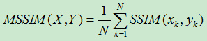

# $\small {\rm ffmpeg}$ 基础

[TOC]

## ffmpeg转码基础

### 指令模板（cmd指令）

说明1. **【ffmpeg.exe完整路径】** -i **【要转码的音视频完整路径】** -c:v **【视频编码器】** -preset **【编码等级】** **【编码器内部设置头文件】** "**【编码器内部设置参数】**"  **【输出视频完整路径】**

说明2. [ffmpeg.exe完整路径] **-i** [要转码的音视频完整路径] **-c:v** [视频编码器] **-preset** [编码等级] **-profile:v** [编码器指令] **-x265-params**（这是表示后面的指令为 x265 指令，以集群的方式，类如："第一条指令；第二条指令：第三条指令"） [视频输出路径]

列如：`C:\ffmpeg.exe -i C:\input.mp4 -c:v libx265 -preset veryslow -x265-params "crf=19:no-sao=1" C:\output.mp4`

### 指令详解

**`【ffmpeg完整路径】`**
ffmpeg 识别指令是顺序识别的， cmd 需要先调用 $\small {\rm ffmpeg}$ ，所以此处开头给了一个 $\small {\rm ffmpeg}$ 路径来告诉 cmd 指令接受位置

**`-i`**
输入文件的识别号，后面跟输入文件的路径

**`-c:v`**
coder 和 video 的首字母，选择 $\small {\rm ffmpeg}$ 内置的视频编码器

**`-preset`** （可选）
编码等级选择，如果编码器支持数字也可以用数字代替，如 veryslow 可以表示为 `-prsest 8` ，不设置时为默认值，默认为 medium 。

**`【编码器内部设置头文件】`** （可选）
虽然时可选，但是是 `【编码器内部设置参数】` 的前置要求，这是一个固定的字符串，但是其他编码器的没看过，只知道x265的是 `-x265-param` ，x264的是 `-x264-param` 。

**`【编码器内部设置参数】`**（可选）

- 此项参数必须要设置了 `编码器内部设置头文件` 才能使用。
- 此参数是一个数组，必须放在双引号中，在这个数组中，可以放置多个参数，不同参数需要用 `:` 隔开，如 `"crf=18:no-sao=1"` 。
- 注意，此项参数是编码器自己的指令而不是ffmpeg规定的指令且不能有空格，如参数本来就有空格可以尝试将空格改成 `-` 。
- 无数值的参数要用 `=1` 来引用，如x265参数 `no-sao` 在这里为 `no-sao=1` ；x265参数 `pme` 在这里为`:pme=1`。
- 有数值参数就直接等于数字就行了，如x265参数 `crf` 值域为 0~51 ，在这里直接可以用 `crf=[0~51]` 来表示所需要的值。
- 此项也可以不用配置，设置的头文件也都不要了，转码的值会按照系统默认的来，如果设置了编码等级就会按照等级的参数来。

### 注意事项

1. 不同视频与音频编码格式的封装要求不同。
2. -x265-params 后的集群代码如果有错误会抛出错误代码，以警告的方式显示，但是抛出后程序仍然会运行，错误代码的指令由默认参数替换。
3. $\small {\rm ffmpeg}$ 中表示值为 null 要用 `null -` 。
4. 还有别的写法，但是我更喜欢这样 。

## $\small {\rm ffmpeg}$ 多视频/音频流处理

### 多轨处理说明

$~~~~~~$ $\small {\rm ffmpeg}$ 默认是单视频流和单音轨处理，在需要处理多个音轨或者视频时就需要 `-map` 指令
**参数位置：** 放置在视频/音频编码指令前
例如：`F:\ffmpeg.exe -i input.mp4 -map 0:v -c:v libx265 -preset fast  -map 0:a -acodec copy out.mp4`

### 参数解释 `-map z:x:y`

- z表示第几个输入源，有的时候我们会同时选择多个输入源 值类型为 int 。

- x目前知道的有两个， v 和 a 。v 表示 video ，即选择视频流 ；a 表示 audio ，即选择音频

- y 表示选择的 音频 / 视频流 ，此项可选，不填就表示全选，值类型为int

### 举例解释

- `map  0:v` ： 表示选择了第一个输入源的所有视频流
- `-map 0:a` ： 表示选择了第一个输入源的所有音频流
- `-map 0:v:1` ： 表示选择了第一个输入源中的第一个视频流
- `-map 0:a:1` ： 表示选择了第一个输入源中的第一个音频流
- `-map 1:v` ： 表示选择了第二个输入源中的所有视频流
- `-map 1:a` ： 表示选择了第二个输入源中的所有音频流

注意，此命令可以重复，用作选择多个指定的视频或音频流
如 `F:\ffmpeg.exe -i input.mp4 -map 0:v -c:v libx265 -preset fast  -map 0:a:0 -map 0:a:1 -acodec copy out.mp4`

## ffmpeg视频分辨率缩放

### 缩放说明

通过下列两种方式可以将输出的视频分辨率进行缩放或者拉伸，但是这并非 ai 算法，拉伸毫无意义
此方式是 ffmpeg 自带的方式，不是编码器自带的方式

#### 代码1 `-s`

用`-s`参数设置视频分辨率，参数值 w*h ，w : 宽度单位是像素，h : 高度单位是像素

- 代码样式：`ffmpeg -i input_file -s 320x240 output_file`
- 代码举例：`ffmpeg -i input.avi -s 640x480 output.avi`

#### 代码2 `Scale filter`

`Scale filter` 的优点是可以使用一些额外的参数

- 代码样式：`Scale=width:height[:interl={1|-1}]`
- 代码举例：`ffmpeg -i input.mpg -vf scale=320:240 output.mp4`

**对输入视频成比例缩放**

- 改变为源视频一半大小：`ffmpeg -i input.mpg -vf scale=iw/2:ih/2 output.mp4`
- 改变为原视频的90%大小：`ffmpeg -i input.mpg -vf scale=iw*0.9:ih*0.9 output.mp4`

## ffmpeg_x265_10bit编码

### 说明

在 ffmpeg 中，x265 无法通过设置 `-profile:v main10` 来指定 mian10 编码输出，需要通过 `-pix_fmt` 指定编码的色彩空间的方式来达到 main10 输出。

参考代码：`D:\ffmpeg.exe -i D:\input.mp4 -c:v libx265 -pix_fmt yuv420p10le -preset slower  -acodec copy  D:\工具\output.mp4`

### 代码

`-pix_fmt yuv420p10le`

这段代码的作用是以 yuv420p 的 10bit 色彩空间编码
 位置：指定编码器后面，即 `-c:v` 后边。

- `-pix_fmt` ： 用于指定编码的色彩空间
- `yuv420p10le` ： 参数

### 其他参数

Pixel formats（像素格式）:
I.... = Supported Input  format for conversion
.O... = Supported Output format for conversion
..H.. = Hardware accelerated format
...P. = Paletted format
....B = Bitstream format

| 格式名词 | NB组件 | 像素深度 || 格式名词 | NB组件 | 像素深度 |
| :--: | :--: | :--: | :--: | :--: | :--: | :--: |
| IO... yuv420p | 3 | 12 || IO... yuyv422 | 3 | 16 |
| IO... rgb24 | 3 | 24 || IO... bgr24 | 3 | 24 |
| IO... yuv422p | 3 | 16 || IO... yuv444p | 3 | 24 |
| IO... yuvj420p | 3 | 12 || IO... yuvj422p | 3 | 16 |
| IO... yuvj444p | 3 | 24 || IO... bgr8 | 3 |  8 |
| IO... nv21 | 3 | 12 || IO... argb | 4 | 32 |
| IO... rgb8 | 3 |  8 || IO... rgb444le | 3 | 12 |
| IO... rgba | 4 | 32 || IO... abgr | 4 | 32 |
| IO... bgra | 4 | 32 || IO... yuv440p | 3 | 16 |
| IO... yuvj440p | 3 | 16 || IO... yuva420p | 4 | 20 |
| IO... yuv420p16le | 3 | 24 || IO... yuv420p16be | 3 | 24 |
| IO... yuv422p16le | 3 | 32 || IO... yuv422p16be | 3 | 32 |
| IO... yuv444p16le | 3 | 48 || IO... yuv444p16be | 3 | 48 |
| IO... rgb444be | 3 | 12 || IO... yuv420p10be | 3 | 15 |
| IO... yuv420p10le | 3 | 15 || IO... yuv422p10be | 3 | 20 |
| IO... yuv422p10le | 3 | 20 || IO... yuv444p10be | 3 | 30 |
| IO... yuv444p10le | 3 | 30 || ..H.. vdpau | 0 |  0 |
| ..... nv16 | 3 | 16 || ..... nv20le  | 3 | 20 |
| ..... nv20be  | 3 | 20 || IO... rgba64be | 4 | 64 |
| IO... rgba64le | 4 | 64 || IO... bgra64be | 4 | 64 |
| IO... bgra64le | 4 | 64 || IO... yvyu422 | 3 | 16 |
| I.... ya16be  | 2 | 32 || I.... ya16le  | 2 | 32 |
| IO... yuv420p12be | 3 | 18 || IO... yuv420p12le | 3 | 18 |
| IO... yuv420p14be | 3 | 21 || IO... yuv420p14le | 3 | 21 |
| IO... yuv422p12be | 3 | 24 || IO... yuv422p12le | 3 | 24 |
| IO... yuv422p14be | 3 | 28 || IO... yuv422p14le | 3 | 28 |
| IO... yuv444p12be | 3 | 36 || IO... yuv444p12le | 3 | 36 |
| IO... yuv444p14be | 3 | 42 || IO... yuv444p14le | 3 | 42 |
| IO... gbrp12be | 3 | 36 || IO... gbrp12le | 3 | 36 |
| IO... gbrp14be | 3 | 42 || IO... gbrp14le | 3 | 42 |
| IO... yuv440p10le | 3 | 20 || IO... yuv440p10be | 3 | 20 |
| IO... yuv440p12le | 3 | 24 || IO... yuv440p12be | 3 | 24 |
| I.... gbrap12be | 4 | 48 || I.... gbrap12le | 4 | 48 |
| I.... gbrap10be | 4 | 40 || I.... gbrap10le | 4 | 40 |
| ..H.. mediacodec | 0 |  0 || ..H.. qsv  | 0 |  0 |
| ..H.. d3d11va_vld | 0 |  0 || ..H.. cuda | 0 |  0 |
| ..H.. vdpau_h264 | 0 |  0 || ..H.. vaapi_vld | 0 |  0 |
| ..H.. dxva2_vld | 0 |  0 |

## x265 2pass

### 说明

2pass 使用需要先进行一次编码（pass=1），1pass时会创建一个文件用于存放编码信息，第二次编码时（pass=2），系统就会到指定目录下获取这个文件，通过此文件的数据来获取本次编码的最佳码率， 2pass 和 crf 相比，时间要多0.5倍，但同体积下画质提升不会超过 5% ，这并不划算，预设未到 veryslow 时建议提高预设。

实际上可以还可以3遍编码，但是效率太低没啥用不做说明。

### 代码

2pass 需要先进行 1pass 然后进行 2pass ，这样就需要2段代码。

#### 第一遍代码

模板：`F:\ffmpeg.exe -i F:\1.mp4 -c:v libx265 -preset slow -x265-params "pass=1:bitrate=400:vbv-maxrate=800:vbv-bufsize=1600" -acodec copy  -f mp4 -y nul`

- `pass=1` 告诉编码器这是第一次编码，这样就会生成用于第二次编码的数据文件
- `vbv-maxrate=800:vbv-bufsize=1600:bitrate=400` 2pass 需要指定平均码率，最高码率、缓冲区大小，建议 `缓冲区大小=2*最高码率=2*平均码率` 。
- `-f mp4` 表示输出封装为 MP4 。
- `-y nul` 表示输出数据为空，因为 1pass 本来就不需要输出视频，日志文件不属于视频输出文件

#### 第二遍编码

模板：`F:\ffmpeg.exe -i F:\1.mp4 -c:v libx265 -preset slow -x265-params "pass=2:vbv-maxrate=800:vbv-bufsize=1600:bitrate=400" -acodec copy  -F:\01.mp4`

- `2pass` 作用，告诉编码器这是 2pass 编码，这样编码器就会去寻找日志文件

### 注意事项

- 1pass 时 `-preset` 参数可以用更低的预设代替，2pass 时才采用高预设，这样可以带来时间上的节约，但是码率分配的精度就会降低。
- 目前测试 2pass 低于 slower 预设时，1pass 预设可以低到 veryfast ，但是在 slower 与更高情况下，无法降低 1pass 预设，暂时没有测试原因。

## ffmpeg硬件解码

### 通用硬件解码：dxva2

经过个人尝试，发现不论是在 amd 显卡、nvidia 显卡、 intel 显卡都可以使用 dxva2 进行硬件解码

解码的算力要求几乎是固定的，所以编码速度越快，解码占用的总算力比例就越多，硬件解码就越能体现出价值来

#### 参数详细

**`-hwaccel dxva2 -threads 1`**

- 参数位置：`-i` 之前
- `-hwaccel` 是引用解码器的前缀指示，后面跟解码器名称
- `dxva2` 所引用的解码器
- `-threads 1` threads,线程，表示解码后的数据由多少个处理器线程处理，这里是1个，但是推荐全部线程，速度更快
- 例子：`D:\ffmpeg.exe  -hwaccel dxva2 -threads 1 -i D:\input.mp4 -c:v libx265 -preset veryslow D:\out.mp4`

可以通过`D:\ffmpeg.exe -hwaccel dxva2 -threads 1 -i D:\input.mp4 -f null - -benchmark`来测试是否可用

### amd硬件解码：amf

暂无

### nvidia硬件解码

暂无

## ffmpeg音频转码(待完善)

ffmpeg -i input -c:a libopus -b:a bitrate output

Opusenc a.wav a.opus --bitrate 24 --framesize 40 --discard-comments --discard-pictures

## ffmpeg获取ssim和psnr

### 说明

视频的 ssim 和 psnr 是视频与原视频画面差距的数值，但是个人觉得意义不大，因为本人录屏视频在crf17.5的情况下，slower 居然比 veryfast 要大一倍体积，而slower的 psnr 比 veryfast 数值要小， ssim 要大，但是差距都非常小。
但是当 veryfast 调成 crf17 时，体积仍然比 crf17.5 的 slower 小三分之一，但是 ssim 和 psnr 却吊打 slower ，所以感觉不太可信，乐乐就行

#### PSNR

PSNR（Peak Signal to Noise Ratio）峰值信噪比，一种全参考的图像质量评价指标。

其中，MSE表示当前图像X和参考图像Y的均方误差（Mean Square Error），H、W分别为图像的高度和宽度；n为每像素的比特数，一般取8，即像素灰阶数为256. PSNR的单位是dB，数值越大表示失真越小。

#### SSIM

SSIM（structural similarity）结构相似性，也是一种全参考的图像质量评价指标，它分别从亮度、对比度、结构三方面度量图像相似性。

其中ux、uy分别表示图像X和Y的均值，σX、σY分别表示图像X和Y的方差，σXY表示图像X和Y的协方差，即

C1、C2、C3为常数，为了避免分母为0的情况，通常取C1=(K1*L)^2, C2=(K2*L)^2, C3=C2/2, 一般地K1=0.01, K2=0.03, L=255. 则

SSIM取值范围[0,1]，值越大，表示图像失真越小.

在实际应用中，可以利用滑动窗将图像分块，令分块总数为N，考虑到窗口形状对分块的影响，采用高斯加权计算每一窗口的均值、方差以及协方差，然后计算对应块的结构相似度SSIM，最后将平均值作为两图像的结构相似性度量，即平均结构相似性MSSIM：

### 代码

#### 获取ssim参考代码

`F:\ffmpeg.exe -i F:\1.mp4 -i F:\1.mp4  -lavfi ssim="stats_file=ssim.log" -f null -`

- 获取代码需要设置两个输入视频，第一个视频为原视频，第二个视频为转码视频，因为程序会以第一个视频为模板，用第二个视频去对比计算
- `-lavfi ssim="stats_file=ssim.log"` 作用：获取并输出对比数据，这个对比数据没找到指定地址的方法
- `-f null -` 作用：设定输出为空，因为只需要对比数据不需要视频输出

#### 获取psnr参考代码

`F:\ffmpeg.exe -i F:\1.mp4 -i F:\1.mp4  -lavfi psnr="stats_file=psnr.log" -f null -`

- 同 ssim 参考代码解析，其实 ssim 参考代码把 ssim 改成psnr 就行，这是唯一差别

#### 同时获取ssim和psnr代码

`F:\ffmpeg.exe -i F:\1.mp4 -i F:\1.mp4  -lavfi "ssim;[0:v][1:v]psnr" -f null -`

- `"ssim;[0:v][1:v]psnr"` 这是最大的区别，其中 `[0:v]` 位于前方，表示第一个输入的视频，`[1:v]` 在后面，表示第二个输入的视频，对比方法与前面一样。
