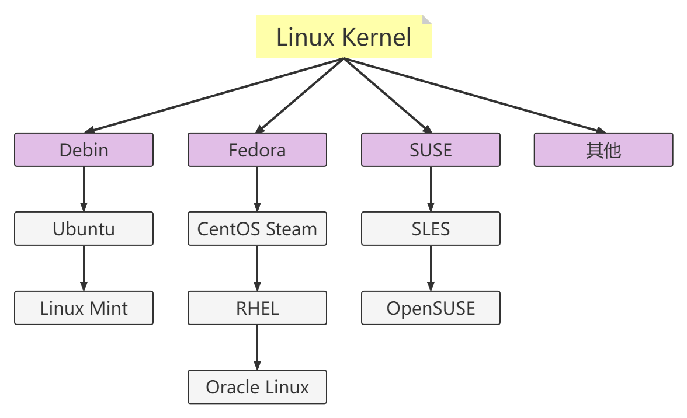
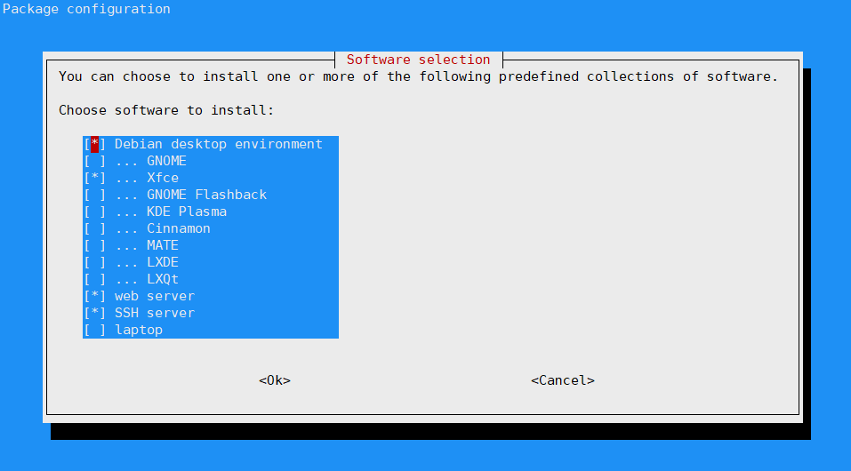

# linux基本操作

[TOC]

$~~~~~$ 在进行 linux 学习之前，我们需要了解什么是 linux 。
$~~~~~$ Linux是一套免费使用和自由传播的类Unix操作系统，是一个基于POSIX和UNIX的多用户、多任务、支持多线程和多CPU的操作系统。 它能运行主要的UNIX工具软件、应用程序和网络协议。 它支持32位和64位硬件。 Linux继承了Unix以网络为核心的设计思想，是一个性能稳定的多用户网络操作系统。
$~~~~~$ 严格来讲，Linux这个词本身只表示Linux内核，但实际上人们已经习惯了用Linux来形容整个基于Linux内核，并且使用GNU 工程各种工具和数据库的操作系统。
    > linux 内核实际上非常小，小到路由器上都能使用。

$~~~~~$ 在初步了解了什么是 linux 后，我们还需要了解一个概念：上下游。
$~~~~~$ 在 linux 中，内核自然是整个 linux 的源头，所有的操作系统都是基于这个内核开发的，但是不是所有的系统都是使用这个内核开发的，有些系统是基于一些已经开发好的 linux 系统来进行二次开发。我们把源系统叫做二次开发的系统的上游，下图是主流的 linux 系统上下游图。
<center></center>

在同一个支脉下，越上游的系统 linux 内核版本越新，技术越新，更新越快。
理论上来讲，同支脉越下游的系统稳定性越高，但这只是理论上，需要具体情况具体分析

> $~~~~~$ CentOS Stream 并不是基于 Fedora 进行二次开发的，而是基于 RHEL 经过稳定性测试后的源码进行开发的，但是由于 RHEL 发布版 会根据 CentOS Stream 发布版 出现的问题对源码进行修改后才会进行发布，所以还是将它放在 RHEL 的上游。

$~~~~~$ 对于开发者而言，优先选择上游的 linux 系统，这样对于新技术的学习和效率的提升是有很大的帮助的。而且身为开发者，在不影响效率的情况下自然应该越接近源头。
$~~~~~$ 对于服务器而言，稳定性是第一追求，因此通常会选择下游的操作系统。

## linux基础命令

### 用户切换

$~~~~~$ 如果是 `$` 前缀，表示以普通权限操作，`#` 前缀表示超级管理员权限操作，要切换用户使用此代码： `su -[用户名]` ，如果切换到超级管理员账户，可以直接用 `su -` 命令。

$~~~~~$ 下方代码如果用的是 `$` 开头，其实是表示以普通权限操作

> linux 默认输入密码是不会有任何字符显示的

`$ shutdown -h now` 关机命令 ；`$ reboot` 重启命令

### 文件夹操作

```shell
mkdir [文件夹名]                  创建⽂件夹
cd [文件夹名]                     进⼊⽂件夹
ls                               查看当前⽂件夹内的所有⽂件或⼦⽂件夹
cd ..                            退出⽂件夹，返回文件夹上一层目录
rm -rf folder                    删除⽂件夹(在要删除的文件夹之外才能执行)
```

### 文本操作

1. **文本的创建与编辑**
    `touch file.txt` 创建文本，但不会进入文本
    `vi file.txt` 或 `vim file.txt` 若无文本则自动创建并进入文本，若有则直接进入文本。

2. **写入数据**
   - `r + 字母` ： 修改光标所在位置的字母为指定的字母，r命令只修改一个字母。
   - `s + 字母` ： 替换光标所在位置的字母为任意输入文本。
   - `数字 + s + 字母` ： 替换光标所在位置后面数字指定数量的文本为任意输入文本，与前面一个命令的区别就是替换指定数量的字母。
   - `R + 任意输入` ： 进入替换模式，后续字母输入将逐一替换原有文本，直至按下 Esc 键回退到命令模式。

3. **光标的移动**
    `K[上]、J[下]、H[左]、L[右]`

4. **删除文本**
    删除文本字母 :
   - `x` ，删除光标所在位置的一个字母，并保持在命令模式。

   删除文本块 :

   - `dw` ,删除光标所在位置往后的一个单词，并保持在命令模式。
   - `d + [数字] + w` ，删除光标所在位置往后的由数字指定数量的单词，并保持在命令模式。
   - `dd` ，删除光标所在的一整行，并保持在命令模式。
   - `d + 0` ，（数字零），删除光标所在位置直到行首的所有文本，并保持在命令行模式。
   - `d + $` ,删除光标所在位置直到行末的所有文本，并保持在命令行模式。此命令等效于命令： D

5. **保存文本**

    $~~~~~$ 编辑完成之后，按 ESC 键 跳到命令模式后输入下列代码（命令前面冒号是必要的）：

    ```shell
    :w              # 保存文件但不退出vi
    :w file         # 将修改另外保存到file中，不退出vi
    :w!             # 强制保存，不推出vi
    :wq             # 保存文件并退出vi
    :wq!            # 强制保存文件，并退出vi
    :q              # 不保存文件，退出vi
    :q!             # 不保存文件，强制退出vi
    :e!             # 放弃所有修改，从上次保存文件开始再编辑
    ```

6. **文件删除**

    使用 `rm -rf` 命令
    使用规则 ： `rm -rf [目录名字]`  

    - 如果没有目录名，linux 会删除当前目录下的所有东西，这就是删库到跑路
    - `-r` ： 向下递归，不管有多少级目录，一并删除
    - `-f` ： 直接强行删除，没有任何提示
    示例：

    ```shell
    rm -rf /var/log/httpd              #将会删除/var/log/httpd目录以及其下所有文件、文件夹
    rm -f /var/log/httpd/access.log    #将会强制删除/var/log/httpd/access.log这个文件
    ```

    >使用 `rm -rf` 的时候一定要小心，Linux没有回收站。

7. **文件改名**
   使用 `mv` 命令
   使用规则 ： `mv [原文件名] [新文件名]`

8. **文件访问权限**

    文件访问权限设置由拥有者设置和文件读写运行权限设置组成。
    文件权限就是对指定的用户类型指定其访问文件的权限。
    <center></center>

    文件访问权限的指定方法有两种

    字母方法：

    ```shell
    chmod [who] [opt] [per] [file]
    ```

   - `chmod` ：命令前缀，表示这是控制文件访问权限的命令
   - `who` ：哪种用户，值域：
     - u 表示该文件的拥有者
     - g 表示与该文件的拥有者属于同一个群体(group)者，
     - o 表示其他以外的人
     - a 表示这三者皆是。

   - `opt` ：对文件权限操作，值域 : `+`(增加)，`-`(删减)，`=`(覆盖)。
   - `per` : 文件权限，值域：`r`(读)，`w`(写)，`x`(运行)，`X` 表示只有当该文件是个子目录或者该文件已经被设定过为可执行。
   - `file` : 文件名，如果文件在文件夹下面，就要写上完整路径

   举例：

   - 赋予helloworld.txt文件读写权限：`chmod u+r helloworld.txt`

   - 删除helloworld.txt文件的运行权限：`chmod u-x helloworld.txt`

   **还有数字法**，不做描述，不想用。
   **指定用户时**，只有在局域网这种情况下才会用到其他两个。

## linux 初始操作

### 换源

$~~~~~$ 源，即系统默认的下载链接，linux可以通过下载指令从网上直接下载应用自动安装，非常方便。但是 linux 的默认下载链接是国外的，国内很难连接上，因此需要更换国内的源。

$~~~~~$ linux 有两个类别， debin类和 CentOS/RedHat 类，两种系统的下载方式分别是 apt-get 与 yum ，后面会进行讲解。

#### debin换源

$~~~~~$ debin 默认的源（apt下载的链接）在国内经常无法使用，所以要把源进行更换。

使用指令 `vi /etc/apt/sources.list` 打开并编写源地址文件

删除内部所有文字，再粘贴上我们的源
>linux 在中国有许多个源可以使用，如下任意选择一个版本的就行

```shell
# Debian 10 buster

# 中科大源

deb https://mirrors.ustc.edu.cn/debian/ bullseye main contrib non-free
deb-src https://mirrors.ustc.edu.cn/debian/ bullseye main contrib non-free
deb https://mirrors.ustc.edu.cn/debian/ bullseye-updates main contrib non-free
deb-src https://mirrors.ustc.edu.cn/debian/ bullseye-updates main contrib non-free

deb https://mirrors.ustc.edu.cn/debian/ bullseye-backports main contrib non-free
deb-src https://mirrors.ustc.edu.cn/debian/ bullseye-backports main contrib non-free
deb https://mirrors.ustc.edu.cn/debian-security/ bullseye-security main contrib non-free
deb-src https://mirrors.ustc.edu.cn/debian-security/ bullseye-security main contrib non-free

# 网易源

deb https://mirrors.163.com/debian/ bullseye main non-free contrib
deb-src https://mirrors.163.com/debian/ bullseye main non-free contrib
deb https://mirrors.163.com/debian-security/ bullseye-security main
deb-src https://mirrors.163.com/debian-security/ bullseye-security main

deb https://mirrors.163.com/debian/ bullseye-updates main non-free contrib
deb-src https://mirrors.163.com/debian/ bullseye-updates main non-free contrib
deb https://mirrors.163.com/debian/ bullseye-backports main non-free contrib
deb-src https://mirrors.163.com/debian/ bullseye-backports main non-free contrib

# 阿里云

deb https://mirrors.aliyun.com/debian/ bullseye main non-free contrib
deb-src https://mirrors.aliyun.com/debian/ bullseye main non-free contrib
deb https://mirrors.aliyun.com/debian-security/ bullseye-security main
deb-src https://mirrors.aliyun.com/debian-security/ bullseye-security main

deb https://mirrors.aliyun.com/debian/ bullseye-updates main non-free contrib
deb-src https://mirrors.aliyun.com/debian/ bullseye-updates main non-free contrib
deb https://mirrors.aliyun.com/debian/ bullseye-backports main non-free contrib
deb-src https://mirrors.aliyun.com/debian/ bullseye-backports main non-free contrib

# 华为源
deb https://mirrors.huaweicloud.com/debian/ bullseye main non-free contrib
deb-src https://mirrors.huaweicloud.com/debian/ bullseye main non-free contrib
deb https://mirrors.huaweicloud.com/debian-security/ bullseye-security main
deb-src https://mirrors.huaweicloud.com/debian-security/ bullseye-security main

deb https://mirrors.huaweicloud.com/debian/ bullseye-updates main non-free contrib
deb-src https://mirrors.huaweicloud.com/debian/ bullseye-updates main non-free contrib
deb https://mirrors.huaweicloud.com/debian/ bullseye-backports main non-free contrib
deb-src https://mirrors.huaweicloud.com/debian/ bullseye-backports main non-free contrib
```

1. 源录入完成后，点击键盘的 `esc` 按键，进入文件的指令操作状态，再输入 `:wq!` ，然后回车确认。
2. 输入指令 `apt-get update` ，更新源。自此，源更新就完成了。

### CentOS/RedHat 换源

CentOS 的换源方法与 Debin 有些许不同，我们首先需要备份源数据

```shell
mv /etc/yum.repos.d/CentOS-Base.repo /etc/yum.repos.d/CentOS-Base.repo.backup
```

进入源目录 `cd /etc/yum.repos.d`，然后下载源

```shell
wget -nc http://mirrors.aliyun.com/repo/Centos-7.repo
```

然后将下载的源更换上去

```shell
mv Centos-7.repo CentOS-Base.repo
```

最后更新本地的 yum 缓存

```shell
# 全部清除
yum clean all
yum list
```

$~~~~~$ 不论是 debin 还是 centos ，如果在使用源更新或安装程序时，出现已安装版本大于下载版本，不用想，源错了，要去网上找最新的。

#### apt-get 与 yum 使用

<font size=4 color="DarkViolet">首先介绍 apt-get 的使用方法</font>

1. 更新软件包数据库：`apt-get update`
   > $~~~~~$ apt 实际上在可用软件包的数据库上工作。即 apt 每次进行下载，更新，卸载都是先查本地数据库里面的数据，如果没有更新，那么就会缺失最新的信息。这就是为什么在安装任何Linux系统之后，第一件事应该是更新apt数据库。

2. 升级已安装的软件包：`apt-get upgrade`
   >这将显示要升级的软件包数量和所有要升级的软件包。

3. 完全升级已安装的软件包：`apt-get full-upgrade`
   >升级和完全升级的区别在于，如果需要升级整个系统，后者将删除已安装的软件包。

4. 安装软件包：`apt install [软件名]`
   > 如果没有安装会自动安装并自动配置环境，做到即开即用。
   > 如果已安装了软件就会执行升级操作。

5. 移除已安装的软件包：`apt remove [软件名]`
   移除多个已安装的软件包：`apt remove [软件名1] [软件名2]`

6. 删除未使用的软件包：`apt autoremove`
   >$~~~~~$ 在系统上安装依赖于其他软件包的新软件包时，也会安装软件包依赖项。删除包后，依赖项将保留在系统上。这些剩余的软件包不再被其他任何东西使用，可以移除。

7. 生成所有软件包列表：`apt list`
   生成指定的软件包列表：`apt list | grep [软件名]`
   > $~~~~~$ grep 是一个通用指令，可以理解为一个筛选条件，如上所示的代码，又如 `ps -ef | grep 5051` ，如果只用 ps -ef 的话会把所有端口的程序都列出来，加了 `| 5051` 后，就只会列出 5051 端口的程序。

   生成已安装的软件包：`apt list --installed`
   获取可升级软件包的列表：`apt list --upgradeable`

8. 搜索指定的软件包：`apt search [软件名]`
   > 如果找到，该命令将返回名称与搜索词匹配的包，如：搜索 jdk ，然后会出现不同版本，jdk8，jdk11，jdk17，……，即只要是 jdk 都会返回回来。

9. 显示软件包信息：`apt show [软件名]`
   > 会显示有关软件包依赖项、安装大小、软件包源等信息

10. 不升级的情况下安装软件包：`apt install [软件名] --no-upgrade`
    > 通常来说，如果已安装的软件再次执行安装，这时就会更新软件，使用上面这条指令就可以去除掉 install 指令的自动更新属性。

    只升级软件包：`apt install [软件名] --only-upgrade`

11. 安装软件的特定版本：`apt install [软件名]=<版本号>`

12. 清理下载文件的存档：`apt-get clean`
    > 有时候我们进行某些操作没有经过 apt ，或者缓存信息被修改了，缓存数据出错。

> 还有一堆的操作，不过上述几个是可能会用到的，而最主要用到就是1，2，3，4，5 。

<font size=4 color="DarkViolet">然后，我们再来了解 yum 的使用方法</font>

1. 升级系统与本地数据库：`yum upgrade`
2. 安装软件：`yum install[软件名]`
3. 删除软件：`yum remove [软件名]` 或 `yum erase [软件名]`
4. 升级软件：`yum upgrade [软件名]` 或 `yum update [软件名]`
5. 查询信息：`yum info [软件名]`
6. 搜索软件：`yum search [软件名]`
7. 清除缓存：`yum clean all`

### 静态ip配置

$~~~~~$ 在使用 shell 访问 linux 时，经常会出现 ip 地址变动，这时候我们可以固定 ip 地址，避免每次都要查看。

<font size=4 color="DarkViolet">RedHat/CentOS ip配置</font>

1. 首先，我们通过 `cd` 查看我们的网卡。

2. 然后，我们通过如下指令进入网卡配置的文件目录中。

   ```shell
    cd /etc/sysconfig/network-scripts/
    ```

3. 下一步，通过 `ls` 查看该目录下的文件，找到我们网卡的信息。

4. 在该目录下，输入 `vi 【你的网卡名】` ，将如下的几个指令添加或者修改到你的文件中

    ```shell
    BOOTPROTO="static" # 使用静态IP地址，默认为dhcp 
    IPADDR="19.37.33.66" # 设置的静态IP地址
    NETMASK="255.255.255.0" # 子网掩码 
    GATEWAY="19.37.33.1" # 网关地址 

    ONBOOT=yes  #设置网卡启动方式为 开机启动 并且可以通过系统服务管理器 systemctl 控制网卡
    ```

    > $~~~~~$ ip、网关，需要根据自己的网络位置分配，具体一段可以参考开始的动态ip ，前三段的代码与静态ip、网关都是一样，如动态ip为 192.168.18.113 ，那么我们的 ip 就是192.168.18.XXX ，网关就是 192.168.18.254（网关的地址只能为 1 或 254）。

5. 通过 `vi /etc/sysconfig/network` 修改 /etc/sysconfig/network

    ```shell
    # Created by anaconda
    NETWORKING=yes
    GATEWAY=19.37.33.1  #此处网关地址与上面的一样 
    ```

<font size=4 color="DarkViolet">debin ip配置</font>

1. 首先，我们编辑 interfaces 文件， `/etc/network/interfaces` ,添加如下的设置

    ```shell
    auto lo
    iface lo inet loopback
    auto eth0
    
    allow-hotplug eth0
    iface eth0 inet static
    address 192.168.9.100
    netmask 255.255.255.0
    gateway 192.168.9.254
    ```

    由于 interfaces 文件中注释可能会导致出错，所以为了方便复制，将每一行的解释放在此处
    **`auto lo`** : 开机自动配置lo接口 ，必填选项
    **`auto eth0`** : 开机自动启动网卡 eth0
    **`allow-hotplug eth0`** : 设置网卡 eth0 为热拔插自启，，只需要网卡自启的话通常选 `auto eth0` .
    **`iface lo inet loopback`** : 将lo接口设置为一个本地回环（loopback）地址 ，必填选项
    **`iface eth0 inet static`** : 设置 eth0 网卡ip配置，static 静态IP 设置，dhcp 动态 IP 设置
    **`address`** : 静态 IP 选项，设置静态 ip 地址
    **`netmask`** : 静态 ip 选项，设置静态 ip 的子网掩码
    **`gateway`** : 静态 ip 选项，设置静态 ip 的网关，如果只用内网不跨网段，就不配网关。

    如果我们只需要静态 IP 的话，就不需要配置后面的地址、网关、子网掩码了

    ```shell
        auto lo
    iface lo inet loopback
    auto eth0
    
    allow-hotplug eth0
    iface eth0 inet DHCP
    ```

    **如果需要设置多个网卡，只需要在后面添加就行了**

    ```shell
    auto lo
    iface lo inet loopback
    auto eth0 eth1
    
    iface eth0 inet static
    address 192.168.9.100
    netmask 255.255.255.0
    gateway 192.168.9.254

    iface eth1 inet static
    address 192.168.9.101
    netmask 255.255.255.0
    gateway 192.168.9.254
    ```

    > $~~~~~$ ip ，网关 通常是将 ip 地址最后一段换成 1 或者 254 ，如 ip 是 192.168.18.23 ，网关就是 192.168.18.1 或 192.168.18.254。
    > $~~~~~$ 如果使用的是有不同网段的局域网，那么 dns 服务器地址也需要配置，具体是什么问管理员。

    然后依然可以通过 `:wq` 来保存并关闭编辑器。

<font size=4 color="DarkViolet">dns 服务器配置</font>

接下来，我们需要配置 dns 服务器，debin 和 RedHat 的 dns 服务器配置方案是一样的。
若该 dns 是用于互联网连接的，内网不配置这个。
只需要使用 `vi /etc/resolv.conf` ，修改 resolv.con 文件即可，具体内容如下：

```shell
nameserver 114.114.114.114   #设置首选dns
nameserver 8.8.8.8           #设置备用dns
```

> $~~~~~$ 注意，dns服务器如果是用于网络连接，那么上面的就够了。如果是用于不同网段直接连接，而且还是内网的话，就需要指定内网中的 dns 服务器了。

至此，ip地址，网关，dns配置完成，重启服务器即可生效。

```shell
service networking restart
```

如果重启网络后，配置并没有生效，请检查是否有书写错误，比如全角和半角字符。

#### 一些有关网卡或者 ip 的指令

```shell
dhclient                              # 动态获取IP地址（设置ip为静态后将无法使用）
dhclient -s [服务器地址]               # 向指定的服务器请求获取网卡参数
dhclient -R                           # 释放ip地址
dhclient -x                           # 停止dhclient服务进程
ifconfig [网卡名] up                  # 启动指定网卡
fconfig [网卡名] down                 # 关闭指定网卡
ifup [网卡名]                         # 打开网络
service networking restart            # 重启网络服务
netstat -nltp                         # 查看网络端口使用
netstat -nao | grep [端口/程序名]      # 查看某个端口或者某个应用的端口使用情况
lsof -i:[端口名]                       # 查看端口占用情况（可查看占用端口线程的ID）
kill -9 [ID]                           # 杀死占用端口的进程（注意是进程，一个程序可能有多个进程）
```

### 镜像文件挂载

$~~~~~$ 在 linux 中，我们可以通过一段指令直接从网上下载软件，自动安装。省略了环境变量和一些繁琐手续的操作。
$~~~~~$ 但是在离线状态，或者网络速度很慢的时候，我们将难以使用这个方法从网络上获取软件，但是我们可以通过挂载镜像的时候，将镜像视作源，从镜像中进行下载。
$~~~~~$ 下面将介绍镜像文件挂载的流程，由于 debin 与 redhat 类的挂载流程相似，所以将以 CentOS 为主要模板，不一样的地方会做提示。

1. 首先，我们先创建挂载目录，挂载的镜像将会通过这个目录连接到我们的系统。

    ```shell
    mkdir /media/cdrom
    ```

    > 挂载的目录其实叫什么无所谓，只要对应就好

    将镜像文件挂载到创建的目录中

    ```shell
    #以下是虚拟机的挂载代码
    mount /dev/cdrom /media/cdrom
    ```

    > $~~~~~$ /dev/cdrom 是虚拟机挂载的镜像文件目录，但这个目录不是固定的，建议使用 swap 指令查看一下，可能是 /dev/sr0 ，反正是 dev 目录下的东西

2. 通过代码进入到 yum 配置文件目录 `cd /etc/yum.repos.d/`
   $~~~~~$ 再通过 `ls` 查看目录下的文件，由于系统会读取该目录下 repo 后缀的文件来作为配置文件，所以需要将目录里除了 CentOS-Media.repo 的所有文件全部改名，只要不是 repo 后缀的就行，以下是改名代码（若有不足，请自行操作）
   > 注意，当我们取消挂载时，需要将文件名改回来，所以这里只建议改个后缀就行了，避免时间久了无法还原。

    **若使用的是 debin 系统，请忽略 2、3 步，直接使用指令 `apt-cdrom -m -d /mnt/cdrom add`**

    ```shell
    mv CentOS-Base.repo CentOS-Base.repo.disable
    mv CentOS-CR.repo CentOS-CR.repo.disable
    mv CentOS-Debuginfo.repo CentOS-Debuginfo.repo.disable
    mv CentOS-fasttrack.repo CentOS-fasttrack.repo.disable
    mv CentOS-Sources.repo CentOS-Sources.repo.disable
    mv CentOS-Vault.repo CentOS-Vault.repo.disable
    ```

3. 修改CentOS-Media.repo属性
   如果我们上面没有找到 CentOS-Media.repo 文件，将文件后缀改名后直接执行这一步就行了
    通过 `vi /etc/yum.repos.d/CentOS-Media.repo` 进入编辑状态，然后将下列配置代码覆盖上去

    ```shell
    [c7-media]
    name=CentOS-$releasever - Media
    baseurl=file:///media/cdrom
    gpgcheck=1
    enabled=1
    ```

4. 最后，使用 `yum clean all` 来清空 yum 配置，再用 `yum uodate` 来重新拉取配置。

    **若使用的是 debin 先使用 `apt clean all` 再用 `apt-get update` ，若未生效请重启试试。**

现在我们已经将源切换到光驱中了，可以直接使用 yum/apt 从镜像拉取了。

> 光驱中只有一些通用软件的源，要是需要一些额外的插件只能自行下载安装或者联网下载。

若是想要临时取消挂载，使用 `umount /dev/sdc` 。（没试过）
若是想要永久删除挂载，使用 `vim /etc/fstab` ，删除对应磁盘/镜像即可。

### 挂载储存器

$~~~~~$ 储存器,包括 U盘，硬盘等一切可用储存电子数据的容器，但本方法不一定使用于所有储存器的挂载，小众的可以试试。
$~~~~~$ linux 的存储器不是像 windows 一样插上去就行了，图形界面可用通过界面直接确认，但是命令需要进行指令操作
$~~~~~$ 挂载镜像与挂载储存器都是挂载，所以很多地方相似，但又不完全相似。

1. 首先，我们需要使用 `fdisk -l` 来查看所有硬盘，找到我们需要挂载的硬盘，会显示类sh

    ```shell
    磁盘 /dev/sda：299.4 GB, 299439751168 字节，584843264 个扇区
    Units = 扇区 of 1 * 512 = 512 bytes
    扇区大小(逻辑/物理)：512 字节 / 512 字节
    I/O 大小(最小/最佳)：512 字节 / 512 字节
    磁盘标签类型：dos
    磁盘标识符：0x000de8f6

    设备 Boot            Start        End       Blocks   Id  System
    /dev/sda1   *        2048     1026047      512000   83   Linux
    /dev/sda2         1026048    42969087    20971520   82   Linux swap / Solaris
    /dev/sda3        42969088   584843263   270937088   83   Linux

    磁盘 /dev/sdb：3000.0 GB, 3000034656256 字节，5859442688 个扇区
    Units = 扇区 of 1 * 512 = 512 bytes
    扇区大小(逻辑/物理)：512 字节 / 512 字节
    I/O 大小(最小/最佳)：512 字节 / 512 字节
    磁盘标签类型：gpt
    Disk identifier: 69D07AFC-584D-4926-81B8-8DEF8087445F
    ```

    一般情况下，可直接通过容量大小就判断哪个是插入的设备。

2. 然后，创建一个挂载后的目录

   ```shell
   mkdir /mnt/usb
   ```

3. 最后，我们就可以通过如下的指令来挂载储存器了

   ```shell
   # 注意挂载目录要是自己的目录

   # fat32格式，以vfat格式挂载
   mount -t vfat /dev/sdb1 /mnt/usb/

   # exfat格式挂载
   mount -t exfat /dev/sdb1 /mnt/usb/

   # ntfs格式挂载
   mount -t ntfs-3g /dev/sdb5 /mnt/ -ro force
   ```

    挂载之后，我们访问 `/mnt/usb/` 就等于是访问硬盘，向 `/mnt/usb/` 就是直接向硬盘读写，不会走主分区中转。

    如果需要取消挂载，只需要用 `umount /dev/sdb1` 来卸载就行了。

### 后期桌面安装与卸载

$~~~~~$ 在初始化安装的时候，我们会在安装与不安装图形界面中进行选择，后期也可能因为各种原因去安装或卸载图形界面，因此在此处专门介绍以下如何安装和卸载图形界面。
$~~~~~$ 初始化时的安装就不再介绍了，此处主要介绍以下后期的安装和卸载。

#### debin 图形界面安装

debin 中提供了一个简单的安装卸载基础环境的方式，我们可以通过这个方法来进行图形界面的安装。
在控制台输入代码 `tasksel` ，就可以跳出一个由字符构成的伪图形界面

<center></center>

在其中进行选择就行了，debin 自带了受众最广的几个图形界面。

- `Debian desktop environment` ：debin的图形界面基础环境，要装图形界面必须装这个，反之，不装图形界面就别下。
- `GNOME` …… `LXQT` ：这几个就是图形界面系统。
- `web-server` 与 `SSH -server` ：这是电脑的 web 和 SSH 基础环境，与图形界面无关
- `laptop` ：这是笔记本的基础环境，如果不是笔记本别装

通过空格进行选择，回车进行执行，安装完毕后，重启即可。
> 如果需要删除图形界面，同样进入这个界面将对应的选项取消就行了。

#### 图形界面的开启与关闭

$~~~~~$ 我们并不一定会一直使用图形界面，在预算不充足或者有特别需求的时候，需要关闭图形界面以减少可能的漏洞和提高运行效率，这是我们就需要开启或关闭图形界面，而不是安装和卸载。

开启和关闭图形界面有以下几种方法：

```shell
# 开启指令
startx           # 图形界面完全关闭时，界面中的所有未保存文件将销毁
init 5 # 图形界面完全关闭时，界面中的所有未保存文件将销毁

# 关闭指令
在图形界面关机选项中选择 log out


# 切换指令
ctrl+alt+F7  # 切换到图形界面
ctrl+alt+F7  #切换到命令行
```

$~~~~~$ 上述指令中，切换指令就是字面意思，从图形界面切换到命令行，从命令行切换到图形界面，两边都不会关闭，因此两边运行的程序，未保存的文件都不会掉，但两边的环境都会占用资源。
> $~~~~~$ 图形界面一样有纯命令行的窗口，而且是高级操作的主要途径，因此建议用命令行窗口而不是切换到命令行模式，减少操作。
> $~~~~~$ startx 有一个非常有意思的地方，如果你是使用 SSH 远程命令行输入的，那么在远程软件中就会以进程的方式来控制，我们如果在远程软件中使用 `ctrl+c` 来关闭进程的话，图形界面就会被关闭，如果使用 `ctrl+z` 来退出进程的话，就将失去这个控制能力。
> $~~~~~$ 如果我们退出了 `startx` 进程，再次输入 `starx` 的话，就会启动一个新的图形界面系统，但是原来的图形界面并未被关闭，还会在内存中运行着，所以不小心或者需要进行 `ctrl+z` 的话，一定不要再次指令 `startx` 了，这时要想关闭图形界面，只能在图形界面中寻找 log out 选项了。
> $~~~~~$ 另外，哪怕是完全关闭的情况，每次关闭也会带来十几 mb 的内存文件，但尚不清楚是否会运行，具体是什么东西本人并不清楚。

$~~~~~$ 有时候，我们使用 `startx` 指令会报错：`…… “dbus-launch” ……` ，这是桌面总线的进程间通信的问题，当使用带有kex的WSL2访问屏幕时，此错误很常见，我们可以通过安装 `dbus-x11` 来解决这个问题

```shell
apt install dbus-x11
```

$~~~~~$ 但是关闭图形界面后，系统并不会自动切换到命令行界面，还是会重启到图形界面的登录界面，这是因为模式选择这一块有一个默认的流程：开机自动寻找图形界面，找不到再进入命令行模式，而关界面不关机会重复这个选择流程，所以还是会进入到图形界面，因此建议将命令行模式设为默认模式。
> 当然，要是作为 linux 客户机还是建议直接图形界面，只有当作为服务器但有时又会兼职客户机时才这样做。

#### 图形界面与命令行模式的启动切换

$~~~~~$ 下载了图形界面之后，将会其作为默认的操作界面，要想修改这个选项，就需要对设置进行一些修改。

进入 grub 配置文件 ： `vi /etc/default/grub` ，配置文件的具体内容如下：

```shell
GRUB_DEFAULT=0
GRUB_TIMEOUT=5
GRUB_DISTRIBUTOR=`lsb_release -i -s 2> /dev/null || echo Debian`
GRUB_CMDLINE_LINUX_DEFAULT="quiet"
GRUB_CMDLINE_LINUX=""
```

将 `GRUB_CMDLINE_LINUX=""` 修改为 `GRUB_CMDLINE_LINUX="text"` ，保存并退出。

然后使用 `update-grub` ，更新 grub 配置。

最后，使用 `systemctl set-default multi-user.target` 命令更新服务器管理器配置。

重启生效。

> 若想让系统默认进入图形界面，重复上述流程，把 `GRUB_CMDLINE_LINUX="text"` 改回 `GRUB_CMDLINE_LINUX=""` 就行了 。

### 防火墙策略修改

**防火墙编写一定不能打乱原有的策略**，如端口重复等，会导致防火墙直接失效。

1. **防火墙策略查看**

    我们可通过如下指令查看防⽕墙状态：

    ```shell
    $ iptables -L -n  

    # 如果没有配置过，⼀般会返回如下信息

    Chain INPUT (policy ACCEPT)
    target prot opt source destination

    Chain FORWARD (policy ACCEPT)
    target prot opt source destination

    Chain OUTPUT (policy ACCEPT)
    target prot opt source destination
    ```

    如果不是，或不需要，直接清空规则重新编写，执行 `iptables -F` 。

2. **防火墙策略文件编写**

    $~~~~~$ 创建自己的策略文件作为系统防火墙策略，这样在修改时就可以查看是否有冲突了，我们通过如下指令创建策略⽂件：

    ```shell
    vi /etc/iptables.test.rules
    ```

    在文件种写⼊如下配置⽂件策略：

    ```shell

    *filter

    -A INPUT -i lo -j ACCEPT
    -A INPUT ! -i lo -d 127.0.0.0/8 -j REJECT

    -A INPUT -m state --state ESTABLISHED,RELATED -j ACCEPT

    -A OUTPUT -j ACCEPT

    # ----------- 如下是我们关注的着重点 --------------

    -A INPUT -p tcp --dport 80 -j ACCEPT
    -A INPUT -p tcp --dport 443 -j ACCEPT
    -A INPUT -p tcp -m state --state NEW --dport 22 -j ACCEPT

    # ----------- 如上是我们关注的着重点 --------------

    -A INPUT -p icmp -m icmp --icmp-type 8 -j ACCEPT
    -A INPUT -m limit --limit 5/min -j LOG --log-prefix "iptables denied: " --log-level 7

    -A INPUT -j REJECT
    -A FORWARD -j REJECT
    COMMIT
    ```

    $~~~~~$ 初始设置开启 80 和 443 端口，是因为网页访问和 https 访问会使用这两个端口，之后要想开启哪个端口，直接到这个文件中修改就行了。
    $~~~~~$ 开启端口代码 `-A INPUT -p tcp --dport [端口号] -j ACCEPT`
    $~~~~~$ 开启指定 ip 访问代码 `-A INPUT -s [ip地址] -j ACCEPT`

    $~~~~~$ **编写完成后将其保存并退出文本。并通过如下指令使其生效：**

    ```shell
    iptables-restore < /etc/iptables.test.rules
    ```

    $~~~~~$ **最终** 我们再次通过 **`iptables -L -n`** 查看效果。

3. **策略规则的持久化**

    $~~~~~$ 如上生效后，服务器⼀旦重启，那么规则就会失效，我们需要让配置⽂件长久的存活下去，我们需要执行如下操作。

4. **配置文件的保存**

    $~~~~~$ 我们在 iptables.test.rules 中写好了我们想要的配置⽂件，并且通过 iptables-restore 使其生效后，现在我们需要将生成的策略单独存放在硬盘中，执行如下指令：

    ```shell
    iptables-save > /etc/iptables.up.rules
    ```

    $~~~~~$ 然后我们需要系统重启的时候将如上导出的配置⽂件重新加载到 iptables 中，我们需要创建并编写自启策略：`vi /etc/network/if-pre-up.d/iptables` ，具体内容如下：

    ```shell
    #!/bin/sh
    /sbin/iptables-restore < /etc/iptables.up.rules
    ```

    $~~~~~$ 通过以上操作已完成服务器和策略⽂件的关联⾃启，但是尚未添加可执行权限，执行如下指令为该脚本添加可执行权限：

    ```shell
    chmod +x /etc/network/if-pre-up.d/iptables
    ```

### 查看基础信息

```shell
cat /proc/cpuinfo| grep "physical id"| sort| uniq| wc -l    查看物理CPU个数
cat /proc/cpuinfo| grep "cpu cores"| uniq                   查看每个物理CPU中core的个数(即 cpu 核数)
cat /proc/cpuinfo| grep "processor"| wc -l                  查看逻辑CPU的个数
cat /proc/cpuinfo | grep name | cut -f2 -d: | uniq -c       查看CPU信息（型号）
cat /proc/meminfo                                           查看内存信息

uname -a                              查看Linux 内核 1
cat /proc/version                     查看Linux 内核 2

dmidecode | grep "Product Name"       查看机器型号（机器硬件型号） 1
dmidecode                             查看机器型号（机器硬件型号） 2

cat /etc/redhat-release               查看linux 系统版本 1
lsb_release -a                        查看linux 系统版本 2
cat  /etc/issue                       查看linux 系统版本 3
 
cat /proc/cpuinfo                     查看linux系统和CPU型号，类型和大小
cat /proc/meminfo                     查看linux 系统内存大小的信息，可以查看总内存，剩余内存，可使用内存等信息  

top                                   查看系统内存使用情况（动态）
free -m                               查看内存与可用内存大小(单位 mb)
free -m -t                            统计内存的使用情况（比起 free -m ，多了一个 total 行）
df -h                                 查看硬盘空间与已使用空间大小

ip addr                               查看linux的ip地址
```

## 【附录一】apt-get装机软件表

```shell
# 以下为必要软件
apt-get install vim                              # vim（输入规则）
apt-get install sudo                             # sudo（root分权）
apt-get install iptables                         # iptables（防火墙）
apt-get install bash-completion                  # bash-completion（代码补全）
apt-get install aptitude                         # aptitude（另一个类似于apt的下载器，当apt下载）
apt-get install build-essential                  # build-essential（debin自带的编译器集合）
apt-get install gdebi                            # gdebi （用于安装本地deb包）
apt-get install unzip                            # unzip（zip文件查看，压缩，解压软件）
apt-get install fontconfig                       # fc-list，fa-cache（字体管理软件）


# 以下为非必要软件
apt-get install manpages-dev                     # manpages-dev（编译手册）
apt-get install openjdk-17-jre openjdk-17-jdk    # openjdk17
apt-get install exfat-fuse                       # exfat-fuse，用于exfat格式挂载
apt-get install ntfs-3g                          # ntfs-3g，用于ntfs格式挂载
```
