# 高等数学笔记

**Do not go gentle into that good night**

## 一些基础性的公式与定义

驻点：在微积分，驻点（Stationary Point）又称为平稳点、稳定点或临界点（Critical Point）是函数的一阶导数为零，即在“这一点”，函数的输出值停止增加或减少。对于一维函数的图像，驻点的切线平行于x轴。对于二维函数的图像，驻点的切平面平行于xy平面。

- $\small \sqrt{x} ×\sqrt{y}=\sqrt{xy}$

- $\small\displaystyle \log_amn=\log_am+\log_an~~;~~\log_a\frac{m}{n}=\log_am-\log_an~~;~~\log_ab=\frac{\log_cb}{\log_ca}~~(\ln,\log,\lg$ 通用 $\small)$
- $\small\displaystyle \ln m^n=n\ln m$
- 等比数列和计算：$\small\displaystyle \left\{ S_n \right\}=\frac{(首项)·(1-公比^n)}{1-公比}$
- $\small {\large\frac{k}{(x+a)(x-b)}}=k{\large\frac{1}{a+b}(\frac{1}{x-b}{\small -}\frac{1}{x+a})}~,~{\large\frac{1}{(x-a)(x-b)}{\small =}\frac{1}{a-b}(\frac{1}{x-a}-\frac{1}{x-b})}$
- $\small {\large\frac{k}{(x+a)(x+b)}}={\large\frac{k}{b-a}}({\large\frac{1}{x+a}}-{\large\frac{1}{x+b}})~,$ 若 $\small b-a=1,$则 $\small {\large\frac{1}{b·a}}={\large\frac{1}{a}}-{\large\frac{1}{b}}$
  > &emsp;&ensp; 如：$\small a+aq+aq^2+…+aq^n$ ，公比为 $\small\displaystyle \frac{aq^n}{aq^{n-1}}=q$ ，首项为 $\small a$ ，所以和为 $\small\displaystyle \left\{ S_n \right\} = \frac{a(1-q^n)}{1-q}$ ，然后 $\small n$ 代入计算，若 $\small n→∞$ ，则直接转换为求极限公式 $\small\displaystyle \left\{ S_n \right\} = \lim_{n→∞}\frac{a(1-q^n)}{1-q}$
  > &emsp;&ensp; 注意：若如此例求和公式中有未知数时，先看题目的约束条件，然后再讨论不同情况下的结果。

## 映射与函数

### 定义

&emsp;&ensp; 两个非空集合 $\small A$ 与 $\small B$ 间存在着对应关系 $\small f$ ，而且对于 $\small A$ 中的每一个元素 $\small a~,~B$ 中总有唯一的一个元素 $\small b$ 与它对应，就这种对应为从 $\small A$ 到 $\small B$ 的映射，记作 $\small f:A→B$ 。其中，$\small b$ 称为元素 $\small a$ 在映射 $\small f$ 下的像，**记作：$\small b=f(a)$**。$\small a$ 称为 $\small b$ 关于映射 $\small f$ 的 **原像**。集合 $\small A$ 中所有元素的像的集合称为映射 $\small f$ 的 **值域**，记作 $\small f(A)$ ，集合 $\small A$ 即为定义域。
&emsp;&ensp; 定义域用符号表示为 $\small D_f$ ，值域为 $\small R_f$ 。（ 若关系为 $\small g$ ，此处就是 $\small D_g,R_g$ ）

&emsp;&ensp; 即两个非空集合 $\small X,Y$ 。$\small X$ 中任意元素带入 $\small f(x)$ 必定等于且只等于 $\small Y$ 集合中的一个元素，这个 $\small f$ 就为映射。

- $\small x$ 只有对应一个 $\small y$ ，但是一个 $\small y$ 能对应的 $\small x$ 数量没有限制。
- 每个 $\small x$ 都有一个 $\small y$ 对应，但是 $\small Y$ 中的元素不一定都有 $\small x$ 对应。

### 分类

#### 满射

&emsp;&ensp; $\small R_f=Y$时，即为满射，即 $\small Y$ 中所有元素都有一个 $\small x$ 对应。

#### 单射

&emsp;&ensp; $\small X$ 中每个元素对应的 $\small y$ 都不一样，即没有两个 $\small x$ 对应的 $\small y$ 是同一个的。

#### 逆映射

&emsp;&ensp; 设 $\small f:x→Y$ 单射，每个 $\small y ∈ R_f$ ，都有唯一的 $\small x ∈ X$ 对应 ，且满足 $\small f(x)=y$ 。
&emsp;&ensp; 这时就有映射关系 $\small g ~,~ g: R_f→X$ ，我们将关系 $\small g$ 称为逆映射，记为 $\small f^{-1}$ ，这时 $\small D_f^{-1}=R_f ~,~ R_f^{-1}=X$ 。

#### 复合映射

&emsp;&ensp; 当 $\small g:XY_1~,~f:Y_2→Z$ 且 $\small Y_1 ⊂ Y_2~,~x ∈ X$ 时 ： $$\small f[g(x)] ∈ Z~,~R_g ⊂ D_f$$

## 函数

### 函数的几种特性

#### 有界性

有界性一共包含下列三种性质：

- **上界** : $\small ∃K_1~,~f(x) < k_1~,~k_1$ 就为 $\small f(x)$ 的一个上界，大于 $\small k_1$ 的数也是 $\small f(x)$ 的上界，上界可以有有 $\small 1→∞ $ 个。
- **下界** : 与上界相同，$\small f(x)>k_2$ ，$\small k_2$ 就是 $\small f(x)$ 的下界，小于 $\small k_2$ 的也是 $\small f(x)$ 的下界。
- **有界** ：$∃$ 正数 $\small M$ ，使得 $\small |f(x)| \leq M$ ，即函数即有上界又有下界。
- **无界** : 字面意思，没有上下界。

#### 单调性,基偶性,周期性

1. **单调性**
    一般地，设一连续函数 $\small f(x)$ 的定义域为 $\small D$ ，则:
    &emsp;&ensp; 如果对于属于定义域 $\small D$ 内某个区间上的任意两个自变量的值 $\small x_1,x_2∈D$ 且 $\small x_1>x_2$ ，都有 $\small f(x_1) >f(x_2)$ ，即在 $\small D$ 上具有单调性且单调增加，那么就说 $\small f(x)$ 在这个区间上是增函数。
    &emsp;&ensp; 相反地，如果对于属于定义域 $\small D$ 内某个区间上的任意两个自变量的值 $\small x_1,x_2∈D$ ，且$\small x_1>x_2$ ，都有 $\small f(x_1)<f(x_2)$ ，即在 $\small D$ 上具有单调性且单调减少，那么就说 $\small f(x)$ 在这个区间上是减函数。

    &emsp;&ensp; 若函数 $\small y$ 在 $\small [a,b]$ 区间上的导函数 $\small y'>0$ ，则函数在 $\small [a,b]$ 上单调递增，若 $\small y'<0$ ，则函数在 $\small [a,b]$ 区间上单调递减。

2. **奇偶性**
   一般地，对于函数 $\small f(x)$ ：

   1. 如果对于函数 $\small f(x)$ 定义域内的任意一个 $\small x$ ，都有 $\small f(x)=f(-x)$ 或 $\small\displaystyle \frac{f(x)}{f(-x)}=1$ 那么函数 $\small f(x)$ 就叫做偶函数，关于y轴对称。
   2. 如果对于函数 $\small f(x)$ 定义域内的任意一个 $\small x$ ，都有 $\small f(-x)=-f(x)$ 或 $\small\displaystyle \frac{f(x)}{f(-x)}=-1$ ，那么函数 $\small f(x)$ 就叫做奇函数，关于原点对称。
   3. 如果即存在 $\small f(x)=f(-x)$ 也存在 $\small f(-x)=-f(x)$ ，则称这个函数既为奇函数由为偶函数。
   4. 如果不存在 存在 $\small f(x)=f(-x)$ 也不存在 $\small f(-x)=-f(x)$ ，则函数既不是奇函数也不是偶函数。
   5. 奇+奇=奇 ，偶+偶 = 偶 ，奇+偶 = 非奇非偶 ；偶 × 偶 = 偶 ，奇×奇 = 偶 ，奇×偶 = 奇 。

3. **周期性**
    $\small ∃$ 正数 $\small e$ ，且 $\small f(x+e)=f(x)$ ，这个函数就具有周期性。
    &emsp;&ensp; 也就是说，函数 $\small f(x)$ 中，存在这样一个数，设其为 $\small e$ $\small f(x+e)$ 的结果等于 $\small f(x)$ ，那么这个函数 $\small f(x)$ 就存在周期性。
    &emsp;&ensp; 通常所指的周期是最小周期。
    &emsp;&ensp; 并非每一个函数都有最小周期，如 $\small y=1$ 。

> 若函数 $\small f(x)$ 与 $\small g(x)$ 相同，则其定义域与值域相同 ，且 $\small f(x) = g(x) $ 。

### 反函数

&emsp;&ensp; **理论 $1~~$** 设 $\small f: D→f(D)$ 单射（也就是说设每个 $\small x$ 对应的 $\small y$ 值都不相同），则存在 $\small f^{-1}:f(D)→D$ (单射就必定存在反函数)。满足 $\small f^{-1}$ 关系的函数就是 $\small f(D)$ 的反函数，公式可以写作：$\small d=f^{-1}(y)$（$y$ 代表 $\small f(D)$，**记做**: $\small x=f^{-1}(y)$ 。

&emsp;&ensp; **理论 $2~~$** 设函数 $\small y=f(x)(x∈A)$ 的值域是 $\small C$ ，若找得到一个函数 $\small g(y)$ 在每一处 $\small g(y)$ 都等于 $\small x$ ，这样的函数 $\small x=g(y)(y∈C)$ 叫做函数 $\small y=f(x)(x∈A)$ 的反函数，记作 $\small x=f^{-1}(y)$ 。反函数 $\small x=f^-1(y)$ 的定义域、值域分别是函数 $\small y=f(x)$ 的值域、定义域。最具有代表性的反函数就是对数函数与指数函数。

&emsp;&ensp; 反函数就是把函数的 $\small y=f(x)$ 变成 $\small x=f(y)$ ，如 $\small y=2x-1$ ，反函数是 $\small\displaystyle x=\frac{1}{2}y+1$ 。**注意：** 反函数的表示还是遵循于 $\small y=f(x)$ 的原则，所以 $\small y=2x-1$ 的反函数正确写法应该是 $\small\displaystyle y=\frac{1}{2}x+1$

- 如果函数 $\small y=f(x)$ 严格单调，则必存在反函数。
- 函数 $\small y=f(x)$ 是单调递增的话，函数 $\small x=f^{-1}$ 就是单调递增。
- 函数 $\small y=f(x)$ 是单调递减的话，函数 $\small x=f^{-1}$ 就是单调递减。

#### 三角函数与反三角函数

&emsp;&ensp; 三角函数按图形理解，设三角形的临边为 $\small x$ ，对边为 $\small y$ ，斜边为 $\small r$ ，则 $\small\displaystyle \sin =\frac{y}{r}~,~\cos =\frac{x}{r}~,~\tan =\frac{y}{x}~,~\cot =\frac{x}{y}~,~\sec=\frac{r}{x}~,~\csc=\frac{r}{y}$ 。

&emsp;&ensp; 反三角函数的写法就是在三角函数前加了个 $\small {\rm arc}$ ，如 $\small \cos x$的反三角函数就是 $\small \arccos x~,~\sin x$ 的反函数就是 $\small \arcsin x$ 。
&emsp;&ensp; 反三角函数的定义域与三角函数值域相同，值域需要截取有效三角函数定义域部分（即与反三角函数定义域相同的三角函数值域的定义域部分）。

三角函数反三角函数定义域与值域：

$\small\displaystyle \tan x~,~D_f ∈ \left\{x|x∈R,x\neq \frac{π}{2+kπ},k∈Z\right\}~,~R_f ∈ R$
$\small\displaystyle \sin x~,~D_f ∈ [R]~,~R_f ∈ [-1,1]$
$\small\displaystyle \cos x~,~D_f ∈ [R]~,~R_f ∈ [-1,1]$
$\small\displaystyle \cot x~,~D_f ∈\left\{x|x∈R,x≠kπ,k∈Z\right\}~,~D_f ∈ R$
$\small\displaystyle \csc x~,~D_f ∈ \left\{x|x≠\frac{kπ+π}{2},k∈Z \right\}~,~D_f ∈ \sec x≥1~或~\sec x≤－1$
$\small\displaystyle \sec x~,~D_f ∈ \left\{x|x≠\frac{kπ+π}{2},k∈Z \right\}~,~D_f ∈ \sec x≥1~或~\sec x≤－1$
$\small\displaystyle \arcsin x~,~D_f ∈ [-1,1]~,~R_f ∈ [-\frac{\pi}{2},\frac{\pi}{2}]$
$\small\displaystyle \arccos x~,~D_f ∈ [-1,1]~,~R_f ∈ [0,\pi]$
$\small\displaystyle \arctan x~,~D_f ∈ R~,~R_f ∈ [-\frac{\pi}{2},\frac{\pi}{2}]$

下图为常见的三角函数与反三角函数的图像：

 

##### 三角函数与反三角函数的代换公式

$$\small\begin{aligned}
&\sin^2x+\cos^2x=1 &~~~~~~~~~~~~&\tan^2x+1=\sec^2x &~~~~~~~~~~~~&\cot^2x+1=\csc^2x
\\ &\tan x\cot x=1 &&\sin x\csc x=1 &&\cos x\sec x=1
\\ &\sin x=\tan x\cos x &&\cos x=\cot x\sin x &&\tan x=\sin x\sec x
\\ &\cot x=\cos x\csc x &&\sec x=\tan x\csc x &&\csc x=\sec x\cot x
\\  &\sin^2x=\frac{1-\cos 2x}{2} &&\cos^2x=\frac{1+cos 2x}{2} &&\tan^2x=\frac{1-\cos 2x}{1+\cos 2x}
\\ &\sin 2x=2\sin x\cos x &&\cos 2x=1-2\sin^2x &&\tan 2x=\frac{2\tan x}{1-\tan^2x}
\end{aligned}$$ $$\small \begin{cases} \small\displaystyle \cos(a\pm b)=\cos a\cos b \mp \sin a\sin b \\ \sin (a\pm b)=\sin a\cos b \pm \cos a\sin b \\ \tan(a \pm b)=\footnotesize\displaystyle \frac{\tan a \pm \tan b}{1 \mp \tan a\tan b} \end{cases}$$

重要数据：

1. $\cos π = -\cos 0 = -1 ~,~ \sin π = \pm\sin 0 = 0~,~\sin {\large\frac{π}{4}}=\cos {\large\frac{π}{4}}={\large\frac{\sqrt{2}}{2}$ 。
2. 三角函数是以 $\small π$ 为周期的周期函数 $\small 2x$ 时，周期缩小为 $\large\frac{π}{2}$ 。
3. 余弦等于正弦分之一
4. $\sec 0  =1 ~,~ \arctan 1 = \frac{π}{4} ~,~ \arctan ∞ = \frac{π}{2}$

> $\sin 1 ,\cos 1$ 之中的 1 就是数字1 ，与 π 无关

下列公式所有三角函数通用：
$\small \tan x · \tan x=(\tan x)^2=\tan^2x$

### 复合函数

&emsp;&ensp; 若 $\small y=f(t),t=g(x)$ ，则 $\small y=f[g(x)]~,~y=f[g(x)]$ 就是一个复合函数，$\small t$ 称为中间变量。

### 运算法则

1. $\small\displaystyle (f\pm g)(x)=f(x) \pm g(x)$
2. $\small\displaystyle (f·g)(x)=f(x)·g(x)$
3. $\small\displaystyle ({\frac{f}{g}})(x)={\frac{f(x)}{g(x)}},g(x) \neq 0$

## 数列极限

### 定义

&emsp;&ensp; 1. 设 $\small {x_n}$ 为一组数列，如果存在常数 $\small a$ ，对于给定的正数 $\small ξ$ （不论它有多小），总存在正整数 $\small N$ ，使得当 $\small n>N$ 时，不等式 $\small |x_n-a|< ξ$ 都成立。那么就称常数 $\small a$ 是数列 $\small {x_n}$ 的极限，或者称数列 $\small \left\{ x_n \right\}$ 收敛于 $\small a$ ，记为 $$\small \lim_{n→∞} x_n=a~或~x_n→a(n→∞)$$
&emsp;&ensp; 2. $\small \left\{ x_n \right\}$ 是数列，$\small ∀ ξ >0~,~∃N$ ，当 $\small n>N$ 时，$\small |x_n-a|< ξ$ ，$\small a$ 就是数列 $\small \left\{ x_n \right\}$ 极限。

> 在计算中，一般直接取 $\small ξ$ 等于零。

### 收敛数列的性质

1. 如果数列 $\small \left\{ x_n \right\}$收敛，那么它的极限唯一。
2. 如果数列收敛，那么数列 $\small \left\{ x_n \right\}$ 一定有界。
3. 如果 $\small\displaystyle \lim_{n→∞} x_n =a$ ，且 $\small a>0$ （或 $\small a<0$ ） ，那么存在正整数 $\small N$ ，当 $\small n>N$ 时，都有 $\small x_n>0$（或 $\small x_n<0$ ） 。
   > 即： 若数列有极限，那么极限 $\small a>0$ 时，$\small x_n>0$ ；极限 $\small a<0$时，$\small x_n<0$ 。
4. 如果数列 $\small \left\{ x_n \right\}$ 收敛于 $\small a$ ，那么它的任意子数列也收敛于 $\small a$ 。（子数列，如数列 $\small X_n=(x_1,x_2,...,x_n)$ ，那么数列 $\small X'_n=(x_2,x_3,...,x_n)$ 就是它的子数列。）
5. 若 $\small\displaystyle \lim_{n→∞} x_n=0 ~,~ \lim_{n→∞} x_n = \lim_{n→∞} |x_n|=0$ 。

### 基本算法

#### 极限运算规则

设 $\small\displaystyle \lim_{n→∞}x_n=a,\lim_{n→∞}y_n=b$ ，则：

1. $\small\displaystyle \lim_{n→∞}(x_n \pm y_n)=a \pm b$ 。
2. $\small\displaystyle \lim_{n→∞}(x_ny_n)=ab$ 。
3. 若 $\small b\neq 0,y_n\neq 0$ ，则 $\small\displaystyle \lim_{n→∞}\frac{x_n}{y_n}=\frac{a}{b}$ 。

#### 夹逼准则

如果数列满足 $\small \left\{ x_n \right\} , \left\{ y_n \right\} , \left\{ z_n \right\}$ 满足下列条件：
$~~~~~~ \small\displaystyle y_n\leq x_n\leq z_n~(n=1,2,3,…) ~~;~~ \lim_{n→∞}y_n=a,\lim_{n→∞}z_n=a$ 。
则数列 $\small \left\{ x_n \right\}$ 的极限存在，且 $\small\displaystyle \lim_{n→∞}x_n=a$ 。

#### 单调有界准则

&emsp;&ensp; 单调有界数列必有极限，即若数列 $\small \left\{ x_n \right\}$ 单调增加（减少）且有上界（下界），则 $\small\displaystyle \lim_{n→∞}x_n$ 存在。

#### 求极限

在数列中，求极限一般求出的都是一个公式：

1. 设 $\small |x_n|<ξ$ 。
2. 把 $\small x_n$ 中的 $\small n$ 提出来，构成公式 $\small n> ξ \times XXX$ 。
3. 数列 $\small x_n$ 的极限为 $\small ξ \times XXX$ 。

> 如： $\small\displaystyle q_n<ξ~,~n\ln q<\ln ξ~,~n<\frac{\ln ξ}{\ln q}$（**注意**若题目给出了 $\small q<1$ ，那么 $\small \ln q<0$ ，最后的 $\small >$ 就要改成 $\small <$）。

#### 已知极限求证

1. 把 $\small a$ ，代入 $\small |x_n-a|<ξ$ 。
2. 把 $\small n$ 单独提出来，构建成 $\small\displaystyle n>XXX，\frac{1}{n\pm a}>ξ,(n\pm a)^2>ξ$ 类似的不等式（公式中只有一个 $\small n$）。
3. 取 $\small N=XXX$ 或 $\small\displaystyle N=\frac{1}{n\pm a}$ 或 $\small N=(n\pm a)^2>ξ$ ，当 $\small n>N$ 时，整个数列符合 $\small |x_n-a<ξ|,n>N$ ，那么 $\small a$ 就是此数列的极限。
4. 然后写结论： $\small\displaystyle { \lim_{n→∞} x_n =a}$ 。

## 函数极限

&emsp;&ensp; 设函数 $\small f(x)$在点 $\small x_0$ 的某一去心邻域内有定义，如果存在常数 $\small A$ ，对于任意给定的正数 $\small ξ$ (不论其有多小)，总存在正数 $\small δ$ ，使得当 $\small x$ 满足不等式 $\small 0<|x-x_0|<δ$ 时，对应的函数值 $\small f(x)$ 都满足不等式 $$\small |f(x)-A|<ξ$$ 那么常数 $\small A$ 就叫做函数 $\small f(x)$ 当 $\small x→x_0$ 时的极限，记作 $$\small\displaystyle \lim_{x→x_0}f(x)=A~或~f(x)→A(当x→x_0)$$ 当 $\small\displaystyle \lim_{x→x_0}f(x)=A$ 时，$\small ∀ξ>0, ∃δ>0$ ，当 $\small 0<|x-x_0|<δ$ 时，有 $\small |f(x)-A|<ξ$ 。

> 定义中 $\small 0<|x-x_0|$ 表示 $\small x\neq x_0$ ，所以 $\small x→x_0$ 时有没有极限，与 $\small f(x)$ 在点 $\small x_0$ 是否有定义无关。

### 函数极限的性质

&emsp;&ensp; **唯一性**$~~$ 如果极限 $\small\displaystyle \lim_{x→x_0}f(x)$ 存在，那么极限唯一。
&emsp;&ensp; **局部有界性**$~~$ 如果 $\small\displaystyle \lim_{x→x_0}f(x)=A$ ，则存在正常数 $\small M$ 和 $\small δ$ ，使得当 $\small 0<|x-x_0|<δ$时，有 $\small |f(x)|\leq M$ 。
&emsp;&ensp; **局部保号性**$~~$ 如果 $\small f(x)→A(x→x_0)$ ，且 $\small A>0$ (或 $\small A<0$)，那么存在常数 $\small δ>0$ ，使得当 $\small 0<|x-x_0|<δ$ 时，有 $\small f(x)>0$（或 $\small f(x)<0$ ）。
&emsp;&ensp; **左极限**$~~$ 函数 $\small f(x)$ 在 $\small x_0$ 的左侧 ( $\small x$ 数值较小的那侧 ) 有定义，当 $\small x$ 从 $\small x_0$ 左侧趋近于 $\small x_0$ (记作 $\small x→x^{-}_0$) 时，函数 $\small f(x)$ 无限趋近于某一个确定的常数 $\small A$ ，则称 $\small A$ 为函数 $\small f(x)$ 当 $\small x→x_0$的左极限，**记为**： $$\small \lim_{x→x^{-}_0}f(x)=A或 f(x^{-}_0)=A$$
&emsp;&ensp; **右极限**$~~$ 函数 $\small f(x)$ 在 $\small x_0$ 的右侧 （$\small x$ 数值较大的那侧）有定义，当 $\small x$ 从 $\small x_0$ 右侧趋近于 $\small x_0$ (记作 $\small x→x^{+}_0$) 时，函数 $\small f(x)$ 无限趋近于某一个确定的常数 $\small A$ ，则称 $\small A$ 为函数 $\small f(x)$ 当 $\small x→x_0$ 的右极限，**记为** ： $$\small \lim_{x→x^{+}_0}f(x)=A ~或~ f(x^{+}_0)=A$$ 当 $\small x→∞$ 时，$\small f(x)$ 的左区间趋近于 $\small -∞$ ，右区间趋近于 $\small +∞$（区间：$\small x$ 的取值范围）。

若函数 $\small f(x)$ 在 $x_0$ 处左右都有极限则称 $\small f(x)$ 在该点处有极限，写作 $\small \lim_{x→x_0}f(x)=A$

> **函数拥有左右极限是函数拥有极限的充分必要条件。**

&emsp;&ensp; **无穷小**$~~$ 如果函数 $\small f(x)$ 当 $\small x→x_0$ 或 $\small x→∞$ 时的极限为零，则称函数 $\small f(x)$ 为 $\small x→x_0$ 或 $\small x→∞$ 时的无穷小量，简称无穷小，列如：

&emsp;&ensp; 1. $\small\displaystyle \lim_{x→0}{\tan x}=0$ ，所以函数 $\small \tan x$ 是当 $\small x→0$ 时的无穷小。
&emsp;&ensp; 2. $\small\displaystyle \lim_{x→∞} {\rm arccot}~x = 0$ ，所以函数 $\small {\rm arccot}~x$ 是当 $\small x→+∞$ 时的无穷小。

&emsp;&ensp; **无穷大**$~~$ 如果当 $\small x→x_0$ 或 $\small (x→∞)$ 时，函数 $\small f(x)$ 的绝对值无限大，则称函数 $\small f(x)$ 为 $\small x→x_0$ 或 $\small (x→∞)$ 时的无穷大量，记作 $\small\displaystyle \lim_{x→x_0} f(x)=∞$ 。
&emsp;&ensp; **有界函数**$~~$ 即 $\small x$ 取任意值，$\small a<f(x)<b$ （$\small a,b$ 皆为一个定值+常数）。

&emsp;&ensp; **夹逼准则**$~~$ 若 $\small g(x)\leq f(x)\leq h(x)$ ，且 $\small\displaystyle \lim g(x)=A~,~ \lim h(x)=A$ 。则 $\small\displaystyle \lim f(x)$ 存在，且 $\small\displaystyle \lim f(x)=A$ 。

> 看到求累加数的极限，第一个想到夹逼准则，无穷级的是求敛散性，也能用到夹逼准则，但是很少。

### 极限之间的四则运算

当极限之间的关系不属于 $\small ∞+(-∞)~,~(-∞)+∞~,~(-∞)-(-∞)~,~∞-∞~,~∞×0~,~0×∞~,~0/0~,~∞/∞$ 这几种关系时，极限之间可以进行四则计算，即：

$$\begin{align*}
&\lim_{x→x_0}A-B=\lim_{x→x_0}A-\lim_{x→x_0}B &~~~~ &\lim_{x→x_0}A+B=\lim_{x→x_0}A +\lim_{x→x_0}B
\\ &\small \lim_{x→x_0}A×B=\lim_{x→x_0}A ×\lim_{x→x_0}B &~~~~ &\lim_{x→x_0}\frac{A}{B}=\frac{\displaystyle\lim_{x→x_0}A}{\displaystyle\lim_{x→x_0}B}
\end{align*}$$

### 洛必达法则 |||

1. 若 $\small\displaystyle \lim_{x→a} f(x)=0$（或 $\small\displaystyle =∞$）$\small\displaystyle ~,~\lim_{x→a} g(x)=0$（或 $\small\displaystyle =∞$）（a 可以为任何常数或无穷大）。
   > &emsp;&ensp; 此处没有写 $\small\displaystyle \lim_{x→a} f(x)=\lim_{x→a} g(x)=0$（或 $\small =∞$），是因为实际是趋近于无穷或趋近于零，两个公式的结果仍然有高阶无穷小的差距，严格意义上来所并不相等
2. 满足第一条定理，且 $\small\displaystyle \lim_{x→a} \frac{f'(x)}{g'(x)}∃$ ，则 $\small\displaystyle \lim_{x→a} \frac{f(x)}{g(x)}= \lim_{x→a} \frac{f'(x)}{g'(x)}$ 。
3. 若$\small\displaystyle \lim_{x→a} \frac{f'(x)}{g'(x)}$ 仍然是 $\small\displaystyle \frac{0}{0}$ 或 $\small\displaystyle \frac{∞}{∞}$ 我们可以继续求导，即： $\small\displaystyle \lim_{x→a} \frac{f(x)}{g(x)}= \lim_{x→a} \frac{f'(x)}{g'(x)}= \lim_{x→a} \frac{f''(x)}{g''(x)}$
   隐含条件：$f(x)~,~g(x)$ 都为无穷小量 ；都可导 ；导数比值的极限存在。

&emsp;&ensp; **洛必达法则能不能用，用了再说，** 法则在公式中用不了不代表函数没有极限，如 $\small\displaystyle \lim_{x→0} \frac{\sin x+x^2}{x}$ 用洛必达求的结果为无极限，但是有极限的，$\small\displaystyle \lim_{x→0}\frac{\sin x+x^2}{x} = \lim_{x→0} 1+x$ ，极限为 $\small\displaystyle 1$ 。

> 可以理解为洛必达为函数有极限的充分条件。

#### 洛必达法则使用

在 $\small\displaystyle \lim_{x→a} =\frac{XXX}{ZZZ}$（分子分母中都有 $\small x$ 存在） 中，把分子分母分别看成单独的函数，即 $\small\displaystyle \lim_{x→a} =\frac{f(x)}{g(x)}$ 。
&emsp;&ensp; 若 $\small f(x),g(x)$ 都趋近于 $\small 0$ ，就求 $\small f(x)$ 与 $\small g(x)$ 的导数。然后代入公式 $\small\displaystyle \lim_{x→a} \frac{f'(x)}{g'(x)}$ 。
&emsp;&ensp; 若 $\small\displaystyle \lim_{x→a} \frac{f'(x)}{g'(x)}$ 有极限，因为洛必达法则的 $\small\displaystyle \lim_{x→a} \frac{f(x)}{g(x)}= \lim_{x→a} \frac{f'(x)}{g'(x)}$ ，此极限也是原式的极限，原式极限就求出来了。

#### 函数极限的重要公式

1. $\small\displaystyle \lim_{x→0} \frac{\sin x}{x}=1$
2. $\small\displaystyle \lim_{x→∞} (1+\frac{1}{x})^x=e$
3. $\small\displaystyle \lim_{x→0} x\ln x=0$

### 常用的等价无穷小

（等价替换原则其实就是基于 **泰勒公式** 的计算结果）
**$x→0$ 时：**

$$\small\begin{aligned}
&\small \sin x \sim x ~,~ \sin^nx \sim x^n &~~~~~~~~~~~~~~& \arcsin x \sim x ~,~ \arcsin^nx \sim x^n
\\ &\small \tan x \sim x ~,~ \tan^nx \sim x^n && \arctan x \sim x ~,~ \arctan^nx \sim x^n
\\ &\small e^x-1 \sim x && \ln (1+x) \sim x ~,~ \ln n =\ln [1+(n-1)] \sim n-1
\\ &\small (1+x)^a -1 \sim ax && 1-\cos x \sim \frac{1}{2}x^2
\\ &x-\sin x\sim \frac{1}{6}x^3 && x^2-\sin^2x = (x+\sin x)(x-\sin x) \sim \frac{1}{3}x^4
\end{aligned}$$

**$x→1$ 时**

$\small\displaystyle \ln x \sim x-1$

> &emsp;&ensp; **注意**： 此处的 $\small x$ 是宏观意义上的 $\small x$ ，如 $\small\displaystyle \lim_{x→0} \sin(x+2b-c)$ ，此处的 $\small\displaystyle x+2b+c$ 可以视为一个整体 $\small x$ ，然后就可以用等价替换方法： $\small\displaystyle \sin(x+2b-c) \sim \small\displaystyle x-2b-c$ ，即 $\sin (狗) \sim 狗$
> **等价无穷小只能用于整除或整乘之中**

### 求极限方法

&emsp;&ensp; 求极限一般是给出 $\small\displaystyle \lim_{x→x_0} f(x)$ ，因为 $\small\displaystyle \lim_{x→x_0}f(x)=A$ ，这时候将 $\small x$ 代入 $\small f(x)$ ，结果就是 $\small A$ 。如 $\small\displaystyle \lim_{x→1} x^2+2x+1$ ，把 $\small\displaystyle x=1$ 代入公式得 $\small f(x)$ 等于 4，所以 $\small\displaystyle A=4$ 。

**函数七种未定式：**$(~\small\displaystyle \frac{0}{0},\frac{∞}{∞},∞·0~~;~~∞-∞~~;~~∞^0,0^0,1^∞~\normalsize)$

1. $\frac{0}{0}~,~\frac{∞}{∞},∞·0$
   先约分，约分完了能用洛必达就用，不能用再想其他的。
2. $∞-∞$
   计算方法：有分母直接通分，没有分母创造分母通分。
3. $∞^0,0^0,1^∞$
   转换 $\small\displaystyle \lim_{x→x_0}U(x)^{V(x)}=e^{\scriptsize\displaystyle\lim_{x→x_0}V(x)\ln U(x)}$ ，**见到幂指函数先用公式转换转换再处理**。
   若 $\small\displaystyle U→1$ ，则 $\small\displaystyle U(x)^V=e^{v(u-1)}$

### 泰勒公式(微积分支柱性观点)

&emsp;&ensp; **任何可导函数 $\small f(x)$ 都可以转换为 $\small\displaystyle \sum a_nx^n$ ，即 $\small\displaystyle f(x)=\sum a_nx^n$**。
**当 $\small\displaystyle x→0$ 时，总有以下公式成立：**

- $\small\displaystyle x = x-0 ~~,~~ \\sin x= x-\frac{1}{6}x^3+o(x^3)$
- $\small\displaystyle \arcsin x = x+\frac{1}{6}x^3+o(x^3) ~~,~~ \tan x = x+\frac{1}{3}x^3+o(x^3)$
- $\small\displaystyle \arctan x = x-\frac{1}{3}x^3+o(x^3) ~~,~~ \cos x = 1-\frac{1}{2}x^2+\frac{1}{24}x^4+o(x^4)$
- $\small\displaystyle \ln(1+x)=x-\frac{x^2}{2}+\frac{x^3}{3}-\frac{x^4}{4}+o(x^4) ~~,~~ e^x=1+x+\frac{x^2}{2!}+\frac{x^3}{3!}+o(x^3)$
- $\small\displaystyle \frac{1}{1-x}=1+x+x^2+x^3+o(x^3)~(-1<x<1)$

&emsp;&ensp; $\small\displaystyle o$ 是代指后面的一堆指数，所以 $\small\displaystyle o$ 与 $\small\displaystyle o$ 相加减还是等于 $\small\displaystyle o$（ 减后的 $\small\displaystyle o$ 其实是代指减后的结果，每个 $\small\displaystyle o$ 都公式不同，但是因为 $\small\displaystyle x→0$ ，所以可以直接看作 $\small 0$ ）。
&emsp;&ensp; 泰勒公式在分母为 $\small\displaystyle x^n$ 时经常使用，分母为 $\small x$ 的几次方，泰勒公式就展开至几次方。

#### 高阶无穷小运算

设 $\small\displaystyle m,n$ 为正整数，则:

1. $\small\displaystyle o(x^m)\pm o(x^n)=o(x^l)~,~l=min${$n,m$}(加减法时，低阶吸收高阶，即 $\small\displaystyle n,m$ 哪个更小，$\small l$ 就等于哪个);
2. $\small\displaystyle o(x^m) · o(x^n)=o(x^{m+n})~,~x^m·o(x^n)=o(x^{m+n})$(乘法时阶数“累加”)
3. $\small\displaystyle o(x^m)=o(kx^m)=k·o(x^m)$

> 在趋近于零时，哪个数更小哪个就更高阶，如 $\small\displaystyle x→0$ 时，$\small\displaystyle 2x$ 比 $\small x$ 更高阶。

#### 使用泰勒公式的极限计算方法

&emsp;&ensp; **见到 $\small\displaystyle \frac{A}{B}$ 型**，用**上下同阶**原则，即：若分母（分子）是 $\small\displaystyle x^k$ ，则分子（分母）展开至 $\small\displaystyle x^k$ 。

&emsp;&ensp; **见到 $\small\displaystyle A-B$ 型**，用**幂次最低**原则，即将 $\small A,B$ 分别展开至系数不相等的 $\small x$ 的最低次幂为止（系数： $\small\displaystyle ax^n~,~a$ 就是系数）。

> &emsp;&ensp; 见到 $\small\displaystyle A+B$ ，直接转换成 $\small\displaystyle A-(-B)$ 然后再用 $\small\displaystyle A-B$ 的**幂次最低**原则计算。
> &emsp;&ensp; **注意：** 幂次最低原则只适用于 $\small\displaystyle A-B$ ，注意 $\small\displaystyle A+B$ 没有这个原则，必须把 $\small\displaystyle A+B$ 转换为 $\small\displaystyle A-(-B)$。

### 无穷小比阶

1. **无穷小定义**
   &emsp;&ensp; 如果当 $\small\displaystyle x→x_0$(或 $\small\displaystyle x→∞$)时，函数 $\small f(x)$ 的极限为 0，那么称函数 $\small f(x)$ 为当 $\small\displaystyle x→x_0$(或 $\small\displaystyle x→∞$) 时的无穷小，记为 $$\small \lim_{x→x_0}f(x)=0~(或\lim_{x→∞}f(x)=0)$$ &emsp;&ensp; 特别的，以 0 为极限的数列 $\small\displaystyle \left\{x_n\right\}$ 称 $\small\displaystyle \left\{x_n\right\}$ 为当 $\small\displaystyle n→∞$ 时的无穷小。

2. **无穷大定义**
   &emsp;&ensp; 如果当 $\small\displaystyle x→x_0$(或 $\small\displaystyle x→∞$)时，函数 $\small\displaystyle |f(x)|$ 无限大，那么称函数 $\small f(x)$ 为当 $\small\displaystyle x→x_0$（或 $\small\displaystyle x→∞$ ）时的无穷大，记为 $$\small \lim_{x→x_0}f(x)=∞~(或\lim_{x→∞}f(x)=∞)$$

3. **无穷大与无穷小的关系**
   &emsp;&ensp; 在自变量的同一变换过程中，如果 $\small f(x)$ 为无穷大，则 $\small\displaystyle \frac{1}{f(x)}$ 为无穷小 ; 反之 如果 $\small f(x)$ 为无穷小，且 $\small\displaystyle f(x)\neq0$ ，则 $\small\displaystyle \frac{1}{f(x)}$ 为无穷小。

**设在自变量的同一变化过程中，$\small  \lim α(x)=0,\lim β(x)=0$ ，且 $\small\displaystyle β(x) \neq 0$ ，则:**

1. 若 $\small\displaystyle \lim \frac{α(x)}{β(x)} = 0$ ，则称 $\small\displaystyle α(x)$ 是比 $\small\displaystyle β(x)$ **高阶的无穷小**，记为 $\small\displaystyle α(x)=o(β(x))$ 。
2. 若 $\small\displaystyle \lim \frac{α(x)}{β(x)} = ∞$ ，则称 $\small\displaystyle α(x)$ 是比 $\small\displaystyle β(x)$ **低价的无穷小**。
3. 若 $\small\displaystyle \lim \frac{α(x)}{β(x)} \neq 0$ ，则称 $\small\displaystyle α(x)$ 与 $\small\displaystyle β(x)$ 是 **同阶无穷小**。
4. 若 $\small\displaystyle \lim \frac{α(x)}{β(x)} = 1$ ，则称 $\small\displaystyle α(x)$ 与 $\small\displaystyle β(x)$ 是 **等价无穷小**，记作 $\small\displaystyle α(x)$ **~** $\small\displaystyle β(x)$ 。
5. 若 $\small\displaystyle \lim \frac{α(x)}{[β(x)]^k} = c \neq 0$ ，则称 $\small\displaystyle α(x)$ 是 $\small\displaystyle β(x)$ 的 **$k$ 阶无穷小**。

> &emsp;&ensp; 什么叫阶，可以理解为次方，即 $\small\displaystyle \lim \frac{α(x)}{β(x)} = ∞~,~α(x)$ 是比 $\small\displaystyle β(x)$ 高阶的无穷小 ，这句话可以理解为 $\small\displaystyle α(x)$中的 $\small x$ 的次方比 $\small\displaystyle β(x)$ 中的 $\small x$ 的次方多，如 $\small\displaystyle x^2$ 比 $\small x$ 高阶，$\small x^n$ 比 $\small\displaystyle x^{n-1}$ 高阶。
> &emsp;&ensp; 在题目中 $\small\displaystyle α(x)$ 比 $\small\displaystyle β(x)$ 高阶的意义就是所有 $\small\displaystyle α(x)$ 中阶乘小于或等于 $\small\displaystyle β(x)$ 中最大的阶乘的数都为不存在，即都为 $\small 0$ ，其他的阶乘也这意思。
> 此定义常出现在 【函数极限有定义，求函数中的未知数】这类题中，如：
> &emsp;&ensp; $\small\displaystyle \lim_{x→0} \frac{\ln(1+x)-(ax+bx^2)}{x^2}=2$ ，求常数 $\small a,b$ 。

### 函数的连续与间断

&emsp;&ensp; **函数的连续与间断是逐点的概念，即一个一个的点才会形成的概念。**

#### 连续与间断的定义

&emsp;&ensp; **连续的定义**$~~$ 设函数 $\small f(x)$ 在点 $\small x_0$ 的某一领域内有定义，且有 $\small\displaystyle \lim_{x→x_0} f(x) = f(x_0)$ （极限值 = 函数值），则称函数 $\small f(x)$ 在点 $\small x_0$ 处连续。

&emsp;&ensp; **间断的定义：**$~~$ 以下设函数 $\small f(x)$ 在点 $\small x_0$ 的某去心邻域内有定义：

1. **可去间断点：**
   &emsp;&ensp; 若 $\small\displaystyle \lim_{x→x_0} f(x) = A \neq f(x_0)$ ($f(x_0)$ 甚至可以无定义)，则这类间断点称为可去间断点。
   只要修改或者补充 $\small\displaystyle f(x_0)$ ，使得 $\small\displaystyle \lim_{x→x_0} f(x) = A = f(x_0)$
   ，就会使得函数在点 $\small x_0$ 处连续，于是，这个点叫作可去间断点，也叫做可补间断点。

2. **跳跃间断点**
   &emsp;&ensp; 若 $\small\displaystyle \lim_{x→x_0^-} f(x)$ 与 $\small\displaystyle \lim_{x→x_0^+} f(x)$ 都存在，但是 $\small\displaystyle \lim_{x→x_0^-} f(x) \neq  \lim_{x→x_0^+} f(x)$ ，则这类间断点称为跳跃间断点。
   &emsp;&ensp; **可去间断点和跳跃间断点统称为第一类间断点。**

3. **无穷间断点**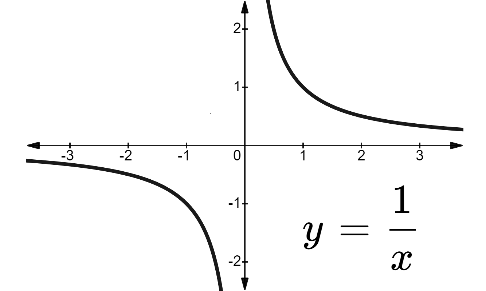
   &emsp;&ensp; 若$\small\displaystyle \lim_{x→x_0} f(x)=∞$ ，则这类间断点称为无穷间断点，如函数 $\small\displaystyle y=\frac{1}{x}$ 的点 $\small\displaystyle x=0$ 处为无穷间断点。

4. **震荡间断点**
   &emsp;&ensp; 若 $\small\displaystyle \lim_{x→x_0^-} f(x)$ 振荡不存在（处于振荡状态，极限不存在），则这类间断点称为 振荡间断点。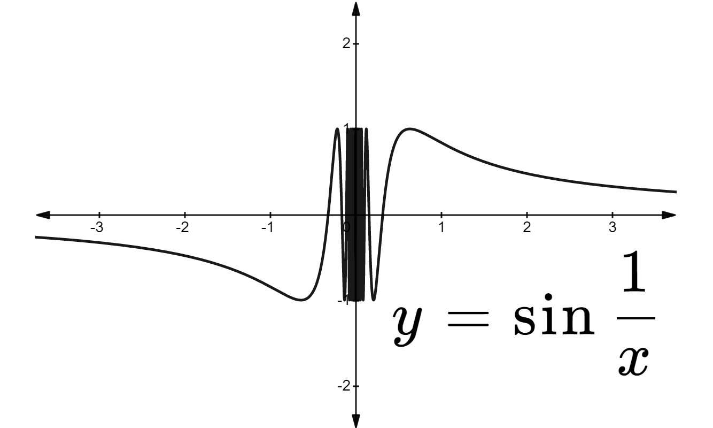
   &emsp;&ensp; 如函数 $\small\displaystyle y=\sin \frac{1}{x}$ 在点 $\small\displaystyle x=0$ 处没有定义，且当 $\small\displaystyle x→0$ 时，函数值在 -1 与 1 之间交替振荡取值，极限不存在，故点 $\small\displaystyle x=0$ 为函数 $\small\displaystyle y=\sin \frac{1}{x}$ 的振荡间断点。

> 无穷间断点和振荡点都属于第二类间断点，除此之外，还有不属于上述定义的第二类间断点，此处不做讨论，用不上。

## 一元函数微分学的概念与计算

### 导数的定义

&emsp;&ensp; 设 $\small y=f(x)$ 定义在区间 $\small I$ 上，让自变量在 $\small x=x_0$ 处加一个增量 $\small\displaystyle Δx$（可正可负）, 其中 $\small\displaystyle x_0∈I~,~x_0+Δx∈I$ ，则可得函数的增量 $\small\displaystyle Δy=f(x_0+Δx)-f(x_0)$ 。若函数增量 $\small\displaystyle Δy$ 与自变增量 $\small\displaystyle Δx$ 的比值在 $\small\displaystyle Δx→0$ 时的极限存在，即 $\small\displaystyle \lim_{x→x_0^-} \frac{Δy}{Δx}$ 存在，则称函数 $\small y=f(x)$ 在点 $\small x_0$ 处**可导**，并称这个极限为 $\small y=f(x)$ 在点 $\small x_0$ 处的导数，记作 $\small f'(x)$ ，即 $$\small f'(x)=\lim_{Δx→0} \frac{Δy}{Δx} = \lim_{Δx→0} \frac{f(x_0+Δx)-f(x_0)}{Δx}$$

> $\small -f'(x)=\lim_{Δx→0} \frac{Δy}{Δx} = \lim_{Δx→0} \frac{f(x_0-Δx)-f(x_0)}{Δx}$

#### 导数的几何意义

&emsp;&ensp; $\small y=f(x)$ 在点 $\small x_0$ 处的导数 $\small f'(x_0)$ 就是曲线 $\small y=f(x)$ 在点 $\small\displaystyle (x_0,y_0)$ 处切线的斜率 $\small\displaystyle k$ ，即 $\small\displaystyle k=f'(x_0)$ ，于是曲线 $\small y=f(x)$ 在点 $\small\displaystyle (x_0,y_0)$ 处的切线方程为 $\small\displaystyle y-y_0=f'(x_0)(x-x_0)$ ，法线方程为 $\small\displaystyle y-y_0=-\frac{1}{f'(x_0)}(x-x_0)$ $\small\displaystyle (f'(x_0)\neq 0)$ 。

> &emsp;&ensp; 一个函数在某一点的导数描述了这个函数在这一点附近的变化率。函数在某一点的导数就是该函数所代表的曲线在这一点上的切线斜率。导数的本质是通过极限的概念对函数进行局部的线性逼近。例如在运动学中，物体的位移对于时间的导数就是物体的瞬时速度。
>
> &emsp;&ensp; 所以也可以这样理解 : 在物理学中计算平均加速度的话，就是 [ (末速度 - 初速度) ÷ 时间 ]，即 $\small\displaystyle \frac{f(x_0+Δx)-f(x_0)}{Δx}$ ，当 时间趋近于 0 时，这个结果就是瞬间加速度，记为 $\small f'(x)$ ，即 $\small\displaystyle \lim_{Δx→0} \frac{f(x_0+Δx)-f(x_0)}{Δx}=f'(x)$ ，这个值就是斜率。

&emsp;&ensp; 若函数在 $\small x_0$ 上**连续**，则 $\small\displaystyle f(x_0) = \lim_{x→x_0} f(x)$

#### 单侧导数

&emsp;&ensp; 导数与极限一样，也有左右之分，即
$$\small \lim_{Δx→0^-} \frac{f(x_0+Δx)-f(x_0)}{Δx} ~记作~ f'_-(x_0)$$ $$\small \lim_{Δx→0^+} \frac{f(x_0+Δx)-f(x_0)}{Δx} ~记作~ f'_+(x_0)$$ &emsp;&ensp; 上述的 $\small\displaystyle f'_-(x_0),f'_+(x_0)$ 分别是 $\small f(x)$ 在点 $\small x_0$ 处的左导数、右导数，统称为**单侧导数**。
&emsp;&ensp; 与极限同样，左右导数都存在也是 $\small f'(x_0)$ 的 **充分必要条件**。

#### 不可导图形

1. **无穷导数**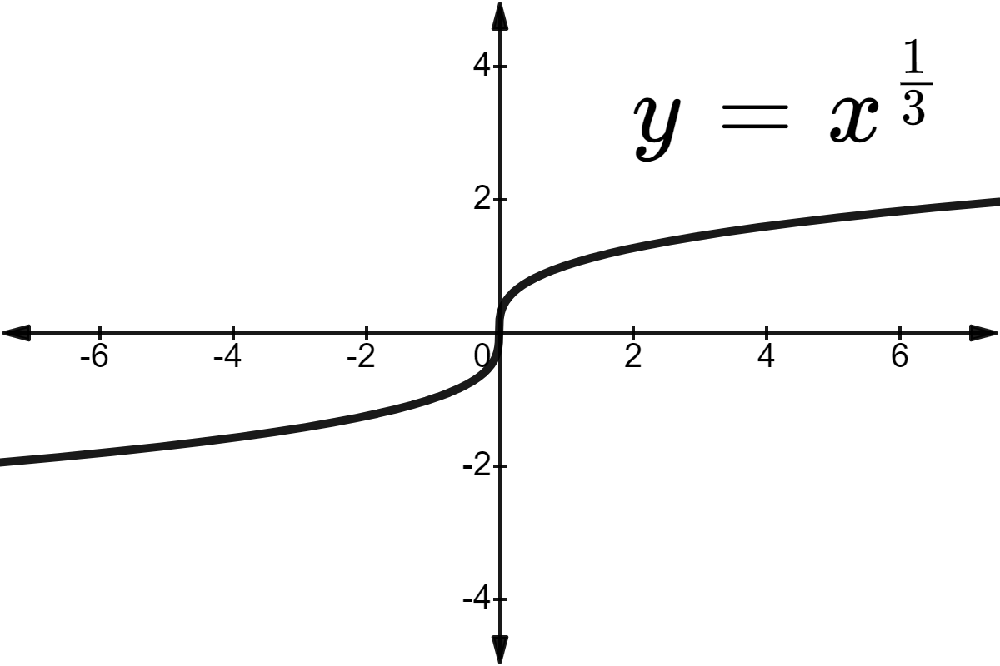
   &emsp;&ensp; 如 $\small y=x^{\scriptsize \frac{1}{3}}$ 的函数，当 $\small\displaystyle x=0$ 时， $\small\displaystyle f'_-(x_0)= +∞~,~f'_+(x_0)=-∞$ ，左右导数相等，但是当导数为 $\small\displaystyle ∞$ 时，这个导数被称为**无穷导数**，在高等数学中认为**无穷导数**不可导。

#### 导数常用定理

1. 函数的奇偶性与其导数互异。
2. 函数 $\small f(x)$ 是可导的周期为 $\small\displaystyle T$ 的周期函数，则 $\small f'(x)$ 也是以 $\small\displaystyle T$ 为周期的周期函数 （$\small\displaystyle T$ 不一定是最小正周期）
3. 若 $\small\displaystyle \lim_{x→x_0}f(x)=\frac{a}{b}$ 存在，则：分子 = $\small\displaystyle \frac{a}{b}·b =$（$\small\displaystyle \frac{a}{b}$ 的值 $\small\displaystyle × b$ 的值）。
4. 若 $\small f(x)$ 在 $\small x=x_0$ 处连续，且 $\small\displaystyle \lim_{x→x_0}\frac{f(x)}{x-x_0}=A$ 存在，则 $\small\displaystyle f(x_0)=0$ 且 $\small\displaystyle f'(x_0)=A$ 。
   > 两边同时对 $\small x$ 求导，得 $\small \frac{f'(x)·x'}{1-0} = 0$ ，所以 $\small f'(x) = 0$

#### 高阶导数的概念

$$\small f^{(n)}(x_0)= \lim_{Δx→0}\frac{f^{(n-1)}(x_0+Δx)-f^{(n-1)}(x_0 )}{Δx}$$
&emsp;&ensp; 其中 $\small\displaystyle n \geq 2$ 且为整数，且 $\small\displaystyle f ^{(n-1)}(x)$ 在 $\small x_0$ 的某领域内有定义，$\small\displaystyle x_0+Δx$ 也在该领域内。

> $\small\displaystyle f^n(x)$ 就是 $\small f(x)$ 的 $\small n$ 次导数，过去常用的 $\small f'(x)$ 就是 $\small\displaystyle n=1$ 次的导数。
> 若 $\small\displaystyle n=2$ ，就是对 $\small f(x)$ 的导数 $\small f'(x)$ 再次求导，即 $\small f''(x)$ 。
> 以此类推，$\small n$ 等于几，就是对 $\small f(x)$ 的几次求导，后面的 $\small\displaystyle f^{(n-1)}$ 就是对 $\small f(x)$ 的 $\small\displaystyle n-1$ 次求导。

### 微分的概念

&emsp;&ensp; 一个边长为 $\small x$ 的正方形，其边长增加 $\small\displaystyle Δx$ ，那么其增加的面积就是 $$\small ΔS=(x+Δx)^2-x^2=2xΔx+Δx^2$$ 其中，$\small\displaystyle ΔS$ 我们将其叫做 **增量**。

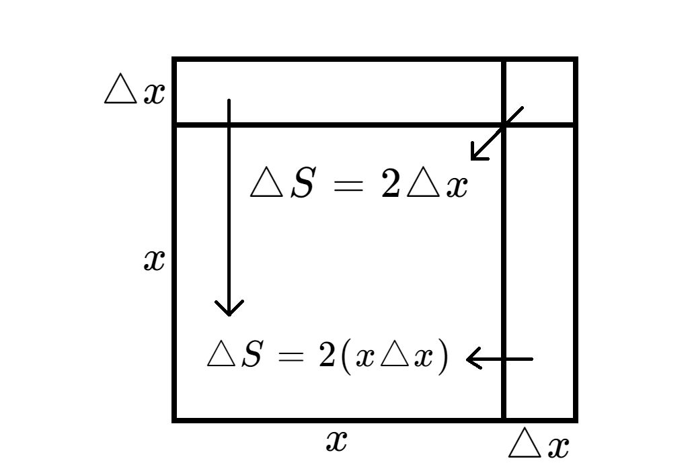

&emsp;&ensp; 在 $\small\displaystyle ΔS=(x+Δx)^2-x^2=2xΔx+Δx^2$ 中，我们会发现 $\small\displaystyle (Δx)^2$ 远小于 $\small\displaystyle 2xΔx$ ，当 $\small\displaystyle Δx$ 趋向于无穷小时，$\small (Δx)^2$ 相较于 $\small\displaystyle 2xΔx$（图中更长的那个两个矩形的面积）就可以忽略，即 $\small\displaystyle \lim_{Δx→0}=\frac{(Δx)^2}{Δx}=0$ ，即$(Δx)^2=o(Δx)~,~o(Δx)$ 为高阶无穷小，是误差，一般情况下可以忽略。
&emsp;&ensp; 所以当 $\small\displaystyle Δx$ 足够小时，有 $\small\displaystyle ΔS\approx 2xΔx$。

&emsp;&ensp; 当我们将上述概念代入函数中后，就存在增量 $\small\displaystyle Δy=f(x_0+Δx)-f(x_0)=AΔx+o(Δx)(Δx→0)$ **其中：**$Δy$ 叫做增量、$AΔx$ 叫做线性主部、$o(Δx)$ 是误差 。
&emsp;&ensp; 我们把 **线性主部** 定义为 $\small\displaystyle {\rm d}y$ ($y$ 的微分) ，整体公式为： $$\small \left. {\rm d}y \right|_{x=x_0} = AΔx = y'(x_0)·Δx = y'(x_0)·{\rm d}x$$

> &emsp;&ensp; 在微积分学中，通常把自变量 $\small x$ 的增量 $\small\displaystyle Δx$ 称做自变量的微分，记作$\small\displaystyle {\rm d}x,{\rm d}x=Δx$ 。
> &emsp;&ensp; 由此我们可以衍生得出，$\small\displaystyle {\rm d}x=x'$ ，在计算中 $\small\displaystyle \left. {\rm d}y \right|_{x=x_0}=y'(x_0)·{\rm d}x=y'(x_0)·x_0'$ ，由于 $\small x$ 通常等于 $\small x$ ，而 $\small\displaystyle x'=1$ ，所以经常被省略，但是在 $\small\displaystyle x=g(x)$ 时，$\small\displaystyle f(x)'=f'[g(x)]·g'(x)$ 。
> &emsp;&ensp; **注意：** $\small\displaystyle '$ 出现在函数最后面时，如 $\small\displaystyle f[g(x)]'$ ，意味求函数最小的自变量的微分，也就是求 $\small\displaystyle g(x)$ 中的 $\small x$ 的微分，出现在函数符号后面，如 $\small\displaystyle f'[g(x)]$ ，意味着求函数中的自变量的微分，也就是求 $\small\displaystyle f[g(x)]$ 中的 $\small\displaystyle g(x)$ 的微分。

### 不同函数的导数

#### 反函数的导数

设 $\small y=f(x)$ 可导，且 $\small\displaystyle f'(x)\neq 0$ ，则存在反函数 $\small\displaystyle x=φ(y)$ ，且 $$\small \frac{{\rm d}x}{{\rm d}y}=\frac{1}{\frac{{\rm d}y}{{\rm d}x}}~,~即~φ'(y)=\frac{1}{f'(x)}$$

#### 分段函数导数

设 $\small\displaystyle f(x)=\begin{cases} \small\displaystyle f_1(x), x\geq x_0 \\ \small\displaystyle f_2(x),x<0 \end{cases}$ ，则：

1. 在分段点时，用导数定义: $\small\displaystyle f'_+(x_0)=  \lim_{x→x^+}\frac{f_1(x)-f(x_0)}{x-x_0}~,~f'_-(x_0)= \lim_{x→x^-}\frac{f_2(x)-f(x_0)}{x-x_0}$ ，根据$f'_+(x_0)$ 是否等于 $\small\displaystyle f'_-(x_0)$ 来判定 $\small f'(x_0)$ ( 左右导数相等，函数可导 )。
2. 在非分段点，用导数公式求导，即 $\begin{cases} \small\displaystyle x>x_0,f'(x)=f'_1(x) \\ \small\displaystyle x<x_0,f'(x)=f'_2(x)\end{cases}$ 。

#### 复合函数的导数与微分形式不变性

设 $\small\displaystyle u=g(x)$ 在点 $\small x$（$x$ 没有下标是泛指点，即可以为任何函数上的任意个点，下同）处可导，$\small y=f(u)$ 在点 $\small\displaystyle u=g(x)$ 处可导,则 $$\small \lbrace f[g(x)]\rbrace '= f'[g(x)]·g'(x) = f'[g(x)]·g'(x)$$ $$\small {\rm d} \lbrace f[g(x)] \rbrace = f'[g(x)]·g'(x){\rm d}x = f'[g(x)]·{\rm d}g(x) $$ $$\small \lbrace f[g(h(x))]\rbrace '=f'[g(h(x))]·g'(h(x))·h'(x)$$
&emsp;&ensp; 对于 $\small\displaystyle {\rm d}f(x)$ 的运算可以这样看，$\small \begin{cases} \small\displaystyle{\rm d}f(x)=f'(x){\rm d}x \\ \small\displaystyle{\rm d}f(u)=f'(u){\rm d}u \\ \small\displaystyle {\rm d}f(狗)=f'(狗){\rm d}(狗)\end{cases}$

> 再次强调，$\small \lbrace f[g(x)]\rbrace '$ 是对 $\small x$ 求导 ；$f'[g(x)]$ 是对 $\small\displaystyle g(x)$ 求导，所以要注意求导符号的位置。

#### 反函数，参数方程求导

&emsp;&ensp; 若 $\small f'(x)$ 存在且不等于 $\small 0$ ，则函数 $\small f(x)$ 必定严格单调（可逆推）。
&emsp;&ensp; 若函数 $\small y=f(x)$ 的反函数为 $\small\displaystyle x=φ(y)$ ，则 $\small\displaystyle φ'(y)=\frac{1}{f'(x)}$ ，即反函数的导数等于其原函数的导数分之一，这一点在反三角函数求导中尤为重要。
&emsp;&ensp; $\small\displaystyle \frac{{\rm d}\frac{{\rm d}y}{{\rm d}x}}{{\rm d}x}=\frac{{\rm d}^2y}{{\rm d}x^2}$ 其中 $\small\displaystyle {\rm d}x·{\rm d}x=({\rm d}x)^2={\rm d}x^2$ ，此处 2 叫做微分的幂，$\small\displaystyle 2x·{\rm d}x={\rm d}(x^2)$ 此处的 2 叫做幂的微分。

&emsp;&ensp; $\small\displaystyle f''(x)=-\frac{φ''(x)}{[φ'(x)]^3}$ 。

#### 参数方程所确定的函数的导数

&emsp;&ensp; 设函数 $\small y=f(x)$ 由参数方程 $\begin{cases} \small\displaystyle x=φ(t) \\ \small\displaystyle y=ψ(t) \end{cases}$ 确定，其中 $\small\displaystyle t$ 是参数，且 $\small\displaystyle φ(t),ψ(t)$ 均对 $\small\displaystyle t$ 可导，$\small ψ'(t) \neq 0$ ，则： $$\small \frac{{\rm d}y}{{\rm d}x}=\frac{\frac{{\rm d}y}{{\rm d}t}}{\frac{{\rm d}x}{{\rm d}t}}=\frac{ψ'(t)}{φ'(t)}=u(t) ~~~~~~~~~~~~ \small \frac{{\rm d}^2y}{{\rm d}x^2}=\frac{\frac{{\rm d}(\frac{{\rm d}y}{{\rm d}x})}{{\rm d}t}}{\frac{{\rm d}x}{{\rm d}t}}=\frac{\frac{{\rm d}u}{{\rm d}t}}{\frac{{\rm d}x}{{\rm d}t}}=\frac{u'(t)}{x'(t)}$$

> &emsp;&ensp; $\small\displaystyle \frac{{\rm d}y}{{\rm d}x}$ 是 $\small\displaystyle y$ 对 $\small x$ 求导，及求 $\small\displaystyle y=y(x),x=f(x)$ 中的 $\small f(x)$ 中的 $\small x$ 的导数，及得出一个直接指向 $\small f(x)$ 中的 $\small x$ 的导数方程，即 $\small\displaystyle y =[y(g(x))]'$
> &emsp;&ensp; $\small\displaystyle \frac{{\rm d}^2y}{{\rm d}x^2}$ 即 $\small\displaystyle y$ 对 $\small x$ 的二次求导，即 $\small\displaystyle y =[y(g(x))]''$
> &emsp;&ensp; **注意：** $\small\displaystyle '$ 在最后是对公式中最低位变量求导。

#### 隐函数求导法

设函数 $\small\displaystyle y=y(x)$ 是由方程 $\small\displaystyle F(x,y)=0$ 确定的可导函数，则：

1. 方程 $\small\displaystyle F(x,y)=0$ 两边对自变量 $\small x$ 求导，注意 $\small\displaystyle y=y(x)$ ，即将 $\small\displaystyle y$ 看作中间变量（即 $\small\displaystyle y$ 不是一个常数而是 $\small\displaystyle y(x)$ ），得到一个关于 $\small\displaystyle y'$ 的方程。
2. 解出该方程即可求出 $\small\displaystyle y'$ 。

> $\small\displaystyle y=y(x)$ 很难理解？那就 $\small y=f(x)$ 。

#### 对数求导法

&emsp;&ensp; 对于多项相乘、相除、开方、乘方的式子，一般先取对数再求导。设 $\small y=f(x)$ $\small\displaystyle (f(x)>0)$ ，求 $\small\displaystyle y'$ ，则：

1. 等式两边取对数，得 $\small\displaystyle \ln y=\ln f(x)$ 。（$\small\displaystyle \ln y=1=\frac{1}{y}·y$）
2. 两边对自变量 $\small x$ 求导（ 同样注意 $\small y=f(x)$ ，即将 $\small\displaystyle y$ 看作中间变量 ），得 $$\small \frac{1}{y}y'=[\ln f(x)]' ⇒ y'=y[\ln f(x)]'$$

#### 幂指函数求导 |||

&emsp;&ensp; 对于 $\small\displaystyle u(x)^{v(x)}$ $\small\displaystyle (u(x)>0,u(x)\neq1)$ ，除了用上面的对数求导法外，还可以先化成指数函数 $\small\displaystyle u(x)^{v(x)}=e^{v(x)\ln u(x)}$ ，然后求导：$$\small [u(x)^{v(x)}]=[e^{v(x)\ln u(x)}]'=u(x)^{v(x)}[v'(x)\ln u(x)+v(x)·\frac{u'(x)}{u(x)}]$$

#### 高阶导数

高阶导数就是 $\small\displaystyle f^{(n)} (x)，n>1$ 的导数，即 $\small\displaystyle f''(x),f'''(x),f^{'…'}(x)$ 。

高阶导数主要有三种方法：

1. **归纳法**
   逐次求导，探索规律，得出通式
   如，$\small\displaystyle y=2^x$ ，则： $$\small y'=2^x\ln2,y''=2^x(\ln 2)^2,……$$ 得出通式：$\small\displaystyle y^{(n)}=2xln(2)^n,n=0,1,2,…$ 。

2. **用高阶求导公式**
   设 $\small\displaystyle u=u(x)~,~v=v(x)$ ，均 $\small n$ 阶可导，则 
$[u\pm v]^{(n)}=u^{(n)}\pm v^{(n)}$   $\small (uv)^{(n)}=u^{(n)}v+C^1_nu^{n-1}v'+C^2_nu^{(n-2)}v''+……+C^k_nu^{(n-k)}v^{(k)}+……+C^{n-1}_nu'v^{(n-1)}+uv^{(n)}= \sum^{n}_{k=0}{C^k_nu^{(n-k)}v^{(k)}}$

3. **泰勒公式代入定式**
   先写出 $\small y=f(x)$ 的泰勒公式或者麦克劳林公式，再通过比较系数来获得 $\small\displaystyle f^{(n)}(x_0)$ 。
   1. 任何一个无穷阶可导函数（收敛情况下）都可以写成 $$\small y=f(x)= \sum^{∞}_{n=0} \frac{f^{(n)}(x_0)}{n!}(x-x_0)^n$$ $$\small 或者~~~~~~~~y=f(x)= \sum^{∞}_{n=0} \frac{f^{(n)}(0)}{n!}x^n$$
   2. 题目给出一个具体的无穷阶可导函数 $\small y=f(x)$ ，可以通过已知的泰勒公式展开成幂级数。
   3. 根据函数展开式的唯一性，比较 $\small\displaystyle 1,2$ 中公式的系数，就可以获得 $\small\displaystyle f^{(n)}(x_0)$ 或者 $\small\displaystyle f^{(n)}0$ 。

### 基本求导公式

$$\small\begin{aligned}
 &(x^a)'=ax^{a-1}(a为常数 )  &&(a^x)'= a^x\ln a(a>0,a\neq 1)  &&(e^x)'=e^{kx}·(kx)'
\\ &(\log_a x)'=\frac{x'}{x\ln a}  &&(\ln x)'=\frac{x'}{x}  &&(\sin x)'=\cos x
\\ &(\cos x)'=-\sin x  &&(\arcsin x)'=\frac{x'}{\sqrt{1-x^2}}  &&(\arccos x)'=-\frac{x'}{\sqrt{1-x^2}}
\\ &(\tan x)'=\sec^2x  &&(\cot x)'=-\csc^2x  &&(\arctan x)'=\frac{x'}{1+x^2}
\\ &({\rm arccot}~x)'=-\frac{x'}{1+x^2}  &&(\sec x)'=\sec x\tan x  &&(\csc x)'=-\csc x\cot x
\\ &[\ln (x+\sqrt{x^2+1})]'=\frac{x'}{\sqrt{x^2+1}}  &&[\ln (x+\sqrt{x^2-1})]'=\frac{x'}{x^2-1}  &&\left(\frac{n}{ax^k} \right)'=-\frac{n(ax^k)'}{(ax^k)^2}
\\ &(|x|)' = \frac{x}{|x|}
\end{aligned}$$

> 当 $\small x=x$ 时，$\small x'=1$ ，当 $\small x=\sin x$ 时，$\small x'=\sin x'=\cos x$

#### 导数的四则运算法则

$\small [f(x) \pm g(x)]'=f'(x) \pm g'(x) ~~~~~~~~~~~~ [f(x)·g(x)]'=f'(x)g(x)+f(x)g'(x)$
$\small \left[ {\large\frac{g(x)}{f(x)}} \right]' = {\large\frac{g'(x)f(x)-g(x)f'(x)}{[f(x)]^2}} ~~~~~~~~~~~~ f(kx)'=kf(x)'~,~k$ 为常数。

## 一元微分的几何学概念

### 极值与最值的概念

&emsp;&ensp; **定义 $1~~$** 若存在 $\small x_0$ 的某个邻域，使得在该邻域内任意一点 $\small x$ ，均有 $$\small f(x)\leq f(x_0)(或f(x)\geq f(x_0))$$ 成立，则称 $\small x_0$ 为 $\small f(x)$ 的广义的极大值点（或极小值点），$\small f(x_0)$ 为 $\small f(x)$ 的广义的极大值（或极小值）。
&emsp;&ensp; **定义 $2~~$** 若存在 $\small x_0$ 的某个去中心邻域，使得对于该邻域内任一异于 $\small x_0$ 的点 $\small x$ ，均有 $$\small f(x)<f(x_0)(或 f(x)>f(x_0))$$ 成立，则称 $\small x_0$ 为 $\small f(x)$ 的**真正极大值点（或极小值点）**，$\small f(x_0)$ 为 $\small f(x)$ 的**真正的极大值（或极小值）**。

> &emsp;&ensp; 常函数只有一个值，用 定义 2 的话，常函数就没有最大最小值了，所以考研中若无特殊说明，默认使用 定义 1。
> &emsp;&ensp; 极值点只需要点邻域内没有比它还大的点就行了，即$\small\displaystyle \lim_{x→x_0^-}$ 与 $\small\displaystyle \lim_{x→x_0^+}$ 都存在定义，且 $\small\displaystyle f(x)<f(x_0)$ （或 $\small\displaystyle f(x)>f(x_0)$ ） ，则该点为函数的极大（或极小）点。若函数满足这个条件的点有多个，取最大/最小的值为极大/极小值。
> &emsp;&ensp; 进行导数计算时得出来的就是指定区间上的极大/极小值。

&emsp;&ensp; **定义 $3~~$** 设 $\small x_0$ 为 $\small f(x)$ 定义域内一点，若对于 $\small f(x)$ 的定义域内任意一点 $\small x$ ，均有 $$\small f(x)\leq f(x_0)(或f(x)\geq f(x_0))$$ 成立，则称 $\small x_0$ 为 $\small f(x)$ 的广义的最大值（或最小值）。

&emsp;&ensp; **定义 $4~~$** 设 $\small x_0$ 为 $\small f(x)$ 定义域内一点，若对于 $\small f(x)$ 的定义域内任意一异于 $\small x_0$ 的点 $\small x$ ，均有 $$\small f(x)<f(x_0)(或f(x)>f(x_0))$$ 成立，则称 $\small x_0$ 为 $\small f(x)$ 的广义的最大值（或最小值）。

> &emsp;&ensp; 最值与极值的区别在于，最值只要求在函数的某个点，极值需要该点有左右邻域，也就是说极值需要双侧有定义。
> &emsp;&ensp; 间断点都可以是极值点，间断点满足左右有定义的性质。

### 单调性与极值的判别

的公共定义域上的公共定义域上

1. **单调性的判别**
   &emsp;&ensp; 若 $\small y=f(x)$ 在区间 $\small I$ 上有 $\small f'(x)>0$ ，则 $\small y=f(x)$ 在 $\small I$ 上严格单调增加；相应地，若 $\small y=f(x)$ 在区间 $\small I$ 上有 $\small f'(x)<0$ ，则 $\small y=f(x)$ 在 $\small I$ 上严格单调减少。

2. **一阶可导点是极值点的必要条件**
   设 $\small f(x)$ 在 $\small x=x_0$ 处可导，且在点 $\small x_0$ 处取得极值，则必有 $\small f'(x_0)=0$ 。

3. **判别极值的第一充分条件**
   设 $\small f(x)$ 在 $\small x=x_0$ 处连续，且在 $\small x_0$ 的某去心邻域 $\small U(x_0,δ)$ 内可导 则：

   1. 若 $\small x∈(x_0-δ,x_0)$ 时，$\small f'(x)<0$ ，而 $\small x∈(x_0,x_0+δ)$ 时，$\small f'(x)>0$ ，则 $\small f(x)$ 在 $\small x=x_0$ 处取得**极小值**。（即在 $\small x_0$ 左边单调递减，右边单调递增时，在该点取得 **极小值**）
   2. 若 $\small x∈(x_0-δ,x_0)$ 时，$\small f'(x)>0$ ，而 $\small x∈(x_0,x_0+δ)$ 时，$\small f'(x)<0$ ，则 $\small f(x)$ 在 $\small x=x_0$ 处取得**极大值**。（即在 $\small x_0$ 左边单调递增，右边单调递减时，在该点取得 **极大值**）
   3. 若 $\small f'(x_0)$ 在 $\small (x_0-δ,x_0)$ 和 $\small (x_0,x_0+δ)$ 内不变号，则点 $\small x_0$ 不是极值点。
      > 注意，此处的 $\small (x_0-δ,x_0)$ 和 $\small (x_0,x_0+δ)$ 是区间的意思，不是坐标，即 $\small x_0-δ<x<x_0$ 和 $\small x_0<x<x_0+δ$ 。

4. **判别极值的第二充分条件**
   设 $\small f(x)$ 在 $\small x=x_0$ 处二阶可导，且 $\small f'(x_0)=0 ~,~ f''(x_0) \neq 0$ ，则

   1. 若 $\small f''(x_0)<0$ ，则 $\small f(x)$ 在 $\small x_0$ 处取得**极大值**
   2. 若 $\small f''(x_0)>0$ ，则 $\small f(x)$ 在 $\small x_0$ 处取得**极小值**
      上述第二充分条件可以推广为第三充分条件。
      > 证明
      > $\small\displaystyle f''(x_0)= \lim_{x→x_0}\frac{f'(x)-f'(x_0)}{x-x_0}= \lim_{x→x_0}\frac{f'(x)}{x-x_0}$
      >
      > 1. 若 $\small f''(x)<0$ ，则 $\small f'(x)>0,x<0$ 或 $\small f'(x)<0,x>0$ ，左增右减，极大值条件。
      > 2. 若 $\small f''(x)>0$ ，则 $\small f'(x)>0,x>0$ 或 $\small f'(x)<0,x<0$ ，左减右增，极小值条件。

5. **判别极值的第三充分条件**
   设 $\small f(x)$ 在 $\small x_0$ 处 $\small n$ 阶可导，且 $\small f^{(m)}(x_0)=0(m=1,2,…,n-1),f^{(n)}(x_0) \neq 0(n \geq 2)$ ，则
   1. 当 $\small n$ 为偶数时，$\small x_0$ 必为极值点。
   2. 当 $\small n$ 为偶数且 $\small f^{(n)}(x_0)<0$ 时，$\small f(x)$ 在 $\small x_0$ 处取得**极大值**。
   3. 当 $\small n$ 为偶数且 $\small f^{(n)}(x_0)>0$ 时，$\small f(x)$ 在 $\small x_0$ 处取得**极大值**。

### 凹凸性与拐点的概念与判别

#### 凹凸性与拐点的概念

1. **凹凸性的定义**
   &emsp;&ensp; 设函数 $\small f(x)$ 在区间 $\small I$ 上连续，如果对 $\small I$ 上任意 $\small x_1,x_2$ 两点，恒有 $$\small f(\frac{x_1+x_2}{2})<\frac{f(x_1)+f(x_2)}{2}$$ 则称 $\small y=f(x)$ 在 $\small I$ 上的图形是凹的（或凹弧），如图 （a）所示 ；如果恒有 $$\small f(\frac{x_1+x_2}{2})>\frac{f(x_1)+f(x_2)}{2}$$ ，则称 $\small f(x)$ 在 $\small I$ 上的图形是凸的（或凸弧），如图 （b）所示。
      
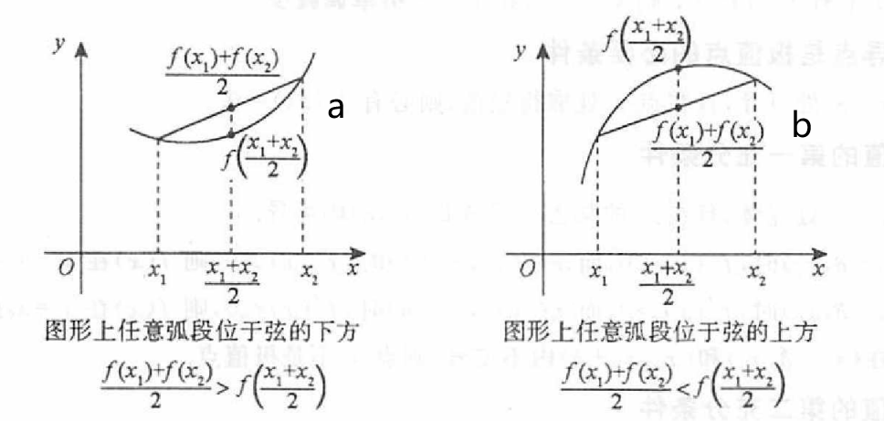

2. **拐点定义**
   连续曲线的凹弧与凸弧的分界点称为该曲线的拐点。

   > 拐点只用满足连续，不需要可导。
   > 拐点是曲线上的点，写作 $\small (x_0,f(x_0))$ ，极值点写作 $\small x_0$ 。

#### 凹凸性与拐点的判别

1. **判别凹凸性**
   设函数 $\small f(x)$ 在 $\small I$ 上二阶可导：

   1. 若在 $\small I$ 上 $\small f''(x)>0$ ，则 $\small f(x)$ 在 $\small I$ 上的图形是凹的。
   2. 若在 $\small I$ 上 $\small f''(x)<0$ ，则 $\small f(x)$ 在 $\small I$ 上的图形是凸的。

2. **二阶可导点是拐点的必要条件**
   &emsp;&ensp; 设 $\small f''(x_0)$ 存在，且点 $\small (x_0,f(x_0))$ 为曲线上的拐点，则 $\small f''(x_0)=0$ 。

3. **判别拐点的第一充分条件**
   &emsp;&ensp; 设 $\small f(x)$ 在点 $\small x=x_0$ 处连续，在点 $\small x=x_0$ 的某去心邻域 $\small U(x_0,δ)$ 内二阶导数存在，且在该点的左，右领域内 $\small f''(x)$ 变号 (无论是由正变负，还是由负变正)，则点 $\small (x_0,f(x_0))$ 为曲线上的拐点。

   > $\small (x_0,f(x_0))$ 为曲线 $\small y=f(x)$ 上的拐点时，并不要求 $\small f(x)$ 在点 $\small x_0$ 的导数存在，如 $\small\displaystyle y=\sqrt[3] x$ 在 $\small x=0$ 的情形。

4. **判别拐点的第二充分条件**
   &emsp;&ensp; 设 $\small f(x)$ 在 $\small x=x_0$ 的某邻域内三阶可导，且 $\small f''(x_0)=0，f'''(x_0)\neq0$ ，则 $\small (x_0,f(x_0))$ 为拐点。

5. **判别拐点的第三充分条件**
   &emsp;&ensp; 设 $\small f(x)$ 在 $\small x_0$ 处 $\small n$ 阶可导，且 $\small f^{(m)}(x_0)=0(m=2,…,n-1)，f^{(n)}(x_0)\neq0(n\geq3)$ ，则当 $\small n$ 为奇数时，$\small (x_0,f(x_0))$ 为拐点。

#### 做函数图形

给出函数 $\small f(x)$ ，作图的一般步骤：

1. 确定函数 $\small f(x)$ 的定义域，并考察它是否有奇偶对称性。
2. 求出 $\small f'(x),f''(x)$ ，用 $\small f(x)$ 的无定义点，$\small f'(x)=0$ 的点，$\small f'(x)$ 不存在的点，$\small f''(x)=0$ 的点，$\small f''(x)$ 不存在的点，将定义域划分为若干个区间，确定函数图形在各个区间上的单调性与凹凸性，进而确定函数的极值点和拐点。
3. 确定渐近线（如果有的话）。
4. 作出函数图形。

#### 渐进线

1. **铅锤渐近线**
   若 $\small\displaystyle \lim_{x→x^+_0}f(x)=0$ （或 $\small\displaystyle \lim_{x→x^-_0}f(x)=0$），则 $\small x=x_0$ 为一条铅锤渐近线。

   > &emsp;&ensp; **注意** ： 此处的 $\small x_0$ 一般是函数的无定义点。
   > 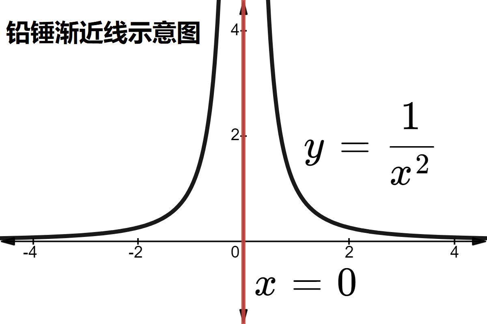 如图，$\small y=\frac{1}{x^2}~,~x_0=0$ 。

2. **水平渐近线**
   &emsp;&ensp; 若 $\small\displaystyle \lim_{x→+∞}f(x)=y_1$ 则 $\small y=y_1$ 为一条水平渐近线 ；若 $\small\displaystyle \lim_{x→-∞}f(x)=y_2$ 则 $\small y=y_2$ 为一条水平渐近线。
   &emsp;&ensp; 若 $\small\displaystyle \lim_{x→+∞}f(x)= \lim_{x→-∞}f(x)=y_0$ 则 $\small y=y_0$ 为一条水平渐近线。

   > 此处的 $\small\displaystyle y$ 代表常数。

3. **斜渐近线（考研知识）**

   &emsp;&ensp; 若 $\small\displaystyle \lim_{x→+∞}\frac{f(x)}{x}=k_1~,~ \lim_{x→+∞}[f(x)-k_1x]=b_1$ ，则 $\small y=k_1x+b$ 是曲线 $\small y=f(x)$ 的一条渐近线。
   &emsp;&ensp; 若 $\small\displaystyle \lim_{x→-∞}\frac{f(x)}{x}=k_2~,~ \lim_{x→-∞}[f(x)-k_2x]=b_2$ ，则 $\small y=k_2x+b$ 是曲线 $\small y=f(x)$ 的一条渐近线。
   &emsp;&ensp; 若 $\small\displaystyle \lim_{x→+∞}\frac{f(x)}{x} =  \lim_{x→-∞}\frac{f(x)}{x} = k ~,~ \lim_{x→+∞}[f(x)-kx]= \lim_{x→-∞}[f(x)-kx]=b$ ，则 $\small y=kx+b$ 是曲线 $\small y=f(x)$ 的一条渐近线。

   > &emsp;&ensp; 斜渐近线必须与 $\small x$ 的一次方同阶无穷大，从图像上来看，就是图像的斜率与 $\small y=f(x)$ 比，不能高也不能太低。

##### 渐近线计算方法

&emsp;&ensp; 1. 首先看函数是否满足 $\small\displaystyle \lim_{x→x^+_0/x^-_0}f(x)=0$ ，若满足则直接判断为铅锤渐近线。
&emsp;&ensp; 2. 判断是否满足 $\small\displaystyle \lim_{x→+∞/-∞/∞}f(x)=常数$ ，若满足则判断水平渐近线。
&emsp;&ensp; 3. 若非水平渐近线，则看是否满足 $\small\displaystyle \lim_{x→+∞/-∞/∞}f(x)=K（k为常数）$ 若满足则看 $\small\displaystyle b= \lim_{x→+∞}[f(x)-kx]$ 是否存在，若存在则为斜渐近线。

> 在公式中一直在强调 $\small x→+∞/-∞/∞$ 是为了说明渐近线不只是一条，在 $\small x→+∞$ 时可能会有，$\small x→-∞$ 时也可能会有，$\small x_0$ 时也可能会有。
> 水平渐近线与斜渐近线在单方向上是唯一的，即 $\small x→-∞$ 或 $\small x→+∞$ 时只会有其中的一种渐近线，不可能存在两种，但铅锤可能与水平/斜渐近线共存。

#### 最值或取值范围

1. **求闭区间 $\small [a,b]$ 上连续函数 $\small f(x)$ 的最大值 $\small M$ 和最小值 $\small m$ 。**

   1. 求出 $\small f(x)$ 在 $\small (a,b)$ 内的可疑点 —— 驻点与不可导点，并求出这些可疑点处的函数值。
   2. 求出端点的函数值 $\small f(a)$ 和 $\small f(b)$ 。
   3. 比较以上所求得的所有函数值，其中最大者为 $\small f(x)$ 在 $\small [a,b]$ 上的最大值 $\small M$ ，最小者为 $\small f(x)$ 在 $\small [a,b]$ 上的最小值 $\small m$ 。

   > &emsp;&ensp; 有时这类问题也可以命名为 “求连续函数 $\small f(x)$ 在闭区间 $\small [a,b]$ 上的值域 $\small [m,M]$”。

2. **求开区间 $\small (a,b)$ 内连续函数 $\small f(x)$ 的最值或者取值范围**
   1. 求出 $\small f(x)$ 在 $\small (a,b)$ 内的可疑点 —— 驻点与不可导点，并求出这些可疑点处的函数值。
   2. 求 $\small (a,b)$ 两端的单侧极限 ；若 $\small a,b$ 为有限常数，则求 $\small\displaystyle \lim_{x→a^+}与 \lim_{x→a^-}$ ；若 $\small a$ 为 $\small -∞$ 则求 $\small\displaystyle \lim_{x→-∞}f(x)$ ；若 $\small b$ 为 $\small +∞$ ，则求 $\small\displaystyle \lim_{x→+∞}f(x)$ 。记以上所求左端极限为 $\small A$ ，右端极限为 $\small B$ 。
   3. 比较**可疑点**与**单侧极限**的结果，确定最值或取值范围。

#### 函数图形

给出函数 $\small f(x)$ ，作图的一般步骤：

1. 确认函数 $\small f(x)$ 的定义域，并考察它是否有奇偶对称性。
2. 求出 $\small f'(x),f''(x)$ ，用 $\small f(x)$ 的无定义点，$\small f'(x)$ 的不存在点，$\small f''(x)=0$ 的点，$\small f''(x)$ 不存在的点，将定义域划分成若干子区间，确定函数图形在各个子区间上的单调性与凹凸性，进而确定函数的极值点和拐点。

## 中值定理（十大定理及其应用）

### 有关函数的定理

设 $\small f(x)$ 在 $\small [a,b]$ 上连续，则 ：

1. **有界与最值定理**
   &emsp;&ensp; $\small m≤f(x)≤M$ ，其中 $\small m,M$ 分别为 $\small f(x)$ 在 $\small [a,b]$ 上的最小值与最大值。

2. **介值定理**
   &emsp;&ensp; 当 $\small m≤μ≤M$ 时，存在 $\small ξ∈[a,b]$ ，使得 $\small f(ξ)=μ$ 。

   > &emsp;&ensp; 导数介质定理：设 $\small f(x)$ 在 $\small [a,b]$ 上可导，若 $\small f'_+(a)\neq f'_-(b)$ ，则对于任意介于 $\small f'_+(a)$ 和 $\small f'_-(b)$ 之间的 $\small μ$ ，存在 $\small ξ∈(a,b)$ ，使得 $\small f'(ξ)=μ$ 。
   > 导数介质定理可以推出导数零点定理。

3. **平均值定理** （离散的平均值定理）
   &emsp;&ensp; 当 $\small a<x_1<x_2<…<x_n<b$ 时，在 $\small [x_1,x_n]$ 内至少存在一点 $\small ξ$ ，使 $$\small f(ξ)=\frac{f(x_1)+f(x_2)+…+f(x_n)}{n}$$

4. **零点定理**
   &emsp;&ensp; 设 $\small f(x)$ 在 $\small [a,b]$ 上可导，当 $\small f(a)·f(b)<0$ 时，存在 $\small ξ∈(a,b)$ ，使得 $\small f(ξ)=0$ 。
   > &emsp;&ensp; **证：** $\small f(a)·f(b)<0$ ，则存在 $\small f(a)<0,f(b)>0$ 或 $\small f(a)>0,f(b)<0$ ，一小一大之间必有 $\small 0$ 。

### 有关导数的定理

1. **费马定理**
   &emsp;&ensp; 设 $\small f(x)$ 满足在 $\small x_0$ 点处 $\small\begin{cases}  1.可导 \\  2. 取极值 \end{cases}$ 则 $\small f'(x_0)= 0$ 。

   > &emsp;&ensp; 假设 $\small f(x)$ 在点 $\small x_0$ 处取得极大值，则存在 $\small x_0$ 的邻域 $\small U(x_0)$ ，对于任意 $\small x∈U(x_0)$ ，都有 $\small △f=f(x)-f(x_0)\leq 0$ ，于是根据导数的定义与极限的保号性，有 $$\small\displaystyle f'_-(x_0)=\lim_{x→x_0}\frac{f(x)-f(x_0)}{x-x_0} \geq 0$$ $$\small\displaystyle f'_+(x_0)=\lim_{x→x_0}\frac{f(x)-f(x_0)}{x-x_0}\leq 0$$ ，又因为 $\small f(x)$ 在点 $\small x_0$ 处可导，于是 $\small f'_-(x_0)=f'_+(x_0)$ ，故 $\small f'(x_0)=0$ 。
   > &emsp;&ensp; 当一个人跑到最远处时，它的速度为零 ；当一个人跑得最快时，他的加速度为零，这些都是费马定理在生活中的通俗应用。

   结合**零点定理**与**费马定理**后，可得：
   $\small f(x)$ 的最大值点 $\small ξ$ 取在 $\small (a,b)$ 内，且满足 $\small\begin{cases} 1.可导 \\ 2. 为极大值 \end{cases}$ ，则 $\small f'(ξ)=0$ 。

2. **罗尔定理** |||
   &emsp;&ensp; 设 $\small f(x)$ 满足 $\small\begin{cases} 1.在 [a,b] 上连续 \\ 2. 在(a,b)内可导 \\ 3.f(a)=f(b) \end{cases}$ ，则存在 $\small ξ∈(a,b)$ ，使得 $\small f'(ξ)=0$ 。

   - **罗尔定理的推广**

     1. 设 $\small f(x)$ 在 $\small (a,b)$ 区间内可导，$\small\displaystyle  \lim_{x→a^+}= \lim_{x→b^-}=A$ ，则在 $\small (a,b)$ 内至少存在一点 $\small ξ$ ，使 $\small f'(ξ)=0$
     2. 设 $\small f(x)$ 在 $\small (a,b)$ 区间内可导，$\small\displaystyle  \lim_{x→a^+}= \lim_{x→b^-}=\pm∞$ ，则在 $\small (a,b)$ 内至少存在一点 $\small ξ$ ，使 $\small f'(ξ)=0$
     3. 设 $\small f(x)$ 在 $\small (a,+∞)$ 内可导，$\small\displaystyle  \lim_{x→a^+}= \lim_{x→+∞}=A$ ，则在 $\small (a,+∞)$ 内至少存在一点 $\small ξ$ ，使 $\small f'(ξ)=0$
     4. 设 $\small f(x)$ 在 $\small (-∞,+∞)$ 内可导，$\small\displaystyle  \lim_{x→-∞}= \lim_{x→+∞}=\pm ∞$ ，则在 $\small (-∞,+∞)$ 内至少存在一点 $\small ξ$ ，使 $\small f'(ξ)=0$

   - **罗尔定理的使用**
     &emsp;&ensp; 在实际考试中，基本会遇到 $\small F(x)$ ，进行 $\small F(a)=F(b)→F'(ξ)=0$ ，最重要的是要使 等式右边 $\small =0$，这时候等式左边的就是 $\small F'(x)$ 。

     1. 常用乘积求导公式 $\small (uv)'=u'v+uv'$ 的逆用来制造辅助函数。

        1. $\small [f(x)f(x)]'=[f^2(x)]'=2f(x)·f'(x)$
           见到 $\small f(x)f'(x)$ ，作 $\small F(x)=f^2(x)$ 。

        2. $\small [f(x)·f'(x)]'=[f'(x)]^2+f(x)·f''(x)$
           见到 $\small [f(x)·f'(x)]'=[f'(x)]^2+f(x)·f''(x)$ ，做 $\small F(x)=f(x)·f'(x)$ 。

        3. $\small [f(x)e^{φ(x)}]'=f'(x)e^{φ(x)+f(x)e^{φ(x)}·φ'(x)}=[f'(x)+f(x)·φ'(x)]e^{φ(x)}$ 。
           见到 $\small f'(x)+f(x)·φ'(x)$ ，$\small F(x)=f(x)e^{φ(x)}$
           > 常见以下几种情况
           > &emsp;&ensp; $\small φ(x)=x ⇒ f'(x)+f'(x)=0$ ，作 $\small F(x)=f(x)e^x$ 。
           > &emsp;&ensp; $\small φ(x)=-x ⇒ f'(x)-f'(x)=0$ ，作 $\small F(x)=f(x)e^{-x}$ 。
           > &emsp;&ensp; $\small φ(x)=kx ⇒ f'(x)+kf'(x)=0$ ，作 $\small F(x)=f(x)e^{kx}$ 。

     2. 有些问题难点不在于找到辅助函数，而是要找到**函数值相等的三个不同点**，即找到 $\small f(a)=f(b)=f(c)$ 的点( 不妨设 $\small a<b<c$)，分别在 $\small [a,b],[b,c]$ 上使用罗尔定理，有 $\small f'(ξ_1)=f'(ξ_2)=0, ξ_1∈(a,b),ξ_2∈(b,c)$ ，进而在 $\small [ξ_1,ξ_2]$ 上再对 $\small f'(x)$ 使用罗尔定理，得 $\small f''(ξ)=0,ξ∈(ξ_1,ξ_2)⊂(a,c)$ 。

3. **拉格朗日中值定理** |||
   &emsp;&ensp; 设 $\small f(x)$ 满足 $\small\begin{cases} 1.在 [a,b] 上连续 \\ 2. 在(a,b)内可导 \end{cases}$ 则存在 $\small ξ∈(a,b)$ ，使得： $$\small f(b)-f(a)=f'(ξ)(b-a)$$ $$\small\displaystyle 或者写成~~~~~~~~~~f'(ξ)=\frac{f(b)-f(a)}{b-a}$$

   > &emsp;&ensp; 联系 $\small f$ 与 $\small f'(x)$ ，立即想到拉格朗日。
   > &emsp;&ensp; 罗尔证明 $\small f(ξ)=0$ ，拉格朗日证明 $\small f'(ξ)=A$ ，即使用费拉格朗日得出 $\small\displaystyle f'(ξ)=\frac{f(b)-f(a)}{b-a}=A=0$ ，可以直接转换为罗尔定理
   > &emsp;&ensp; 若出现 $\small\displaystyle ξ_1,ξ_2∈(a,b)$ 时 (即 $\small\displaystyle ξ_1,ξ_2$ 的相对大小无法确定时)，不能直接使用拉格朗日，因为会出现 $\small\displaystyle f'(ξ)=x=y$ 的可能，出现了逻辑错误，因为 $\small\displaystyle x\neq y$ ，所以需要创造一个 $\small\displaystyle ζ~,~ξ_1∈(a,ζ),ξ_2∈(ζ,b)$ ，然后用拉格朗日得 $\small\displaystyle f(ζ)-f(a)=f(ξ_1)(ζ-a),f(b)-f(ζ)=f(ξ_2)(b-ζ)$ 。

4. **柯西中值定理**
   &emsp;&ensp; 设 $\small\displaystyle f(x)~,~g(x)$ 满足 $\begin{cases} \small\displaystyle 1.在 [a,b] 上连续 \\ \small\displaystyle 2. 在(a,b)内可导  \\ \small\displaystyle 3. g'(x)=0 \end{cases}$ ，则存在 $\small\displaystyle ξ∈(a,b)$ ，使得：$$\small \frac{f(b)-f(a)}{g(b)-g(a)}=\frac{f'(ξ)}{g'(ξ)}$$

   > &emsp;&ensp; 当 $\small\displaystyle g(ξ)=x$ 时，$\small\displaystyle g(a)=a,g(b)=b,g'(ξ)=1~,~\therefore \frac{f(b)-f(a)}{g(b)-g(a)}=\frac{f'(ξ)}{g'(ξ)}=\frac{f(b)-f(a)}{b-a}=\frac{f'(ξ)}{1}$ ，即拉格朗日中值定理。
   > &emsp;&ensp; $\small\displaystyle \therefore$ 拉格朗日就是 $\small\displaystyle g(x)=x$ 特殊情况的柯西定理，即**柯西**可以推出**拉格朗日**，**拉格朗日**又能推出**罗尔**，但是不能逆推。

5. **泰勒公式** |||

   1. 带**拉格朗日余项**的 $\small n$ 阶泰勒公式 ：
      &emsp;&ensp; 设 $\small f(x)$ 在点 $\small x_0$ 的某个领域内 $\small\displaystyle n+1$ 阶导数存在，则对该领域内的任意点 $\small x$ ，有 $$\small f(x)=f(x_0)+f'(x-x_0)+…+\frac{1}{n!}f^{(n)}(x_0)(x-x_0)^n+\frac{f^{(n+1)}(ξ)}{(n+1)!}(x-x_0)^{n+1}$$ 其中 $\small ξ$ 介于 $\small\displaystyle x,x_0$ 之间。

   2. 带**佩亚诺余项**的 $\small n$ 阶泰勒公式 ：
      &emsp;&ensp; 设 $\small f(x)$ 在点 $\small x_0$ 处可导，则存在 $\small x_0$ 的一个邻域，对于该领域内的任意点，有 $$\small f(x)=f(x_0)+f'(x_0)(x-x_0)+…+\frac{1}{n!}f^{(n)}(x_0)(x-x_0)^n+o((x-x_0)^n)$$

   > &emsp;&ensp; 注意，在公式中一直到 $\small\displaystyle \frac{1}{n!}f^{(n)}(x_0)(x-x_0)^n$ 都是属于泰勒公式的精确项，而 $\small\displaystyle \frac{f^{(n+1)}(ξ)}{(n+1)!}(x-x_0)^{n+1}$ 和 $\small\displaystyle o((x-x_0)^n)$ 分别是公式中的**拉格朗日余项**和**佩亚诺余项**。
   > &emsp;&ensp; $\small\displaystyle \therefore$ 整个公式叫做**带拉格朗日/佩亚诺余项的 $\small n$ 阶泰勒公式**。
   > 当 $\small\displaystyle x_0=0$ 时，泰勒公式称为**麦克劳林**公式，下面是几个重要函数的麦克劳林展开式：
   >
   > $\small\displaystyle e^x=1+x+\frac{1}{2!}x^2+…+\frac{1}{n!}x^n+o(x^n)$
   > $\small\displaystyle \sin x= x-\frac{x^3}{3!}+…+(-1)^n\frac{x^{2n+1}}{(2n+1)!}+o(x^{2n+1})$
   > $\small\displaystyle \cos x = 1-\frac{x^2}{2}+\frac{1}{4!}x^4+…+(-1)^n\frac{x^{2n}}{(2n)!}+o(x^{2n})$
   > $\small\displaystyle \frac{1}{1-x}=1+x+x^2+…+x^n+o(x^n)$
   > $\small\displaystyle \frac{1}{x+1}=1-x+x^2-…+(-1)^nx^n+o(x^n)$ > $\small\displaystyle \ln(1+x)=x-\frac{x^2}{2}+\frac{x^3}{3}-…+(-1)^{n-1}\frac{x^n}{n}+o(x^n)$
   > $\small\displaystyle (1+x)^α=1+αx+\frac{α(α-1)}{2!}x^2+…+\frac{α(α-1)…(αn+1)}{n!}x^n+o(x^n)$

   &emsp;&ensp; 在考研考试中最多会到 2 阶，即 $\small\displaystyle n\leq2$ ，多了计算过于复杂，不符合考察目的。
   &emsp;&ensp; 拉氏余项在**区间问题**中经常使用，佩氏余项在$x→x_0$ 时进行使用，所以会发现，在极限中泰勒公式是使用 带佩氏余项的泰勒公式。

### 有关积分的定理

1. **积分中值定理** （连续的平均值定理）
   设 $\small f(x)$ 在 $\small [a,b]$ 上连续，存在 $\small\displaystyle ξ∈(a,b)$ ，使得 $$\small \int^b_af(x){\rm d}x=f(ξ)(b-a)$$

   &emsp;&ensp; 平均值定理 $\begin{cases} \small\displaystyle 离散： f(ξ)=\frac{1}{n} \sum^{n}_{i=1}f(x_i) \\ \small\displaystyle 连续：f(ξ)=\frac{1}{b-a} \int^{b}_{a}{f(x){\rm d}x} \end{cases}$

   > 在 $\small [a,b]$ 和 $\small (a,b)$ 上连续都通用。

## 零点问题与微分不等式

### 零点问题

&emsp;&ensp; 方程 $\small\displaystyle f(x)=0$ 的根就是函数 $\small f(x)$ 的零点，从几何上讲，方程的根作为两条曲线的交点，代数语言 “$\small\displaystyle f(x)=g(x)$的根” 与几何语言 “曲线 $\small f(x)$ 与 $\small\displaystyle g(x)$ 的交点”，两者概念不同，但描述的是同一件事，基于此，为讨论方程的根，有时可以改为讨论曲线的交点，讨论方程根的问题 （也称为函数的零点问题）通常可以考虑下面的这些方法：

1. **零点定理（主要用于证明根的存在性）**
   &emsp;&ensp; 设 $\small f(x)$ 在 [a,b] 上连续，且 $\small\displaystyle f(a)f(b)<0$ ，则 $\small\displaystyle f(x)=0$ 在 $\small (a,b)$ 内至少有一个根。

   > &emsp;&ensp; 推广的零点定理：若 $\small f(x)$ 在 $\small (a,b)$ 内连续，$\small\displaystyle \lim_{x→a^+}f(x)=α~,~\lim_{x→b^-}f(x)=β$ ，且 $\small\displaystyle α·β<0$ 则 $\small\displaystyle f(x)=0$ 在 $\small (a,b)$ 内至少有一个根，这里的 $\small\displaystyle a,b,α,β$ 可以是有限数也可以为无穷大。

2. **单调性（主要用于证明根的唯一性）**
   &emsp;&ensp; 若 $\small f(x)$ 在 $\small (a,b)$ 内单调，则 $\small\displaystyle f(x)=0$ 在 $\small (a,b)$ 内至多有一个根。这里 $\small a,b$ 可以是有限数，也可以是无穷大。

3. **罗尔原话（罗尔定理推论）**
   &emsp;&ensp; 若 $\small\displaystyle f^{(n)}(x)=0$ ，至多有 $\small\displaystyle k$ 个根，则 $\small\displaystyle f(x)=0$ 至多有 $\small\displaystyle k+n$ 个根。

4. **实系数奇次方程至少有一个实根**

### 微分不等式

1. **用函数性态（包括单调性 、凹凸性和最值等）证明不等式**
   一般的，使用如下依据：

   1. 若有 $\small\displaystyle f'(x)≥0，a<x<b$ ，则有 $\small\displaystyle f(a)≤f(x)≤f(b)$ 。
   2. 若有 $\small\displaystyle f''(x)≥0，a<x<b$ ，则有 $\small\displaystyle f'(a)≤f'(x)≤f'(b)$ ，且：
      1. 当 $\small\displaystyle f'(a)>0$ 时，$\small f'(x)>0$ **$→$** $\small f(x)$ 单调递增。
      2. 当 $\small\displaystyle f'(b)<0$ 时，$\small f'(x)<0$ **$→$** $\small f(x)$ 单调递减。
   3. 设 $\small f(x)$ 在 $\small I$ 内连续，且有唯一的极值点 $\small x_0$ ，则 $\begin{cases} \small\displaystyle 当 x_0 为极大值点时，f(x_0)≥f(x) \\ \small\displaystyle 当 x_0 为极小值点时，f(x_0)≤f(x) \end{cases}~,~∀x∈I$ 。
   4. 若有 $\small\displaystyle f''(x)>0,a<x<b,f(a)=f(b)=0$ ，则有 $\small\displaystyle f(x)<0$ 。
      > **证明：** $\small\displaystyle \because f''(x)>0 ~~~~ \therefore f'(x)$ 单调递增 。
      > 又 $\small\displaystyle \because a<x<b ~,~ f(a)=f(b)=0 ~~~~ \therefore f(x)=f(-x) ~,~ f'(b)>0,f'(a)<0$ 。
      > $\small\displaystyle \therefore a,b$ 之间必定存在一个数，使得 $\small\displaystyle f(x)<0$ 。

2. **用常数变量化证明不等式**
   &emsp;&ensp; 如果欲证的不等式中都是常数，则可以将其中一个或者几个常数变量化，在利用上面所述的导数工具去证明。

3. **用中值定理证明不等式**
   &emsp;&ensp; 主要用**拉格朗日值定理**或者**泰勒公式**。

## 一元积分学的概念与计算

### 概念

#### 不定积分

1. **原函数与不定积分**
   &emsp;&ensp; 设函数 $\small f(x)$ 定义在某区间 $\small I$ 上，若存在可导函数 $\small F(x)$ ，对于**该区间上任意一点**都有 $\small\displaystyle F'(x)=f(x)$ 成立，则称 $\small F(x)$ 是 $\small f(x)$ 在区间 $\small I$ 上的一个原函数，称 $\small\displaystyle \int f(x){\rm d}x=F(x)+C$ 为 $\small f(x)$ 在区间 $\small I$ 上的不定积分。

   > &emsp;&ensp; 积分就是逆求导，$\small\displaystyle \int f(x){\rm d}x$ 就是把 $\small f(x)$ 看作导数，然后求其原函数 $\small F(x)$ ，所以 $\small\displaystyle \int f(x){\rm d}x=F(x)+C$ ，后面的定积分与变限积分也是，就是要注意以下 $\small x$ 的取值范围（即积上限和积下限）。
   > &emsp;&ensp; $\small\displaystyle f(x){\rm d}x$ 中的 $\small\displaystyle {\rm d}x$ 就是 $\small\displaystyle x'$ ， $\small\displaystyle x=x,{\rm d}x=x'=1~~,~~x=\cos x,{\rm d}x=x'=-\sin x$ ，因此我们发现，积分 $\small\displaystyle \int f(x){\rm d}x$ 其实是完美遵循微分的原则 $\small\displaystyle [f(x)]'=f'(x)·x'$ 。
   > &emsp;&ensp; 后面的换元法 $\small\displaystyle f[g(x)]g'(x){\rm d}x=f[g(x)]·g(x)'·1=f[g(x)]·{\rm d}g(x)$ 也是完美遵循了这个原则。这样以 $\small\displaystyle g(x)$ 为元函数积分回去和以 $\small x$ 为元函数积分回去的结果是一样的，等同于 $\small\displaystyle G(x)=F(x)$ 。两个函数互联单射，即 $\small\displaystyle G(x)==F(x)$ ，因此推断出不止结果一样，公式也一样。
   > &emsp;&ensp; 由于函数求导后常数等于 $\small 0$ ，所以逆求导后的公式有个 $\small\displaystyle +C$ ，用来指代原函数中的常数，**计算题中求完原函数后一定要记得 $\small\displaystyle +C$**。

2. **原函数（不定积分）存在定理**
   1. 连续函数 $\small f(x)$ 必有原函数 $\small F(x)$ 。
   2. 含有第一类间断点，无穷间断点的函数 $\small f(x)$ 在包含该间断点的区间内必定没有原函数。

#### 定积分

##### 定积分的概念

&emsp;&ensp; 若函数 $\small f(x)$ 在区间 $\small [a,b]$ 上有界，在 $\small (a,b)$ 上任取 $\small\displaystyle n-1$ 个分点 $\small\displaystyle x_k(k=1,2,3,…,n-1)$ ，定义 $\small\displaystyle x_0=a$ 和 $\small\displaystyle x_n=b$ ，且 $\small\displaystyle a=x_0<x_1<x_2<x_3<…<x_{n-1}<x_n=b$ ，记 $\small\displaystyle △x_k=x_k-x_{k-1},k=1,2,3,…,n$ ，并取任取 $\small\displaystyle ξ_k∈[x_{k-1},x_k]$ ，记 $\small\displaystyle λ= \max_{1≤k≤n}$ ，当 $\small\displaystyle λ→0$ 时，极限 $\small\displaystyle \lim_{λ→0}\sum^n_{k=1}f(ξ_k)△x_k$ 存在且与分点 $\small\displaystyle x_k$ 及 $\small\displaystyle ξ_k$ 的取法无关，则称函数 $\small f(x)$ 在区间 $\small [a,b]$ 上可积，即
$$\small \int^b_a f(x){\rm d}x=\lim_{λ→0}\sum^n_{k=1}f(ξ_k)△x_k$$ ，定积分所得结果无限接近于函数相较于 x 的轴的图像面积，如图所示：

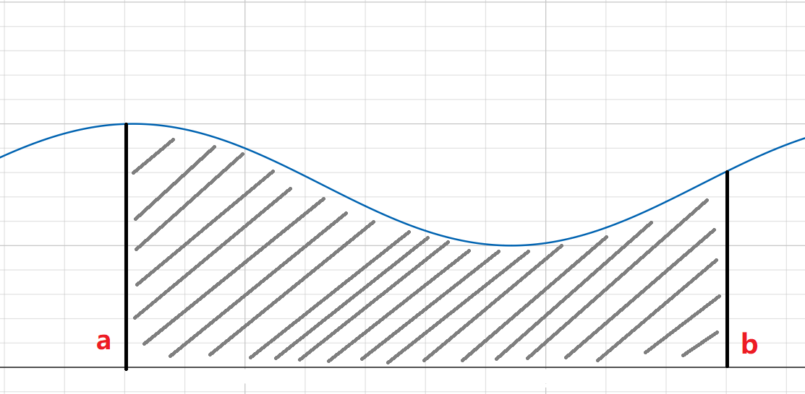

&emsp;&ensp; 定积分就是用来求函数 $\small f(x)$ 在 $\small [a,b]$ 上相较于 $\small x$ 轴形成的曲边梯形的面积，面积没有负的，若函数经过了负 $\small\displaystyle y$ 轴，则面积如图所示。

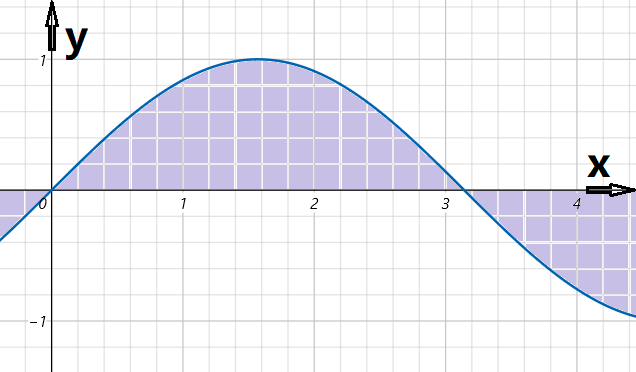

&emsp;&ensp; 在 $\small [a,b]$ 内将 $\small x$轴 划分为 $\small n$ 段，每个线段的左端点就等于$a+\frac{b-a}{n}$ ，左端点的 $\small\displaystyle y$ 值等于 $\small\displaystyle f(a+\frac{b-a}{n})$ ，这段梯形的面积就等于 $\small\displaystyle f(a+\frac{b-a}{n})·\frac{b-a}{n}$ ，当 $\small n$ 趋近于无穷时，所有小梯形的面积加起来就等于曲边梯形的面积。
**因此定积分的精准公式为:**
$$\small \int^b_a f(x){\rm d}x=\lim_{n→∞}\sum^n_{i=1}f(a+\frac{b-a}{n}i)\frac{b-a}{n}$$
&emsp;&ensp; 这是最精确的写法，上面定义的一堆公式可以不用管，记这个就行了。

&emsp;&ensp; **重要记忆公式**$~~$ 取 $\small\displaystyle a=0,b=1$: $$\small \lim_{n→∞}\sum^n_{i=1}f(\frac{i}{n})=\int^1_0f(x){\rm d}x$$

> 由定积分精准公式将 $\small a,b$ 特殊化为 $\small\displaystyle a=0,b=1$ ，得出的公式最简单，也最利于解决问题。
>
> 积分计算：积上限计算结果-积下限结算结果，即 $$\small \int^b_af(x){\rm d}x=F(b)-F(a)$$ 积分最有魅力的地方就在于此，计算结果等于 $\small f(x)$ 在 $\small [a,b]$ 区间上形成曲边梯形面积。

##### 定积分存在定理

&emsp;&ensp; 定积分的存在性，也称一元函数的（常义）可积性，这里的“常义”是指“区间有限，函数有界”，也有人称为“黎曼”可积性，与后面内容中的“区间无穷，函数无界”的反常积分有所区别，在考研中可积性都是指常义可积性。
定积分存在定理包括以下两个方面：

1. 定积分存在的充分条件
   1. 若 $\small f(x)$ 在 $\small [a,b]$ 上连续，则 $\small\displaystyle \int^b_a f(x){\rm d}x$ 存在。
   2. 若 $\small f(x)$ 在 $\small [a,b]$ 上单调，则 $\small\displaystyle \int^b_a f(x){\rm d}x$ 存在。
   3. 若 $\small f(x)$ 在 $\small [a,b]$ 上有界，且只有有限个间断点，则 $\small\displaystyle \int^b_a f(x){\rm d}x$ 存在。
2. 定积分存在的必要条件
   可积函数必有界，即若定积分 $\small\displaystyle \int^b_a f(x){\rm d}x$ 存在，则 $\small f(x)$ 在 $\small [a,b]$ 上必有界。

##### 定积分的性质

1. **求区间长度**
   &emsp;&ensp; 假设 $\small\displaystyle a<b$ ，则 $\small\displaystyle \int^b_a {\rm d}x=b-a=L$ ，其中 $\small\displaystyle L$ 为区间 $\small [a,b]$ 的长度。
2. **积分的线性性质**
   &emsp;&ensp; 设 $\small\displaystyle k_1,k_2$ 为常数，则 $\small\displaystyle \int^b_a [k_1f(x)\pm k_2g(x)]{\rm d}x=k_1\int^b_af(x){\rm d}x \pm k_2\int^b_ag(x){\rm d}x$ 。
   > 一元积分通用：$\small\displaystyle \int kf(x){\rm d}x=k\int f(x){\rm d}x ~,~ \int [f(x)\pm g(x)]=\int f(x) \pm \int g(x)$ 。
3. **积分的可加（拆）性**
   &emsp;&ensp; 无论 $\small\displaystyle a,b,c$ 大小如何，总有 $\small\displaystyle \int^b_af(x){\rm d}x=\int^c_af(x){\rm d}x+\int^b_cf(x){\rm d}x$ 。
4. **积分保号性**
   &emsp;&ensp; 若在区间 $\small [a,b]$ 上 $\small\displaystyle f(x)≤g(x)$ ，则有 $\small\displaystyle \int^b_af(x){\rm d}x ≤ \int^b_a g(x){\rm d}x$ ，特殊的，有 $\small\displaystyle \left|\int^b_af(x){\rm d}x \right|≤\int^b_a |f(x){\rm d}x|$
   > &emsp;&ensp; 设 $\small f(x)$ 是 $\small [a,b]$ 上的非负连续函数，只要 $\small f(x)$ 不恒等于 $\small 0$ ，则必有 $\small\displaystyle  \int^b_a f(x){\rm d}x > 0$ 。
5. **估值定理**
   &emsp;&ensp; 设 $\small\displaystyle M,m$ 分别是 $\small f(x)$ 在 $\small [a,b]$ 上的最大值和最小值，$\small L$ 为区间 $\small [a,b]$ 的长度，则有 $\small\displaystyle mL < \int^b_a f(x){\rm d}x < ML$ 。
6. **中值定理**
   &emsp;&ensp; 设 $\small f(x)$ 在闭区间 $\small [a,b]$ 上连续，则在 $\small [a,b]$ 上至少存在一点 $\small ξ$ ，使得 $$\small \int^b_a f(x){\rm d}x =f(ξ)(b-a)$$

   > &emsp;&ensp; 设 $\small\displaystyle F(x)=\int^x_a f(t){\rm d}t$ ，在 $\small [a,b]$ 上 ，用拉氏定理得： $\small\displaystyle F(b)-F(a)=F'(ξ)(b-a)$ 。
   > &emsp;&ensp; 积上限代入 $\small b$ ，即 $\small\displaystyle \int^b_a f(x){\rm d}x - \int^a_a f(x){\rm d}x = \int^b_a f(x){\rm d}x =f(ξ)(b-a)~,~ξ∈(a,b)⊂[a,b]$
   > &emsp;&ensp; 求导完毕。（$\small\displaystyle F'(x)=f(x)$）
   > &emsp;&ensp; 老拉格朗日了。

7. **对称性**
&emsp;&ensp; 设 $\small f(x)$ 在 $\small [a,-a]$ 上连续，则：
$$\small \int^a_{-a}f(x){\rm d}x=\begin{cases} \displaystyle 2\int^a_{0}f(x){\rm d}x~,~~~~~~~~f(x)=f(-x)~,~(f(x)为偶函数) \\ 0~,~~~~~~~~~~~~~~~~~~~~~~~~~f(x)=-f(x)~,~(f(x)为奇函数) \end{cases}$$

#### 变限积分

1. **变限积分的概念**
   &emsp;&ensp; 当 $\small x$ 在 $\small [a,b]$ 上变动时，对应于每一个 $\small x$ 值，积分 $\small\displaystyle \int^x_af(t){\rm d}t$ $\small\displaystyle (a≤x≤b)$ ，称函数 $\small\displaystyle \Phi(x)$ 为变上限的定积分，同理可以定义变下限的定积分和上、下限都变化的定积分，这些都称作变限积分。事实上，变限积分就是定积分的推广。

   > &emsp;&ensp; 变限积分就是在积上，下限至少有一个不确定时的定积分。
   > &emsp;&ensp; **变现积分是一个函数，定积分是一个常数**，之所以写法是 $\small\displaystyle \int^x_af(t){\rm d}t$ $\small\displaystyle (a≤x≤b)$ ，因 $\small x$ 是变量，$\small t$ 也是变量，**这是两个变量**，在计算中时，变量 $\small x$ 会以上限的性质代入 $\small\displaystyle t$ 进行计算。

2. **变限积分的性质**

   1. 函数 $\small f(x)$ 在 $\small [a,b]$ 上可积，则函数 $\small\displaystyle F(x)=\int^x_af(t){\rm d}t$ 在 $\small [a,b]$ 上连续（可逆推）。
   2. 若函数 $\small f(x)$ 在 $\small [a,b]$ 上连续，则函数 $\small\displaystyle F(x)=\int^x_af(t){\rm d}t$ 在 $\small [a,b]$ 上可导（不可逆推）。
      > 连续则可积亦可导。
      > 变限积分可以用可积推连续，但是定积分不能，切记！！！

3. **变限积分的求导公式**
   &emsp;&ensp; 设 $\small\displaystyle F(x)=\int^{φ_2(x)}_{φ_1(x)}f(t){\rm d}t$ ，其中 $\small f(x)$ 在 $\small [a,b]$ 上连续，可导函数 $\small\displaystyle φ_1(x)$ 和 $\small\displaystyle φ_2(x)$ 的值域在 $\small [a,b]$ 上，则在函数 $\small\displaystyle φ_1(x)$ 和 $\small\displaystyle φ_2(x)$ 的公共定义域上，有：
   $$\small F'(x)=\frac{\rm d}{{\rm d}x}[\int^{φ_2(x)}_{φ_1(x)}f(t){\rm d}t]=f[φ_2(x)]φ_2'(x)-f[φ_1(x)]φ_1'(x)$$
   > &emsp;&ensp; $\small x$ 为求导变量，$\small t$ 为积分变量。$x$ 出现在积分上下限时才能使用变限积分求导公式，若 $\small x$ 出现在被积函数中，必须通过恒等变形（比如变量代换等），将其移除被积函数，才能使用变限积分求导公式。
   > &emsp;&ensp; $\small\displaystyle \frac{\rm d}{{\rm d}x}[\int^{φ_2(x)}_{φ_1(x)}f(t){\rm d}t]$ 为对积分式中上下限中的变量 $\small x$ 求导，即 $\small\displaystyle \frac{{\rm d}[F(φ_2(x))-F(φ_1(x))]}{{\rm d}x}$ 。

#### 反常积分

1. **反常积分的通俗理解**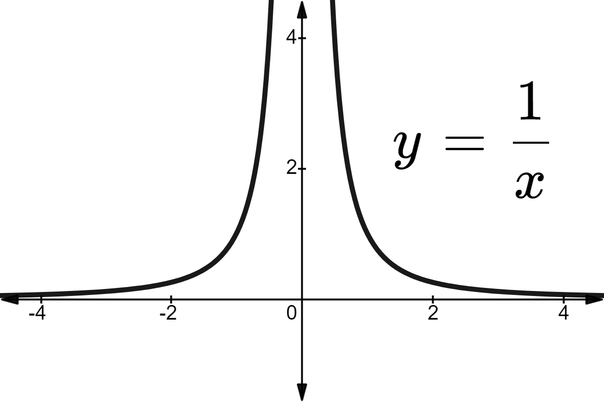
   &emsp;&ensp; 事实证明，常积分的两大重要特性有限性与有界性即使被破坏掉，也能可能能进行计算，如 $\small\displaystyle \int^{+∞}_1\frac{1}{x^2}=F(x)=\left. -\frac{1}{x} \right|^{+∞}_{1}=0-(-1)=1$(有限性破坏)，当我们把 $\small\displaystyle \int^{+∞}_1\frac{1}{x^2}$ 的图形 $\small x$ 轴转变成 $\small\displaystyle y$ 轴，$\small y$ 轴变为 $\small x$ 轴后，就得到了一个破坏**有界性**的公式。
   &emsp;&ensp; 但是并非所有破坏了有界性和无界性的积分都可计算，必须满足 $\small F(x)$ 为收敛。

   > 只要 $\small F(x)$ 在区间上收敛，就能当成常积分计算。

2. **无穷区间上的反常积分的概念与敛散性**

   1. $\small\displaystyle \int^{+∞}_a f(x){\rm d}x~,~\lim_{x→+∞}F(x)$ 存在即收敛，不存在则发散。
   2. $\small\displaystyle \int^{b}_{-∞} f(x){\rm d}x~,~\lim_{x→-∞}F(x)$ 存在则收敛，不存在则发散。
   3. $\small\displaystyle \int^{+∞}_{-∞} f(x){\rm d}x~,~\lim_{x→\pm∞}F(x)$ 存在则收敛，不存在则发散。

   > &emsp;&ensp; 在反常积分中，一般把 “∞” 和使得函数极限为无穷的点 (**瑕点**) 统称为奇点。
   > &emsp;&ensp; **瑕点：** $\small\displaystyle \lim_{x→b^-/a^+}$ 时，$\small F(x)=∞$ 的点。

3. **无界函数的反常积分的概念与敛散性**
   1. $\small b$ 或 $a$ 为 $\small\displaystyle \int^{b}_{a} f(x){\rm d}x$ 唯一的瑕点，$\small\displaystyle \lim_{x→b^-/a^+}F(x)$ 存在则反常积分收敛，不存在则发散。
   2. 若 $\small\displaystyle c∈(a,b)$ 且为唯一瑕点，$\small\displaystyle \lim_{x→c^+/c^-}F(x)$ 存在，则反常积分 $\small\displaystyle \int^{b}_{a} f(x){\rm d}x=\int^{b}_{c} f(x){\rm d}x+\int^{c}_{a} f(x){\rm d}x$ 收敛，否则发散

#### 积分特性

&emsp;&ensp; $\small f(x)$ 为偶函数，则 $\small f'(x)$ 为奇函数，$\small f''(x)$ 为偶函数，以此类推。
&emsp;&ensp; $\small f(x)$ 为奇函数，则 $\small f'(x)$ 为偶函数，$\small f''(x)$ 为奇函数，以此类推。
&emsp;&ensp; $\small f'(x)$ 为周期函数，则 $\small f''(x)$ 为周期函数，$\small f(x)$ 在 $\small\displaystyle \int^T_0 f(x){\rm d}x=0$ 时为周期函数，就是说$\small f'(x)$ 是周期函数时，原函数 $\small f(x)$ 不一定时周期函数，要把周期 $\small\displaystyle T$ 带进去求证。

- $\small\displaystyle \int ^b_a kf(x){\rm d}x= k\int ^b_a f(x){\rm d}x$
- $\small\displaystyle \int ^b_a[f_1(x) \pm f_2(x)]{\rm d}x =\int ^b_a f_1(x){\rm d}x \pm \int ^b_a f_2(x){\rm d}x$
- $\small\displaystyle \int ^b_a f(x){\rm d}x = \int ^c_a f(x){\rm d}x + \int ^b_c f(x){\rm d}x$ ( 其中 $\small\displaystyle a<c<b$ )。

### 积分计算|||

#### 不定积分的积分方法

&emsp;&ensp; 定积分与变限积分就是有代入积上下限的不定积分，所以不定积分的计算方式都可以在定积分与变限积分中使用。

##### 基本积分公式

1. $\small\displaystyle \int x^k {\rm d}x=\frac{1}{k+1}x^{k+1}+C$ $\small\displaystyle ,$ $\small\displaystyle k\neq -1$ ；$\begin{cases} \small\displaystyle \int \frac{1}{x^k}{\rm d}x=-\frac{1}{(k-1)x^{k-1}}+C \\ \small\displaystyle \int \frac{1}{\sqrt x}{\rm d}x=-2\sqrt{x}+C \end{cases}$
2. $\small\displaystyle \int\frac{1}{x}{\rm d}x = \ln|x|+C ~~,~~ \int\frac{x}{1+x^2}{\rm d}x = \frac{x'}{2}\ln|(1+x^2)|+C$
3. $\small\displaystyle \int e^{kx}{\rm d}x=\frac{1}{k}e^{kx}+C ~~;~~ \int a^x{\rm d}x=\frac{a^x}{\ln a}+C ~,~ a>0$ 且 $\small\displaystyle a\neq 1$
4. $\small\displaystyle \int\sin x{\rm d}x=-\cos x+C~~;~~\int\cos x{\rm d}x=\sin x+C$ ；
   $\small\displaystyle \int\tan x{\rm d}x=-\ln|\cos x|+C ~~;~~ \int\cot x{\rm d}x = \ln|\sin x|+C$ ；
   $\small\displaystyle \int\frac{{\rm d}x}{\cos x}=\int \sec x{\rm d}x=\ln|\sec x+\tan x|+C ~;~ \int \frac{1}{\cos^2x}{\rm d}x=\tan x+C$ ；
   $\small\displaystyle \int\frac{{\rm d}x}{\sin x}=\int \csc x{\rm d}x=\ln |\csc x-\cot x|+C ~;~ \int \frac{1}{\sin^2x}{\rm d}x=-\cot x+C$ ；
   $\small\displaystyle \int \sec^2 x{\rm d}x=\tan x+C ~~;~~ \int \csc^2 x{\rm d}x=-\cot x+C$ ；
   $\small\displaystyle \int \sec x\tan x{\rm d}x=\sec x +C ~~;~~ \int\csc x\cot x{\rm d}x=-\csc x+C$
5. $\begin{cases} \small\displaystyle \int \frac{1}{1+x^2}{\rm d}x=\arctan x+C \\ \small\displaystyle \int \frac{1}{a^2+x^2}{\rm d}x=\frac{1}{a}\arctan\frac{x}{a}+C(a>0) \end{cases}$
6. $\begin{cases} \small\displaystyle \int \frac{1}{\sqrt{1-x^2}}{\rm d}x=\arcsin x+C \\ \small\displaystyle \int \frac{1}{\sqrt{a^2-x^2}}{\rm d}x=\arcsin\frac{x}{a}+C(a>0) \end{cases}$
7. $\begin{cases} \small\displaystyle \int \frac{k}{\sqrt{x^2+a^2}}{\rm d}x=k\ln(x+\sqrt{x^2+a^2})+C(常见a=1) \\ \small\displaystyle \int \frac{k}{\sqrt{x^2-a^2}}{\rm d}x=k\ln|x+\sqrt{x^2-a^2}|+C(|x|>|a|) \end{cases}$

8. $\small\displaystyle \int \frac{k~或~kx}{x^2-a^2}{\rm d}x=\frac{k~或~kx'}{2a}\ln|\frac{x-a}{x+a}|+C$ $\small\displaystyle ;$ $\small\displaystyle \int\frac{k~或~kx}{a^2-x^2}{\rm d}x=\frac{k~或~kx'}{2a}\ln|\frac{x+a}{x-a}|$
9. $\small\displaystyle \int\sqrt{a^2-x^2}{\rm d}x=\frac{a^2}{2}\arcsin\frac{x}{a}+\frac{x}{2}\sqrt{a^2-x^2}+C(a>|x|≥0)$
10. $\small\displaystyle \int \sin^2x{\rm d}x=\frac{x}{2}-\frac{\sin 2x}{4}+C(\sin^2x=\frac{1-\cos 2x}{2})$ ；
    $\small\displaystyle \int \cos^2x{\rm d}x=\frac{x}{2}+\frac{\sin 2x}{4}+C(\cos^2x=\frac{1+\cos 2x}{2})$ ；
    $\small\displaystyle \int\tan^2x{\rm d}x=\tan x-x+C(tan^2x=sec^2x-1)$ ；
    $\small\displaystyle \int\cot^2{\rm d}x=-\cot x-x+C(\cot^2x=\csc^2x-1)$

##### 凑微分法

**基本思想** $\small\displaystyle \int f[g(x)]g'(x){\rm d}x=\int f[g(x)]{\rm d}[g(x)]=\int f(u){\rm d}u$

> &emsp;&ensp; $\small\displaystyle g'(x)·{\rm d}x=g'(x)·x'=g'(x)·1=g'(x)={\rm d}[g(x)] ~~,~~ \left\{ F[g(x)] \right\}'=F'[g(x)]·g'(x)$ 。
> &emsp;&ensp; **注意**，仅当 $\small x$ 为 $\small x$ 时 $\small\displaystyle g'(x)·{\rm d}x=g'(x)$ ，要是 $\small\displaystyle x=\sin x$ ，那么 $\small\displaystyle g'(x)·{\rm d}x=g'(x)·\cos x$ ，所以**必须要注意 $\small x$ 是什么**。

&emsp;&ensp; 当被积分函数比较复杂时，拿出一部分放到 $\small\displaystyle {\rm d}$ 后面去，若能凑成 $\small\displaystyle \int f(u){\rm d}u$ 的形式，则凑分成功，比如：$$\small \int \frac{\ln^5x}{x}{\rm d}x=\int \ln^5x·\frac{1}{x}{\rm d}x=\int \ln^5x{\rm d}(\ln x)=\frac{ln^6x}{6}+C$$

&emsp;&ensp; 熟练掌握基本积分公式即常用的凑分公式，比如能够熟练计算下面这种题：
$\small\displaystyle \int \frac{\sqrt x}{\sqrt{4-x^3}}=\frac{2}{3}\int\frac{{\rm d}(x)^{\frac{3}{2}}}{\sqrt{4-(x^\frac{3}{2})^2}}=\frac{2}{3}\int\frac{{\rm d}(x^{\frac{3}{2}})}{2·\sqrt{1-(\frac{1}{2}x^{\frac{3}{2}})^2}}=\frac{2}{3}\int\frac{{\rm d}(\frac{1}{2}x^{\frac{3}{2}})}{\sqrt{1-(\frac{1}{2}x^{\frac{3}{2}})^2}}=\frac{2}{3}\arcsin(\frac{1}{2}x^{\frac{3}{2}})+C$

##### 换元法

**基本思想** $\small\displaystyle \int f(x){\rm d}x$ ，当 $\small\displaystyle x=g(u)$ 时，$\small\displaystyle \int f[g(u)]{\rm d}[g(u)]=\int f[g(u)]g'(u){\rm d}u$ 。
&emsp;&ensp; 当被积函数不容易积分（比如含有根式，含有三角函数时），可以通过换元的方法从 $\small\displaystyle d$ 后面拿出一部分放到前面来，就成为 $\small\displaystyle \int f[g(u)]g'(u){\rm d}u$ 的形式，若 $\small\displaystyle f[g(u)]g'(u)$ 容易积分，则换元成功。

> $\small\displaystyle x=g(u)$ 必须是可导函数，且不要忘记计算结束后用反函数 $\small\displaystyle u=g^{-1}(x)$ 回代。

**归纳总结换元法的思维结构：**

&emsp;&ensp; 1. 三角函数代换 —— 当被积函数含有如下根式时，可作三角代换，这里 $\small\displaystyle a>0$ 。$$\small \begin{cases} \small \sqrt{a^2-x^2},令x=a\sin t,则原式=\sqrt{a^2-a^2\sin^2t}=\sqrt{a^2\cos^2t}=a\cos t~,~|t|<{\large\frac{π}{2}} \\ \small \sqrt{a^2+x^2} , 令x=a\tan t,则原式=a\sec t~,~ |t|<{\large \frac{π}{2}} \\ \small \sqrt{x^2-a^2},令x=a\sec t,则原式=a\tan t~,~\begin{cases} \small若 x>0,则0<t<{\large \frac{π}{2}} \\ \small 若x<0,则 {\large \frac{π}{2}}<t<π \end{cases} \end{cases}$$
 : > 只在积分中讨论正负。

&emsp;&ensp; 2. 恒等变形后作三角函数代换 —— 当被积函数含有根式 $\small\displaystyle \sqrt{ax^2+bx+c}$ 时，可化为以下三种形式：$\sqrt{φ^2(x)+k^2},\sqrt{φ^2(x)-k^2},\sqrt{k^2-φ^2x}$ ，再作三角函数代换。

&emsp;&ensp; 3. 根式转换 —— 当被积函数含有根式 $\small\displaystyle \sqrt[n]{ax+b},\sqrt{\frac{ax+b}{cx+d}},\sqrt{ae^{bx}+c}$ 等时，一般令根式 $\small\displaystyle \sqrt{*}=t$（ 因为很难通过根号内换元法的办法凑成平方，所以根式无法去掉 ）。对同时含有 $\small\displaystyle \sqrt[n]{ax+b},\sqrt[m]{ax+b}$ 的函数，一般取 $\small\displaystyle m,n$ 的最小公倍数 $\small\displaystyle l$ ，令 $\small\displaystyle \sqrt[l]{ax+b}=t$ 。

&emsp;&ensp; 4. 倒转换 —— 当被积函数分母幂次比分子高两次及两次以上时，作倒代换，令 $\small\displaystyle x=\frac{1}{t}$ 。

&emsp;&ensp; 5. 复杂函数的直接代换 —— 当被积函数中含有 $\small\displaystyle a^x,e^x,\ln x,\arcsin x,\arctan x$ 等时，可以考虑直接令复杂函数等于 $\small\displaystyle t$ ，值得提出的是，当 $\small\displaystyle \ln x,\arcsin x,\arctan x$ 与 $\small\displaystyle P_n(x)$ 或者 $\small\displaystyle e^{ax}$ 作乘法时 （其中为 $\small x$ 的 $\small n$ 次多项式），优先考虑分部积分法。
: 比如计算 $\small\displaystyle \int e^{\sqrt{2x-1}}{\rm d}x$ 。
令 $\small\displaystyle t=\sqrt{2x-1}$ ，则 $\small\displaystyle x=\frac{t^2+1}{2}~,~{\rm d}x=t{\rm d}t$ ，则：$\small\displaystyle \int e^{\sqrt{2x-1}}{\rm d}x=\int e^t{\rm d}t=\int t{\rm d}(e^t)=te^t-\int e^t{\rm d}t=te^t-e^t+C=(t-1)e^t+C=(\sqrt{2x-1}-1)e^{\sqrt{2x-1}}+C$

> &emsp;&ensp; 在更换 $\small {\rm d}x$ 时，需要注意 $\small t=f(x)$ ，所以 $\small x=g(t)$ ，则 $\small {\rm d}x={\rm d}g(t)=g'(t){\rm d}t$ 。如在上公式中 $\small x={\large\frac{t^2+1}{2}}$ ，则 $\small {\rm d}x=\left( {\large\frac{t^2+1}{2}} \right)'{\rm d}t$ ，争对将 $\small {\rm d}x$ 转换成 $g'(t){\rm d}t$ ，有如下两个步骤：
> &emsp;&ensp; 1. 若 $\small x,t$ 的关系比较复杂的情况下，因为 $\small t=f(x),x=g(t)$ 互为反函数，反函数的导数等于其原函数的导数的倒数，所以 $\small {\rm d}x={\large\frac{1}{f'(x)}}{\rm d}t$ ，然后观察原方程式是否存在可以将 $f'(x)$ 中的 $\small x$ 约去的办法。
> &emsp;&ensp; 2. 利用等量代换，四则运算等方法计算出 $\small g(t)$。

##### 分部积分法

1. **基本思想** $\small\displaystyle \int u{\rm d}v=uv-\int v{\rm d}u$
   此方法用于求 $\small\displaystyle \int u{\rm d}v$ 比较难，$\small\displaystyle \int v{\rm d}u$ 比较容易的情形。

   - 被积函数为 $\small\displaystyle P_n(x)e^{kx},P_n(x)\sin ax,P_n(x)\cos ax$ 等形式时，一般来说取 $\small\displaystyle u=P_n(x)$ 。
   - 被积函数为 $\small\displaystyle e^{ax}\sin bx,e^{ax}bx$ 等形式，可以取其中两因子中的任意一个。
   - 被积函数为 $\small\displaystyle P_n\ln x,P_n(x)\arcsin x,P_n(x)\arctan x$ 等形式时，分别取 $\small\displaystyle u=\ln x,u=\arctan x,u=\arctan x$ 。
     > 总结就一句话，哪个难算取哪个。

2. 分部积分法的推广公式与 $\small\displaystyle \int P_n(x)e^{kx}{\rm d}x,\int P_n(x)\sin ax{\rm d}x,\int P_n(x)\cos bx{\rm d}x$ 。
   &emsp;&ensp; 设函数 $\small\displaystyle u$ 与 $\small\displaystyle v$ 具有直到第 $\small\displaystyle (n+1)$ 阶的连续导数，并根据分部积分公式： $$\small \int u{\rm d}v=uv-\int v{\rm d}u$$ ，则有 $\small\displaystyle \int uv^{(n+1)}{\rm d}x=uv^{(n)}-u'v^{(n-1)}+u''v^{(n-2)}-…+(-1)^nu^{(n)}v+(-1)^{n+1}\int u^{(n+1)}v{\rm d}x$ 。

##### 有理数的函数积分

&emsp;&ensp; **定义**$~~$ 形如 $\small\displaystyle \int \frac{P_n(x)}{Q_m(x)}{\rm d}x(n<m)$ 的积分称为**有理数的积分**，其中 $\small\displaystyle P_n(x),Q_m(x)$ 分别是 $\small x$ 的 $\small n$ 与 $\small m$ 次多项式。
&emsp;&ensp; **方法**$~~$ 先将 $\small\displaystyle Q_m(x)$ 因式分解，再把 $\small\displaystyle \frac{P_n(x)}{Q_m(x)}$ 拆成若干最简有理分式之和。

**分解的基本原则：**

1. $\small\displaystyle Q_m(x)$ 的一次单因式 $\small\displaystyle ax+b$ 产生一项 $\small\displaystyle \frac{A}{ax+b}$ 。
2. $\small\displaystyle Q_m(x)$ 的 $\small\displaystyle k$ 重一次因式 $\small\displaystyle (ax+b)^k$ 产生 $\small\displaystyle k$ 项，分别为 $\small\displaystyle \frac{A_1}{ax+b}+\frac{A_2}{(ax+b)^2}+…+\frac{A_k}{(ax+b)^k}$ 。
3. $\small\displaystyle Q_m(x)$ 的二次单因式 $\small\displaystyle px^2+qx+r$ 产生一项 $\small\displaystyle \frac{Ax+B}{Px^2+qx+r}$ 。
4. $\small\displaystyle Q_m(x)$ 的 $\small\displaystyle k$ 二次单因式产生 $\small\displaystyle k$ 项 ： $\small\displaystyle \frac{A_1x+B_1}{px^2+qx+r}+\frac{A_2x+B_2}{(px^2+qx+r)^2}+…+\frac{A_kx+B_k}{(px^2+qx+r)^k}$ 。

> &emsp;&ensp; 以 $\small\displaystyle Q_m(x)$ 的 $\small\displaystyle k$ 重一次因式为例，原式为 $\small\displaystyle \int\frac{Q_m(x)}{(ax+b)^n(cx+d)^k}{\rm d}x$ ，将 $\small f(x)$ 拆分式为：
> &emsp;&ensp; $\small\displaystyle \frac{Q_m(x)}{(ax+b)^n(cx+d)^k}=\frac{A_1}{(ax+b)^1}+…+\frac{A_n}{(ax+b)^n}+…+\frac{A_{n+1}}{(cx+d)^1}+\frac{A_{n+k}}{(cx+d)^k}$ > &emsp;&ensp; 然后将进行通分，等式左右同时乘 $\small\displaystyle (ax+b)^n(cx+d)^k$ ，方便计算。
> &emsp;&ensp; 分次令 $\small\displaystyle x=常数$ ，使得大部分 $\small\displaystyle A·f(x)=0$ ，然后算得某个 $\small\displaystyle A_?$ 的值，实在带不动可以把其他已得的 $\small A$ 代入再算，总之要把所有 $\small A$ 的值都求出来。
> &emsp;&ensp; 求出来所有 $\small A$ 以后，就能得出：
> &emsp;&ensp; $\small\displaystyle \int\frac{Q_m(x)}{(ax+b)^n(cx+d)^k}{\rm d}x=\int\frac{A_1}{(ax+b)^1}{\rm d}x+…+\int\frac{A_n}{(ax+b)^k}{\rm d}x+\int\frac{A_{n+1}}{(cx+d)^1}{\rm d}x+…+\int\frac{A_{n+k}}{(cx+d)^k}{\rm d}x$
>
> > 正常情况下拆分出来的 $\small A$ 数量不会多于 3 个，超过 5 个赶紧换其他办法，肯定会比这个简单。

#### 定积分的计算

&emsp;&ensp; 定积分的计算主要依赖牛顿莱布尼茨公式。
&emsp;&ensp; 若 $\small f(x)$ 在 $\small [a,b]$ 上连续，$\small F'(x)=f(x)$ ，则 ：
$$\small \int^b_a f(x){\rm d}x=\left. F(x) \right|^{b}_{a}=F(b)-F(a)$$ ，由牛顿 -莱布尼茨公式结合不定积分的计算方法，有定积分的换元积分法和分部积分法，分别如下：

1. **定积分的换元积分法**
   &emsp;&ensp; 设 $\small f(x)$ 在 $\small [a,b]$ 上连续，函数 $\small\displaystyle x=φ(t)$ 满足，1. $\small\displaystyle φ(α)=a,φ(β)=b$ ；2. $\small\displaystyle x=φ(t)$ 在 $\small\displaystyle [α,β]$（或 $\small\displaystyle [β,α]$）上有连续的导数，且其值域为 $\small\displaystyle R_φ=[a,b]$ (当值域超出 $\small [a,b]$ 时，此条件改为：其值域在 $\small [a,b]$ 上连续 )，则有
   $$\small \int^b_a f(x){\rm d}x=\int^β_α f[φ(t)]φ'(t){\rm d}t$$

2. **定积分分布积分法**
   &emsp;&ensp; 设函数 $\small\displaystyle u(x),v(x)$ 的导数 $\small\displaystyle u'(x),v'(x)$在区间 $\small [a,b]$ 上连续，则存在：$$\small \int^b_au(x)v'(x){\rm d}x=u(x)v(x)\big|^b_a-\int^b_a v(x)u'(x){\rm d}x$$ &emsp;&ensp; 用牛顿-莱布尼兹公式或者分部计算法计算定积分时方法与求不定积分一致，只是多了个代入计算。

3. **在计算定积分时，下面的结论非常有用：**

   1. 设 $\small f(x)$ 为连续的偶函数，则 $\small\displaystyle \int^a_{-a} f(x){\rm d}x=2\int^a_0 f(x){\rm d}x$ 。
   2. 设 $\small f(x)$ 为连续的奇函数，则 $\small\displaystyle \int^a_{-a} f(x){\rm d}x=0$ 。
   3. 设 $\small f(x)$ 是以 $\small\displaystyle T$ 为周期的连续函数，则 $\small\displaystyle \int^{a+T}_a f(x){\rm d}x=\int^T_a f(x){\rm d}x$ ，即在长度为一个周期的区间上的定积分，与该区间的起始位置无关 。
   4. 设 $\small f(x)$ 为连续函数（**区间再现公式**），则 $\small\displaystyle \int^b_a f(x){\rm d}x=\int^b_a f(a+b-x){\rm d}x$ 。
   5. $\small\displaystyle \int^{\frac{π}{2}}_0 \sin^nx{\rm d}x=\int^{\frac{π}{2}}_0\cos^nx{\rm d}x=\begin{cases} \large \frac{n-1}{n}·\frac{n-3}{n-2}·…·\frac{2}{3}·\normalsize 1 ~,~ \small n为大于1的奇数 \\ \large \frac{n-1}{n}·\frac{n-3}{n-2}·…·\frac{1}{2}·\frac{π}{2} \normalsize ~,~ \small n为正偶数 \end{cases}$

> 注意，定积分的计算结果是一个常数，所以定积分的导数值为零，即设 $\small\displaystyle \int^b_a f(x)=A$ ，则 $\small\displaystyle \frac{{\rm d}}{{\rm d}x}\int^b_a f(x)=\left[\int^b_a f(x) \right]'=A'=0$ 。

#### 变限积分计算方法

&emsp;&ensp; 与定积分一样，积完后把上下限代入，作 $\small\displaystyle F(b)-F(a)$ ，变限积分计算出来的结果可能是个函数式，也可能在中途把变量约掉了，结果变成了一个常数。

#### 点火公式(待补充)

## 一元函数积分学的几何应用

### 用定积分表达和计算平面图形的面积

1. 曲线 $\small y=f(x)$ 与 $\small\displaystyle y=g(x)$ ，在区间 $\small\displaystyle [a,b](a<b)$ 上所围成的平面图形面积：$$\small S=\int^b_a|f(x)-g(x)|{\rm d}x$$ ，如图，阴影部分为所求面积。
   

   > 公式由微元法推得，$\small |f(x)-g(x)|$ 得到的是 $\small f(x)$ 与 $\small\displaystyle g(x)$ 之间的距离，也就是高，然后 $\small\displaystyle |f(x)-g(x)|{\rm d}x$ 得到这一部分的面积，再 $\small\displaystyle \int^b_a$ 就得到了每一小块面积的和，即整个平面图形的面积。

2. 曲线 $\small\displaystyle r=f(x)$ 与 $\small\displaystyle r=g(x)$ 与两条射线 $\small a,b$ $\small\displaystyle (0<b-a<2π)$ 所围成的曲边扇形的面积：$$\small S=\frac{1}{2}\int^b_a|f^2(x)-g^2(x)|{\rm d}x$$
   > 遇到函数为半径所构成的图像就用这个。

### 用定积分表达和计算旋转体的体积

1. 曲线 $\small y=f(x)$ 与 $\small\displaystyle x=a,x=b(a<b)$ 及 $\small x$ 轴围成的曲边梯形绕 $\small x$ 轴旋转一圈所得到的旋转体的体积: $$\small V=\int^b_aπf^2(x){\rm d}x$$
   

2. 曲线 $\small\displaystyle y=f(x)\geq 0$ 与 $\small\displaystyle y=g(x)\geq 0$ 及 $\small\displaystyle x=a,x=b(a<b)$ 所围成的平面图形绕 $\small x$ 轴旋转一周所得到的旋转体体积：$$\small V=π\int^b_a|f^2(x)-g^2(x)|{\rm d}x$$

3. 曲线 $\small y=f(x)$ 与 $\small\displaystyle x=a,x=b(0\leq a<b)$ 及 $\small x$ 轴围成的曲边梯形绕 $\small\displaystyle y$ 轴旋转一周所得到的旋转体的体积计算公式：$$\small V=2π\int^b_a x|f(x)|{\rm d}x$$

4. 曲线 $\small y=f(x)$ 与 $\small\displaystyle y=g(x)$ 及 $\small\displaystyle x=a,x=b(0\leq a\leq b)$ 所围成的图形绕 $\small\displaystyle y$ 轴旋转一圈所形成的旋转体的体积：$$\small\displaystyle V=2π\int^b_ax|f(x)-g(x)|{\rm d}x$$

### 用定积分表达和计算函数的平均值

&emsp;&ensp; 设 $\small\displaystyle x∈[a,b]$ ，函数 $\small f(x)$ 再 $\small [a,b]$ 上平均值为 $\small\displaystyle \bar{y}=\frac{1}{b-a}\int^b_a f(x){\rm d}x$ 。

> &emsp;&ensp; 积分中值定理转换而来，对比就可以看出，积分中值定理中的 $\small\displaystyle f(ξ)$ 就是积分的平均值。

## 积分等式与积分不等式

### 积分等式

#### 推广的积分中值定理

&emsp;&ensp; 设 $\small\displaystyle f(x),g(x)$ 在 $\small [a,b]$ 上连续且 $\small\displaystyle g(x)$ 不变号，则至少存在一点 $\small ξ$ ，使得 $$\small \int^b_a f(x)g(x){\rm d}x=f(ξ)\int^b_ag(x){\rm d}x$$

#### 夹逼准则

&emsp;&ensp; 一般在见到 $\small\displaystyle \lim\small\int^{\scriptsize b}_{\scriptsize a}$ 时想到用夹逼准则。

#### 积分法

&emsp;&ensp; 之前学的各种积分计算方法，如凑分，换元……

### 积分不等式

#### 用函数的单调性

&emsp;&ensp; 首先将某一（通常取上限）变量化，然后移项构造辅助函数，由辅助函数的单调性来证明不等式，此方法多用于所给条件为“$\small f(x)$ 为 $\small [a,b]$ 上连续”的情形。

#### 用拉格朗日中值定理

&emsp;&ensp; 此方法多用于所给条件为“$\small f(x)$ 一阶可导”且某一端点值比较简单（甚至为 $\small 0$ ）的题目。

#### 用泰勒公式

&emsp;&ensp; 此方法多用于所给条件为“$\small f(x)$ 二阶可导”且某一端点值比较简单（甚至为 0）的题目。

## 多元函数微分学

### 基本概念

#### 平面点集的基本概念

&emsp;&ensp; 在平面上建立直角坐标系 $\small\displaystyle xOy$ ，则平面上的点就可用两个实数组成的有序数组 $\small\displaystyle (x,y)$ 来表示，而二元函数 $\small\displaystyle f(x,y)$ 的定义域恰是以两个实数组成的有序数组 $\small\displaystyle (x,y)$ 为元素的集合，于是：$f(x,y)$ 的定义域就是平面上的点集。下面给出平面点集的一些基本概念：

&emsp;&ensp; 1. 平面上任意两点 $\small\displaystyle M_1(x,y)$ 与 $\small\displaystyle M_2(x_2,y_2)$ 之间的距离定义为：$$\small ρ(M_1,M_2)=\sqrt{(x_2-x_1)^2+(y_2-y_1)^2}$$ 其中记号 $\small\displaystyle ρ(M_1,M_2)$ 表示点 $\small\displaystyle M_1$ 与 $\small\displaystyle M_2$ 的距离，它满足三个要素：

1. **非负性**： $\small\displaystyle ρ(M_1,M_2)\geq0$ ；
2. **对称性**： $\small\displaystyle ρ(M_1,M_2)=ρ(M_2,M_1)$ ；
3. **三角不等式**： $\small\displaystyle ρ(M_1,M_3)\leqρ(M_1,M_2)+ρ(M_2,M_3)$

> 此处的 $\small\displaystyle ρ(M_1,M_2)$ 中的 $\small\displaystyle M_1,M_2$ 代表的是两个点，即 $\small\displaystyle ρ[(x_1,y_1),(x_2,y_2)]$ 。

&emsp;&ensp; 2. 设 $\small\displaystyle M_0$ 为平面上的一个点，$\small δ>0$ ，则平面上以点 $\small\displaystyle M_0$ 为圆心的，以 $\small\displaystyle δ$ 为半径的圆的内部叫做点 $\small\displaystyle M_0$ 的 $\small\displaystyle δ$ 邻域，记作 $\small\displaystyle U(M_0,δ)$ ，即：
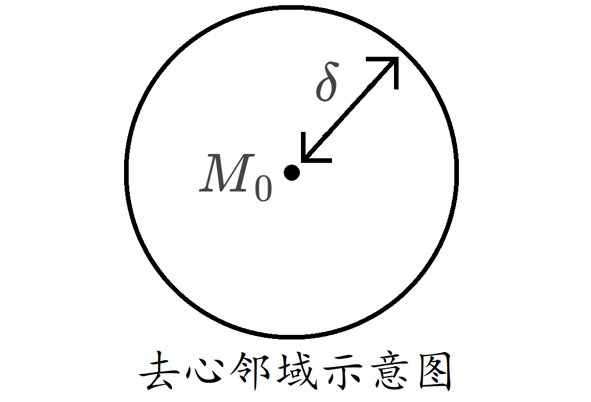$U(M_0,δ)=\lbrace M | 0<ρ(M_0,M)<δ,M在平面上 \rbrace$

&emsp;&ensp; 若在上述邻域中去掉圆心 $\small\displaystyle M_0$ ，则叫做点 $\small\displaystyle M_0$ 的去心邻域，记作 $\small\displaystyle \mathring{U}(M_0,δ)$ ，即 $$\small \mathring{U}(M_0,δ)=\lbrace M|0<ρ(M_0,M)<δ,M在平面上 \rbrace$$

&emsp;&ensp; 3. 给定平面上的一个点集 $\small\displaystyle E$ ，可以用上述邻域概念将平面上的点分类为内点，外点和边界点 ：

1. 设 $\small M$ 为平面上的一点，若存在 $\small\displaystyle δ>0$ ，使得 $\small\displaystyle U(M,δ)⊂E$ 则 $\small M$ 为点集 $\small\displaystyle E$ 的**内点**。
2. 若存在 $\small\displaystyle δ>0$ ，使得 $\small\displaystyle U(M,δ)∩E=\varnothing$ ，则 $\small M$ 为点集 $\small\displaystyle E$ 的外点。
3. 若对任意的 $\small\displaystyle δ>0,U(M,δ)$ 中既有 $\small\displaystyle E$ 中的点，也有 $\small\displaystyle E$ 外的点， 则 $\small M$ 为点集 $\small\displaystyle E$ 的边界点，且 $\small\displaystyle E$ 的所有边界点的集合统称为 $\small\displaystyle E$ 的边界。

&emsp;&ensp; 4. 设 $\small\displaystyle E$ 是一个平面点集，$\small\displaystyle M_0$ 为平面上任意一点，若对任意的 $\small\displaystyle δ>0$ 总有 $\small\displaystyle \mathring{U}(M_0,δ)∩E\neq \varnothing$ ，即 $\small\displaystyle M_0$ 的任意领域中都含有异于 $\small\displaystyle M_0$ 的 $\small\displaystyle E$ 中的点，则称 $\small\displaystyle M_0$ 为 $\small\displaystyle E$ 的聚点，非空开集的内点与边界点都是这个点的聚点，闭区间的任意一点都是他的聚点。

&emsp;&ensp; 若存在 $\small\displaystyle δ>0$ ，使得 $\small\displaystyle U(M_0,δ)∩E=\lbrace M_0 \rbrace$ ，即如果 $\small\displaystyle M_0$ 的某一邻域与点集 $\small\displaystyle E$ 的交集是一个孤立的点 $\small\displaystyle M_0$ ，则称点 $\small\displaystyle M_0$ 为 $\small\displaystyle E$ 孤立点，边界点要么是聚点，要么是孤立点。

#### 极限与连续

##### 极限

$~~~~~$**定义**：设二元函数 $\small\displaystyle f(P)=f(x,y)$ 的定义域为 $\small\displaystyle D~,~P_0(x_0,y_0)$ 是 $\small\displaystyle D$ 的聚点，如果存在常数 $\small A$ ，对于任意给定的正数 $\small ξ$ ，总存在正数 $\small\displaystyle δ$ ，使得当点 $\small\displaystyle P(x,y)∈D∩\mathring{U}(P_0,δ)$ 时，都有： $$\small |f(x,y)-A|< ξ$$ 成立，那么就称常数 $\small A$ 为函数 $\small\displaystyle f(x，y)$ 当 $\small\displaystyle (x,y)→(x_0,y_0)$ 时的极限，记作 $$\small \lim_{(x,y)→(x_0,y_0)}f(x,y)=A 或 f(x,y)→A((x,y)→(x_0,y_0))$$

&emsp;&ensp; 以上是按集合论知识（以点集趋向方式）定义多元极限，通俗来说，只要 $\small\displaystyle f(x,y)$ 是 “有定义” 的，且满足 $\small\displaystyle |f(x,y)-A|<ξ$ ，则 $\small\displaystyle \lim_{(x,y)→(x_0,y_0)}f(x,y)=A$ 这里 “排除” 了 $\small\displaystyle (x_0,y_0)$ 邻域内的无定义点，如：$$\small \lim_{(x,y)→(0,0)}\frac{\sqrt{xy+1}-1}{xy}=\lim_{(x,y)→(0,0)}\frac{xy+1-1}{xy(\sqrt{xy+1}+1)}=\lim_{(x,y)→(x_0,y_0)}\frac{1}{\sqrt{xy+1}+1}=\frac{1}{2}$$

> &emsp;&ensp; 此定义法是数学专业的定义方法，忽略了 $\small\displaystyle x,y$ 的无定义点方向，即上方公式里的 $\small\displaystyle x=0,y=0$ 这两条线，四个方向并未考虑。
> &emsp;&ensp; 但是还有另一种定义法，要求所有方向趋近于 $\small\displaystyle (x_0,y_0)$ 时，$\small f(x,y)$ 都要趋近于 $\small A$ ，这样当点集中拥有 $\small\displaystyle x,y$ 定义不存在的方向时，极限就不存在了，但在二维空间中许多事物都不具备这种完全趋向性，如上公式，$\small\displaystyle x=0,y=0$ 不存在，那么由于这四个方向不存在，这个极限就不存在了。
> &emsp;&ensp; 这并不是所另一种定义不对，只是定义不同，结果不同而已，但是不用担心，考试中出现的题必然同时满足两条定义。

##### 连续

&emsp;&ensp; 如果 $\small\displaystyle \lim\limits_{\substack{△x→0 \\ △y→0}}f(x,y)=f(x_0,y_0)$ ，则称 $\small\displaystyle f(x,y)$ 在点 $\small\displaystyle (x_0,y_0)$ 处连续。

#### 偏导数 |||

&emsp;&ensp; 设函数 $\small\displaystyle z=f(x,y)$ 在点 $\small\displaystyle (x_0,y_0)$ 的某邻域内有定义，若极限 $$\small \lim_{△x→0}\frac{f(x_0+△x,y_0)-f(x_0,y_0)}{△x}$$ ，则称此极限为函数 $\small\displaystyle z=f(x)$ 在点 $\small\displaystyle (x_0,y_0)$ 处对 $\small x$ 的编导数，记作 $$\small \left. \frac{∂z}{∂x} \right|_{\begin{matrix} x=x_0 \\ \small\displaystyle y=y_0 \\ \small\displaystyle \end{matrix}} ~或~ \left. \frac{∂f}{∂x} \right|_{\begin{matrix} x=x_0 \\ \small\displaystyle y=y_0 \\ \small\displaystyle \end{matrix}} ~或~ \left. z_x' \right|_{\begin{matrix} x=x_0 \\ \small\displaystyle y=y_0 \\ \small\displaystyle \end{matrix}} ~或~ f_x'(x_0,y_0)$$
&emsp;&ensp; 于是便得到了以下公式：$$\small f_x'(x_0,y_0)=\lim_{△x→0}\frac{f(x_0+△x,y_0)-f(x_0,y_0)}{△x}=\lim_{x→x_0}\frac{f(x,y_0)-f(x_0,y_0)}{x-x_0}$$ $$\small f_y'(x_0,y_0)=\lim_{△y→0}\frac{f(x_0,y_0+△y)-f(x_0,y_0)}{△y}=\lim_{y→y_0}\frac{f(x_0,y)-f(x_0,y_0)}{y-y_0}$$
&emsp;&ensp; 如果 $\small\displaystyle \lim\limits_{\substack{△x→0 \\ △y→0}}f(x,y)=f(x_0,y_0)$ $$\small \left. \frac{∂z}{∂x} \right|_{\begin{matrix} x=x_0 \\ \small\displaystyle y=y_0 \\ \small\displaystyle \end{matrix}} ~,~\left. \frac{∂f}{∂x} \right|_{\begin{matrix} x=x_0 \\ \small\displaystyle y=y_0 \\ \small\displaystyle \end{matrix}} ~,~ \left. z_x' \right|_{\begin{matrix} x=x_0 \\ \small\displaystyle y=y_0 \\ \small\displaystyle \end{matrix}} ~或~ f_x'(x_0,y_0)$$

#### 可微 |||

&emsp;&ensp; 如右图所示，设矩形的长宽分别为 $\small\displaystyle x,y$ ，则此矩形的面积为 $\small\displaystyle S=xy$ 。若 $\small\displaystyle x,y$ 分别增长 $\small\displaystyle △x,△y$ ，则该矩形面积的增量为 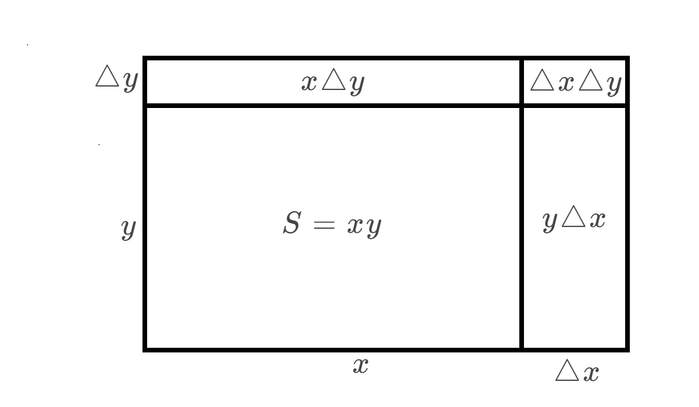 $$\small △S=(x+△x)(y+△y)-xy=y△x+x△y+△x△y$$
&emsp;&ensp; 上式右端由两个部分组成，一部分是 $\small\displaystyle y△x+x△y$ ，它是关于 $\small\displaystyle △x,△y$ 的线性函数 ；另外一部分是 $\small\displaystyle △x△y$ ，因为 $$\small \lim\limits_{\substack{△x→0 \\ △y→0}}\frac{△x△y}{\sqrt{(△x)^2+(△y)^2}}\leq\lim\limits_{\substack{△x→0 \\ △y→0}}\frac{\frac{(△x)^2+(△y)^2}{2}}{\sqrt{(△x)^2+(△y)^2}}=\lim\limits_{\substack{△x→0 \\ △y→0}}\frac{\sqrt{(△x)^2+(△y)^2}}{2}=0$$ &emsp;&ensp; 所以当 $\small\displaystyle △x→0,△y→0$ 时，$\small △x△y$ 是比 $\small\displaystyle ρ=\sqrt{(△x)^2+(△y)^2}$ 高阶的无穷小量，即 $$\small △S=y△x+x△y+o(ρ)(ρ→0)$$ $\small\displaystyle y△x+x△y$ 是 $\small\displaystyle △S$ 的主要部分，$\small o(ρ)$ 是误差，$\small △S≈y△x+x△y$ 。称 $\small\displaystyle y△x+x△y$ 为函数 $\small\displaystyle S=xy$ 在点 $\small\displaystyle (x,y)$ 处的全微分。

**至此，我们引出了可微的定义：**
&emsp;&ensp; 如果函数 $\small\displaystyle z=f(x,y)$ 在点 $\small\displaystyle (x,y)$ 的全增量 $\small\displaystyle △z=f(x+△x,y+△y)-f(x,y)$ 可表示为 $$\small △z=A△x+B△y+o(ρ)$$ &emsp;&ensp; 其中 $\small\displaystyle ρ=\sqrt{(△x)^2+(△y)^2}~,~A,B$ 不依赖于 $\small\displaystyle △x,△y$ 而仅仅与 $\small\displaystyle x,y$ 有关，则称函数 $\small\displaystyle z=f(x,y)$ 在点 $\small\displaystyle (x,y)$ 可微，而称 $\small\displaystyle A△x+B△y$ 为函数 $\small\displaystyle z=f(x,y)$ 在点 $\small\displaystyle (x,y)$ 的全微分，记作 $\small\displaystyle {\rm d}z$ ，即 $\small\displaystyle {\rm d}z=A△x+B△y$ 。

> $~~~~~~$ 实际上，$\small {\rm d}z=A△x+B△y$ 是由对 $\small\displaystyle f(x,y)$ 中的 $\small\displaystyle x,y$ 分别求偏导数得来的，也就是说全微分就是对其中的变量分别的偏导数的和，即： $$\small {\rm d}z=A△x+B△y=\frac{∂z}{∂x}△x+\frac{∂z}{∂x}△y=\frac{∂z}{∂x}{\rm d}x+\frac{∂z}{∂x}{\rm d}y$$

**判断函数 $\small\displaystyle z=f(x,y)$ 是否可微，步骤如下：**

1. 写出全增量 $\small\displaystyle △z=f(x_0+△x,y_0+△y)-f(x_0,y_0)$ 。
2. 写出线性增量 $\small\displaystyle A△x+B△y$ ，其中 $\small\displaystyle A=f_x'(x_0,y_0)~,~B=f_y'(x_0,y_0)$ 。
3. 作极限 $\small\displaystyle \lim\limits_{\substack{△x→0 \\ △y→0}}\frac{△z-(A△x+B△y)}{\sqrt{(△x)^2+(△y)^2}}$ 若该极限等于 $\small 0$ ，则 $\small\displaystyle z=f(x,y)$ 在点 $\small\displaystyle (x_0,y_0)$ 可微，否则就不可微。

> &emsp;&ensp; 用形式简单的 “线性增量” $\small\displaystyle A△x+B△y$ 去代替形式复杂的 “全增量 $\small\displaystyle △z$”，且其误差 $\small\displaystyle △z-(A△x+B△y)$ 是 $\small\displaystyle o(\sqrt{(△x)^2+(△y)^2})$ 。就是说，用简单的代替了复杂的，且产生的误差可以忽略不计，这就是可微的真正含义，在实际问题中，有时直接计算 $\small\displaystyle △z$ ，有时算出 $\small\displaystyle A△x+B△y$ 来近视 $\small\displaystyle △z$ 。

#### 偏导数的连续性

&emsp;&ensp; 对于 $\small\displaystyle z=f(x,y)$ ，讨论其在某特殊点 $\small\displaystyle (x_0,y_0)$ （比如二元分段函数的分段点）处编导数是否连续，是考研重点，其步骤为：

1. 用定义法求 $\small\displaystyle f_x'(x_0,y_0),f_y'(x_0,y_0)$ 。
2. 用公式法求 $\small\displaystyle f_x'(x_0,y_0),f_y'(x_0,y_0)$ 。
3. 计算 $\small\displaystyle \lim\limits_{\substack{△x→x_0 \\ △y→y_0}}f_x'(x,y)~,~\lim\limits_{\substack{△x→x_0 \\ △y→y_0}}f_y'(x,y)$ 。

&emsp;&ensp; 看 $\small\displaystyle \lim\limits_{\substack{△x→x_0 \\ △y→y_0}}f_x'(x,y)=f_x'(x_0,y_0) ~,~ \lim\limits_{\substack{△x→x_0 \\ △y→y_0}}f_y'(x,y)=f_y'(x_0,y_0)$ 是否成立，若成立，则 $\small\displaystyle z=f(x,y)$ 在点 $\small\displaystyle (x_0,y_0)$ 处的偏导数是连续的。

### 多元函数微分法则

#### 链式求导规则（显函数求导）

链式求导规则主要是针对显函数和抽象函数来使用。

1. 复合函数的中间变量均为一元函数的情形。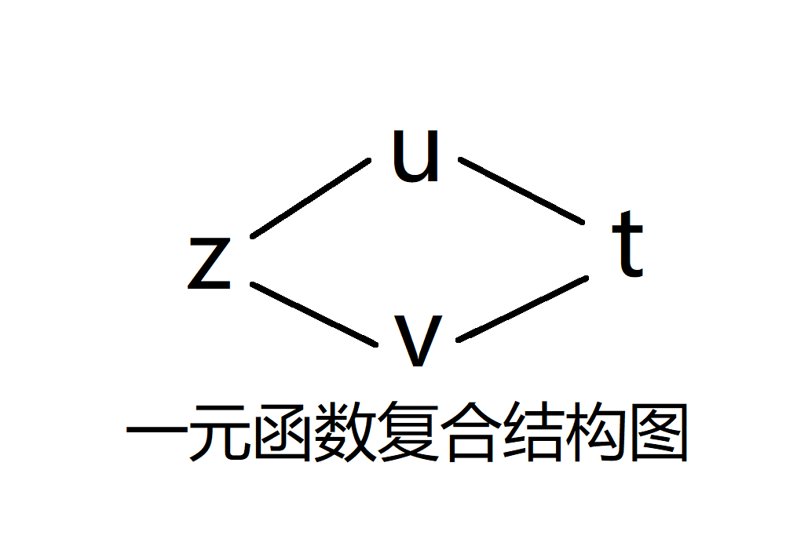
   &emsp;&ensp; 设 $\small\displaystyle z=f(u,v) ~,~ u=a(t) ~,~ v=b(t)$ ，则 $\small\displaystyle z=f[a(t),b(t)]$ ，且： $$\small \frac{{\rm d}z}{{\rm d}t}=\frac{∂z}{∂u}\frac{{\rm d}u}{{\rm d}t}+\frac{∂z}{∂v}\frac{{\rm d}v}{{\rm d}t}$$

   > &emsp;&ensp; 因为 $\small\displaystyle u,v$都有 $\small\displaystyle t$ 变量，所以根据复合函数求导原则，求最高级的 $\small\displaystyle u,v$ ，也就是求 $\small\displaystyle z$ 的全微分，然后在分别求 $\small\displaystyle u'(t),v'(t)$ ，与复合函数求导 $\small\displaystyle f[g(x)]'=f'[g(x)]·g'(x)$ 原理一样。
   > $$\small {{\rm d}z}=\frac{∂z}{∂x}{\rm d}x+\frac{∂z}{∂y}{\rm d}y$$

2. 复合函数的中间变量均为多元函数的情形。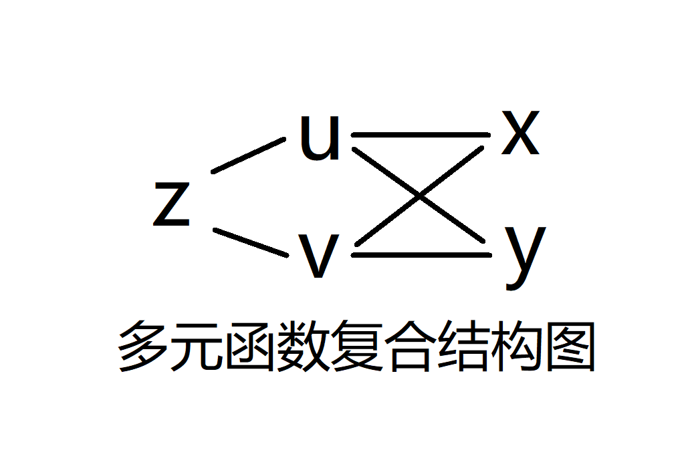
   &emsp;&ensp; 设 $\small\displaystyle z=f(u,v) ~,~ u=a(x,y) ~,~ v=b(x,y)$ ，则 $\small\displaystyle z=f[a(x,y),b(x,y)]$ ，且： $$\small \frac{∂z}{∂x}=\frac{∂z}{∂u}\frac{∂u}{∂x}+\frac{∂z}{∂v}\frac{∂v}{∂x} ~~,~~ \frac{∂z}{∂y}=\frac{∂z}{∂u}\frac{∂u}{∂y}+\frac{∂z}{∂v}\frac{∂v}{∂y}$$

3. 复合函数的中间变量既有一元函数，又有多元函数的情形
   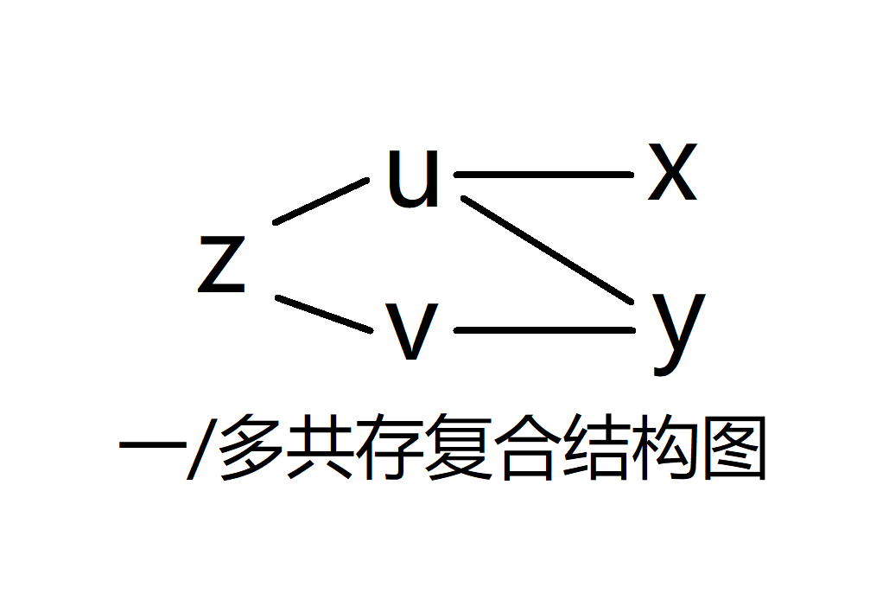
   &emsp;&ensp; 设 $\small\displaystyle z=f(u,v) ~,~ u=a(x,y) ~,~ v=b(y)$ ，则 $\small\displaystyle z=f[a(x,y),b(y)]$ ，且： $$\small \frac{∂z}{∂x}=\frac{∂z}{∂u}\frac{∂u}{∂x} ~~,~~ \frac{∂z}{∂y}=\frac{∂z}{∂u}\frac{∂u}{∂y}+\frac{∂z}{∂v}\frac{{\rm d}v}{{\rm d}y}$$

> &emsp;&ensp; 若 $\small\displaystyle f$ 具有二阶连续偏导数，则 $\small\displaystyle f_{12}''=f_{21}''$ ，简化使用。
> &emsp;&ensp; $\small\displaystyle f_1',$ 意思是对多元函数 $\small\displaystyle f(x,y)$ 中的第一属性求导（或偏导），$\small f_{12}''$ 的意思是对 $\small\displaystyle f(x,y)$ 中第一属性求导（或偏导），再在求导的结果中对再对第二个属性求导（或偏导）。
> &emsp;&ensp; 此写法可以在答题时直接使用。

#### 隐函数求导

&emsp;&ensp; 一般来说，形如 $\small y=f(x)$ 的函数称为**显函数**，例如 $\small\displaystyle y=\sin x$ ；由方程 $\small\displaystyle F(x,y)=0$ 所确定的函数称为**隐函数**，例如由方程 $\small\displaystyle x+y^3-1=0$ 确定的隐函数（其显函数表示为 $\small\displaystyle y=\sqrt[3]{1-x}$）。

&emsp;&ensp; **隐函数存在定理 $1~~$** 设函数 $\small\displaystyle F(x,y)$ 在点 $\small\displaystyle P(x_0,y_0)$ 的某一邻域内具有连续偏导数，$\small F(x_0,y_0)=0~,~F_y'(x_0,y_0)\neq 0$ ，则方程 $\small\displaystyle F(x,y)=0$ 在点 $\small\displaystyle (x_0,y_0)$ 的某一邻域内能确定一个连续且具有连续导数的函数 $\small y=f(x)$ ，它满足条件 $\small\displaystyle y_0=f(x_0)$ ，并有 $\small\displaystyle \frac{{\rm d}y}{{\rm d}x}=-\frac{F_x'}{F_y'}$ 。

> &emsp;&ensp; 这里的 $\small\displaystyle F_y'(x_0,y_0)\neq0$(也就是 $\small\displaystyle \frac{{\rm d}y}{{\rm d}x}$ 存在) 是定理的关键，因此，所谓的“隐函数”存在，是要求在一个“指定的位置”，方程 $\small\displaystyle F(x,y)=0$ 能确定一个“不仅有意义，而且要有可导这种性质的函数”，而在一个指定位置处可导的函数必然是单值的。

**证明 $\small\displaystyle \frac{{\rm d}y}{{\rm d}x}=-\frac{F_x'}{F_y'}$** ：
&emsp;&ensp; 将 $\small y=f(x)$ 代入 $\small\displaystyle F(x,y)=0$ ，得恒等式 $\small\displaystyle F(x,f(x))=0$ ，在这个恒等式两边对 $\small x$ 求导，得 $\small\displaystyle \frac{∂F}{∂x}+\frac{∂F}{∂y}·\frac{{\rm d}y}{{\rm d}x}=0$。
&emsp;&ensp; 由于 $\small\displaystyle F_y'$ 连续且 $\small\displaystyle F_y'(x_0,y_0)\neq0$ ，所以存在 $\small\displaystyle (x_0,y_0)$ 的一个邻域，在这个邻域内 $\small\displaystyle F_y'\neq0$ ，于是得 $\small\displaystyle \frac{{\rm d}y}{{\rm d}x}=-\frac{F_x'}{F_y'}$ 。

&emsp;&ensp; **隐函数存在定理 $2~~$** 设函数 $\small\displaystyle F(x,y,z)$ 在点 $\small\displaystyle P(x_0,y_0,z_0)$ 的某一邻域内具有连续偏导数，且 $\small\displaystyle F(x_0,y_0,z_0)=0~,~F_z'(x_0,y_0,z_0)\neq 0$ ，则方程 $\small\displaystyle F(x,y,z)=0$ 在点 $\small\displaystyle (x_0,y_0,z_0)$ 的某一邻域内能唯一确定一个连续且具有连续偏导数的函数 $\small\displaystyle z=f(x,y)$ ，它满足条件 $\small\displaystyle z_0=f(x_0,y_0)$ ，并有 $$\small \frac{∂z}{∂x}=-\frac{F_x'}{F_z'}~,~\frac{∂z}{∂y}=-\frac{F_y'}{F_z'}$$ &emsp;&ensp; 此公式的证明同样简单，将 $\small\displaystyle z=f(x,y)$ 代入 $\small\displaystyle F(x,y,z)=0$ 得 $\small\displaystyle F(x,y,f(x,y))=0$ ，式子两端分别对 $\small x$ 和 $\small\displaystyle y$ 求偏导数，得 $\small\displaystyle F_x'+F_z'·\frac{∂z}{∂x}=0~,~F_y'+F_z'·\frac{∂z}{∂y}=0$ 。
$~~~~~$因为 $\small\displaystyle F_z'$ 连续且 $\small\displaystyle F_z'(x_0,y_0,z_0)\neq0$ ，所以存在点 $\small\displaystyle (x_0,y_0,z_0)$ 的一个邻域，使得 $\small\displaystyle F_z'\neq0$ ，于是得 $\small\displaystyle \frac{∂z}{∂x}=-\frac{F_x'}{F_z'}~,~\frac{∂z}{∂y}=-\frac{F_y'}{F_z'}$ 。

> 同理，$\small\displaystyle F_z'(x_0,y_0,z_0)\neq0$（也就是 $\small\displaystyle \frac{∂z}{∂x},\frac{∂z}{∂y}$ 都存在且连续）是定理的关键。

### 多元函数的极值与最值

#### 概念

&emsp;&ensp; **定义 $1~~$** 若存在 $\small\displaystyle (x_0,y_0)$ 的某个邻域，使得在该邻域内任意一点 $\small\displaystyle (x,y)$ ，均有 $$\small f(x,y)\leq f(x_0,y_0)（或f(x,y)\geq f(x_0,y_0)）$$ 成立，则称 $\small\displaystyle (x_0,y_0)$ 为 $\small\displaystyle f(x,y)$ 的广义的极大值点（或极小值点），$\small f(x_0,y_0)$ 为 $\small\displaystyle f(x,y)$ 的**广义的极大值**（或**极小值**）。

&emsp;&ensp; **定义 $2~~$** 若存在 $\small\displaystyle (x_0,y_0)$ 的某个去心邻域，使得对于该邻域内任意一点 $\small\displaystyle (x,y)$ ，均有 $$\small f(x,y)<f(x_0,y_0)（或f(x,y)>f(x_0,y_0)$$ 成立，则称 $\small\displaystyle (x_0,y_0)$ 为 $\small\displaystyle f(x,y)$ 的**真正的极大值点**（或**极小值点**），$\small f(x_0,y_0)$ 为 $\small\displaystyle f(x,y)$ 的**真正极大值**（或**极小值**）。

&emsp;&ensp; **定义 $3~~$** 设 $\small\displaystyle (x_0,y_0)$ 为 $\small\displaystyle f(x,y)$ 定义域内一点，若对于 $\small\displaystyle f(x,y)$ 的定义域内任意一点 $\small\displaystyle (x,y)$ 均有 $$\small f(x,y)\leq f(x_0,y_0)（或f(x,y)\geq f(x_0,y_0)）$$ 成立，则称 $\small\displaystyle f(x_0,y_0)$ 为 $\small\displaystyle f(x,y)$ 的**广义的最大值**（或**最小值**）。

&emsp;&ensp; **定义 $4~~$** 设 $\small\displaystyle (x_0,y_0)$ 为 $\small\displaystyle f(x,y)$ 定义域内一点，若对于 $\small\displaystyle f(x,y)$ 的定义域内任意一个异于 $\small\displaystyle (x_0,y_0)$ 的点 $\small\displaystyle (x,y)$ ，均有 $$\small f(x,y)<f(x_0,y_0)（或f(x,y)> f(x_0,y_0)）$$ 成立，则称 $\small\displaystyle f(x_0,y_0)$ 为 $\small\displaystyle f(x,y)$ 的真正的最大值（或最小值）。

#### 无条件极值

1. **二元函数取极值的必要条件（类比一元函数）**
   &emsp;&ensp; 设 $\small\displaystyle z=f(x,y)$ 在点 $\small\displaystyle (x_0,y_0)\begin{cases} \small\displaystyle 一阶偏导数存在 \\ \small\displaystyle 可取极值 \end{cases}$ ，则 $\small\displaystyle f_x'(x_0,y_0)=0~,~f_y'(x_0,y_0)=0$ 。
   >该必要条件同样适用于三元及三元以上函数。

2. **二元函数取极值的充分条件**
   &emsp;&ensp; 记$\begin{cases} \small\displaystyle f_{xx}''(x_0,y_0)=A \\ \small\displaystyle f_{xy}''(x_0,y_0)=B \\ \small\displaystyle f_{yy}''(x_0,y_0)=C \end{cases}$ ，则 $\small\displaystyle △=B^2-AC\begin{cases} \small\displaystyle △<0 时 \begin{cases} \small\displaystyle A<0~为极大值 \\ \small\displaystyle A>0~为极小值 \end{cases} \\ \small\displaystyle △>0 时，非极值 \\ \small\displaystyle △=0 时,方法失效,用其他方法 \end{cases}$
   >该充分条件不适用于三元及三元以上函数。

>考试时无条件极值计算有这两个基本够了，满足充分必要条件必定为极值
>由此可以推断，考试时无条件极值只会考到二元函数，三元过于复杂。

#### 条件极值与拉格朗日乘数法

&emsp;&ensp; 求目标函数 $\small\displaystyle u=f(x,y,z)$ 在条件 $\begin{cases} \small\displaystyle  A(x,y,z)=0\\ \small\displaystyle B(x,y,z)=0\end{cases}$ 下的最值，则：
&emsp;&ensp; 1. 构造辅助函数 $\small\displaystyle F(x,y,z,C,D)=f(x,y,z)+CA(x,y,z)+DB(x,y,z)$ 。
&emsp;&ensp; 2. 令 $\begin{cases} \small\displaystyle  F_x'=f_x'+CA_x'+DB_x'=0 \\ \small\displaystyle F_y'=f_y'+CA_y'+DB_y'=0 \\ \small\displaystyle F_z'=f_z'+CA_z'+DB_z'=0 \\ \small\displaystyle F_C'=A(x,y,z)=0 ~,~ F_D'=B(x,y,z)=0 \end{cases}$
&emsp;&ensp; 3. 解出上述方程组得备选点 $\small\displaystyle P_i~,~i=1,2,3,…,n$ ，并求出 $\small\displaystyle f(P_i)$ ，取其最大值为 $\small\displaystyle U_{max}$ ，最小值为 $\small\displaystyle U_{min}$ ，若问题已表明最值存在，则此结果就是目标函数 $\small\displaystyle u=f(x,y,z)$ 的最大和最小值。

## 二重积分

### 概念、性质、对称性

#### 几何背景

&emsp;&ensp; 二重积分的几何背景就是曲顶柱体的体积。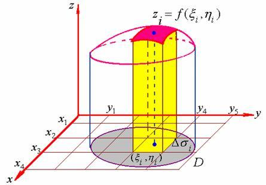
&emsp;&ensp; 设 $\small f(x,y)\geq0$ ，被积函数 $\small f(x,y)$ 可作为曲顶柱体在点 $\small (x,y)$ 处柱体微元的竖坐标（高），用底面积 $\small {\rm d}σ$ 乘以高 $\small f(x,y)$ ，得到一个“小竖条”的体积，当“小竖条”趋近于 $\small ∞$ 时，所有“小竖条”的体积之和就是整个曲顶梯形的体积，若 $\small f(x,y)< 0$ ，柱体就在 $\small xOy$ 的下方，二重积分的绝对值等于柱体的体积，但二重积分的值是负的，不过无论高 $\small f(x,y)$ 是正还是负，底面积 $\small {\rm d}σ$ 不能为负。
&emsp;&ensp; 在考研数学中，一般总假设 $\small f(x,y)$ 在 $\small D$ 上可积，即二重积分总是存在的。

#### 性质

1. **求区域面积** $\small \underset {D}{\displaystyle\iint}1·{\rm d}σ=\underset {D}{\displaystyle\iint}{\rm d}σ=A ~,~ \underset {D}{\displaystyle\iint}{\rm d}σ=\underset {D}{\displaystyle\iint}{\rm d}x{\rm d}y=A=\large\frac{1}{4}\small πa^2~,~x^2+y^2<a^2$ ，其中 $\small A$ 为 $\small D$ 的面积。

   > 百度找到的是 $\small A=πa^2$ ，但是代入计算答案不对，计算步骤中给的是 $ \large\frac{1}{4}\small πa^2$ 。

2. **可积函数必有界**$~~$ 当 $\small f(x,y)$ 在有界闭区域 $\small D$ 上可积时，则 $\small f(x,y)$ 在 $\small D$ 上必有界。

3. **积分的线性性质**$~~$ 设 $\small k_1,k_2$ 为常数，则 $$\small\underset {D}{\displaystyle\iint}[k_1f(x,y)\pm k_2g(x,y)]{\rm d}σ=k_1\underset {D}{\displaystyle\iint}f(x,y){\rm d}σ\pm k_2\underset {D}{\displaystyle\iint}g(x,y){\rm d}σ$$
4. **积分的可加性**$~~$ 当 $\small f(x,y)$ 在有界闭区域 $\small D$ 上可积时，且 $\small D_1∪D_2=D~,~D_1∩D_2=\varnothing$ ，则 $$\small\underset {D}{\displaystyle\iint}f(x,y){\rm d}σ=\underset {D_1}{\displaystyle\iint}f(x,y){\rm d}σ+\underset {D_2}{\displaystyle\iint}f(x,y){\rm d}σ$$
5. **积分的保号性**$~~$ 当 $\small f(x,y),g(x,y)$ 在有界闭区域 $\small D$ 上可积时，若在 $\small D$ 上，$\small f(x,y)\leq g(x,y)$ 则有 $$\small\underset {D}{\displaystyle\iint}f(x,y){\rm d}σ\leq \underset {D}{\displaystyle\iint}g(x,y){\rm d}σ$$ 特殊的有：$~~~~~~~~~~~$$\small \bigg\lvert\underset {D}{\displaystyle\iint}f(x,y){\rm d}σ\bigg\lvert\leq\underset {D}{\displaystyle\iint}|f(x,y){\rm d}σ|$

6. **二重积分的估值定理**$~~$ 设 $\small M,m$ 分别是 $\small f(x,y)$ 在有界闭区域 $\small D$ 上的最大值和最小值，$\small A$ 为 $\small D$ 的面积，则有 $$\small mA\leq \underset {D}{\displaystyle\iint}f(x,y){\rm d}σ\leq MA$$

7. **二重积分的中值定理**$~~$ 设函数 $\small f(x,y)$ 在有界闭区域 $\small D$ 上连续，$\small A$ 为 $\small D$ 的面积，则在 $\small D$ 上至少存在一点 $\small (ξ,η)$ ，使得： $\small \underset {D}{\displaystyle\iint}f(x,y){\rm d}σ=f(ξ,η)A$ 。

#### 普通对称性于轮换对称性

##### 普通对称性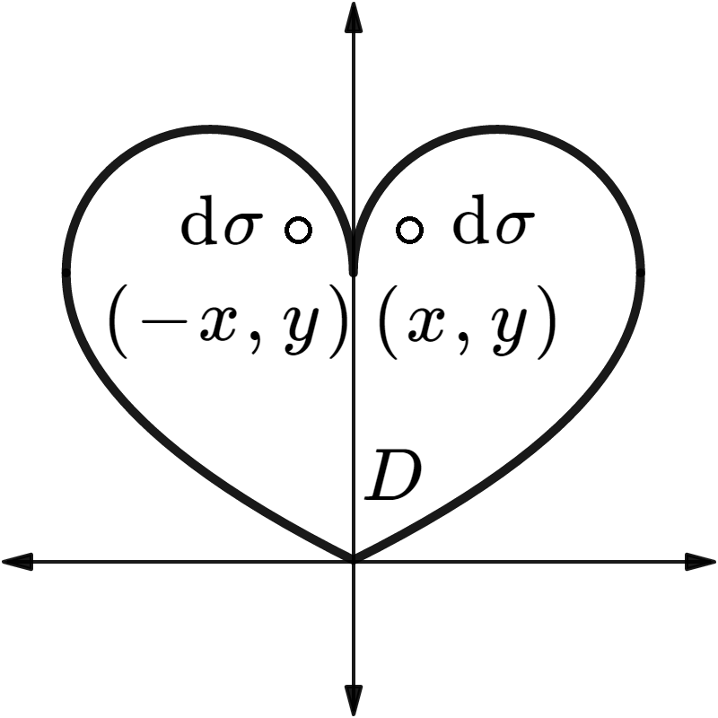

&emsp;&ensp; 设区域 $\small D$ 关于 $\small y$ 轴对称，如右图所示，取对称两块小面积 $\small {\rm d}σ$ ，对称点分别为 $\small (x,y)$ 与 $\small (-x,y)$ ，则对称点处的高分别为 $\small f(x,y)$ 与 $\small f(-x,y)$ 。依据定义，对称位置的两个“小竖条”的体积分别为 $\small f(x,y){\rm d}σ$ 与 $\small f(-x,y){\rm d}σ$ 。
&emsp;&ensp; 由于 $\small {\rm d}σ$ 一样，所以当 $\small f(x,y)=f(-x,y)$ 时，$\small f(x,y){\rm d}σ=f(-x,y){\rm d}σ$ ，体积相同，此时只需要计算一半的对称区域，然后乘以 $\small 2$ ，就可得整个积分值 ；而当 $\small f(x,y)=-f(-x,y)$ 时，$\small f(x,y){\rm d}σ=-f(-x,y){\rm d}σ$ ，对称位置体积正好相反，这样累加起来的总体积为 $\small 0$ 。于是，总结以上内容得到： $$\small\underset {D}{\iint}f(x,y){\rm d}x{\rm d}y=\begin{cases} \small\displaystyle  2\underset {D_1}{\displaystyle\iint}f(x,y){\rm d}x{\rm d}y~,~~~~f(x,y)=f(-x,y) \\ \small\displaystyle 0~,~~~~~~~~~~~~~~~~~~~~~~~~~~~f(x,y)=-f(-x,y) \end{cases}$$ 其中 $\small D_1$ 是 $\small D$ 在 $\small y$ 轴右边部分。

##### 轮换对称性

&emsp;&ensp; 首先看这样一个问题，$\small\displaystyle \underset {\scriptsize D_1:\frac{x}{4}+\frac{y}{3}\leq 1}{\displaystyle\iint}f(2x^2+3y^2){\rm d}x{\rm d}y$ 是否等于 $\small\displaystyle \underset {\scriptsize D_2:\frac{y}{4}+\frac{x}{3}\leq1}{\displaystyle\iint}f(2y^2+3x^2){\rm d}y{\rm d}x$ ？答案显然是相等的，因为上述两个积分只是将 $\small x$ 与 $\small y$ 这两个字母对调了，之所以相等，是因为**积分值与用什么字母表示是无关的**，这里并没有涉及任何对称性的概念，抽象来说，便有 $$\small\underset {D_{xy}}{\iint}f(x,y){\rm d}x{\rm d}y==\underset {D_{yx}}{\iint}f(y,x){\rm d}y{\rm d}x$$ &emsp;&ensp; 再看一个问题，$\small\underset {\scriptsize D_1:\frac{x}{4}+\frac{y}{4}\leq 1}{\displaystyle\iint}f(2x^2+3y^2){\rm d}x{\rm d}y$ 与 $\small \underset {\scriptsize D_1:\frac{x}{4}+\frac{y}{4}\leq 1}{\displaystyle\iint}f(2y^2+3x^2){\rm d}y{\rm d}x$ 是否相等？答案自然也是相等的，理由一样，但是在这个问题中的区域 $\small D$ 有个特点，就是 $\small x$ 与 $\small y$ 对调后，区域 $\small D$ 不变（事实上，区域 $\small D$ 关于 $\small y=x$ 对称）。
&emsp;&ensp; 于是可抽象化的写出这个式子：$$\small\underset {D}{\iint}f(x,y){\rm d}x{\rm d}y=\underset {D}{\iint}f(y,x){\rm d}y{\rm d}x$$ ，令 $\small {\rm d}σ={\rm d}x{\rm d}y$ ，则 $\small \underset {D}{\displaystyle\iint}f(x,y){\rm d}σ=\underset {D}{\displaystyle\iint}f(y,x){\rm d}σ$ 。整理以下可以这样来描述：
: 若把 $\small x$ 与 $\small y$ 对调后，区域 $\small D$ 不变（或区域 $\small D$ 关于 $\small y=x$ 对称），则 $$\small\underset {D}{\iint}f(x,y){\rm d}σ=\underset {D}{\iint}f(y,x){\rm d}σ$$ ，这就是**轮换对称性**。

### 计算

#### 直角坐标系下的计算法

&emsp;&ensp; 在直角坐标系下，按照积分次序不同，一般将二重积分的计算分为两种情况：

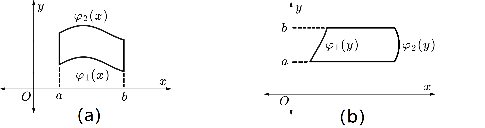

1. $\small \underset {D}{\displaystyle\iint}f(x,y){\rm d}σ=\displaystyle\int^b_a {\rm d}x\int^{φ_2(x)}_{φ_1(x)}f(x,y){\rm d}y$ ，$\small D$ 为 $\small X$ 型区域：$\small φ_1(x)\leq y\leqφ_2(x)~,~a \leq x\leq b$ 。
2. $\small \underset {D}{\displaystyle\iint}f(x,y){\rm d}σ=\displaystyle\int^b_a {\rm d}y\int^{φ_2(y)}_{φ_1(y)}f(x,y){\rm d}x$ ，$\small D$ 为 $\small Y$ 型区域：$\small φ_1(y)\leq x\leqφ_2(y)~,~a \leq x\leq b$ 。

> &emsp;&ensp; $\small φ(x)$ 就是把积分中的函数单独提出得到的 $\small y=f(x)$ ，代入上下限计算就是其结果 ，$\small φ(y)$ 同理。
> &emsp;&ensp; 后积的上下限是否要代入具体值或者代入函数式，主要看哪种方式简单，通常来说，后积式中往往会出现两个未知变量 $\small x,y$ ，这时，就需要取上下限为函数式来消掉另一个未知变量（通常取上限为函数式，下限为常数值，若上下限有一个等于$\small 0$，则其取$\small 0$，另一个上/下限取函数式）。
> 如果 $\small x,y$ 后积积分单调性与前积积分不同，那么后面的定积分上下限通常是变量公式。
> &emsp;&ensp; 如:$\small\underset {D}{\displaystyle\iint}2xy{\rm d}x{\rm d}y$ ，平面 $\small D$ 由直线 $\small y=2x,y=-1,x=1$ 构成，先积 $\small y$ 就是 $\small\displaystyle \int^{1}_{y}y{\rm d}x \int^{f(1)=1×2=2}_{f(y)=2x=-1×2÷2=-1}2x{\rm d}y$ ，先积 $\small x$ 就是 $\small\displaystyle \int^{2x}_{-1}2x{\rm d}y \int^{f(2x)=1÷2×2=1}_{f(y)=x=-1÷2=-0.5}y{\rm d}x$ ，具体先积谁就看哪个简单，也就是看被积函数。
> &emsp;&ensp; 先积后积积的是变量，即先积 $\small x$ 那么第一个就是 $\small\displaystyle \int^b_a xdy$ ，先积 $\small y$ 同理。
> &emsp;&ensp; 注意，在积分$\small\displaystyle \int^b_a{\rm d}x \int^d_c{\rm d}y$ 上下限 $\small a,b,c,d$ 有两个为变量时经常出现更换 $\small {\rm d}x{\rm d}y$ 的顺序后二重积分会出现分裂现象，如 $\small\displaystyle \int^1_{\frac{1}{2}}{\rm d}x \int^{4x}_{\frac{1}{x}}f(x,y){\rm d}y$ ，将 $\small x$ 取值代入 $\small y$ 中 ，得到两个数据 $\small 1<y<4,2<y<2$ ，这样写法当然是错误的，应该合起来理解 $\small 1<y<2,2<y<4$ 。这样就得到了两个 $\small y$ 的取值范围，两个取值范围自然有两个积分组成，而原式 $\small\displaystyle \int^1_{\frac{1}{2}}{\rm d}x \int^4x_{\frac{1}{x}}$ 就是由这两部分组成的，所以互换 $\small {\rm d}x,{\rm d}y$ 后的表达式为 $\small\displaystyle \int^2_1{\rm d}y\int^1_{\frac{1}{y}}f(x,y){\rm d}x+\int^4_2{\rm d}y+\int^1_{\frac{y}{4}}f(x,y){\rm d}y$ 。
> &emsp;&ensp; 正常情况下，只要题目没有给出 $\small x,y$ 的定值，那么除非 $\small x$ 或 $\small y=0$ ，否则 ${\rm d}x,{\rm d}y$ 上下限取关系式。
> &emsp;&ensp; 上面的二重积分转换成的一重积分写法严格来说应该是 $$\small \int^b_a \left[ \int^{φ_2}_{φ_1} f(x,y){\rm d}y\right]{\rm d}x$$

#### 极坐标系下的计算法

&emsp;&ensp; 在极坐标系下，按照积分区域与极点位置关系的不同，一般将二重积分的计算分为三种情况：

1. $\small \underset {D}{\displaystyle\iint}f(x,y){\rm d}σ=\displaystyle\int^β_α {\rm d}θ\int^{r_2(θ)}_{r_1(θ)}f(r\cos θ,r\sin θ)r{\rm d}r$（极点 $\small O$ 在区域 $\small D$ 外部）。
2. $\small \underset {D}{\displaystyle\iint}f(x,y){\rm d}σ=\displaystyle\int^β_α {\rm d}θ\int^{r(θ)}_0 f(r\cos θ,r\sin θ)r{\rm d}r$（极点 $\small O$ 在区域 $\small D$ 边界上）。
3. $\small \underset {D}{\displaystyle\iint}f(x,y){\rm d}σ=\displaystyle\int^{2π}_0 {\rm d}θ\int^{r(θ)}_0 f(r\cos θ,r\sin θ)r{\rm d}r$（极点 $\small O$ 在区域 $\small D$ 内部）。

> &emsp;&ensp; 在极坐标系下，几乎所有的计算都是先积 $\small r$ ，后积 $\small θ$ ，所以一般不讨论积分次序的交换问题。
> $\small x=r\cos θ,y=r\sin θ$ ，即$\small f(r\cos θ,r\sin θ)=f(x,y)$ 。
> $\small x^2+y^2\leq b^2$ 时， $\small 0 \leq θ \leq π~,~ 0 \leq r \leq b$ 。
> $\small a^2<x^2+y^2\leq b^2$ 时， $\small 0 \leq θ \leq 2π~,~ a \leq r \leq b$ 。

#### 极坐标系与直角坐标系选择的一般原则

一般来说，给出一个二重积分：

1. 先看被积函数是否为 $\small f(x^2+y^2)~,~f({\large\frac{y}{x}})~,~f({\large\frac{x}{y}})$ 等形式。
2. 再看积分区域是否为圆或者圆的一部分。

&emsp;&ensp; 如果是两者皆是，那么优先选用极坐标系，否则就优先考虑直角坐标系（这只是一般原则，不是必然规律，具体问题需要具体分析）。

#### 极坐标系与直角坐标系的相互转化

&emsp;&ensp; 把握两个东西，一是用好 $\small \begin{cases} \small x=r \cos θ \\ \small y=r\sin θ \end{cases}$ 这个公式，二是画好区域 $\small D$ 的图形 ，确定好上、下限的转化。

> &emsp;&ensp; 二重积分的考研题有个特点，就是命题人给出的坐标往往是不容易甚至是不能做出积分的，这就有两个出题角度，一是给出极坐标转换成直角坐标系取计算；二是反过来，给出直角坐标系转换成极坐标系去计算。

## 常微分方程

### 微分方程的概念

1. **微分方程**
   &emsp;&ensp; 含有未知函数及其导数的（或者微分）的方程称为**微分方程**，一般写成 $$\small F(x,y,y',…,y^{(n)})=0~或~y^{(n)}=f(x,y,y',y^{(n-1)})$$

2. **常微分方程**
   &emsp;&ensp; 未知函数是一元函数的微分方程称为**常微分方程**，如：$\small y'''-y''+6y=0~,~y{\rm d}x-(x+\sqrt{x^2+y^2}){\rm d}y=0$ 。

3. **微分方程的阶**
   &emsp;&ensp; 方程中未知函数导数的最高阶数称为**微分方程的阶**，如：$\small y'''-y''+6y=0$ 就是三阶方程。

4. **微分方程的解**
   &emsp;&ensp; 若将函数代入微分方程，使方程称为恒等式，则该函数称为**微分方程的解**，设 $\small\displaystyle y=y(x)$ 在区间 $\small I$ 上连续且有直到 $\small n$ 阶的导数，使 $\small\displaystyle F(x,y(x),y'(x),…,y^{(n)}(x))==0$ ，则称 $\small\displaystyle y=y(x)$ 为该微分方程在区间 $\small I$ 上的一个解。

5. **微分方程的通解**
   &emsp;&ensp; 若微分方程的解中含有的独立常数的个数等于微分方程的阶数，则该解称为该方程的通解，即：若 $\small\displaystyle y=y(x,C_1,C_2,…,C_n)$ 是 $\small n$ 阶微分方程 $\small\displaystyle F(x,y(x),y'(x),…,y^{(n)}(x)==0$ 在区间 $\small I$ 上的阶，其中 $\small\displaystyle C_1,C_2,…,C_n$ 为 $\small n$ 个独立的常数，则称它为该微分方程的通解。

6. **初始条件与特解**
   &emsp;&ensp; 确定通解中常数的条件就是**初始条件**，如：$\small y(x_0)=a_0,y'(x_0)=a_1,…,y^{(n-1)}(x_0)=a_{n-1}$ ，其中 $\small\displaystyle a_0,a_1,…,a_{n-1}$ 为 $\small n$ 个给定的数。确定了通解中的常数后，解就成了特解。

### 一阶微分方程的求解

1. **变量可分离型**
   能写成 $\small\displaystyle y'=f(x)g(y)$ 形式的方程称为变量可分离型方程，其解法为 $$\small \frac{{\rm d}y}{{\rm d}x}=f(x)g(y)⇒\int\frac{{\rm d}y}{g(y)}=\int f(x){\rm d}x$$ 例如：$\small\displaystyle \frac{{\rm d}y}{{\rm d}x}=e^{x-y}=e^{x}·e^{-y}⇒\int e^y{\rm d}y=\int e^x{\rm d}x⇒\begin{cases} \small\displaystyle e^y=e^x+C~（隐式解） \\ \small\displaystyle y=\ln(e^x+C)~（显式解） \end{cases}$

   > &emsp;&ensp; $\small\displaystyle \frac{{\rm d}y}{{\rm d}x}=f(x)g(y)$ ，两边同时乘以 $\small\displaystyle {\rm d}x$ 除以 $\small\displaystyle g(y)$ ，得 $\small\displaystyle \frac{{\rm d}y}{g(y)}=f(x)dx$
   > &emsp;&ensp; 一阶方程后面的常数 $\small\displaystyle C$ 代入计算没有问题，那么这个就是微分方程的通解，如果是二阶微分方程通解公式中就会出现两个常数，$\small n$ 阶微分方程的通解出现 $\small n$ 个常数。

2. **可化为变量可分离型**

   &emsp;&ensp; 1. 形如 $\small {\large\frac{{\rm d}y}{{\rm d}x}}=f(ax+by+c)$ 的方程，其中常数 $\small a,b$ 全都不为零，其解法为令 $\small\displaystyle u=ax+by+c$ ，则 $\small {\large\frac{{\rm d}u}{{\rm d}x}}=a+b{\large\frac{{\rm d}y}{{\rm d}x}}$ ，代入原方程得 $\small{\large\frac{{\rm d}u}{{\rm d}x}}=a+bf(u)$ 。

   &emsp;&ensp; 2. **齐次型微分方程**，如：对于微分方程 $$\small (x+y\cos\frac{y}{x}){\rm d}x-x\cos\frac{y}{x}{{\rm d}y}=0$$ $$\small {\rm 将其变形为}~~~~~~~~\frac{{\rm d}y}{{\rm d}x}=\frac{x+y\cos\frac{y}{x}}{x\cos\frac{y}{x}}=\frac{1+\frac{y}{x}\cos \frac{y}{x}}{\cos \frac{y}{x}}=φ(\frac{y}{x}) ~~~~~$$ 我们把形如 $\small\displaystyle \frac{{\rm d}y}{{\rm d}x}=φ(\frac{y}{x})$ 的方程叫作齐次性微分方程，其解法为令 $\small\displaystyle u=\frac{y}{x}$ ，则： $$\small y=ux⇒\frac{{\rm d}y}{{\rm d}x}=u+x\frac{{\rm d}u}{{\rm d}x}$$ ，于是原方程变为 $\small\displaystyle x\frac{{\rm d}u}{{\rm d}x}+u=φ(u)$ ，即 $\small\displaystyle \frac{{\rm d}u}{φ(u)-(u)}=\frac{{\rm d}x}{x}$ 。

   > $\small\displaystyle \frac{{\rm d}x}{{\rm d}y}=φ(\frac{x}{y})$ 型也是齐次方程，轮换性。

3. **一阶线性微分方程**
   &emsp;&ensp; 形如 $\small y'+p(x)y=q(x)$ 的方程，其中 $\small p(x),q(x)$ 为已知的连续函数。其通解公式为 $$\small y=e^{-\int p(x){\rm d}x}\left[ \int e^{\int p(x){\rm d}x}·q(x){\rm d}x+C\right]$$ 推导计算公式： 在方程两边同时乘以 $\small e^{\int p(x){\rm d}x}$ ，得：
   $$
   \small \begin{align} &e^{\int p(x){\rm d}x}·y'+e^{\int p(x){\rm d}x}·p(x)·y=e^{\int p(x){\rm d}x}·q(x)~,
   \\ 于是得：~~~~~~&\left[ e^{\int p(x){\rm d}x}·y \right]'=e^{\int p(x){\rm d}x}·q(x)~,
   \\ 两边积分，得：~~~~~~&e^{\int p(x){\rm d}x}·y=\int e^{\int p(x){\rm d}x}·q(x){\rm d}x+C
   \\ 则：~~~~~~&y=e^{-\int p(x){\rm d}x}\left[ \int e^{\int p(x){\rm d}x}·q(x){\rm d}x+C\right]\end{align}
   $$
   > $\small\displaystyle [e^{\int p(x){\rm d}x}·y]'=(e^{\int p(x){\rm d}x})'·y+e^{\int p(x){\rm d}x}·y'=e^{\int p(x){\rm d}x}~'·\left(\int p(x){\rm d}x\right)'·y+e^{\int p(x){\rm d}x}·y'$
   > 见到方程中最高次为 $\small y'$（或 $\large\frac{{\rm d}y}{{\rm d}x}$），且有 $\small xy,x$ 存在于不同元素中，立即联想到此公式。
   > 见到方程中存在 $\small e$ 的时候，立刻联想到此方程。
4. **伯努利方程（仅数学一要求）**
   &emsp;&ensp; 形如 $\small y'+p(x)y=q(x)y^n~(n\neq0,1)$ 的方程，其中 $\small p(x),q(x)$ 为已知的连续函数 ，其解法具体步骤为：
   1. 先变形为 $\small y^{-n}·y'+p(x)y^{1-n}=q(x)$ 。
   2. 令 $\small z=y^{1-n}$ ，得 $\small {\large\frac{{\rm d}z}{{\rm d}x}}=(1-n)y^{-n}{\large\frac{{\rm d}y}{{\rm d}x}}$ ，则 $\small {\large\frac{1}{1-n}}·{\large\frac{{\rm d}z}{{\rm d}x}}+p(x)z=q(x)$ 。
   3. 解出此一阶线性微分方程即可。

### 二阶可降阶微分方程的求解（仅数一数二要求）

1. **$\small y''=f(x,y')$ 型（方程中不显性含有未知函数 $\small\displaystyle y$ ）**

   1. 令 $\small\displaystyle y'=p(x),y''=p'$ ，则原方程·变为一阶方程 $\small\displaystyle \frac{{\rm d}p}{{\rm d}x}=f(x,p)$ 。
   2. 若求得其解为 $\small\displaystyle p=φ(x,C_1)$ ，即 $\small\displaystyle y'= φ(x,C_1)$ ，则原方程的通解为 $\small\displaystyle y=\displaystyle\int φ(x,C_1){\rm d}x+C_2$ 。

2. **$\small y''=f(y,y')$ 型（方程中不显性含有自变量 $\small x$ ）**
   1. 令 $\small\displaystyle y'=p,y''=\frac{{\rm d}p}{{\rm d}x}=\frac{{\rm d}p}{{\rm d}y}·\frac{{\rm d}y}{{\rm d}x}=\frac{{\rm d}p}{{\rm d}y}·p$ ，则原方程变为一阶方程 $\small\displaystyle P\frac{{\rm d}p}{{\rm d}y}=f(y,p)$ 。
      > $\small\displaystyle \frac{{\rm d}p}{{\rm d}x}={\rm d}p÷{\rm d}x × {\rm d}y÷{\rm d}y=({\rm d}p÷{\rm d}y)·({\rm d}y÷{\rm d}x)=\frac{{\rm d}p}{{\rm d}y}·\frac{{\rm d}y}{{\rm d}x}$ 。
      > 又 $\because \small\displaystyle \frac{{\rm d}y}{{\rm d}x}=y'=p~~,~~ \normalsize \therefore \small y''=\frac{{\rm d}p}{{\rm d}x}=\frac{{\rm d}p}{{\rm d}y}·\frac{{\rm d}y}{{\rm d}x}=\frac{{\rm d}p}{{\rm d}y}·p$ 。
   2. 若求得其解 $\small\displaystyle p=φ(y,C_1)$ ，则由 $\small\displaystyle p=\frac{{\rm d}x}{{\rm d}x}$ 可得 $\small\displaystyle \frac{{\rm d}y}{{\rm d}x}=φ(y,C_1)$ ，分离变量得 $\small\displaystyle \frac{{\rm d}y}{φ(y,C_1)}={\rm d}x$ 。
   3. 两边积分得 $\small\displaystyle \displaystyle\int\frac{{\rm d}y}{φ(y,C_1)}=x+C_2$ ，即可求得原方程的通解 。

### 高阶线性微分方程的求解

#### 概念

1. 方程的 $\small y''=p(x)y'+q(x)y=f(x)$ 称为**二阶变系数线性微分方程**，其中 $\small p(x),q(x)$ 叫做系数函数，$\small f(x)$ 叫做自由项，均为已知的连续函数。
   当 $\small f(x)==0$ 时，$\small y''+p(x)y'+q(x)y=0$ 为齐次方程。
   当 $\small f(x)$ 不恒等于 $\small 0$ 时，$\small y''+p(x)y'+q(x)y=f(x)$ 为**非齐次方程**。

2. 方程 $\small y''+py'+qy=f(x)$ 称为**二阶常系数线性微分方程**，其中 $\small p,q$ 为常数，$\small f(x)$ 叫做自由项。
   当 $\small f(x)==0$ 时，$\small y''+py'+qy=0$ 为齐次方程。
   当 $\small f(x)$ 不恒等于 $\small 0$ 时，$\small y''+py'+qy=f(x)$ 为非齐次方程。

#### 解的结构（以二阶为例）

$~~~~~~$ 1. 若 $\small y_1(x),y_2(x)$ 是 $\small y''+p(x)y'+q(x)y=0$ 的两个解，且 $\small {\large\frac{y_1(x)}{y_2(x)}}\neq C$（常数），则称 $\small y_1(x),y_2(x)$ 是该方程的两个线性无关的解，且 $\small y(x)=C_1y_1(x)+C_2y_2(x)$ 是方程 $\small y''+p(x)y'+q(x)y=0$ 的通解。

$~~~~~~$ 2. 若 $\small y(x)=C_1y_1(x)+C_2y_2(x)$ 是 $\small y''+p(x)y'+q(x)y=0$ 的通解，$\small y^*(x)$ 是 $\small y''+p(x)y'+q(x)y=f(x)$ 的一个特解，则 $\small y(x)+y^*(x)$ 是 $\small y''+p(x)y'+q(x)y=f(x)$ 的通解 。

$~~~~~~$ 3. 若 $\small y_1^*(x)$ 是 $\small y''+p(x)y'+q(x)y=f_1(x)$ 的解，$\small y_2^*(x)$ 是 $\small y''+p(x)y'+q(x)y=f_2(x)$ 的解，则 $\small y_1^*(x)+y_2^*(x)$ 是 $\small y''+p(x)y'+q(x)y=f_1(x)+f_2(x)$ 的解。

#### 二阶常系数齐次线性微分方程的通解

&emsp;&ensp; 对于 $\small y''+py'+qy=0$ ，其对应的特征方程为 $\small λ^2+pλ+q=0$ ，求其特征根，有以下三种情况（其中 $\small\displaystyle C_1,C_2$ ）：

&emsp;&ensp; 1. 若 $\small p^2-4q>0$ ，设 $\small λ_1,λ_2$ 是特征方程的两个不等实根，即 $\small λ_1\neq λ_2$ ，可得其通解为： $$\small y=C_1e^{λ_1x}+C_2e^{λ_2x}$$ &emsp;&ensp; 2. 若 $\small p^2-4q=0$ ，设 $\small λ_1,λ_2$ 是特征方程的两个相等的实根，即二重根，令 $\small λ_1=λ_2=λ$ ，可得其通解为： $$\small y=(C_1+C_2x)e^{λx}$$ &emsp;&ensp; 3. 若 $\small p^2-4q<0$ ，设 $\small α\pm βi$ 是特征方程的一对共轭复根，可得其通解为：$$\small y=e^{αx}(C_1\cos βx+C_2\sin βx)$$

> 特征根与二重特征根的 $\small λ_1,λ_2$ 为 $\small λ^2+pλ+q=0$ 得出来的解。
> 共轭复根解为 $\small α\pm βi={\large\frac{-b\pm i\sqrt{|b^2-4ac|}}{2a}}~,~α={\large\frac{-b}{2a}},β={\large\frac{\sqrt{|b^2-4ac|}}{2a}}$ ，$\small a,b,c$ 的位置为 $\small Aλ^2+Bλ+C=0$ 。
> 很多时候题目会要求求特解，特解就是给定 $\small C_1,C_2$ 具体值的解，题目会给出 $\small x,y$ 代入计算即可。

#### 二阶常系数非齐次线性微分方程的特解

&emsp;&ensp; 对于 $\small y''+py'+qy=f(x)$ ，《考研大纲》规定我们会需要解以下两种情况：
设 $\small P_n(x),P_m(x)$ 分别为 $\small x$ 的 $\small n$ 次，$\small m$ 次多项式：

&emsp;&ensp; 1. 当自由项 $\small f(x)=P_n(x)e^{αx}$ 时 ，特解要设为 $\small y^*=e^{αx}Q_n(x)x^k$ ，其中：$$ \small\begin{cases} e^{αx}~照抄 \\ Q_n(x)~为~x~的~n~次多项式，即~Q_n(x)=A_0+A_1x+A_2x^2+…+A_nx^n \\ k=\begin{cases} 0,~~~~~~α~不是特性根 \\ 1,~~~~~~α~是单特性根 \\ 2,~~~~~~α~是二重特性根 \end{cases} \end{cases}$$
&emsp;&ensp; 2. 当自由项 $\small f(x)=e^{αx}[P_m(x)\cos βx+P_n(x)\sin βx]$ 时，特解要设为 $\small y^*=e^{αx}[Q^1_l(x)\cos βx+Q^2_l(x)\sin βx]x^k$ ，其中：$$\small\begin{cases} e^{αx}~照抄 \\ l= m/n ~,~ Q^1_l(x),Q^2_l(x)~分别为~x~的两个不同的~l~次多项式~(即 m,n 可交换) \\ k=\begin{cases} 0,~~~~~~α\pm β~不是特性根 \\ 1,~~~~~~α\pm β~是特性根 \end{cases} \end{cases}$$

> 1. 若 $\small f(x)$ 中没有 $\small e^{αx}$ ，特解中就没有，则判断 $\small k$ 时 $\small α=0$ 。
> 2. $\small m,n$ 可以相等，特解不变。
> 3. 此处所谓的特征根，是指去掉 $\small f(x)$ 后作为齐次方程算出来的 $λ_1,λ_2$。
> $\small y*=A_0+A_1x+A_2x^2+…+A_nx^n$ ，那么 $y'=(A_0)'+(A_1x)'+…+(A_nx^n)$ ，类推。然后将其代入原方程得 $\small (Ay^*)''+(By^*)'+Cy^*=f(x)$，将 $\small A_0,A_1,A_2,…,A_n$ 解出来，得 $\small y^*=C_0+C_1x+C_2x^2+…+C_nx^n$ ，这就是齐次的特解。
> 4. 特解只是二阶常系数非齐次线性微分方程通解的一部分，将 $\small f(x)$ 去掉后变成二阶齐次微分方程，然后用定理得到的齐次微分方程通解加上非齐次方程特解的公式，就是方程的通解，即 $\small y=齐次方程通解+y^*$ 。

#### $\small n$ 阶常系数齐次线性微分方程的解

&emsp;&ensp; 方程 $\small y^{(n)}+p_1y^{(n-1)}+…+p_{n-1}y'+p_ny=0$ 称为 $\small n$ 阶常系数齐次线性微分方程，其中 $\small p_1,p_2,…,p_n$ 为常数，其对应的特性方程为 $\small λ^n+p_1λ^{n-1}+…+p_{n-1}λ+P_n=0$ ，求出其特性根，有如下情况（其中大写的英文字母均为任意常数）：
&emsp;&ensp; 1. 特征根为单实数根 $\small λ$ 时，微分方程通解中对应一项 $\small Ce^{λx}$ 。
&emsp;&ensp; 2. 特征根为 $\small k$ 重实数根 $\small λ$ 时，微分方程通解中对应 $\small k$ 项 $\small (C_1,C_2x,…,C_kx^{k-1})e^{λx}$ 。
&emsp;&ensp; 3. 特征根为单复根 $\small α\pm β(β>0)$ 时，微分方程通解中对应两项 $\small e^{αx}(C_1\cos βx+C_2\sin βx)$ 。
&emsp;&ensp; 4. 特征根为 $\small k$ 重复根 $\small α\pm β(β>0)$ 时，微分方程通解中对应 $\small 2k$ 项：$\small e^{αx}[(C_1,C_2x,…,C_kx^{k-1})\cos βx+(D_1,D_2x,…,D_kx^{k-1})\sin βx]$ 。

## 无穷极数（仅数一，数三要求）

### 常数项级数的概念与性质

&emsp;&ensp; **一尺之捶，日取其半，万世不竭**

#### 概念及其敛散性

&emsp;&ensp; 给定一个无穷数列 $\small u_1,u_2,…,u_n,…$ ，将其各项用加号连起来得到的**记号** $\footnotesize\displaystyle\sum^{∞}_{n=1}$$\small u_n$ ，即：$$\small \sum^{∞}_{n=1}u_n=u_1+u_2+…+u_n+…$$ 叫做**无穷级数**，简称**级数**，其中 $\small u_n$ 叫做该级数的**通项**，若 $\small u_n$ 是常数而不是函数，则 $\footnotesize\displaystyle\sum^{∞}_{n=1}$$\small u_n$ 就被更细致地称为**常数项无穷级数**，简称**常数项级数**。这里的通项式 $\small u_n={\large\frac{1}{2^n}}$ ，之所以称 $\footnotesize\displaystyle\sum^{∞}_{n=1}$$\small u_n$ 为一个记号，是说这种相加只是形式上的，因为无穷多项是不可能逐一相加求和的，在加不完的时候或者趋近无穷时考虑啥？极限。

&emsp;&ensp; 现将级数中的各项逐一相加，得到下面这些和：$$\small \begin{align*} S_1=u_1~,~&S_2=u_1+u_2~,~S_3=u_1+u_2+u_3~,
\\ \small\displaystyle&S_n=u_1+u_2+…+u_n , \end{align*}$$ 这称为级数的部分和，$\small \left\{ S_n \right\}$ 就是级数的部分和数列。显然，我们愿意去研究当 $\small n→∞$ 时所发生的事情，因为 $\small\displaystyle \lim_{n→∞}S_n=$$\footnotesize\displaystyle\sum^{∞}_{n=1}$$\small u_n$ ，这就道出了无穷多项相加的方法：用极限工具来处理，若 $\small\displaystyle \lim_{n→∞}S_n=S$ （一个存在的有限数），则 $\footnotesize\displaystyle\sum^{∞}_{n=1}$$\small u_n$ 收敛，并称 $\small S$ 为该收敛级数 $\footnotesize\displaystyle\sum^{∞}_{n=1}$$\small u_n$ 的和；若 $\small\displaystyle \lim_{n→∞}S_n$ 不存在或者为 $\small \pm ∞$ ，则称 $\footnotesize\displaystyle\sum^{∞}_{n=1}$$\small u_n$ 发散。

&emsp;&ensp; 研究一个级数 $\footnotesize\displaystyle\sum^{∞}_{n=1}$$\small u_n$ 是收敛还是发散，也可以简单的说成研究级数 $\footnotesize\displaystyle\sum^{∞}_{n=1}$$\small u_n$ 的敛散性。

#### 无穷级数的性质

**性质 1**$~~$ 若级数 $\footnotesize\displaystyle\sum^{∞}_{n=1}$$\small u_n~,~\footnotesize\displaystyle\sum^{∞}_{n=1}$$\small v_n$ 均收敛，且其和分别为 $\small S,T$ 则任给常数 $\small a,b$ ，有$\footnotesize\displaystyle\sum^{∞}_{n=1}$$\small (au_n+bv_n)$ 也收敛，且其和为 $\small aS+bT$ ，即： $$\small \sum^{∞}_{n=1}(au_n+bv_n)=a\sum^{∞}_{n=1}u_n+b\sum^{∞}_{n=1}v_n$$ ，这个性质称为收敛级数的线性性质。
在叙述下一个性质前，先给出一个概念：在级数 $\footnotesize\displaystyle\sum^{∞}_{n=1}$$\small u_n$ 中**去掉前 $\small m$ 项**，得 $$\small \sum^{∞}_{n=m+1}u_n=u_{m+1}+u^{m+2}+…+u_{n+k}+…$$ ，这叫作级数 $\footnotesize\displaystyle\sum^{∞}_{n=1}$$\small u_n$ 的 $\small m$ 项后余项。

**性质 2**$~~$ 若级数 $\footnotesize\displaystyle\sum^{∞}_{n=1}$$\small u_n$ 收敛，则其任意 $\small m$ 项后余项$\footnotesize\displaystyle\sum^{∞}_{n=m+1}$$\small u_n$ 也收敛，反之亦然；若存在 $\small m$ 项后余项 $\footnotesize\displaystyle\sum^{∞}_{n=1}$$\small u_n$ 收敛，则 $\footnotesize\displaystyle\sum^{∞}_{n=1}$$\small u_n$ 也收敛 ，反之亦然。
: > 改变级数任意有限项，不会改变该级数的敛散性。

**性质 3**$~~$ 若 $\footnotesize\displaystyle\sum^{∞}_{n=1}$$\small u_n$ 收敛，则 $\small\displaystyle \lim_{n→∞}u_n=0$ 。
&emsp;&ensp; **证明：** $\small \because u_n=S_n-S_{n-1}~,~\therefore \displaystyle\lim_{n→∞}u_n=\displaystyle\lim_{n→∞}(S_n-S_{n-1})=S-S=0$ 。

> 此性质为级数收敛的必要条件，但不充分。故其逆否命题为：若 $\small\displaystyle \lim_{n→∞}u_n\neq0$ ，则 $\footnotesize\displaystyle\sum^{∞}_{n=1}$$\small u_n$ 必发散 ，且即使 $\small\displaystyle \lim_{n→∞}u_n=0$ ，也不能保证 $\footnotesize\displaystyle\sum^{∞}_{n=1}$$\small u_n$ 收敛 。

### 无穷级数敛散性的判别方法

#### 正项级数及其敛散性判别

若通项 $\small u_n\geq0,n=1,2,…$ ，则称 $\footnotesize\displaystyle\sum^{∞}_{n=1}$$\small u_n$ 为**正项级数** 。

##### 名词解释

1. **几何级数 $\footnotesize\displaystyle\sum^{∞}_{n=0}$$\small\displaystyle a^n$**
   &emsp;&ensp; 几何级数形如标题的级数，以幂为级,与幂函数不同，它没有未知变量。

   > 几何级数的 $\small |a|>1$ 发散 ，$\small |a|<1$ 收敛。

2. **调和级数 $\footnotesize\displaystyle\sum^{∞}_{n=1}$$\small\displaystyle \frac{1}{n}$**
   &emsp;&ensp; 其展开式任意相连的三项分别设为 $\small\displaystyle a,b,c$ ，满足 $\small\displaystyle \frac{1}{b}=\frac{1}{2}\left( \frac{1}{a}+\frac{1}{c} \right)$ （即左右两项倒数之和的二分之一等于中间项的倒数），则称这种数为**调和级数**，调和级数必发散。

3. **$\small p$ 一级数 $\footnotesize\displaystyle\sum^{∞}_{n=1}$$\large\frac{1}{n^p} $**
   $~~~~~~$ $\small p$ 级数就是上标题的那个函数，此函数的敛散性与 $\small p$ 有关，$\small p>1$ 则级数收敛，$\small p\leq 1$ 则级数发散。

##### 收敛原则

&emsp;&ensp; 正项级数 $\footnotesize\displaystyle\sum^{∞}_{n=1}$$\small u_n$ 收敛的充分必要条件是它的部分和数列 $\small \left\{ S_n \right\}$ 有界。
**证明：** **必要性：** 由于 $\small u_n\geq 0$ ，故 $\small S_n=u_1+u_2+…+u_n\geq 0$ ，且 $\small S_1\leq S_2 \leq…\leq S_n\leq …$ ，$\small \left\{ S_n \right\}$ 天生便是一个单调不减且下界为 $\small 0$ 的数列，当 $\footnotesize\displaystyle\sum^{∞}_{n=1}$$\small u_n$ 收敛时，$\small\displaystyle \lim_{n→∞}S_n$ 存在，则 $\small \left\{ S_n \right\}$ 必有上界，若上、下界都有，则 $\small \left\{ S_n \right\}$ 有界。
&emsp;&ensp; **充分性：** 若 $\small \left\{ S_n \right\}$ 有界，$\small \because~\left\{ S_n \right\}$ 单调不减，又 $\small \because$ 单调有界准则，$\small \therefore~\left\{ S_n \right\}$ 收敛，即 $\small\displaystyle \lim_{n→∞}S_n$ 存在，$\small \therefore~\footnotesize\displaystyle\sum^{∞}_{n=1}$$\small u_n$ 收敛。

> &emsp;&ensp; 因为 $\small \left\{ S_n \right\}$ 天生单调不减，所以 $\small\displaystyle \lim_{n→∞}S_n$ 只有两种可能结果：1. 若 $\small \left\{ S_n \right\}$ 有界，则 $\small\displaystyle \lim_{n→∞}S_n=$ 有限数 ；若 $\small \left\{ S_n \right\}$ 无界，则 $\small\displaystyle \lim_{n→∞}S_n=+∞$ ，除此之外，别无结果。

&emsp;&ensp; 直接使用收敛原则来判别正项级数敛散性的情形并不多见，因为正项级数部分和有界性的证明往往并不容易，下面给出的方法为利用收敛原则的更实用的正项级数敛散性判别法。

##### 比较判别法

给出两个正项级数 $\footnotesize\displaystyle\sum^{∞}_{n=1}$$\small u_n$ 和 $\footnotesize\displaystyle\sum^{∞}_{n=1}$$\small v_n$ ，如果从某项起有 $\small u_n\leq v_n$ 成立，则：

1. 若 $\footnotesize\displaystyle\sum^{∞}_{n=1}$$\small v_n$ 收敛，则 $\footnotesize\displaystyle\sum^{∞}_{n=1}$$\small u_n$ 也收敛。
2. 若 $\footnotesize\displaystyle\sum^{∞}_{n=1}$$\small u_n$ 发散，则 $\footnotesize\displaystyle\sum^{∞}_{n=1}$$\small v_n$ 也发散。

> 两个正弦级数，若大的收敛，则小的必收敛；若小的发散，则大的必定发散。

##### 比较判别法的极限形式

&emsp;&ensp; 作为比较判别法的推论，这个方法更实用：给出两个正弦级数 $\footnotesize\displaystyle\sum^{∞}_{n=1}$$\small u_n$ 和 $\footnotesize\displaystyle\sum^{∞}_{n=1}$$\small v_n$$\small ~,~v_n\neq 0$ ，且 $\small\displaystyle \lim_{n→∞}\frac{u_n}{v_n}=A$ ，则：

1. 若 $\small A=0$ ，则当 $\footnotesize\displaystyle\sum^{∞}_{n=1}$$\small v_n$ 收敛时，$\small \footnotesize\displaystyle\sum^{∞}_{n=1}$$\small u_n$ 也收敛 。
2. 若 $\small A=+∞$ ，则当 $\footnotesize\displaystyle\sum^{∞}_{n=1}$$\small v_n$ 发散时，$\small \footnotesize\displaystyle\sum^{∞}_{n=1}$$\small u_n$ 也发散。
3. 若 $\small 0<A<+∞$ ，则 $\footnotesize\displaystyle\sum^{∞}_{n=1}$$\small v_n$ 与 $\footnotesize\displaystyle\sum^{∞}_{n=1}$$\small u_n$ 有相同的敛散性。

##### 比值判别法（也叫达朗尔判别法）

给出一个正项数 $\footnotesize\displaystyle\sum^{∞}_{n=1}$$\small u_n$ ，如果 $\small\displaystyle \lim_{n→∞}\frac{u_{n+1}}{u_n}=ρ$ ，那么：

1. 若 $\small ρ<1$ ，则 $\footnotesize\displaystyle\sum^{∞}_{n=1}$$\small u_n$ 收敛。
2. 若 $\small ρ>1$ ，则 $\footnotesize\displaystyle\sum^{∞}_{n=1}$$\small u_n$ 发散。
3. 若 $\small ρ=1$ ，则无法判断 $\footnotesize\displaystyle\sum^{∞}_{n=1}$$\small u_n$ 的敛散性。

##### 根值判别法（也叫柯西判别法）

给出一正项级数 $\footnotesize\displaystyle\sum^{∞}_{n=1}$$\small u_n$ ，如果 $\small\displaystyle \lim_{n→∞}\sqrt[n]{u_n}=ρ$ ，那么：

1. 若 $\small ρ<1$ ，则 $\footnotesize\displaystyle\sum^{∞}_{n=1}$$\small u_n$ 收敛。
2. 若 $\small ρ>1$ ，则 $\footnotesize\displaystyle\sum^{∞}_{n=1}$$\small u_n$ 发散。
3. 若 $\small ρ=1$ ，则无法判断 $\footnotesize\displaystyle\sum^{∞}_{n=1}$$\small u_n$ 敛散性。

#### 交错级数及其敛散性判别

&emsp;&ensp; 若级数**各项正负相间**出现，称这样的级数为**交错级数**，一般写为 $$\small \sum^{∞}_{n=1}(-1)^{n-1}u_n=u_1-u_2+u_3-u_4+…+(-1)^{n-1}u_n+…$$ ，其中 $\small u_n>0(n=1,2,…)$ ，以使各项的正负明显地呈现出来，从而表达出各项依次正负相间的独特规律。
&emsp;&ensp; 1714 年，在写给约翰·伯努利的信件中，莱布尼茨给出了下面这个定理，用于判别**交错级数**的敛散性，史称莱布尼茨判别法。

##### 莱布尼茨判别法

&emsp;&ensp; 给出一交错级数 $\footnotesize\displaystyle\sum^{∞}_{n=1}$$\small (-1)^{n-1}u_n~,~u_n>0,n=1,2,…$ ，若 $\small \left\{ u_n \right\}$ **单调不增**且 $\small\displaystyle \lim_{n→∞}u_n=0$ ，则该级数收敛。

> $\small \left\{ u_n \right\}$ 单调不增，即 $\small u_n\geq u_{n+1}$
> $\small (-1)^nu_n$ 可变为 $\small (-1)^nu_{n+1}$ ，两者在判断敛散性上效果一样。

#### 任意项级数及其敛散性判别

&emsp;&ensp; 若级数各项可正、可负、亦可为零，称这样的级数为**任意项级数**，写作 $\footnotesize\displaystyle\sum^{∞}_{n=1}$$\small u_n$ ，这里的 $\small u_n$ 不作限制，对于这种级数敛散性的判别方法，一般认为超出了本科高等数学的教学要求，此处不做讨论。在高等数学中，是按下述方式进行研究的。
&emsp;&ensp; 给任意项级数的每一项加上绝对值，写成 $\footnotesize\displaystyle\sum^{∞}_{n=1}$$\small |u_n|$ ，这样就使得 $\small |u_n|\geq 0$ ，成了正项级数，它叫作原级数 $\footnotesize\displaystyle\sum^{∞}_{n=1}$$\small u_n$ 的**绝对值级数**。
&emsp;&ensp; 因此绝对值级数就自然站到了正项级数的队伍中，前面讲的五种正项级数的敛散性判别法均可派上用场。绝对值级数 $\footnotesize\displaystyle\sum^{∞}_{n=1}$$\small |u_n|$ 与原级数 $\footnotesize\displaystyle\sum^{∞}_{n=1}$$\small u_n$ 敛散性有如下几个关系：
&emsp;&ensp; 1. 设 $\footnotesize\displaystyle\sum^{∞}_{n=1}$$\small u_n$ 为任意项级数，若 $\footnotesize\displaystyle\sum^{∞}_{n=1}$$\small |u_n|$ 收敛，则称 $\footnotesize\displaystyle\sum^{∞}_{n=1}$$\small u_n$ 绝对收敛。
&emsp;&ensp; 2. 设 $\footnotesize\displaystyle\sum^{∞}_{n=1}$$\small u_n$ 为任意项级数，若 $\footnotesize\displaystyle\sum^{∞}_{n=1}$$\small u_n$ 收敛，但 $\footnotesize\displaystyle\sum^{∞}_{n=1}$$\small |u_n|$ 发散，则称 $\footnotesize\displaystyle\sum^{∞}_{n=1}$$\small u_n$ 条件收敛。
&emsp;&ensp; 3. 若 $\footnotesize\displaystyle\sum^{∞}_{n=1}$$\small |u_n|$ 收敛（即任意项级数 $\footnotesize\displaystyle\sum^{∞}_{n=1}$$\small u_n$ 绝对收敛），则 $\footnotesize\displaystyle\sum^{∞}_{n=1}$$\small u_n$ 必收敛。

#### 收敛级数的性质

&emsp;&ensp; **性质 4**$~~$ 收敛级数的项任意加括号后所得的新级数仍然收敛，且其和不变。
&emsp;&ensp; **证明：** 给出一收敛级数 $\footnotesize\displaystyle\sum^{∞}_{n=1}$$\small u_n$ ，其部分和记为 $\small \left\{ S_n \right\}:~S_1,S_2,…,S_n,…$ ，且 $\small\displaystyle \lim_{n→∞}S_n=S$ （存在），将此级数的项任意加括号得新级数 $$\small (u_1+…+u_{n_1})+(u_{n_1+1}+…+u_{n_2})+(u_{n_2+1}+…+u_{n_3})+…$$ 这个级数的部分和数列记为 $\small \left\{ S_n \right\}:~S_1,S_2,…,S_n,…~,~k=1,2,…$ ，显然其为 $\small \left\{ S_n \right\}$ 的某个子数列，故 $\small \left\{ S_{n_k} \right\}$ 亦收敛于 $\small S$ 。

> 根据**性质 4**可得：
> $~~$ 1. 若加括号后得到的新级数发散，则原级数必然发散（逆否命题）。
> $~~$ 2. 若加括号后得到的新级数收敛，不能断定原级数一定收敛。

&emsp;&ensp; **性质 5**$~~$ 若原级数绝对收敛，**不论将其各项如何重新排列**，所得的新级数也绝对收敛，且其和不变（绝对收敛的级数具有可交换性，此性质由德国数学家狄利克雷给出）。

### 幂级数及其收敛域

#### 概念

1. **函数项级数**
   &emsp;&ensp; 设函数列 $\small \left\{ u_n(x) \right\}$ 定义在区间 $\small I$ 上，称 $\small u_1(x)+u_2(x)+…+u_n(x)+…$ 为定义在区间 $\small I$ 上的**函数项级数**，记为 $\footnotesize\displaystyle \sum^{∞}_{n=1}$$\small u_n(x)$ ，当 $\small x$ 取确定的值 $\small x_0$ 时，$\small \footnotesize\displaystyle \sum^{∞}_{n=1}$$\small u_n(x)$ 成为常数项级数 $\footnotesize\displaystyle\sum^{∞}_{n=1}$$\small u_n(x_0)$ 。

2. **幂级数**
   &emsp;&ensp; 若 $\footnotesize\displaystyle \sum^{∞}_{n=1}$$\small u_n(x)$ 的一般项 $\small u_n(x)$ 是 $\small n$ 次幂函数，则称 $\footnotesize\displaystyle \sum^{∞}_{n=1}$$\small u_n(x)$ 为**幂级数**，它是一种特殊且常用的函数项级数，其一般形式为

   $$
   \small \begin{align*} &\sum^{∞}_{n=0}a_n(x-x_0)^n=a_0+a_1(x-x_0)+a_2(x-x_0)^2+…+a_n(x-x_0)^n+…
   \\ &其标准形式为~~~~~~\sum^{∞}_{n=0}a_nx^n=a_0+a_1x+a_2x^2+…+a_nx^n+…  \end{align*}$$ 其中 $\small a_n(n=0,1,2,…)$ 为**幂级数的系数**。
   > 看不懂？看泰勒公式，幂级数又称泰勒级数。

3. **收敛点与发散点**
   若给定 $\small x_0∈ I$ ，有 $\footnotesize\displaystyle \sum^{∞}_{n=1}$$\small u_n(x_0)$ 收敛，则称点 $\small x_0$ 为幂级数 $\footnotesize\displaystyle \sum^{∞}_{n=1}$$\small u_n(x)$ 的**收敛点**。
   若给定 $\small x_0∈ I$ ，有 $\footnotesize\displaystyle \sum^{∞}_{n=1}$$\small u_n(x_0)$ 发散，则称点 $\small x_0$ 为幂级数 $\footnotesize\displaystyle \sum^{∞}_{n=1}$$\small u_n(x)$ 的**发散点**。

4. **收敛域**
   &emsp;&ensp; 函数项级数 $\footnotesize\displaystyle \sum^{∞}_{n=1}$$\small u_n(x)$ 的所有收敛点的集合称为它的**收敛域**。
   > &emsp;&ensp; 下方的两个方法都是求收敛域的方法，因为不可能一个一个的求收敛点再集合起来，这样就是穷举了，穷举永远是最差的办法（最重要的是几乎所有幂函数都有无数个收敛点）。

#### 阿贝尔定理

&emsp;&ensp; 当幂级数 $\footnotesize\displaystyle \sum^{∞}_{n=0}$$\small a_nx^n$ 在点 $\small x=x_1(x_1\neq0)$ 处收敛时，对于满足 $\small |x|<|x_1|$ 的一切 $\small x$ ，幂级数**绝对收敛**。
&emsp;&ensp; 当幂级数 $\footnotesize\displaystyle \sum^{∞}_{n=0}$$\small a_nx^n$ 在点 $\small x=x_2(x_2\neq0)$ 处发散时，对于满足 $\small |x|>|x_2|$ 的一切 $\small x$ ，幂级数**发散**。
&emsp;&ensp; 阿贝尔定理没有给出任何具体操作，需要借助下面的方法进行计算。

> &emsp;&ensp; 阿贝尔并没有给出收敛与分界点的敛散性理论，直至今日也没有任何理论单独讨论这两个点，因此在计算这两个点时，要选择直接把点代入幂级数中，将其转换为常数项级数，利用常数项级数的计算方法和理论来判别。

#### 收敛域的求法

&emsp;&ensp; 1. 若 $\small\displaystyle \lim_{n→∞}\left| \frac{a_{n+1}}{a_n} \right|=ρ$ ，则 $\footnotesize\displaystyle\sum^{∞}_{n=0}$$\small a_nx^n$ 的收敛半径 $\small R$ 的表达式为 $$\small R=\begin{cases} {\large\frac{1}{ρ}}~,~~~~~~~~~ρ\neq0 \\ +∞~,~~~~~~ρ=0 \\ 0~,~~~~~~~~~~ρ=+∞ \end{cases}$$

&emsp;&ensp; 2. 开区间 $\small (-R,R)$ 为幂级数 $\footnotesize\displaystyle\sum^{∞}_{n=0}$$\small a_nx^n$ 的收敛区间；单独考查幂级数在 $\small x=\pm R$ 处的敛散性就可以确定其收敛域为 $\small (-R,R)$ 或 $\small [-R,R)$ 或 $\small (-R,R]$ 或 $\small [-R,R]$ 。

若计算计算过于复杂，可以尝试下面这种计算方法：

&emsp;&ensp; 1. 将题目给出的级数看作一个函数项级数 $\footnotesize\displaystyle\sum^{∞}_{n=0}$$\small U_n(x)$ ，记 $\footnotesize\displaystyle\sum^{∞}_{n=0}$$\small |U_n(x)|\geq 0$ 。
: > 如：题目是 $\small a_nx^n$ ，$\small a_nx^n$ 就是一个函数项级数（所有的无穷级数都是函数项级数），然后加根号记 $\small |a_nx^n|\geq 0$ 。

&emsp;&ensp; 2. 作 $\small\displaystyle \lim_{n→∞}\frac{|U_{n+1}(x)|}{|U_n(x)|}=ρ$ 或 $\small\displaystyle \lim_{n→∞} \sqrt[n]{|U_n(x)|}=ρ$ 。令 $\small\displaystyle ρ<1$ ，得到 $\small x$ 的收敛区间 $\small\displaystyle x ∈ (a,b)$（也可以写成 $\small\displaystyle x ∈ (-a,+a)$）。
&emsp;&ensp; 3. 单独讨论 $\small\displaystyle x=a,x=b$ （也可写成 $\small\displaystyle x=-a,x=+a)$）的敛散性，得到 $\footnotesize\displaystyle\sum^{∞}_{n=0}$$\small U_n(x)$ 的收敛域。

> &emsp;&ensp; 收敛区间是指未代入分界点的 $\footnotesize\displaystyle\sum^{∞}_{n=0}$$\small U_n(x)$ 的收敛范围，收敛域是指代入了分界点的 $\footnotesize\displaystyle\sum^{∞}_{n=0}$$\small U_n(x)$ 取值范围。
> &emsp;&ensp; 上方的方法与定理在一般幂级数 $\footnotesize\displaystyle\sum^{∞}_{n=0}$$\small a_n(x-x_0)^n$ 与标准幂级数 $\footnotesize\displaystyle\sum^{∞}_{n=0}$$\small a_nx^n$ 通用且完全一致，所以并未赘述。

### 幂级数求和函数

#### 和函数概念

在收敛域上，记 $\small S(x)=$$\footnotesize\displaystyle\sum^{∞}_{n=1}$$\small u_n(x)$ ，并称 $\small S(x)$ 为 $\footnotesize\displaystyle\sum^{∞}_{n=1}$$\small u_n(x)$ 的和函数。

#### 运算法则

若幂级数 $\footnotesize\displaystyle\sum^{∞}_{n=0}$$\small a_nx^n$ 与 $\footnotesize\displaystyle\sum^{∞}_{n=0}$$\small b_nx^n$ 的收敛半径分别为 $\small R_a,R_b~(R_a\neq R_b)$ ，则有：

1. $\small k\footnotesize\displaystyle\sum^{∞}_{n=0}$$\small a_nx^n=$ $\footnotesize\displaystyle\sum^{∞}_{n=0}$$\small ka_nx^n~,~|x|<R_a~,~k$ 为常数。
2. $\footnotesize\displaystyle\sum^{∞}_{n=0}$$\small a_nx^n\pm$$\footnotesize\displaystyle\sum^{∞}_{n=0}$$\small b_nx^n=$ $\footnotesize\displaystyle\sum^{∞}_{n=0}$$\small (a_n\pm b_n)x^n~,~|x|<R=\min \left\{ R_a,R_b \right\}$

> 求和函数就是通过一系列算法将级数转换成泰勒展开式与其他数结合，因为直接计算不可能。
> 在实际运算中，可能出现需要改变通项、下标的问题，现总结求和运算中恒等变形方式如下：
>
> 1. 通项、下标一起变： $\footnotesize\displaystyle\sum^{∞}_{n=k}$$\small a_nx^n=$ $\footnotesize\displaystyle\sum^{∞}_{n=k+l}$$\small a_{n-l}x^{n-l}$ ，其中 $\small l$ 为整数，可正可负可零。
> 2. 只变下标，不变通项：$\footnotesize\displaystyle\sum^{∞}_{n=k}$$\small a_nx^n=a_kx^k+a_{k+1}x^{k+1}+…+a_{k+l-1}x^{k+l-1}+\footnotesize\displaystyle\sum^{∞}_{n=k+l}$$\small a_nx^n$
> 3. 只变通项，不变下标：$\footnotesize\displaystyle\sum^{∞}_{n=k}$$\small a_nx^n=$$\small x^l\footnotesize\displaystyle\sum^{∞}_{n=k}$$\small a_nx^{n-l}$
>    举例：$\footnotesize\displaystyle\sum^{∞}_{n=0}$$\small a_nx^{2n}+$$\footnotesize\displaystyle\sum^{∞}_{n=0}$$\small b_{n-1}x^{2n+2}=a_0x^0+\footnotesize\displaystyle\sum^{∞}_{n=1}$$\small a_nx^{2n}+\footnotesize\displaystyle\sum^{∞}_{n=1}$$\small b_nx^{2n}=a_0+\footnotesize\displaystyle\sum^{∞}_{n=1}$$\small (a_n+b_n)x^{2n}$

#### 性质

&emsp;&ensp; 1. 幂级数 $\footnotesize\displaystyle\sum^{∞}_{n=0}$$\small a_nx^n$ 的和函数 $\small S(x)$ 在其收敛区间 $\small I$ 上连续，且如果幂级数在收敛区间的端点 $\small x=R$ （或$\small x=-R$ ）处收敛，则和函数 $\small S(x)$ 在 $\small (-R,R]$ （或 $\small [-R,R)$ ）上连续。
&emsp;&ensp; 2. 幂级数 $\footnotesize\displaystyle\sum^{∞}_{n=0}$$\small a_nx^n$ 的和函数 $\small S(x)$ 在其收敛区间 $\small I$ 上可积，且有逐项积分公式 $$\small \int^x_0S(x)dt=\int^x_0(\sum^{∞}_{n=0}a_nt^n)dt=\sum^{∞}_{n=0}a_n\int^x_0t^ndt=\sum^{∞}_{n=0}\frac{a_n}{n+1}x^{n+1}~(x∈I)$$ ，逐项积分后所得到的幂级数与原级数有相同的收敛半径，但收敛域可能扩大。
&emsp;&ensp; 3. 幂级数 $\footnotesize\displaystyle\sum^{∞}_{n=0}$$\small a_nx^n$ 的和函数 $\small S(x)$ 在其收敛区间 $\small (-R,R)$ 内可导，且有逐项求导公式 $$\small S'(x)=\left( \sum^{∞}_{n=0}a_nx^n \right)'=\sum^{∞}_{n=0}(a_nx^n)'=\sum^{∞}_{n=1}na_nx^{n-1}~(|x|<R)$$ ，逐项求导后所得到的幂级数与原级数有相同的收敛半径，但收敛域可能缩小。

#### 重要展开式

1. $\small\displaystyle e^x=\sum^{∞}_{n=0}\frac{x^n}{n!}=1+x+\frac{x^2}{2!}+…+\frac{x^n}{n!}+…~,~(-∞<x<∞)$
2. $\small\displaystyle \frac{1}{1+x}=\sum^{∞}_{n=0}(-1)^nx^n=1-x+x^2-x^3+…+(-1)^nx^n+…~,~(-1<x<1)$
3. $\small\displaystyle \frac{1}{1-x}=\sum^{∞}_{n=0}x^n=1+x+x^2+…+x^n+…~,~(-1<x<1)$
4. $\small\displaystyle \ln(1+x)=\sum^{∞}_{n=1}(-1)^{n-1}\frac{x^n}{n}=x-\frac{x^2}{2}+\frac{x^3}{3}-\frac{x^4}{4}+…+(-1)^{n-1}\frac{x^n}{n}+…~,~(-1<x\leq 1)$
5. $\small\displaystyle \sin x=\sum^{∞}_{n=0}(-1)^n\frac{x^{2n+1}}{(2n+1)!}$
   $~~~~~~~$ $\small\displaystyle =x-\frac{x^3}{3!}+\frac{x^5}{5!}-\frac{x^7}{7!}+…+(-1)^n\frac{x^{2n+1}}{(2n+1)!}+…~,~(-∞<x<∞)$
6. $\small\displaystyle\cos x=\sum^{∞}_{n=0}(-1)^n\frac{x^{2n}}{(2n)!}$
   $~~~~~~~$ $\small\displaystyle =1-\frac{x^2}{2!}+\frac{x^4}{4!}-\frac{x^6}{6!}+…+(-1)^n\frac{x^{2n}}{(2n)!}+…~,~(-∞<x<∞)$
7. $\small\displaystyle (1+x)^α=1+αx+\frac{α(α-1)}{2!}x^2+…+\frac{α(α-1)…(a-n+1)}{n!}x^n+…~,~\begin{cases} \small\displaystyle x∈(-1,1)~,~当α\leq-1~,~收敛域为(-1,1) \\ \small\displaystyle x∈(-1,1]~,~当-1<α<0~,~收敛域为(-1,1] \\ \small\displaystyle x∈[-1,1]~,~当α>0~,~收敛域为[-1,1] \end{cases}$

&emsp;&ensp; 其中 1~6 号公式右端 $\small x$ 的取值范围是至收敛域，而对于 $\small 7$ ，问题比较复杂，其收敛区域的端点是否收敛与 $\small α$ 的取值有关。

> 老规矩了， 可存在 $\small x=2x ~,~ x=2x+1 ~,~ x=$ 狗。

### 函数展开成幂级数(或幂级数求和函数)

#### 展开概念

&emsp;&ensp; 如果函数 $\small f(x)$ 在点 $\small x=x_0$ 处存在任意阶导数，则称 $$\small f(x_0)+f'(x_0)(x-x_0)+\frac{f''(x_0)}{2!}(x-x_0)^2+…+\frac{f^{(n)}(x_0)}{n!}(x-x_0)^n+…$$ 为函数 $\small f(x)$ 在 $\small x_0$ 处的泰勒级数，若收敛，则 $\small f(x)=\footnotesize\displaystyle\sum^{∞}_{n=0}$$\small\displaystyle \frac{f^{(n)}(x_0)}{n!}$$\small (x-x_0)^n$ 。
&emsp;&ensp; 特别的，当 $\small x_0=0$ 时，则称 $$\small f(0)+f'(0)x+\frac{f''(0)}{2!}x^2+…+\frac{f^{(n)}(0)}{n!}x^n+…$$ 为函数 $\small f(x)$ 的**麦克劳林级数**，若收敛，则 $\small f(x)=\footnotesize\displaystyle\sum^{∞}_{n=0}$$\small\displaystyle \frac{f^{(n)}(0)}{n!}$$\small x^n$ 。
&emsp;&ensp; 统称为函数展开称幂级数。

#### 求法

&emsp;&ensp; **方法 $1$（直接法）$~~$** 逐个计算 $\small \displaystyle a_n=\small\frac{f^{(n)(x_0)}}{n!}\normalsize (n=0,1,…)$ ，并代入 $$\small f(x_0)+f'(x_0)(x-x_0)+\frac{f''(x_0)}{2!}(x-x_0)^2+…+\frac{f^{(n)}(x_0)}{n!}(x-x_0)^n+…$$ 但是这种直接法太麻烦了，一般情况下不会使用。

&emsp;&ensp; **方法 $2$（间接法）$~~$** 利用已知的幂级数展开式，通过变量代换，四则运算，逐项求导，逐项积分和待定系数等方法得到函数展开式，注意展开式后面的 $\small x$ 取值范围，要代入公式进行换算的。
> &emsp;&ensp; 若幂级数与展开式相似，则直接进行变换，若不相似，尝试 $\small\displaystyle \int^x_0 S(t)=\int^x_0 {\footnotesize\displaystyle\sum^{∞}_{n=0}}f(t)$ 。
> 求和函数一定要级数先求出收敛域，最后结论写法为 “ $\small S(x)=g(x)~,~ x∈(a,b)$ ” 或 $\small [a,b],(a,b],[a,b)$ ，注意两个边界点要单独讨论。

## 多元函数积分学的基础知识（仅数一要求）

### 向量代数

#### 向量及其表达方式

&emsp;&ensp; 既有大小又有方向的量称为向量。
&emsp;&ensp; 两个向量，只要它们的大小相等，方向相同，它们就是相等的向量,与它们在空间中的位置无关（这也称为**向量的自由性**）。
&emsp;&ensp; 向量的表达形式为 $\small \boldsymbol{a}=(a_x,a_y,a_z)=a_x\boldsymbol{i}+a_y\boldsymbol{j}+a_z\boldsymbol{k}$

> &emsp;&ensp; $\small \boldsymbol{i},\boldsymbol{j},\boldsymbol{k}$ 分别代表向量 $\boldsymbol{a}$ 在$\small x,y,z$轴上的方向向量。
> &emsp;&ensp; 将 $\small a$ 看作一个力，那么这个力就是由 $\small x,y,z$ 三个方向发出的力组成的和力，每个方向力的大小加力的方向就是这个力的大小与方向。
> **两点间的距离公式**
> $\small A(x_1,y_1)~,~B(x_2,y_2)$ ，则 $\small AB$ 距离 $\small =\sqrt{(x_2-x_1)^2+(y_2-y_1)^2}$
> $\small A(x_1,y_1,z_1)~,~B(x_2,y_2,z_2)$ ，则 $\small AB$ 距离 $\small =\sqrt{(x_2-x_1)^2+(y_2-y_1)^2+(z_2-z_1)^2}$
>**坐标表示表示**$~~$ $\small \vec{a}=(x,y,z) ~;~ A(x_1,y_1,z_1)~,~B(x_1,y_1,z_1)$ ，则 $\small \overrightarrow{AB}=(x_2-x_1,y_2-y_1,z_2-z_1)$

#### 向量的运算及其应用

设 $\small \boldsymbol{a}=(a_x,a_y,a_z)~,~\boldsymbol{b}=(b_x,b_y,b_z)~,~\boldsymbol{c}=(c_x,c_y,c_z)~,~\boldsymbol{a},\boldsymbol{b},\boldsymbol{c}$ 均不是零向量。

1. **数量积（内积，点积）及其应用（$\small \boldsymbol{a}·\boldsymbol{b}$）**

   1. $\small \boldsymbol{a}·\boldsymbol{b}=(a_x,a_y,a_z)·(b_x,b_y,b_z)=a_xb_x+a_yb_y+a_zb_z$
   2. $\small \boldsymbol{a}·\boldsymbol{b}=|\boldsymbol{a}||\boldsymbol{b}|\cos θ$ ，则 $\small\ \cos θ={\large\frac{\boldsymbol{a}·\boldsymbol{b}}{|\boldsymbol{a}||\boldsymbol{b}|}}={\large\frac{a_xb_x+a_yb_y+a_zb_z}{\sqrt{a_x^2+a_y^2+a_z^2}·\sqrt{b_x^2+b_y^2+b_z^2}}}$ 其中 $\small θ$ 为 $\small \boldsymbol{a},\boldsymbol{b}$ 的夹角。
   3. $\small \boldsymbol{a}⊥\boldsymbol{b} ⇔ θ=\large\frac{π}{2} \small ⇔ \boldsymbol{a}·\boldsymbol{b}=|\boldsymbol{a}||\boldsymbol{b}|\cos θ =0 ⇔ a_xb_x+a_yb_y+a_zb_z=0$
   4. $\small {\rm Prj_b}\boldsymbol{a}=\large\frac{\boldsymbol{a}·\boldsymbol{b}}{|\boldsymbol{b}|}\small=\large\frac{a_xb_x+a_yb_y+a_zb_z}{\sqrt{b_x^2+b_y^2+b_z^2}}$ 称为 $\small \boldsymbol{a}$ 在 $\small \boldsymbol{b}$ 上的投影。
      > $\small |\boldsymbol{a}|$ ： 向量 $\small \boldsymbol{a}$ 的模，向量的长度称作向量的模，其值为：$\small \sqrt{x^2+y^2+z^2}$

2. **向量积（外积、叉积）及其应用**
   1. $\small\displaystyle \boldsymbol{a}×\boldsymbol{b}=\left| \begin{matrix}  \boldsymbol{i} &\boldsymbol{j} &\boldsymbol{k} \\ a_x &a_y &a_z \\b_a &b_y &b_z \end{matrix} \right|$ ，其中 $\small |\boldsymbol{a}×\boldsymbol{b}|=|\boldsymbol{a}||\boldsymbol{b}|\sin θ$ ，用右手规则确定方向（转向角不超过 $\small π$），$\small θ$ 为 $\small \boldsymbol{a},\boldsymbol{b}$ 的夹角。
   2. $\small \boldsymbol{a}~ {\rm //} ~\boldsymbol{b} ⇔ θ=0$ 或 $π ⇔ =\large\frac{a_x}{b_x}\small= \large\frac{a_y}{b_y} \small= \large\frac{a_z}{b_z}$
   3. $\small a·b$ 与 $\small a,b$ 分别垂直。即将 $\small a·b$ 视为一条直线的向量，则这条直线与 $\small a,b$ 向量所在的直线分别垂直 。

#### 向量的方向角和方向余弦

&emsp;&ensp; 1. $\small \boldsymbol{a}$ 与 $\small x$轴、$\small y$轴和$\small z$轴正向的夹角 $\small α,β,γ$ 称为 $\small \boldsymbol{a}$ 的**方向角**。
&emsp;&ensp; 2. $\small \cos α,\cos β,\cos γ$ 称为 $\small \boldsymbol{a}$ 的**方向余弦**，且 $\small \cos α=\large\frac{a_x}{|\boldsymbol{a}|} \small~,~\cos β=\large\frac{a_y}{|\boldsymbol{a}|} \small~,~\cos γ=\large\frac{a_x}{|\boldsymbol{a}|}$。
&emsp;&ensp; 3. $\small \boldsymbol{a}^{\rm o}= \large\frac{\boldsymbol{a}}{|\boldsymbol{a}|} \small=(\cos α,\cos β,\cos γ)$ 称为向量 $\small \boldsymbol{a}$ 的**单位向量**（表示方向向量）。
&emsp;&ensp; 4. 任意向量 $\small \boldsymbol{r}=x\boldsymbol{i}+y\boldsymbol{j}+z\boldsymbol{k}=(r\cos α,r\cos β,r\cos γ)=r(\cos α,\cos β,\cos γ)$ ，其中 $\small \cos α,\cos β,\cos γ$ 为 $\small \boldsymbol{r}$ 的方向余弦，$\small r$ 为 $\small \boldsymbol{r}$ 的模，$\small \cos α= \large\frac{x}{\sqrt{x^2+y^2+z^2}} \small~,~\cos β= \large\frac{y}{\sqrt{x^2+y^2+z^2}} \small~,~ \cos γ= \large\frac{z}{\sqrt{x^2+y^2+z^2}} \small~,~ r=\sqrt{x^2+y^2+z^2}$ 。

### 空间平面与直线

#### 平面方程

以下假设平面的法向量 $\small\boldsymbol{n}=(A,B,C)$ ,法向量是垂直于平面的向量。

1. 一般式：$\small Ax+By+Cz+D=0$
2. 点法式：$\small A(x-x_0)+B(y-y_0)+C(z-z_0)=0$
   > &emsp;&ensp; 垂直于平面的直线，其向量的分量 $\small x,y,z$ 分别乘平面向量的分量 $\small x,y,z$ 的和为零，即 $\small x_ax_b+y_ay_b+z_az_b=0$ ，而法向量就是垂直于平面的向量，其线就是垂直于平面的线（所有垂直于平面的向量都是平面的法向量）。
3. 三点式：$\small \left| \begin{matrix}  x-x_1 &y-y_1 &z-z_1 \\x-x_2 &y-y_2 &z-z_2 \\ x-x_3 &y-y_3 &z-z_3 \end{matrix} \right|=0$（平面过不共线的三点 $\small P_i(x_i,y_i,z_i)~,i=1,2,3$ ）。
4. 截距式：$\small\displaystyle \frac{x}{a}+\frac{y}{b}+\frac{z}{c}=1$（平面过 $\small (a,0,0)~,~(0,b,0)~,~(0,0,c)$ 三点）。

> 主要用前两个。

#### 直线方程

以下假设直线的方向向量 $\small \boldsymbol{τ}=(l,m,n)$ 。

1. 一般式 $\small \begin{cases} A_1x+B_1y+C_1z+D_1=0 ~,~ \boldsymbol{n}_1=(A_1,B_1,C_1) \\ A_2x+B_2y+C_2z+D_2=0 ~,~ \boldsymbol{n}_2=(A_2,B_2,C_2) \end{cases}$ ，其中 $\small \boldsymbol{n}_1$ 不平行于 $\small \boldsymbol{n}_2$ 。
   > 其几何背景就是两个平面的交线，且该直线的方向向量 $\small \boldsymbol{τ}=\boldsymbol{n}_1×\boldsymbol{n}_2$ 。
2. 点向式（标准式、对称式）：$\small\displaystyle\frac{x-x_0}{l}=\frac{y-y_0}{m}=\frac{z-z_0}{n}$ 。
   > &emsp;&ensp; 常用。在直线 $\small L$ 上取一点 $\small a_0$ ，再取一点 $\small a$ ，那么向量 $\small \overrightarrow {a_0a}=(x-x_0,y-y_0,z-z_0)$ ，直线上任取两点组成的直线必定平行于该直线，向量同理，平行则向量分量必成比例。
3. 参数式：$\small \begin{cases} x=x_0+lt \\ y=y_0+mt \\ z=z_0+nt \end{cases}$ ，$\small M(x_0,y_0,z_0)$ 为直线上的已知点，$\small t$ 为参数。
4. 两点式：$\large \frac{x-x_1}{x_2-x_1} \small= \large\frac{y-y_1}{y_2-y_1} \small= \large\frac{z-z_1}{z_2-z_1}$ （直线过不同的两点 $\small P_1(x_i,y_i,z_i) ~,~ i=1,2$ ）。

#### 位置关系

1. **距离**
   点 $\small P_0(x_0,y_0,z_0)$ 到平面 $Ax+by+Cz+D=0$ 的距离 $\small d= \large\frac{|Ax_0+By_0+Cz_0+D|}{\sqrt{A^2+B^2+C^2}}$

2. **直线间的关系**
   设 $\small \boldsymbol{τ}_1=(l_1,m_1,n_1)~,~\boldsymbol{τ}_2=(l_2,m_2,n_2)$ 分别为直线 $\small L_1,L_2$ 的方向向量 1. $\small L_1⊥L_2 ⇔ \boldsymbol{τ}_1⊥\boldsymbol{τ}_2⇔l_1l_2+m_1m_2+n_1n_2=0$ 。 2. $\small L_1 ~//~ L_2 ⇔ \boldsymbol{τ}_1 ~//~ \boldsymbol{τ}_2 ⇔ \large\frac{l_1}{l_2} \small= \large\frac{m_1}{m_2} \small= \large\frac{n_1}{n_2}$ 。

3. **平面间的关系**
   设平面 $\small α,β$ 的法向量分别为 $\small \boldsymbol{n}_1=(A_1,B_1,C_1) ~,~ \boldsymbol{n}_2=(A_2,B_2,C_2)$ 1. $\small α⊥β ⇔ \boldsymbol{n}_1⊥\boldsymbol{n}_2⇔A_1A_2+B_1B_2+C_1C_2=0$ 。 2. $\small α ~//~ β ⇔ \boldsymbol{n}_1 ~//~ \boldsymbol{n}_2 ⇔ \large\frac{A_1}{A_2} \small= \large\frac{B_1}{B_2} \small= \large\frac{C_1}{C_2}$ 。
   > &emsp;&ensp; 若平面的法向量垂直，那么平面也垂直，若法向量平行平面也平行。

4. **平面与直角的关系**
   设直线 $\small L$ 的方向向量为 $\small \boldsymbol{τ}=(l,m,n)$ ，平面 $\small α$ 的法向量为 $\small \boldsymbol{n}=(A,B,C)$ 1. $\small L⊥α ⇔ \boldsymbol{τ} ~//~ \boldsymbol{n} ⇔ \large\frac{A}{l} \small= \large\frac{B}{m} \small= \large\frac{C}{n}$ 。 2. $\small L~//~α ⇔ \boldsymbol{τ}⊥\boldsymbol{n}⇔Al+Bm+Cn=0$ 。
   > &emsp;&ensp; 如果直线与法向量垂直那么就会与平面平行；如果直线与法向量平行，那么就会与平面垂直。
   > &emsp;&ensp; 平面与平面之间，线与线之间的公式相同，但线与面之间不相同，因为对比的是法向量与向量。

### 空间曲线与曲面

#### 空间曲线

1. 一般式 $\small Γ:\begin{cases} F(x,y,z)=0 \\ G(x,y,z)=0 \end{cases}$ ，其几何背景为两个曲面的交线。
2. 参数方程 $\small Γ:\begin{cases}x=φ(x) \\ y=ψ(x) \\ z=ω(t) \end{cases} ~,~ t∈[α,β]$ 。**常用**。
3. 空间曲线在坐标面上的投影（**重点**）
   &emsp;&ensp; 以求曲线 $\small Γ$ 在 $\small xOy$ 平面上的投影曲线为例，将 $\small Γ:\begin{cases} F(x,y,z)=0 \\ G(x,y,z)=0 \end{cases}$ 中的 $\small z$ 消去（通过基本运算法则把 $\small F(x,y,z)=0,G(x,y,z)=0$ 合并并消除 $\small z$ ，可以是替换、减掉，约分等等），得到 $\small φ(x,y)=0$ ，则曲线 $\small Γ$ 在 $\small xOy$ 平面上的投影曲线包含于曲线 $\small \begin{cases} φ(x,y)=0 \\ z=0 \end{cases}$ 。 > &emsp;&ensp; 大括号是连例，因为空间曲线中缺少 $\small x,y,z$ 中某一向量的值，我们一般将其视为柱面（即 $\small z→ ∞$），所以这里连例了 $\small z=0$ ，只取在 $\small z=0$ 上的那个曲线，这个才是投影曲线，空间曲线 $\small Γ$ 投影到 $\small z$ 上的曲线。
   &emsp;&ensp; 曲线 $\small Γ$ 在 $\small xOy$ 其他平面上的投影曲线可类似求得。

#### 空间曲面

1. **曲面方程**：$F(x,y,z)=0$ 。

2. **二次曲面**
   若一个表中有两个曲面名称，则图为第一曲面的图，但是第二的曲面的图与其有相关性。
   |曲面名称|方程|图形|
   | :--: | :--: | :--: |
   |椭球面 | $\small\displaystyle \frac{x^2}{a^2}+\frac{y^2}{b^2}+\frac{z^2}{c^2}=1$  $\small x^2+y^2+z^2=a^2~(球面)$ | 
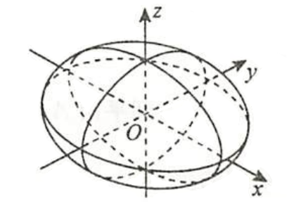
 |
   |单叶双曲面 (线性代数中考)| $\small\displaystyle \frac{x^2}{a^2}+\frac{y^2}{b^2}-\frac{z^2}{c^2}=1$| 
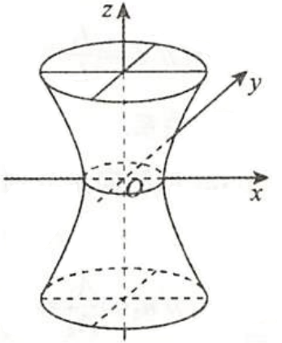
 |
   | 双叶双曲面 (线性代数中考) | $\small\displaystyle \frac{x^2}{a^2}-\frac{y^2}{b^2}-\frac{z^2}{c^2}=1$ | 
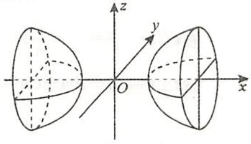
 |

   |                   曲面名称                    |                                                                  方程                                                                  |                                    图形                                    |
   | :-------------------------------------------: | :------------------------------------------------------------------------------------------------------------------------------------: | :------------------------------------------------------------------------: |
   |  椭圆抛物面    旋转抛物面 |                     $\small\displaystyle \frac{x^2}{2p}+\frac{y^2}{2q}=z~(p,q>0)$   $\small x^2+y^2=z$                     | 
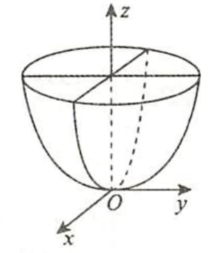
 |
   |     椭圆锥面     锥面     | $\small\displaystyle \frac{x^2}{a^2}+\frac{y^2}{b^2}=\frac{z^2}{c^2}$ $\small z^2=x^2+y^2$   $\small z=\sqrt{x^2+y^2}$ |  
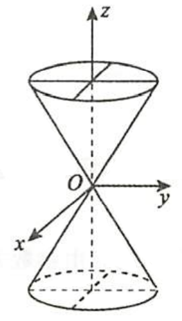
  |
   |             双曲抛物面（马鞍面）1             |                                     $\small\displaystyle -\frac{x^2}{2p}+\frac{y^2}{2q}=z~(p,q>0)$                                     |  
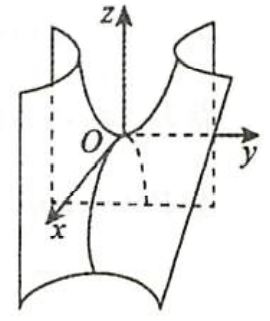
   |
   |  双曲抛物面（马鞍面）2 |                                                             $z=xy$ (主要考的双曲抛物线)                                                             |  
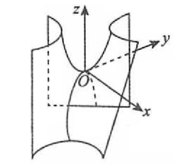
   |

3. **柱面：动直线沿定曲面平行移动所形成的曲面**
   椭圆柱面： $\large\frac{x^2}{a^2} \small+ \large\frac{y^2}{b^2} \small=1$（当 $\small a=b$ 时为圆柱面）
   双曲柱面： $\large\frac{x^2}{a^2} \small- \large\frac{y^2}{b^2} \small=1$
   抛物柱面： $\small y=ax^2$

   > 在空间解析几何中，一般认为缺少变量的方程为柱面。

4. **旋转曲面（重点）：曲线 $\small Γ$ 绕一条定直线旋转一周所形成的曲面。**
   &emsp;&ensp; 曲线 $\small Γ: \begin{cases} F(x,y,z)=0 \\ G(x,y,z)=0 \end{cases}$ ，绕直线 $\small L: \large\frac{x-x_0}{m} {\small ~=~} \frac{y-y_0}{n} {\small ~=~} \frac{z-z_0}{p}$ 旋转形成一个旋转曲面，旋转曲面方程的求法如下：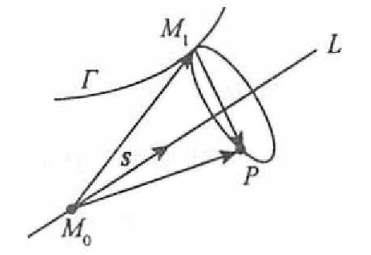
   &emsp;&ensp; 如右图所示，已知点 $\small M_0(x_0,y_0,z_0)$ ，方向向量 $\small s=(m,n,p)$ 。在母线 $\small Γ$ 上任取一点 $\small M_1(x_1,y_1,z_1)$ ，则过 $\small M_1$ 的纬圆上任意一点 $\small P(x,y,z)$ 满足条件 $\small \overrightarrow{M_1P}⊥s ~,~ |\overrightarrow{M_0P}|=|\overrightarrow{M_0M_1}|$ ，即：$$\small \begin{cases} m(x-x_1)+n(y-y_1)+p(z-z_1)=0 \\ (x-x_0)^2+(y-y_0)^2+(z-z_0)^2=(x_1-x_0)^2+(y_1-y_0)^2+(z_1-z_0)^2 \end{cases}$$ 与方程 $\small F(x_1,y_1,z_1)=0$ 和 $\small G(x_1,y_1,z_1)=0$ 联立消去 $x_1,y_1,z_1$ ，便可得到旋转曲面的方程。

### 多元函数微分学的几何应用

#### 空间曲线的切线与法平面

1. 设空间曲线 $\small Γ$ 由参数方程 $\small \begin{cases} x=φ(t) \\ y=ψ(t) \\ z=ω(t) \end{cases}$ 给出，其中 $\small φ(t),ψ(t),ω(t)$ 均可导，$\small P_0(x_0,y_0,z_0)$ 是 $\small Γ$ 上的点，且当 $\small t=t_0$ 时，$\small φ'(t_0),ψ'(t_0),ω'(t_0)$ 都不为 $\small 0$ ，则：

   1. 曲线 $\small Γ$ 在点 $\small P_0(x_0,y_0,z_0)$ 处的切向量为 $\small \boldsymbol{τ}=(φ'(t_0),ψ'(t_0),ω'(t_0))$ 。
   2. 曲线 $\small Γ$ 在点 $\small P_0(x_0,y_0,z_0)$ 处的切线方程为： $\large\frac{x-x_0}{φ'(t_0)} {\small ~=~} \frac{y-y_0}{ψ'(t_0)} {\small ~=~} \frac{z-z_0}{ω'(t_0)}$ 。
   3. 曲线 $\small Γ$ 在点 $\small P_0(x_0,y_0,z_0)$ 处的法平面（过点 $\small P_0(x_0,y_0,z_0)$ 且与切线垂直的平面）方程为：$\small φ'(t_0)(x-x_0)+ψ'(t_0)(y-y_0)+ω'(t_0)(z-z_0)$ 。

2. 设空间曲线 $\small Γ$ 由参数方程 $\small \begin{cases} F(x,y,z)=0 \\ G(x,y,z)=0 \end{cases}$ 给出，则在以下表达式有意义的条件下，有：
   1. 曲线 $\small Γ$ 在点 $\small P_0(x_0,y_0,z_0)$ 处的切向量为： $$\small \boldsymbol{τ}=\left( \left|\begin{matrix} F_y' &F_z' \\ G_y' &G_z'  \end{matrix}\right|_{P_0}~,~\left|\begin{matrix} F_z' &F_x' \\ G_z' &G_x'  \end{matrix}\right|_{P_0} ~,~ \left|\begin{matrix} F_x' &F_y' \\ G_x' &G_y'  \end{matrix}\right|_{P_0} \right)$$
   2. 曲线 $\small Γ$ 在点 $\small P_0(x_0,y_0,z_0)$ 处的切线方程为： $$\small \frac{x-x_0}{\left|\begin{matrix} F_y' &F_z' \\ G_y' &G_z'  \end{matrix}\right|_{P_0}} = \frac{y-y_0}{\left|\begin{matrix} F_z' &F_x' \\ G_z' &G_x'  \end{matrix}\right|_{P_0}} = \frac{z-z_0}{\left|\begin{matrix} F_x' &F_y' \\ G_x' &G_y'  \end{matrix}\right|_{P_0}}$$
   3. 曲线 $\small Γ$ 在点 $\small P_0(x_0,y_0,z_0)$ 处的法平面方程为： $$\small \left|\begin{matrix} F_y' &F_z' \\ G_y' &G_z'  \end{matrix}\right|_{P_0}(x-x_0) + \left|\begin{matrix} F_z' &F_x' \\ G_z' &G_x'  \end{matrix}\right|_{P_0}(y-y_0) + \left|\begin{matrix} F_x' &F_y' \\ G_x' &G_y'  \end{matrix}\right|_{P_0}(z-z_0)=0$$

#### 空间曲面的切平面与法线

1. 设空间曲面 $\small Σ$ 由方程 $\small F(x,y,z)=0$ 给出，$\small P_0(x_0,y_0,z_0)$ 是 $\small Σ$ 上的点，则：

   1. 曲面 $\small Σ$ 在点 $\small P_0(x_0,y_0,z_0)$ 处的法向量（垂直于该切平面的向量）为： $$\small \boldsymbol{n}=(F_x'(x_0,y_0,z_0),F_y'(x_0,y_0,z_0),F_z'(x_0,y_0,z_0))$$ 且法线方程为 $~~~~$ $\large \frac{x-x_0}{F_x'(x_0,y_0,z_0)} \small= \large\frac{y-y_0}{F_y'(x_0,y_0,z_0)} \small= \large\frac{z-z_0}{F_z'(x_0,y_0,z_0)}$ 。
   2. 曲面 $\small Σ$ 在点 $\small P_0(x_0,y_0,z_0)$ 处的切平面方程为： $$\small F_x'(x_0,y_0,z_0)(x-x_0)+F_y'(x_0,y_0,z_0)(y-y_0)+F_z'(x_0,y_0,z_0)(z-z_0)=0$$

2. 设空间曲面 $\small Σ$ 由方程 $\small z=f(x,y)$ 给出，令 $\small F(x,y,z)=f(x,y)-z$ ，则：

   1. 曲面 $\small Σ$ 在点 $\small P_0(x_0,y_0,z_0)$ 处的法向量为： $$\small \boldsymbol{n}=(f_x'(x_0,y_0)~,~f'_y(x_0,y_0),-1)$$ 且法线方程为 $~~~~$ $\large\frac{x-x_0}{f_x'(x_0,y_0)}{\small ~=~}\frac{y-y_0}{f_y'(x_0,y_0)}{\small ~=~}\frac{z-z_0}{-1}$ 。

   2. 曲面 $\small Σ$ 在点 $\small P_0(x_0,y_0,z_0)$ 处的切平面方程为： $$\small f_x'(x_0,y_0)(x-x_0)+f_y'(x_0,y_0)(y-y_0)-(z-z_0)=0$$

> &emsp;&ensp; 若用 $\small α,β,γ$ 表示曲线 $\small z=f(x,y)$ 在点 $\small (x_0,y_0,z_0)$ 处的法向量的方向角，并假定法向量的方向是向上的，即它与 $z$ 轴正向所形成的角 $γ$ 是锐角，则法向量的**方向余弦**为： $$\small \begin{align*} &\cos α=\frac{-f_x'(x_0,y_0)}{\sqrt{1+[f_x'(x_0,y_0)]^2+[f_y'(x_0,y_0)]^2}}
\\&\cos β=\frac{-f_y'(x_0,y_0)}{\sqrt{1+[f_x'(x_0,y_0)]^2+[f_y'(x_0,y_0)]^2}}
\\&\cos γ=\frac{1}{\sqrt{1+[f_x'(x_0,y_0)]^2+[f_y'(x_0,y_0)]^2}} \end{align*}\small  $$ $$\small $$ $$\small $$ 即若为钝角，上面的公式就要变成 $\small (z-z_0)-f_x'(x_0,y_0)(x-x_0)-f_y'(x_0,y_0)(y-y_0)=0$ ，$\small-{\large\frac{x-x_0}{f_x'(x_0,y_0)}} ~=~ -{\large\frac{y-y_0}{f_y'(x_0,y_0)}} ~=~ {\large\frac{z-z_0}{1}}$ ，虽然只是换号，答案都一样（因为最后得 $\small XXX=0$），但是这是检查你是否理解锐角与钝角的区别，所以一定要注意。

#### 场论初论（待补）

## 第$18$讲 三重积分、曲面曲线积分（仅数学一要求）

### 三重积分的概念、性质与对称性（待补充）

### 三重积分的计算（待补充）

### 第一型曲线积分的概念、性质与对称性

为表述方便，除特殊说明外，以下仅讨论空间情况，平面情况比较简单。

#### 第一型曲线积分的概念

&emsp;&ensp; 第一型曲线积分的被积函数 $\small f(x,y)$ （或 $\small f(x,y,z)$）定义在平面曲线 $\small L$ （或空间曲线 $\small Γ$）上，其物理背景是以 $\small f(x,y)$ （或 $\small f(x,y,z)$）为线密度的**平面（或空间）物质曲线的质量**。与前面类似，我们仍然可以利用“分割、近似、求和、取极限”的方法与步骤写出第一型曲线积分：$$\small \int_L f(x,y)ds~（或\int_Γf(x,y,z)ds）$$ &emsp;&ensp; 但事实上，如果仅理解到此，还是不够的，不妨把定积分和第一型曲线积分放在一起做个对比，加深我们对概念的理解。
&emsp;&ensp; 定积分定义在“直线段”上，而第一型曲线积分定义在“曲线段”上。
&emsp;&ensp; 在考研数学中，一般总假设 $\small f(x,y,z)$ 在 $\small Γ$ 上可积，即第一型曲线积分总是存在的。

> &emsp;&ensp; 实际上，第一型曲面积分就是定积分把底下的那个底线$x$轴换成了在二维空间中的一条曲线，所以其性质与定积分完全一样。
> &emsp;&ensp; 定积分 $\small f(x){\rm d}x$ 可以看成一小条的底 × 高，第一型曲线积分也能，其底可以写作 $\small {\rm d}s=\sqrt{(x')^2+(y')^2+(z')^2}{\rm d}u$ ，为啥这样写？因为三维下求直线长度（曲线可以看成无穷个直线组成的线）就这样，二维把 $\small z$ 去掉就行了。
> &emsp;&ensp; $\small {\rm d}u$ 是啥？在第一曲线积分的计算中有此描述。

#### 第一曲线积分的性质

以下总假设 $\small Γ$为空间有限长分段光滑曲线

曲线积分拥有与二重积分相同的性质，不同的是，所求的东西不一样，但是等价替换就是了。

1. **求区域面积** $\small\displaystyle \int_Γ1·{\rm d}s=l_Γ$ ，其中 $\small l_Γ$ 为 $\small Γ$ 上的长度。

2. **可积函数必有界**$~~$ 设 $\small f(x,y,z)$ 在 $\small Γ$ 上可积，则其在 $\small Γ$ 上必有界。

3. **积分的线性性质**$~~$ 设 $\small k_1,k_2$ 为常数，则 $$\small\displaystyle \int_Γ[k_1f(x,y,z)\pm k_2g(x,y,z)]{\rm d}s=k_1\int_Γf(x,y,z){\rm d}s\pm k_2\int_Γg(x,y,z){\rm d}s$$
4. **积分的可加性**$~~$ 设 $\small f(x,y,z)$ 在 $\small Γ$ 上可积，且 $\small Γ_1∪Γ_2=Γ~,~Γ_1∩Γ_2=\varnothing$ ，则： $$\small\displaystyle \int_Γf(x,y,z){\rm d}s=\int_Γf(x,y,z){\rm d}s+\int_Γf(x,y,z){\rm d}s$$
5. **积分的保号性**$~~$ 设 $\small f(x,y,z),g(x,y,z)$ 在 $\small Γ$ 上可积，且在 $\small D$ 上，$\small f(x,y,z)\leq g(x,y,z)$ 则： $$\small \int_Γf(x,y,z){\rm d}s\leq \int_Γg(x,y,z){\rm d}s$$ 特殊的有：$~~~~~~~~~~~$ $\small\displaystyle \left| \int_Γf(x,y,z){\rm d}s\right| \leq \int_Γ|f(x,y,z){\rm d}s|$

6. **第一曲线积分的估值定理**$~~$ 设 $\small M,m$ 分别是 $\small f(x,y,z)$ 在 $\small Γ$ 上的最大值和最小值，$\small l_Γ$ 为 $Γ$ 的长度，则有: $$\small ml_Γ\leq \int_Γf(x,y,z){\rm d}s\leq Ml_Γ$$

7. **第一曲线积分的中值定理**$~~$ 设函数 $\small f(x,y,z)$ 在 $\small Γ$ 上连续，$l_Γ$ 为 $\small Γ$ 长度，则在 $\small Γ$ 上至少存在一点 $\small (ξ,η,ζ)$ ，使得： $\small\displaystyle \int_Γf(x,y,z){\rm d}s=f(ξ,η,ζ)l_Γ$ 。

#### 普通对称性与轮换对称性

分析方法与二、三重积分完全一样。

1. **普通对称性**
   假设 $\small Γ$ 关于 $\small yOz$ 面对称，则： $$\small \int_Γf(x,y,z){\rm d}s= \begin{cases} 2\displaystyle\int_{Γ_1} f(x,y,z){\rm d}s~,~~~~~~ f(x,y,z)=f(-x,y,z) \\ 0 ~,~~~~~~~~~~~~~~~~~~~~~~~~~~~~~f(x,y,z)=-f(x,y,z) \end{cases}$$ 其中 $\small Γ_1$ 是 $\small Γ$ 在 $\small yOz$ 面前面的部分。
   关于其他坐标面对称的情况与此类似。

2. **轮换对称性**
   &emsp;&ensp; 若把 $\small x$ 和 $\small y$ 对调后，$\small Γ$ 不变，则 $\small\displaystyle \int_Γf(x,y,z){\rm d}s = \int_Γf(y,x,z){\rm d}s$ ，这就是**轮换对称性**，轮换对称性**积分值与路径无关**。

### 第一型曲线积分的计算

#### 基础方法——化为定积分

&emsp;&ensp; 由于第一曲线积分就是由定积分推广而来，所以计算第一型曲线积分的基本方法就是将其化为定积分。

1. **对于空间情形**
   若空间曲线 $\small Γ$ 由参数式 $\small \begin{cases} x=x(t) \\ y=y(t) \\z=z(t) \end{cases}~,~(α\leq t\leq β)$ 给出，则：$$\small {\rm d}s=\sqrt{[x'(t)]^2+[y'(t)]^2+[z'(t)]^2}{\rm d}t$$ 且 $~~~~~$$\small\displaystyle \int_Γf(x,y,z){\rm d}s=\int^β_α f[x(t),y(t),z(t)]\sqrt{[x'(t)]^2+[y'(t)]^2+[z'(t)]^2}{\rm d}t$

2. **对于平面情形**
   一投二代三计算。

   1. 若平面曲线 $\small L$ 由 $\small y=y(x)~(a\leq x\leq b)$ 给出，则 $\small {\rm d}s=\sqrt{1+[y'(x)]^2}$ ，且： $$\small \int_L f(x,y){\rm d}s=\int^b_af[x,y(x)]\sqrt{1+[y'(x)]^2}{\rm d}x$$

   2. 若平面曲线 $\small L$ 由参数式 $\small \begin{cases} x=x(t) \\ y=y(t) \end{cases}~,~(α\leq x\leq β)$ 给出，则 $\small {\rm d}s=\sqrt{[x'(t)]^2+[y'(t)]^2}{\rm d}t$ ，且 $$\small \int_Lf(x,y){\rm d}s=\int^β_αf[x(t),y(t)]\sqrt{[x'(t)]^2+[y'(t)]^2}{\rm d}t$$

   3. 若平面曲线 $\small L$ 由极坐标形式 $\small r=r(θ)~(α\leq θ\leq β)$ 给出，则 $\small {\rm d}s=\sqrt{[r(θ)]^2+[r'(θ)]^2}{\rm d}θ$ ，且 $$\small \int_Lf(x,y){\rm d}s=\int^β_αf[r(θ)\cos θ,r(θ)\sin θ]\sqrt{[r(θ)]^2+[r'(θ)]^2}{\rm d}θ$$

#### 技术方法

&emsp;&ensp; 1. 边界方程代入被积函数（由于被积函数就定义在边界方程上，所以可以把边界方程的表达式代入到被积函数中，从而达到简化计算的目的）。
&emsp;&ensp; 2. 对称性（包括普通对称性和轮换对称性）。
&emsp;&ensp; 3. 形心公式的逆用（由 $\small \bar{x}={\large\frac{\int_Γx{\rm d}s}{\int_Γ{\rm d}s}}⇒\displaystyle\int_Γx{\rm d}s=\bar{x}·l_Γ$ ，其中 $\small l_Γ$ 为 $\small Γ$ 的长度）。

### 第一型曲面积分的概念、性质与对称性（待补充）

### 第一型曲面积分的计算（待补充）

### 重积分与第一型线面积分的应用（待补充）

### 第二曲线积分的概念与性质

#### 场的概念

什么叫“场”？从数学的角度来说，**场**就是空间区域 $\small Ω$ 上的一种对应法则。

&emsp;&ensp; 1. 如果 $\small Ω$ 上的每一点 $\small M(x,y,z)$ 都对应着一个数量 $\small u$ ，则在 $\small Ω$ 上就确定了一个数量函数 $u=u(x,y,z)$ ，它代表一个**数量场**，数量场的例子很多，比如温度场，数量场不讲究方向。
&emsp;&ensp; 2. 如果 $\small Ω$ 上的每一点 $\small M(x,y,z)$ 都对应着一个向量 $\small F$ ，则在 $\small Ω$ 上就确定了一个向量函数：$$\small F(x,y,z)=P(x,y,z)\boldsymbol{i}+Q(x,y,z)\boldsymbol{j}+R(x,y,z)\boldsymbol{k}$$ 它代表一个**向量场**，向量场的例子也有很多，比如引力场，向量场讲究方向。

#### 变力沿曲线做功

&emsp;&ensp; 在一个向量场——变力场中，设某质点在变力 $\small \boldsymbol{F}(x,y,z)$ 作用下，沿着有向曲线 $\small Γ$ 从起点 $\small A$ 移动到重点 $\small B$ ，总共做了多少功？（在考研中出现过基于这种背景的考题）
&emsp;&ensp; 设沿着有向曲线 $\small Γ$ 在 $\small M(x,y,z)$ 点移动了一个微位移 $\small {\rm d}\boldsymbol{r}={\rm d}x\boldsymbol{i}+{\rm d}y\boldsymbol{j}+{\rm d}z\boldsymbol{k}$ ，将变力 $\small \boldsymbol{F}(x,y,z)$ 近似看作常力，则力在此微位移上的微功 $\small {\rm d}W=\boldsymbol{F}(x,y,z)·{\rm d}\boldsymbol{r}$ ，于是变力 $\small \boldsymbol{F}(x,y,z)$ 沿着有向曲线 $\small Γ$ 从起点 $\small A$ 移动到终点 $\small B$ 所做的总功为: $$\small\begin{align*} W=\int_Γ{\rm d}W&=\int_Γ\boldsymbol{F}(x,y,z)·{\rm d}\boldsymbol{r}=\int_Γ(P(x,y,z),Q(x,y,z),R(x,y,z))·({\rm d}x,{\rm d}y,{\rm d}z)
\\&=\int_ΓP(x,y,z){\rm d}x+Q(x,y,z){\rm d}y+R(x,y,z){\rm d}z \end{align*}$$ 于是我们就引出了第二型曲线积分的概念。

> &emsp;&ensp; 物理理解：现有一个变力 $\small \boldsymbol{F}(x,y)$ ，求其做功。
> &emsp;&ensp; $\small \boldsymbol{F}(x,y)$ 我们可以将其转变成水平方向的力+铅锤方向的力，即 $\small \boldsymbol{F}(x,y)=P(x,y)\boldsymbol{i}+Q(x,y)\boldsymbol{j}$ ，三维的力类推，转换成三个方向力的和。
> &emsp;&ensp; 但是力在变力的每个点上力的大小与方向都不一定相同，如何确定做的总功？
> &emsp;&ensp; 现在在曲线上任取一小段，我们将这一段记为 $\small {\rm d}\boldsymbol{s}$ 然后将其转化为铅锤向量与水平向量的和， $\small {\rm d}\boldsymbol{s}={\rm d}\boldsymbol{x}\boldsymbol{i}+{\rm d}\boldsymbol{y}\boldsymbol{s}$ 。
> &emsp;&ensp; 那么这一小段上做的功 $\small {\rm d}W$ 就等于【水平位移 × 水平分力+铅锤位移 × 铅锤分力】 = $\small {\rm d}W=\boldsymbol{F}(x,y)·{\rm d}\boldsymbol{s}=P(x,y)·{\rm d}\boldsymbol{x}+Q(x,y)·{\rm d}\boldsymbol{y}$ 。
> 然后将这小段长度取为无穷小，就得到了精确的每小段的做功，再将每段功加起来就得到了总功 $\small\displaystyle W=\int_L{\rm d}W=\int_LP(x,y){\rm d}x+Q(x,y){\rm d}y$ 三维变力做功同理。

#### 第二曲线积分的概念

&emsp;&ensp; 第二型曲线积分的被积函数 $\small \boldsymbol{F}(x,y)=P(x,y)\boldsymbol{i}+Q(x,y)\boldsymbol{j}$ （或 $\small \boldsymbol{F}(x,y,z)=P(x,y,z)\boldsymbol{i}+Q(x,y,z)\boldsymbol{j}+R(x,y,z)\boldsymbol{k}$ ）定义在平面曲线 $\small L$ （或空间曲线 $\small Γ$）上，其物理背景是变力 $\small \boldsymbol{F}(x,y)$（或 $\small \boldsymbol{F}(x,y,z)$）在平面曲线 $\small L$（或空间曲线 $\small Γ$）上从起点移动到终点所做的总功： $$\small \int_L P(x,y){\rm d}x+Q(x,y){\rm d}y~(或\int_ΓP(x,y,z){\rm d}x+Q(x,y,z){\rm d}y+R(x,y,z){\rm d}z)$$

&emsp;&ensp; 由此可以看出，前面所学的定积分，二重积分，三重积分和第一型曲线积分有着完全一致的背景，都是一个**数量函数**在**定义区域**上计算几何量（面积、体积等），单数第二型曲线积分与之不同，它是一个**向量函数**沿**有向曲线**的积分（无几何量可言），于是，有些性质和计算方法都不一样了。

#### 第二型曲线积分的性质（以下总假设 $\small Γ$ 为空间有限长分段光滑曲线）

**性质 1 (积分的线性性质)**$~~$ 设 $\small k_1,k_2$ 为常数，则 $\small\displaystyle \int_Γ(k_1\boldsymbol{F}_1\pm k_2\boldsymbol{F}_2)·{\rm d}\boldsymbol{r}=k_1\int_Γ\boldsymbol{F}_1·{\rm d}\boldsymbol{r} \pm k_2\int_Γ\boldsymbol{F}_2·{\rm d}\boldsymbol{r}$。
**性质 2 (积分的有向性)**$~~$ $\small\displaystyle \int_{\mathop{AB}\limits^{\frown}}\boldsymbol{F}·{\rm d}\boldsymbol{r}=-\int_{\mathop{BA}\limits^{\frown}}\boldsymbol{F}·{\rm d}\boldsymbol{r}$ 。
**性质 3 (积分的可加性)**$~~$ 当 $\small \mathop{AB}\limits^{\frown}+\mathop{BC}\limits^{\frown}=\mathop{AC}\limits^{\frown}$ 时，$\small\displaystyle \int_{\mathop{AC}\limits^{\frown}}\boldsymbol{F}·{\rm d}\boldsymbol{r}=\int_{\mathop{AB}\limits^{\frown}}\boldsymbol{F}·{\rm d}\boldsymbol{r}+\int_{\mathop{BC}\limits^{\frown}}\boldsymbol{F}·{\rm d}\boldsymbol{r}$ 。
**性质 4 （对称性）** 设 $\small\displaystyle W=\int_L{\rm d}W=\int_LP(x,y){\rm d}x+Q(x,y){\rm d}y$，则： $$\small \int_LP(x,y){\rm d}x = \begin{cases}\displaystyle 2\int_{L_1}P(x,y){\rm d}x ~~,~~ P(x,y)=P(-x,y) \\ 0 ~~~~~~~~~~~~~~~~~~~~~~~~,~~P(x,y)=-P(x,y) \end{cases}$$ $$\small \int_LQ(x,y){\rm d}y = \begin{cases} 0 ~~~~~~~~~~~~~~~~~~~~~~~,~~ Q(x,y)=Q(-x,y) \\ \displaystyle 2\int_{L_1}Q(x,y){\rm d}y ~~,~~ Q(x,y)=-Q(x,y) \end{cases}$$

> &emsp;&ensp; 第二曲线积分只能从物理去理解，几何学理解非常难。
> &emsp;&ensp; 关于对称性解释：$\small\displaystyle \int_LP(x,y){\rm d}x,\int_LQ(x,y){\rm d}y$ 分别为水平方向的总功，铅锤方向的总功，水平方向的功方向只有左右，铅锤方向的功方向只有上下，然后画个奇函数偶函数的图就了解了。

#### 积分值与路径无关的条件

&emsp;&ensp; 在区域 $\small D$ 内任意取两点 $\small A,B$ ，曲线积分 $\small\displaystyle \int_{\mathop{AB}\limits^{\frown}} P{\rm d}x+Q{\rm d}y$ 在区域 $\small D$ 内与路径无关的充分必要条件是：对于 $\small D$ 内任意一条简单逐段光滑闭曲线 $\small C$ ，沿 $\small C$ 的曲线积分为零，即： $$\oint_{C^+}P{\rm d}x+Q{\rm d}y=0$$ 既然该曲线在对应区域内任意一条闭合曲线积分都等于零，又因为对于 $\small A,B$ 之间任意给定的两条路径，总是可以构成一条闭合曲线，那么该矢量函数在任何路径上的积分都相等，即**积分与路径无关**。
&emsp;&ensp; 根据格林公式，对闭合曲线的积分可以换成对其内部的二重积分，故该充要条件的推论为：设 $\small D$ 是单连通区域，函数 $\small P(x,y)$ 与 $\small Q(x,y)$ 在 $\small D$ 内有一阶连续偏导数，则对 $\small D$ 内任意取定的两点 $\small A$ 与 $\small B$ ，曲线积分 $$\small \int_{\mathop{AB}\limits^{\frown}} P{\rm d}x+Q{\rm d}y~，有~\frac{∂P}{∂y}=\frac{∂Q}{∂x}~成立$$

#### 积分值与路径无关的性质

&emsp;&ensp; 第二型曲线积分与路径无关，则 $\small P{\rm d}x+Q{\rm d}y$ 恰好是某个函数 $\small u(x,y)$ 的全微分，即有 $\small {\rm d}u(x,y)=P{\rm d}x+Q{\rm d}y$（常称 $\small u$ 是 $\small P{\rm d}x+Q{\rm d}y$ 的原函数），对于任意两点 $\small A,B ∈ D$ ，有 $$\small \int_{\mathop{AB}\limits^{\frown}} P{\rm d}x+Q{\rm d}y=\int^B_A{\rm d}u=u(B)-u(A)$$

> &emsp;&ensp; 若第二曲线积分的积分值与路径无关，那么当的某个轴的坐标值相同时，不论这个轴是由什么函数组成，都将这个轴的值看作是零，直接代入积分值进行计算。
> &emsp;&ensp; 如 $\small A(2,0),B(4,0)~,~A→B$ ，根据积分值与路径无关，其位移可以看作是一条直线，$\small A→B$可以看作一个 $\small x$ 轴从 $\small 0$ 移动到 $\small π$ ，$\small y$ 轴从 $\small 0$ 移动到 $\small 0$ 的直线，因此 $\small y=0$ 。
> &emsp;&ensp; 若起始点为 $\small (a,b)$ ，终点为 $\small (c,d)$ ，则可将其划分为两条线段，即 $\small (a,b),(c,b)~,~(c,b),(c,d)$ ，然后原方程 $\small\displaystyle \int_L [P(x,y){\rm d}x+Q(x,y){\rm d}y]$ 变成 $\small\displaystyle \int_a^c P(x,y){\rm d}x+Q(x,y){\rm d}y+\int^d_b P(x,y){\rm d}x+Q(x,y){\rm d}y$ 然后将 $\small x=0$/$\small y=0$ 带入积分中计算。（ 积分值与路径无关时，未变动的值视为零，并可直接带入积分式计算 。）

### 平面第二型曲线积分的计算

&emsp;&ensp; 由于空间第二型曲线积分的经典计算方法与第二型曲面积分有着密切的联系，故放在后面

#### 基本方法-化为定积分

&emsp;&ensp; 如果平面有向曲线 $\small L$ 由参数方程 $\small \begin{cases} x=x(t) \\ y=y(t) \end{cases}~,~(t:α→β)$ 给出，其中 $\small t=α$ 对应着起点 $\small A$ ，$t=β$ 对应着终点 $\small B$ ，则可以将平面第二型曲线积分化为定积分： $$\small \int_L [P(x,y){\rm d}x+Q(x,y){\rm d}y]=\int^β_α \left\{ P[x(t),y(t)]x'(t)+Q[x(t),y(t)]y'(t) \right\}{\rm d}t$$ 这里的 $\small α,β$ 谁大谁小无所谓，关键是分别对应起点和终点。

#### 格林公式法

##### 格林公式

&emsp;&ensp; 设平面有界闭区域 $\small D$ 由分段光滑闭曲线 $\small L$ 围成，$\small P(x,y),Q(x,y)$ 在 $\small D$ 上具有一段连续偏导数，$\small L$ 取正向，则：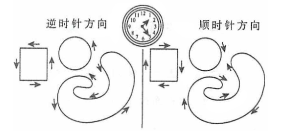 $$\small \oint_LP(x,y){\rm d}x+Q(x,y){\rm d}y=\underset {D}{\displaystyle\iint}\left( \frac{∂Q}{∂x}-\frac{∂P}{∂y} \right){\rm d}σ$$ &emsp;&ensp; 如右图所示，所谓 $\small L$ 取正向，是指当一个人沿着 $\small L$ 的正向前进时，**左手始终在 $\small L$ 所围成的区域 $\small D$ 内**。试想以下假如你在学校的环形操场上跑步，你的左手始终在草坪中，你为逆时针方向，说明你跑的方向是正向。

> $\small {\rm d}σ={\rm d}x{\rm d}y$ 。
> 若 $\small L$ 为反向，则 $\small P(x,y),\small Q(x,y)$ 始末位置互换，结果就为 $\small -\underset {D}{\displaystyle\iint}\left( {\large\frac{∂Q}{∂x}}-{\large\frac{∂P}{∂y}} \right){\rm d}σ$ 。

##### 考试要点

&emsp;&ensp; 一般来说，考试的题目不可能直接满足使用格林公式的条件，命题人可以“破坏”两种条件：

1. $\small L$ 不是封闭曲线，也就是没有围成一个平面有界闭区域 $\small D$ 。
2. 即使 $\small L$ 围成了一个平面有界闭区域 $\small D$ ，但是 $\small P(x,y),Q(x,y){\large\frac{∂Q}{∂x}},{\large\frac{∂P}{∂y}}$ 在 $\small D$ 上不连续。

**这种情况下，不可以直接使用格林公式。**
&emsp;&ensp; 针对第一种情况，我们可以采用“补线法”，补上一条或者若干条线，围出一个平面有界闭区域 $\small D$ ，就可以使用格林公式了。

> &emsp;&ensp; 补线法计算后要减去补的那条线，通过基本方法计算补的线的功，总功减补功就行了就得到了实际功。

&emsp;&ensp; 针对第二种情况，我们可以采用“挖去法”，把不连续点（称为“奇点”）挖去，使条件得以满足，从而使用格林公式。
