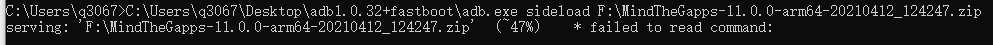

# Lineages OS 安装

[TOC]

## 系统安装

### 1. 解锁 BL 锁

若手机有 BL 锁 ，自行百度如何解锁，因为不同手机的解锁方式不一样.
有的手机无法解锁，无法解锁就无法安装 Lineage OS , GG ！！

若手机已锁，直接进行下一步

### 2. 下载系统与 recovery

1. 系统与 recovery 下载直接到官网下载： <https://download.lineageos.org/> ，装系统前需要重装 recovery ，只有对应的 recovery 才能识别对应的系统。

    由于网络原因，我们打开官网可能会看到如下的显示，也可能是完整的ui界面

    

    两种都没有关系，我们只需要寻找自己手机对应的名称就行了。

    点击名称，可能会跳转到新的下载的界面，也可能就在页面底部显示，还是网络的锅。

    

    如图， File 是 系统安装包，Recovery image 是recovery 的镜像，这两个都要下载，注意，**一定要下载互相对应的 系统 与 recovery镜像 ！！！**

2. 下载 ADB 与 fastboot ,具体下载方法自行百度， 我们只需要下图的几个文件：

   **如果需要 [谷歌服务包](#google-环境安装) 和 [root](#root-安装) ，点击文字跳转至教程。**

### 3. 系统安装

1. **安装 recovery**

   1. 手机进入开发者模式，打开 usb调试 。

   2. 连接电脑，有的手机会弹出窗口询问是否同意电脑对手机进行调试，点击同意就行。

   3. 打开 cmd ，将 adb.exe 拖入 cmd ，如图所示，cmd 内显示了文件的完整路径，这就代表使用 cmd 运行此文件。
   

        然后在路径后面打个空格，接着输入 `reboot bootloader` ，按回车键运行 , 这个指令会让手机会重启到 fastboot 模式，recovery 就在这个模式刷入。
        

   4. 拖入 fastboot.exe 再在路径后面输入个空格，再输入 `devices` ，按回车键运行（后面将不再强调说明按回车键运行） , 代码用于检查设备。（图片为检查到设备后的截图）
        

        检测到设备后 在 footboot 中 输入 `flash recovery E:\lineageos\lineage-18.1-20210708-recovery-sagit.img(此路径为下载的 recovery.img 的路径)`
        

        显示如下内容后，说明安装成功:
        

        如果安装进度未动，或者安装失败，可以下载其他刷机软件刷入 recovery ，通常来说 recovery 安装只需要半分钟。

2. **安装系统**

    1. recovery 安装成功后，按下 音量键上键 + 电源键 ，重启手机进入 recovery 模式。

    2. 选择 Factory Reset ，然后依次格式化数据。（格式化未完成会出现开不了机的问题）

        格式化完成后，返回 recovery 主页，选择 `Apply update` 然后选择 `Apply from ADB` 。

    3. 在 ADB 下，执行 `sideload C:\Users\q3067\Downloads\lineage-18.1-20210708-nightly-sagit-signed.zip（下载的刷机包路径）`

        执行命令后整体如下显示，且手机返回了 `Apply from ADB` 界面，则安装成功

        

    4. 重启手机，开始使用 lineage OS 吧！

## Google 环境安装

在 安卓10 以后，google 谷歌运行框架，谷歌运行服务等应用不允许个人安装，只随系统安装而安装，幸好 lineage OS 官方提供了安装包，包含了大多数 google 基础应用（谷歌三件套也在其中）。

1. **下载**

    官方网址： <https://wiki.lineageos.org/gapps.html> ，选择对应版本下载。

2. **安装**

    安装紧接安装系统的第三步（也就是系统成功刷入后），在第三步返回 `Apply from ADB` 界面后，再次进入 `Apply from ADB` 。
    然后在 ADB 中输入 `sideload F:\MindTheGapps-11.0.0-arm64-20210412_124247.zip(此处为你下载的谷歌服务集成包位置)` ,如图所示（图为安装完成的截图）：

    

    在安装过程中，手机可能会询问是否要安装，选择 YES 。

## root 安装

lineage OS 并未自带 root ，我们需要进入 recovery 安装 Magisk 的底层程序 。

1. **Magisk 下载**

    Magisk 官网下载地址 : <https://github.com/topjohnwu/Magisk/releases>
   下载选择最新的 apk 安装包，安装包名称为：`Magisk-vXX.X.apk`(XX.X 为版本号)

   

2. **Magisk 安装**
    1. 手机重启进入 recovery 模式，选择 `Apply update` 然后选择 `Apply from ADB` 。
    然后在 ADB 中输入 `sideload [此处为你刚才所修改的 zip 文件位置]` , 如图所示（图为安装完成的截图）：
    
    在安装过程中，手机可能会询问是否要安装，选择 YES 。
    2. 安装完成后，重启手机，在手机中会出现 Magisk 软件的图标，点击图标，下载软件。
    3. 手机更新系统后 magisk 的底层 root 程序会被移除，只需要重复此步骤再次安装即可。
